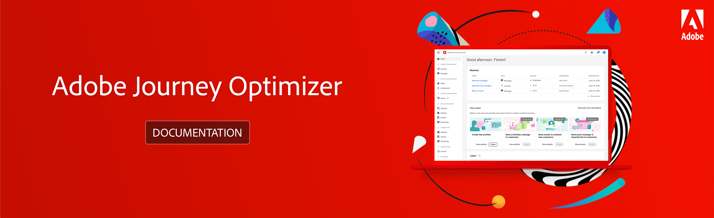

# Adobe [!DNL Journey Optimizer] 文档 {#cjm-documentation}

>[!CAUTION]
>
>7月25日，Adobe Journey Optimizer将发布 [新功能](using/rn/inline-messages.md) 这可改进您为Journey Optimizer渠道（电子邮件、推送、短信）创作内容的方式。 作为Journey Optimizer的从业者，你现在 [创建和创作](using/messages/get-started-content.md) 您的邮件直接从历程发送。 将为您执行历程的自动转换。 话虽如此，我们需要你的帮助。 了解 [必需步骤](using/rn/inline-messages-steps.md).

<table style="table-layout:fixed">
<tr>
  <td>
    
<strong>入门指南</strong>
    

    

    <em></em>
    

    

      <a href="using/start/get-started.md">是什么 [!DNL Journey Optimizer]？</a>
    

    
了解主要功能和用例
    

    

      <a href="using/rn/release-notes.md">发行说明</a>
    

    
新增功能、最新改进和修复
   

    

      <a href="using/start/quick-start.md">快速入门指南</a>
    

    

    了解如何以管理员、数据工程师或历程实践者的身份开始使用
    

    

    

      <a href="using/design/design-emails.md">设计电子邮件内容</a>
    

    

    设计新电子邮件或导入现有 HTML 内容
    

    

      <a href="using/messages/get-started-content.md">发送消息</a>
    

    
了解如何在客户历程中添加推送、短信和电子邮件消息
    

    

    <a href="using/building-journeys/journeys-uc.md">创建您的第一个历程</a>
    

    
了解如何构建并执行历程
    

    

    <a href="using/configuration/get-started-configuration.md">配置 [!DNL Journey Optimizer]</a>
    

    
了解配置 [!DNL Journey Optimizer] 的关键步骤
    

    

    <a href="using/administration/permissions-overview.md">授予对 [!DNL Journey Optimizer]</a> 的访问权限
    

    
定义和管理分配给 [!DNL Journey Optimizer] 用户的权限
    

    

    <a href="using/offers/get-started/starting-offer-decisioning.md">决策管理</a>
    

    
创建优惠并为客户提供最佳优惠和体验
    

    

    
<strong>其他资源</strong>
    

    

    

    

    <li>
      <a href="https://helpx.adobe.com/cn/legal/product-descriptions/adobe-journey-optimizer.html" target="_blank">Adobe Journey Optimizer 产品说明</a>
    </li>
    

    

    <li>
      <a href="https://www.adobe.com/content/dam/cc/en/security/pdfs/AJO_SecurityOverview.pdf" target="_blank">Adobe Journey Optimizer 安全概述</a> (PDF)
    </li>
    

    

    <li>
      <a href="https://experienceleague.adobe.com/docs/journey-optimizer/assets/AJO-FAQ.pdf" target="_blank">Journey Optimizer 常见问题解答</a> (PDF)
    </li>
    

    

    <li>
      <a href="https://experienceleague.adobe.com/docs/experience-platform/landing/home.html?lang=zh-Hans" target="_blank">Adobe Experience Platform 文档</a>
    </li>
    

    

      <li>
      <a href="https://www.adobe.com/experience-platform/documentation-and-developer-resources.html?lang=zh-Hans" target="_blank">Adobe Experience Platform 开发人员资源</a>
    </li>
    

  </td>
   <td>
   
<strong>关键资源的直接链接</strong>
    

    

    <em></em>
    

    
历程管理

    <li>
      <a href="using/building-journeys/journey-gs.md">历程</a>
    </li>
    <li>
      <a href="using/landing-pages/get-started-lp.md">登陆页面</a>
    </li>
    

    
决策管理

    <li>
      <a href="using/offers/get-started/starting-offer-decisioning.md">优惠</a>
    </li>
     <li>
      <a href="using/offers/offer-library/key-steps.md">组件</a>
    </li>
    

    
内容管理

    <li>
      <a href="using/design/assets-essentials.md">资源</a>
    </li>
    

    
数据管理

    <li>
      <a href="using/start/get-started-schemas.md">架构</a>
    </li>
     <li>
      <a href="using/start/get-started-datasets.md">数据集</a>
    </li>
        <li>
      <a href="using/start/get-started-queries.md">查询</a>
    </li>
     <li>
      <a href="https://experienceleague.adobe.com/docs/experience-platform/ingestion/quality/monitor-data-ingestion.html?lang=zh-Hans" target="_blank">监控</a>
    </li>
    

    
连接

    <li>
      <a href="using/start/get-started-sources.md">源</a>
    </li>
    

    
客户

    <li>
      <a href="using/segment/about-segments.md">区段</a>
    </li>
    </li>
    <li>
      <a href="using/landing-pages/subscription-list.md">订阅列表</a>
    </li>     
    <li>
      <a href="using/segment/get-started-profiles.md">用户档案</a>
    </li>
    <li>
      <a href="using/segment/get-started-identity.md">标识</a>
    </li>
    

    
隐私

    <li>
      <a href="https://experienceleague.adobe.com/docs/experience-platform/privacy/home.html?lang=zh-Hans" target="_blank">政策</a>
    </li>
    <li>
      <a href="https://experienceleague.adobe.com/docs/experience-platform/privacy/ui/user-guide.html?lang=zh-Hans"target="_blank">请求</a>
    </li>
    

    
管理

    <li>
      <a href="using/configuration/about-data-sources-events-actions.md">配置</a>
    </li>
    <li>
      <a href="using/configuration/get-started-configuration.md">渠道</a>
    </li>
     <li>
      <a href="using/administration/sandboxes.md">沙箱</a>
    </li>
  </td>
</tr>
</table>

 立即注册 [Adobe Journey Optimizer 季度新闻稿](https://www.adobe.com/subscription/Adobe_Journey_Optimizer_NL.html){target=&quot;_blank&quot;}邮件！

每季度直接在您的收件箱中接收最新产品更新、精彩故事、用例、提示及更多内容。

每份新闻稿都包含以下内容：
* 产品新闻与更新（包括最近发布的功能）
* 活动和网络研讨会的邀请，以及近期网络研讨会的录像
* Adobe Journey Optimizer Experience League 社区中的热门讨论
* 其他 Adobe Journey Optimizer 客户的案例研究和用例
* 有助于提供卓越客户体验并推动业务成功的提示和技巧