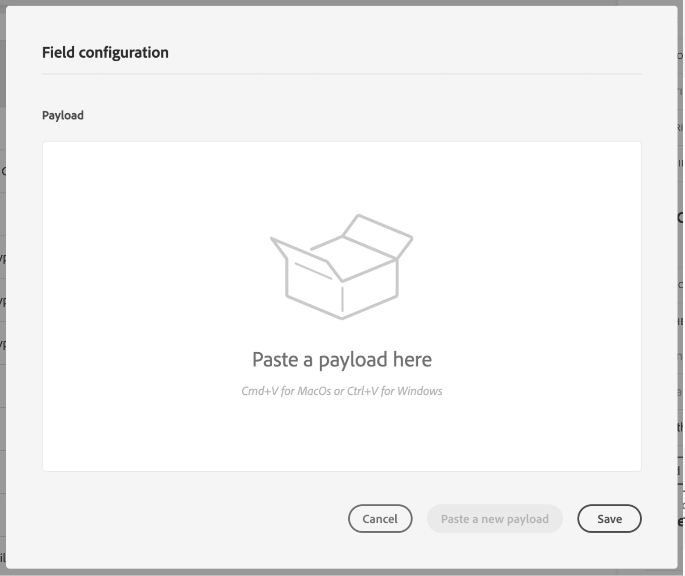

# 配置自定义操作 {#configure-an-action}

>[!CONTEXTUALHELP]
>id="ajo_journey_action_custom_configuration"
>title="自定义操作"
>abstract="如果您使用第三方系统发送消息，或者如果您希望历程将API调用发送到第三方系统，请使用自定义操作配置其与历程的连接。 例如，您可以通过自定义操作连接到以下系统：Epsilon，Slack, [Adobe开发人员](https://developer.adobe.com)、Firebase等"

如果您使用第三方系统发送消息，或者如果您希望历程将API调用发送到第三方系统，请使用自定义操作配置其与历程的连接。 例如，您可以通过自定义操作连接到以下系统：Epsilon，Slack, [Adobe开发人员](https://developer.adobe.com){target=&quot;_blank&quot;}、Firebase等。

自定义操作是技术用户定义并可供营销人员使用的其他操作。 配置完毕后，这些组件会显示在历程的左侧面板(位于 **[!UICONTROL Action]** 类别。 请参阅[此页面](../building-journeys/about-journey-activities.md#action-activities)以了解详情。

## 限制{#custom-actions-limitations}

自定义操作在 [本页](../start/limitations.md).

在自定义操作参数中，您可以传递简单的集合以及对象集合。 进一步了解 [本页](../building-journeys/collections.md#limitations).

另请注意，自定义操作参数具有预期的格式(例如：字符串、小数等)。 您必须谨慎遵循这些预期格式。 在中了解详情 [用例](../building-journeys/collections.md).

## 配置步骤 {#configuration-steps}

以下是配置自定义操作所需的主要步骤：

1. 在“管理”菜单部分，选择 **[!UICONTROL Configurations]**. 在  **[!UICONTROL Actions]** ，单击 **[!UICONTROL Manage]**. 单击 **[!UICONTROL Create Action]** 创建新操作。 操作配置窗格将在屏幕右侧打开。

   

1. 输入操作的名称。

   >[!NOTE]
   >
   >请勿使用空格或特殊字符。请勿使用超过 30 个字符。

1. 向操作添加描述。 此步骤是可选的。
1. 使用此操作的历程数显示在 **[!UICONTROL Used in]** 字段。 您可以单击 **[!UICONTROL View journeys]** 按钮以显示使用此操作的历程列表。
1. 选择与此自定义操作相关的渠道： **电子邮件**, **短信**&#x200B;或 **推送通知**. 它将为所需的营销操作字段预填选定渠道的默认营销操作。 如果您选择 **其他**，则不会定义营销操作。
1. 如果要将同意规则应用于此自定义操作，请选择相应的 **必需的营销操作**. 请参阅[此小节](../action/about-custom-action-configuration.md#consent-management)。
1. 定义不同的 **[!UICONTROL URL Configuration]** 参数。 请参阅[此小节](../action/about-custom-action-configuration.md#url-configuration)。
1. 配置 **[!UICONTROL Authentication]** 中。 此配置与数据源的配置相同。  请参阅[此小节](../datasource/external-data-sources.md#custom-authentication-mode)。
1. 定义 **[!UICONTROL Action parameters]**. 请参阅[此小节](../action/about-custom-action-configuration.md#define-the-message-parameters)。
1. 
1. 单击 **[!UICONTROL Save]**。

   自定义操作现已配置完成，可随时用于您的历程。 请参阅[此页](../building-journeys/about-journey-activities.md#action-activities)。

   >[!NOTE]
   >
   >在历程中使用自定义操作时，大多数参数都是只读的。 您只能修改 **[!UICONTROL Name]**, **[!UICONTROL Description]**, **[!UICONTROL URL]** 字段和 **[!UICONTROL Authentication]** 中。

## URL 配置 {#url-configuration}

配置自定义操作时，您需要定义以下内容 **[!UICONTROL URL Configuration]** 参数：

1. 在 **[!UICONTROL URL]** 字段中，指定外部服务的URL:

   * 如果URL是静态的，请在此字段中输入URL。

   * 如果URL包含动态路径，则只输入URL的静态部分，即方案、主机、端口，以及（可选）路径的静态部分。

      示例: `https://xxx.yyy.com/somethingstatic/`

      在将自定义操作添加到历程时，您将指定URL的动态路径。 [了解详情](../building-journeys/using-custom-actions.md)。
   >[!NOTE]
   >
   >出于安全原因，我们强烈建议您对URL使用HTTPS方案。 我们不允许使用非公共的Adobe地址和IP地址。
   >
   >定义自定义操作时仅允许使用默认端口：80表示http，443表示https。

1. 选择调用 **[!UICONTROL Method]**:它可以 **[!UICONTROL POST]** 或 **[!UICONTROL PUT]**.

   >[!NOTE]
   >
   > 的 **DELETE** 方法不受支持。 如果需要更新现有资源，请选择 **PUT** 方法。

1. 在 **[!UICONTROL Headers]** 部分，定义要发送到外部服务的请求消息的HTTP标头：
   1. 要添加标题字段，请单击 **[!UICONTROL Add a header field]**.
   1. 输入标题字段的键。
   1. 要为键值对设置动态值，请选择 **[!UICONTROL Variable]**. 否则，请选择 **[!UICONTROL Constant]**.

      例如，对于时间戳，您可以设置动态值。

   1. 如果已选择 **[!UICONTROL Constant]**，然后输入常数值。

      如果已选择 **[!UICONTROL Variable]**，则在将自定义操作添加到历程时，将指定此变量。 [了解详情](../building-journeys/using-custom-actions.md)。

      

   1. 要删除标题字段，请指向标题字段，然后单击 **[!UICONTROL Delete]** 图标。
   的 **[!UICONTROL Content-Type]** 和 **[!UICONTROL Charset]** 标题字段默认设置。 您无法修改或删除这些字段。

   在将自定义操作添加到历程后，如果历程处于草稿状态，您仍可以向该历程添加标题字段。 如果您不希望历程受配置更改的影响，请复制自定义操作并将标题字段添加到新的自定义操作。

   >[!NOTE]
   >
   >将根据字段解析规则验证标头。 在 [本文档](https://tools.ietf.org/html/rfc7230#section-3.2.4){_blank}。

## 定义操作参数 {#define-the-message-parameters}

在 **[!UICONTROL Action parameters]** 部分，粘贴要发送到外部服务的JSON有效负载示例。

>[!NOTE]
>
>有效负载中的字段名称不能包含“。” 字符. 不能以“$”字符开头。

您将能够定义参数类型(例如：字符串、整数等)。

您还可以选择指定参数是常量还是变量：

* 常量表示参数的值由技术人员在操作配置窗格中定义。 跨历程的值将始终相同。 在历程中使用自定义操作时，它不会有所不同，营销人员也不会看到它。 例如，它可能是第三方系统所需的ID。 在这种情况下，切换常量/变量右侧的字段是传递的值。
* 变量表示参数的值会有所不同。 在历程中使用此自定义操作的营销人员可以自由地传递他们想要的值，或指定在何处检索此参数的值(例如，从事件、从Adobe Experience Platform等)。 在这种情况下，切换常量/变量右侧的字段是营销人员在命名此参数的历程中看到的标签。

## 同意管理 {#consent-management}

客户现在可以定义与隐私相关的同意策略，以在操作执行期间控制传出数据。 同意策略可用作配置文件属性的表达式，用于设置规则以定义是否可以为给定配置文件执行操作。

Consent sur custom action， pas message encore Conxent a tel type de communication uplication de tel type de donnée champs dans profile vont ticles ce consent conté AEP nuvelles regles de type policies auj gouvernance policies. 对Restric电子邮件进行定位。 关联标签(C4/C5)，用于进行营销操作。 定义目标，键入去营销操作。 Ex SFTP crée dest qui va exporter des donées ce sftp， tu flague ce sftp ave une marketing action. 在自定义操作、电子邮件/短信/推送营销操作中，促销行动的概念被删除。 你自定。

标签：quand tu def data set(où stocker tes données)、onglet data gouvernance、pr chaque attribut tu peux definir type de label associa te attribut。 国家代码标签C3/C4。 标签、peux en def d&#39;autres en fontion besoin。

 — 吉拉评论 — 

描述“其他营销操作”，以便从业人员解释自定义操作的“意图”，例如：我的定制活动是关于锻炼通讯、时事通讯、健身通讯等。

描述第一个版本的同意范围：

- 自定义操作中个性化中使用的营销操作和属性会被考虑在内
- 对于区段触发的历程（从读取区段开始），将考虑用作该区段中标准的属性
- 历程中使用的所有活动（读取区段或自定义操作除外）均未被考虑在内
- 即使使用区段来开始旅程，也不会考虑区段鉴别

描述在自定义操作中被同意策略排除的用户档案仍将继续完成历程（包含消息和抑制列表的iso）

描述预期滞后的提醒：https://wiki.corp.adobe.com/display/DMSArchitecture/Consent+Latency
+ 更正AJO延迟（从1小时到6小时）

我们应记录两种类型的滞后：

- 用户延迟，在Carolina Infante上，我不确定我们能说什么，看这个：

我们是否可以确认是否需要“UPS投影/导出”，以在用户档案级别更新“contentTo”字段（知道我们在运行时使用的内容）？ 因为如果是这种情况，我想我们应该说这将需要48小时，但如果不是，我们只是在说“摄取延迟+收集延迟”（因此在最坏的情况下，如果摄取出现激增或中断，以及/或客户从用户那里收集更新需要较长时间，则需要几秒钟到几小时）。

- 同意策略滞后，我会说“最长6小时”，因为实时历程将每6小时提取一次同意策略。 Carolina Infante ，您知道我们是否受到过滤器滞后的影响？
