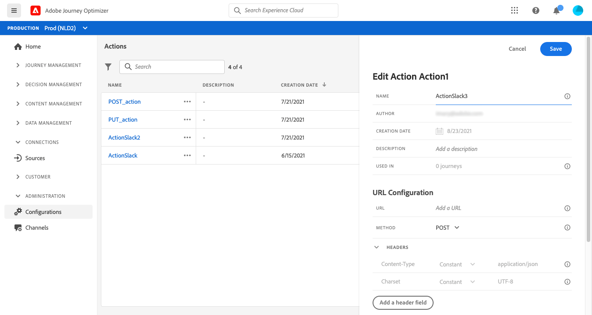

# 配置操作 {#configure-an-action}

如果您使用第三方系统发送消息，或者如果您希望旅程向第三方系统发送API调用，则可以在此处配置其与旅程的连接。 然后，技术用户定义的自定义操作将在您旅程的左侧调色板中的&#x200B;**[!UICONTROL Action]**&#x200B;类别中可用（请参阅[此页面](../building-journeys/about-journey-activities.md#action-activities)）。 以下是可通过自定义操作连接到的一些系统示例：Epsilon、Facebook、Adobe.io、Firebase等
限制列在[此页](../building-journeys/limitations.md)中。

以下是配置自定义操作所需的主要步骤：

1. 在&#x200B;**[!UICONTROL Actions]**&#x200B;列表中，单击&#x200B;**[!UICONTROL Add]**&#x200B;以创建新操作。 操作配置窗格将在屏幕右侧打开。

   

1. 输入操作的名称。

   >[!NOTE]
   >
   >请勿使用空格或特殊字符。请勿使用超过 30 个字符。

1. 为您的操作添加描述。 此步骤是可选的。
1. 使用此操作的旅程数显示在&#x200B;**[!UICONTROL Used in]**&#x200B;字段中。 您可以单击&#x200B;**[!UICONTROL View journeys]**&#x200B;按钮来显示使用此操作的旅程列表。
1. 定义不同的&#x200B;**[!UICONTROL URL Configuration]**&#x200B;参数。 请参阅[此页](../action/about-custom-action-configuration.md#url-configuration)。
1. 配置&#x200B;**[!UICONTROL Authentication]**&#x200B;部分。 此配置与数据源相同。  请参阅[此小节](../datasource/external-data-sources.md#section_wjp_nl5_nhb)。
1. 定义&#x200B;**[!UICONTROL Message parameters]**。 请参阅[此页](../action/about-custom-action-configuration.md#define-the-message-parameters)。
1. 单击 **[!UICONTROL Save]**。

   自定义操作现已配置好并准备在您的旅程中使用。 请参阅[此页](../building-journeys/about-journey-activities.md#action-activities)。

   >[!NOTE]
   >
   >在旅程中使用自定义操作时，大多数参数都是只读的。 只能修改&#x200B;**[!UICONTROL Name]**、**[!UICONTROL Description]**、**[!UICONTROL URL]**&#x200B;字段和&#x200B;**[!UICONTROL Authentication]**&#x200B;部分。

## URL 配置 {#url-configuration}

配置自定义操作时，您需要定义以下&#x200B;**[!UICONTROL URL Configuration]**&#x200B;参数：

1. 添加外部服务的&#x200B;**[!UICONTROL URL]**。

   >[!NOTE]
   >
   >出于安全原因，我们强烈建议使用 HTTPS。我们不允许使用非公开的Adobe地址和IP地址。

1. 选择呼叫&#x200B;**[!UICONTROL Method]**:它可以是&#x200B;**[!UICONTROL POST]**&#x200B;或&#x200B;**[!UICONTROL PUT]**。
1. 在&#x200B;**[!UICONTROL Headers]**&#x200B;部分，单击&#x200B;**[!UICONTROL Add a header field]**&#x200B;定义新的键/值对。 它们与向外部服务发出的请求的HTTP头相对应。 要删除键/值对，请将光标放在&#x200B;**[!UICONTROL Headers]**&#x200B;字段上，然后单击&#x200B;**[!UICONTROL Delete]**&#x200B;图标。

   **[!UICONTROL Content-Type]** 和 **[!UICONTROL Charset]** 默认设置，无法删除或覆盖。

   >[!NOTE]
   >
   >根据以下[解析规则](https://tools.ietf.org/html/rfc7230#section-3.2.4)验证标头。

## 定义消息参数{#define-the-message-parameters}

在&#x200B;**[!UICONTROL Message parameters]**&#x200B;部分，粘贴要发送到外部服务的JSON有效负荷示例。

您将能够定义参数类型(例如：字符串、整数等)。

您还可以选择指定参数是常量还是变量：

* 常量表示参数的值由技术人员在操作配置窗格中定义。 在整个旅程中，价值始终保持不变。 在客户旅程中使用自定义操作时，不会有任何不同，营销人员也不会看到。 例如，它可以是第三方系统所需的ID。 在这种情况下，切换常数/变量右侧的字段是传递的值。
* 变量表示参数的值将不同。 在旅程中使用此自定义操作的营销人员可以自由地传递所需的值或指定检索此参数值的位置(例如从事件、从Adobe Experience Platform等)。 在这种情况下，切换常量/变量右侧的字段是营销人员在命名此参数的旅程中将看到的标签。

