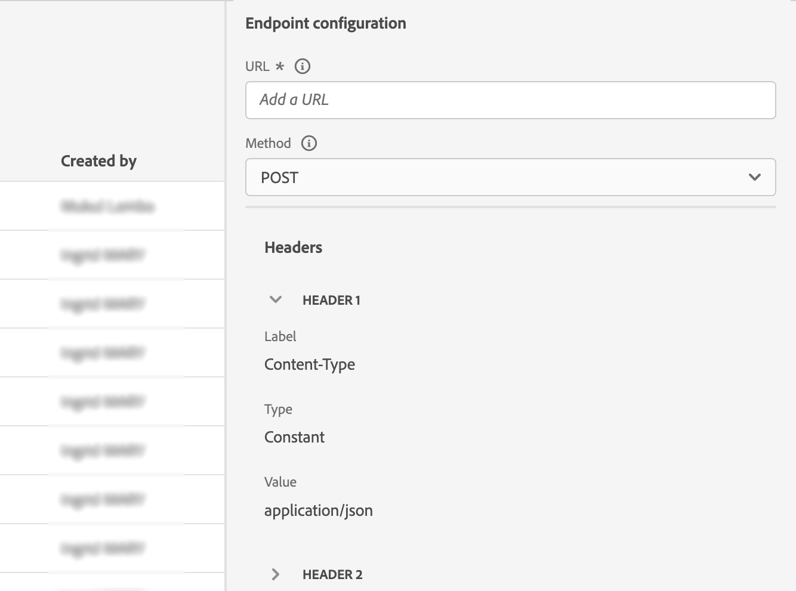

# 配置自定义操作 {#configure-an-action}

>[!CONTEXTUALHELP]
>id="ajo_journey_action_custom_configuration"
>title="自定义操作"
>abstract="如果您要使用第三方系统发送消息，或者如果希望历程将 API 调用发送到第三方系统，请使用自定义操作配置第三方系统与历程的连接。例如，可以通过自定义操作连接到以下系统：Epsilon、Slack、[Adobe Developer](https://developer.adobe.com)、Firebase 等。"

如果您要使用第三方系统发送消息，或者如果希望历程将 API 调用发送到第三方系统，请使用自定义操作配置第三方系统与历程的连接。例如，您可以通过自定义操作连接到以下系统：Epsilon、Slack、[Adobe Developer](https://developer.adobe.com){target="_blank"}、Firebase等。

自定义操作是由技术用户定义并提供给营销人员的附加操作。配置完毕后，它们会显示在历程的左侧面板的&#x200B;**[!UICONTROL 操作]**&#x200B;类别中。 请参阅[此页面](../building-journeys/about-journey-activities.md#action-activities)以了解详情。

## 限制{#custom-actions-limitations}

自定义操作在[此页面](../start/guardrails.md)中列出了一些限制。

在自定义操作参数中，您可以传递简单的集合以及对象集合。 在[此页面](../building-journeys/collections.md#limitations)中了解有关收藏集限制的更多信息。

另请注意，自定义操作参数具有预期格式（例如：字符串、小数等）。 必须注意遵守这些预期格式。 在此[用例](../building-journeys/collections.md)中了解详情。

只有在使用[请求](../action/about-custom-action-configuration.md#define-the-message-parameters)或[响应负载](../action/action-response.md)时，自定义操作才支持JSON格式。

## 最佳实践{#custom-action-enhancements-best-practices}

在使用自定义操作选择要定位的端点时，请确保：

* 可以使用 [API 限制](../configuration/throttling.md) 或 [API 上限](../configuration/capping.md)的配置对此端点进行限制，从而支持历程的吞吐量。请注意，限制配置不能低于 200 TPS。任何目标端点都需要支持至少 200 TPS。
* 此端点的响应时间需要尽可能短。根据预期吞吐量，高响应时间可能会影响实际吞吐量。

为所有自定义操作定义了1分钟内300,000次调用的上限。 此外，默认上限按主机和沙盒执行。 例如，在沙盒上，如果您有两个具有相同主机的端点（例如：`https://www.adobe.com/endpoint1` 和 `https://www.adobe.com/endpoint2`），上限将适用于 adobe.com 主机下的所有端点。“endpoint1”和“endpoint2”将共享相同的上限配置，并且如果一个端点达到限制，将对另一个端点产生影响。

此限制是根据客户使用情况设置的，用于保护自定义操作所针对的外部端点。您需要在基于受众的历程中考虑这一点，相应地定义适当的读取率（使用自定义操作时为 5000 个用户档案/秒）。如果需要，您可以通过我们的“上限/限制 API”定义较大的上限或限制来覆盖此设置。请参阅[此页](../configuration/external-systems.md)。

出于以下各种原因，您不应使用自定义操作定位公共端点：

* 如果没有适当的上限或限制，则可能会向可能不支持此类卷的公共端点发送过多调用。
* 配置文件数据可以通过自定义操作发送，因此，定位公共端点可能会导致无意间在外部共享个人信息。
* 您对公共端点返回的数据没有控制权。 如果端点更改其API或开始发送错误信息，则这些信息将在发送的通信中可用，并可能产生负面影响。

## 同意和数据治理 {#privacy}

在Journey Optimizer中，您可以将数据治理和同意策略应用于自定义操作，以防止将特定字段导出到第三方系统，或排除未同意接收电子邮件、推送或短信通信的客户。 有关更多信息，请参阅以下页面：

* [数据管理](../action/action-privacy.md)。
* [同意](../action/action-privacy.md)。

## 配置步骤 {#configuration-steps}

以下是配置自定义操作所需的主要步骤：

1. 在“管理”菜单部分中，选择&#x200B;**[!UICONTROL 配置]**。 在&#x200B;**[!UICONTROL 操作]**&#x200B;部分中，单击&#x200B;**[!UICONTROL 管理]**。 单击&#x200B;**[!UICONTROL 创建操作]**&#x200B;以创建新操作。 操作配置窗格将在屏幕右侧打开。

   

1. 输入操作的名称。

   >[!NOTE]
   >
   >只允许使用字母数字字符和下划线。 最大长度为30个字符。

1. 向操作添加描述。 此步骤是可选的。
1. 使用此操作的历程数显示在&#x200B;**[!UICONTROL 在]**&#x200B;中使用字段中。 您可以单击&#x200B;**[!UICONTROL 查看历程]**&#x200B;按钮以显示使用此操作的历程列表。
1. 定义不同的&#x200B;**[!UICONTROL URL配置]**&#x200B;参数。 请参阅[此页](../action/about-custom-action-configuration.md#url-configuration)。
1. 配置&#x200B;**[!UICONTROL 身份验证]**&#x200B;部分。 此配置与数据源的配置相同。  请参阅[此小节](../datasource/external-data-sources.md#custom-authentication-mode)。
1. 定义&#x200B;**[!UICONTROL 操作参数]**。 请参阅[此页](../action/about-custom-action-configuration.md#define-the-message-parameters)。
1. 单击&#x200B;**[!UICONTROL 保存]**。

   自定义操作现已配置完毕，可随时用于您的历程。 请参阅[此页](../building-journeys/about-journey-activities.md#action-activities)。

   >[!NOTE]
   >
   >在历程中使用自定义操作时，大多数参数均为只读。 您只能修改&#x200B;**[!UICONTROL Name]**、**[!UICONTROL Description]**、**[!UICONTROL URL]**&#x200B;字段和&#x200B;**[!UICONTROL 身份验证]**&#x200B;部分。

## 端点配置 {#url-configuration}

配置自定义操作时，您需要定义以下&#x200B;**[!UICONTROL 终结点配置]**&#x200B;参数：

{width="70%" align="left"}

1. 在&#x200B;**[!UICONTROL URL]**&#x200B;字段中，指定外部服务的URL：

   * 如果URL是静态的，请在此字段中输入URL。

   * 如果URL包含动态路径，则仅输入URL的静态部分，即方案、主机、端口，以及（可选）路径的静态部分。

     示例：`https://xxx.yyy.com/somethingstatic/`

     将自定义操作添加到历程时，您将指定URL的动态路径。 [了解详情](../building-journeys/using-custom-actions.md)。

   >[!NOTE]
   >
   >出于安全原因，我们强烈建议您对URL使用HTTPS方案。 我们不允许使用非公共Adobe地址和IP地址。
   >
   >定义自定义操作时只允许使用默认端口：80用于http，443用于https。

1. 选择调用&#x200B;**[!UICONTROL 方法]**：它可以是&#x200B;**[!UICONTROL POST]**、**[!UICONTROL GET]**&#x200B;或&#x200B;**[!UICONTROL PUT]**。

   >[!NOTE]
   >
   > 不支持&#x200B;**DELETE**&#x200B;方法。 如果需要更新现有资源，请选择&#x200B;**PUT**&#x200B;方法。

1. 定义标头和查询参数：

   * 在&#x200B;**[!UICONTROL 标头]**&#x200B;部分中，单击&#x200B;**[!UICONTROL 添加标头字段]**&#x200B;以定义要发送到外部服务的请求消息的HTTP标头。 默认情况下，**[!UICONTROL Content-Type]**&#x200B;和&#x200B;**[!UICONTROL Charset]**&#x200B;标头字段已设置。 您无法删除这些字段。 只能修改&#x200B;**[!UICONTROL Content-Type]**&#x200B;标头。 其值应遵循JSON格式。 以下是默认值：

   

   * 在&#x200B;**[!UICONTROL 查询参数]**&#x200B;部分中，单击&#x200B;**[!UICONTROL 添加查询参数字段]**&#x200B;以定义要在URL中添加的参数。

   

1. 输入字段的标签或名称。

1. 选择类型： **[!UICONTROL 常量]**&#x200B;或&#x200B;**[!UICONTROL 变量]**。 如果已选择&#x200B;**[!UICONTROL 常量]**，请在&#x200B;**[!UICONTROL 值]**&#x200B;字段中输入该常量值。 如果已选择&#x200B;**[!UICONTROL 变量]**，则在将自定义操作添加到历程时，将指定此变量。 [了解详情](../building-journeys/using-custom-actions.md)。

   

   >[!NOTE]
   >
   >将自定义操作添加到历程后，如果历程处于草稿状态，您仍然可以向历程添加标题或查询参数字段。 如果您不希望配置更改影响历程，请复制自定义操作并将字段添加到新的自定义操作。
   >
   >将根据字段解析规则验证标头。 请参阅[此文档](https://tools.ietf.org/html/rfc7230#section-3.2.4){_blank}以了解详情。

## mTLS协议支持 {#mtls-protocol-support}

您可以使用相互传输层安全性(mTLS)来确保与Adobe Journey Optimizer自定义操作的出站连接中的增强安全性。 mTLS是一种用于相互身份验证的端到端安全方法，可确保共享信息的双方在数据共享之前都是声称的身份。 与TLS相比，mTLS还包括一个附加步骤，在该步骤中，服务器还会请求客户端的证书并在其末尾验证它。

自定义操作支持双向TLS (mTLS)身份验证。 无需在自定义操作或历程中执行额外配置即可激活 mTLS；当检测到启用了 mTLS 的端点时，会自动执行配置。[了解详情](https://experienceleague.adobe.com/en/docs/experience-platform/landing/governance-privacy-security/encryption#mtls-protocol-support)。

## 定义有效负载参数 {#define-the-message-parameters}

您可以定义有效负载参数，如下所示：

1. 在&#x200B;**[!UICONTROL 请求]**&#x200B;部分中，粘贴要发送到外部服务的JSON有效负载示例。 此字段为可选字段，仅适用于POST和PUT调用方法。

   启用&#x200B;**[!UICONTROL 允许NULL值]**&#x200B;选项以在外部调用中保留Null值。 请注意，发送int、字符串等数组。 中为Null的值不完全受支持。 例如，即使选中了此选项，以下整数数组`[1, null, 2, 3]`也会作为`[1, 2, 3]`发送。 此外，如果此类数组为null，则会作为空数组发送。

   {width="70%" align="left"}

1. 在&#x200B;**[!UICONTROL 响应]**&#x200B;部分中，粘贴调用返回的有效负载示例。 此字段是可选字段，可用于所有调用方法。 有关如何在自定义操作中利用API调用响应的详细信息，请参阅[此页面](../action/action-response.md)。

>[!NOTE]
>
>有效负载中的字段名称不能包含点`.`字符，也不能以`$`字符开头。
>

在字段配置中，您必须：

* 选择参数类型，例如：字符串、整数等。

* 定义常量或变量参数：

   * **常量**&#x200B;表示参数的值由技术角色在操作配置窗格中定义。 值将在各个历程中始终相同。 此操作不会发生改变，且营销人员在历程中使用自定义操作时无法看到它。 例如，它可能是第三方系统期望的ID。 在这种情况下，常量值将设置为切换常量/变量右侧的字段。

   * **变量**&#x200B;表示参数的值可以改变。 在历程中使用此自定义操作的营销人员可以自由传递他们想要的值，或指定从何处检索此参数的值(例如，从事件、Adobe Experience Platform等)。 在这种情况下，切换常量/变量右侧的字段是营销人员将在历程中看到的用于命名此参数的标签。

  对于可选参数，启用行末的&#x200B;**[!UICONTROL Is optional]**&#x200B;选项。 通过选中此选项，您可以将参数标记为非必需，并让历程参与者在历程中创作该自定义操作时选择是否填写参数。

>[!NOTE]
>
>如果您在允许Null值时配置可选参数，则历程从业者未填写的参数将作为Null发送。
>