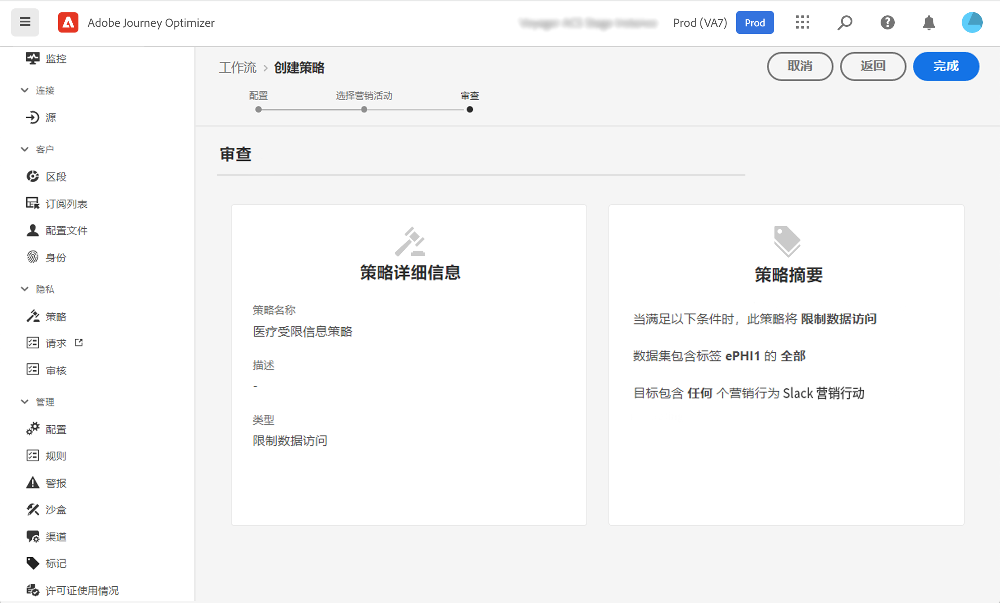
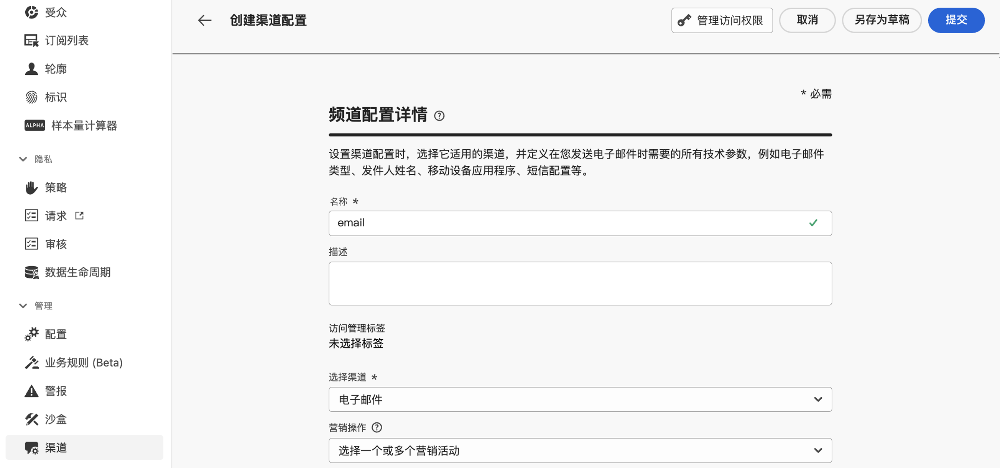
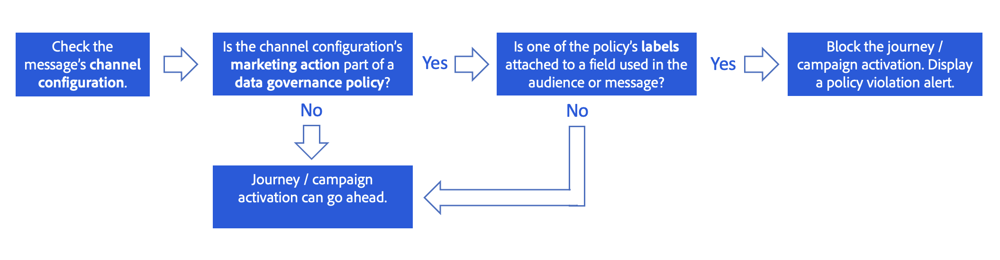
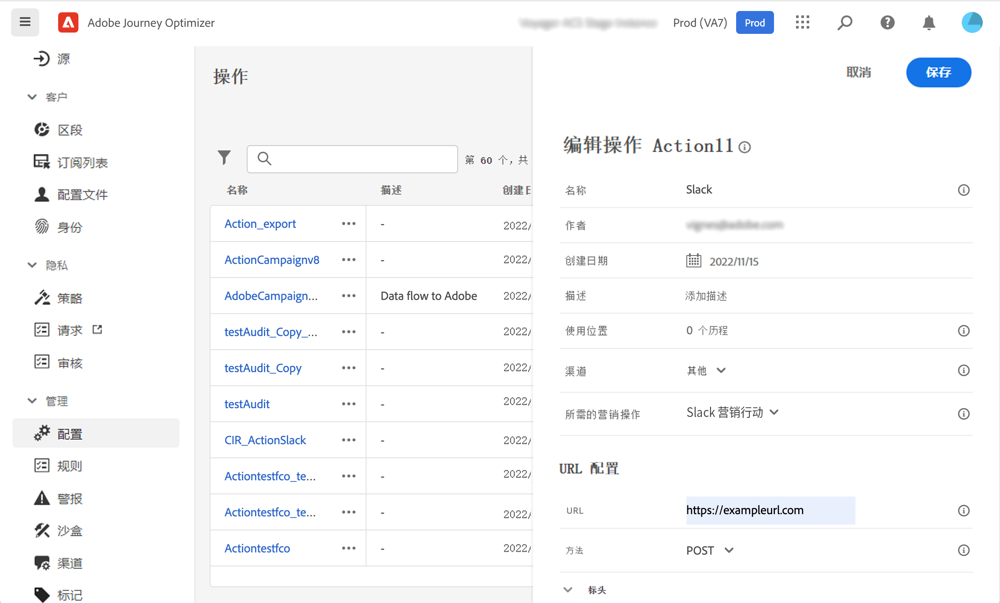

# 数据治理 {#restrict-fields}

>[!CONTEXTUALHELP]
>id="ajo_data_governance_policy_violation"
>title="数据治理政策违反"
>abstract="如果系统在历程/营销活动或自定义操作中识别出受限字段，则会显示错误，导致您无法发布它。使用此对话框中的数据沿袭图来了解在激活历程或营销活动之前需要更改其他哪些配置。"

>[!AVAILABILITY]
>
>本页包含与目前仅限选定客户使用的改进功能相关的信息。

## 数据治理策略入门 {#gs}

通过其[数据使用标签和执行(DULE)管理](https://experienceleague.adobe.com/docs/experience-platform/data-governance/home.html?lang=zh-Hans){_blank}框架，Adobe Experience Platform允许您通过&#x200B;**为字段设置标签**&#x200B;并为每个渠道创建&#x200B;**营销操作**，跨渠道管理和执行数据治理策略。

一旦定义了标签和营销活动，您就可以创建将这两个元素链接在一起的&#x200B;**数据治理策略**。 例如，您可以设置一个策略，将“ePHI”标签与“电子邮件定位”营销操作相关联，从而确保标记为“ePHI”的字段不会用于个性化电子邮件。 [了解如何创建数据治理策略](#governance-policies)

创建治理策略后，您可以将营销操作应用于历程/营销活动和历程自定义操作。
[了解如何在Journey Optimizer中应用营销操作](#apply-marketing-actions)

构建历程或营销活动时，在选择渠道配置或添加自定义操作后，系统会验证消息渠道配置中的营销操作或自定义操作是否属于数据治理策略的一部分。 如果是，则系统检查来自目标受众或消息个性化的任何字段是否被策略标记和限制。 如果检测到此类标签，则会阻止发布历程或营销活动。 [了解如何检测数据治理策略违规](#violation)

## 创建标签和营销操作 {#labels-marketing-actions}

实施数据管理策略的第一步是创建标签，并将它们附加到要限制每个渠道的使用和营销操作的字段。

1. 在左侧菜单中的&#x200B;**隐私**&#x200B;下，单击&#x200B;**策略**。

1. 选择&#x200B;**标签**&#x200B;选项卡，然后单击&#x200B;**创建标签**。

1. 为您的标签定义名称和友好名称。 例如，_ePHI1_。

1. 在左侧菜单中的&#x200B;**数据管理**&#x200B;下，单击&#x200B;**架构**，然后单击&#x200B;**应用访问和数据治理标签**&#x200B;按钮。选择您的架构和字段（例如“血液类型”），然后选择之前创建的标签，在我们的示例中为&#x200B;_ePHI1_。

   

1. 返回至&#x200B;**策略**&#x200B;菜单，选择&#x200B;**营销操作**&#x200B;选项卡，然后单击&#x200B;**创建营销操作**。我们建议您为历程中使用的每个渠道和每个第三方自定义操作创建一个营销操作。 例如，我们来创建一个 _Slack 营销操作_，用于 Slack 自定义操作。

   

## 创建数据治理策略 {#policy}

现已创建标签和营销操作，您可以将它们一起链接到数据治理策略中。 为此，请选择&#x200B;**浏览**&#x200B;选项卡，单击&#x200B;**创建策略**，然后选择&#x200B;**数据治理策略**。 选择您的标签 (_ePHI1_) 和营销操作（_Slack 营销操作_）。

如果您在历程中使用配置了 _Slack 营销操作_&#x200B;的 Slack 自定义操作，则将利用关联的策略。

## 在Journey Optimizer中应用营销操作 {#apply-marketing-actions}

为了在Journey Optimizer中实施数据管理策略，您需要将营销操作应用于历程、营销活动或自定义操作。

### 将营销活动应用于历程和营销活动 {#journeys-campaigns}

创建治理策略后，必须在Journey Optimizer **渠道配置**&#x200B;中应用相关的营销操作。 为此，请执行以下步骤：

1. 访问&#x200B;**[!UICONTROL 渠道]** > **[!UICONTROL 常规设置]** > **[!UICONTROL 渠道配置]**&#x200B;菜单。

1. 打开现有渠道配置或创建新渠道配置。

1. 在&#x200B;**[!UICONTROL 营销操作]**&#x200B;字段中，选择要与此配置关联的历程/营销活动的营销操作。 利用与营销操作关联的所有同意和数据治理策略，以尊重客户的偏好和为敏感字段设置的限制。 [了解详情](../action/consent.md#surface-marketing-actions)

   

1. 完成渠道配置设置，然后保存它。 [了解如何设置渠道配置](../configuration/channel-surfaces.md)。

1. 在历程或营销策划中创建消息时，选择相关的渠道配置。 完成历程或营销策划的配置并保存。

在激活历程或营销活动之前，系统会验证所选渠道配置中的营销操作是否属于数据治理策略的一部分。 如果是，则系统检查来自目标受众或消息个性化的任何字段是否被策略标记和限制。

如果系统识别了受限字段，则会显示一条错误消息，阻止您发布历程或营销策划。 [了解如何检测治理策略违规](#violation)

{zoomable="yes"}

*历程和营销活动的策略违规分析步骤*

### 将营销操作应用于自定义操作 {#custom-actions}

>[!NOTE]
>
>不支持Campaign v7/v8和Campaign Standard历程操作。

让我们以血型字段为例，您需要限制将其导出到使用自定义操作的第三方。 为此，您需要将营销操作应用于自定义操作，然后构建历程并在其中添加自定义操作。

1. 在左侧菜单的&#x200B;**管理**&#x200B;下，单击&#x200B;**配置**&#x200B;并选择&#x200B;**操作**。

1. 打开 Slack 自定义操作。配置自定义操作时，可使用两个字段进行数据治理。

   

   * **渠道**&#x200B;字段允许您选择与此自定义操作相关的渠道。 所选渠道的&#x200B;**必需的营销操作**&#x200B;字段会预填充默认营销操作。如选择&#x200B;**其他**，则默认不会定义营销操作。在本例中，我们为渠道选择&#x200B;**其他**。

   * 使用&#x200B;**必需的营销操作**&#x200B;字段，可定义与自定义操作相关的营销操作。例如，如果您使用该自定义操作通过第三方发送电子邮件，则可以选择&#x200B;**电子邮件定位**。在本例中，我们选择 _Slack 营销操作_。检索并利用与该营销操作关联的治理策略。

   有关配置自定义操作的其他步骤，请参见[此部分](../action/about-custom-action-configuration.md#consent-management)。

1. 在左侧菜单的&#x200B;**历程管理**&#x200B;下，单击&#x200B;**历程**。

1. 创建历程并添加自定义操作。 在历程中添加自定义操作时，有多个选项可用于对数据治理工作进行管理。单击&#x200B;**显示只读字段**&#x200B;以显示所有参数。

   

   * 配置自定义操作时定义的&#x200B;**渠道**&#x200B;和&#x200B;**必需的营销操作**&#x200B;将显示在屏幕顶部。您无法修改这些字段。

   * 您可以定义&#x200B;**其他营销操作**&#x200B;以设置自定义操作类型。这允许您定义此历程中自定义操作的用途。除了必需的营销操作（通常特定于渠道）之外，您还可以定义附加营销操作，该操作将特定于此历程中的自定义操作。例如：训练通信、新闻稿、健身通信等。所需的营销操作和附加营销操作都将适用。 在我们的示例中，我们不使用其他营销操作。

如果在操作参数中检测到标记为&#x200B;_ePHI1_&#x200B;的字段之一（我们示例中的“血液类型”字段），则会显示错误，导致您无法发布历程。 [了解如何检测治理策略违规](#violation)

{zoomable="yes"}

*历程自定义操作的策略违规分析步骤*

## 检测策略违规 {#violation}

如果系统在历程/营销策划或自定义操作中识别出受限字段，则会显示一条错误消息，阻止您发布该字段。

**[!UICONTROL 警报]**&#x200B;按钮显示错误。 单击该错误可显示有关发生的数据治理策略违规的详细信息。

此对话框指示当前历程/营销活动配置违反现有的数据治理策略。 使用数据族图了解在激活历程或营销活动之前，需要先进行哪些其他配置更改。

[数据使用策略违规文档](https://experienceleague.adobe.com/en/docs/experience-platform/data-governance/enforcement/auto-enforcement#data-usage-violation){_blank}中提供了详细信息。
