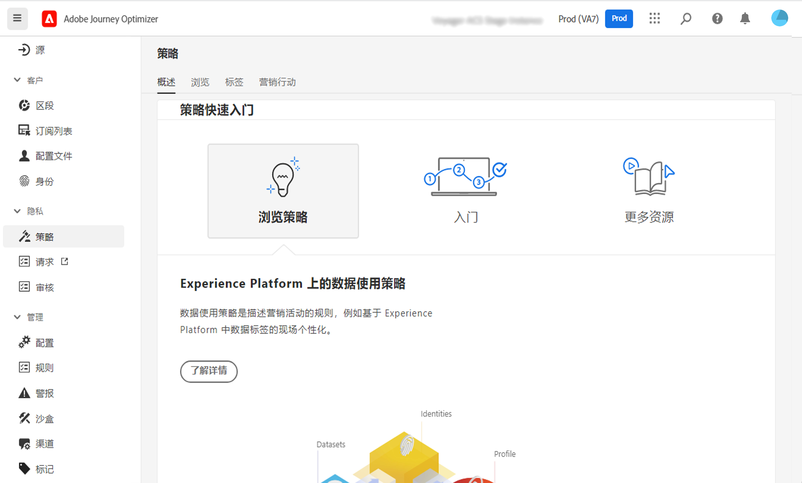
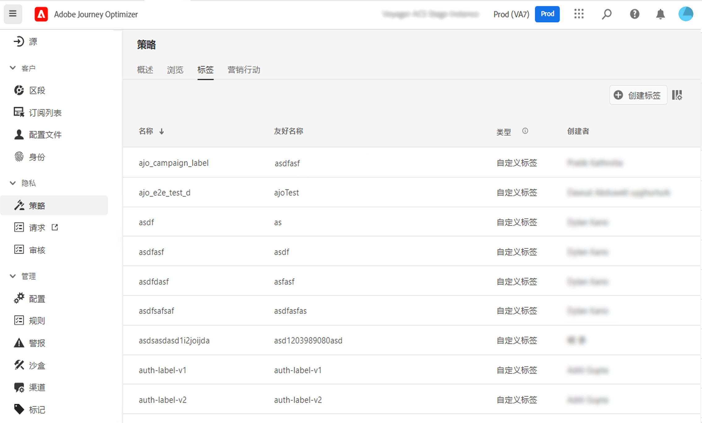
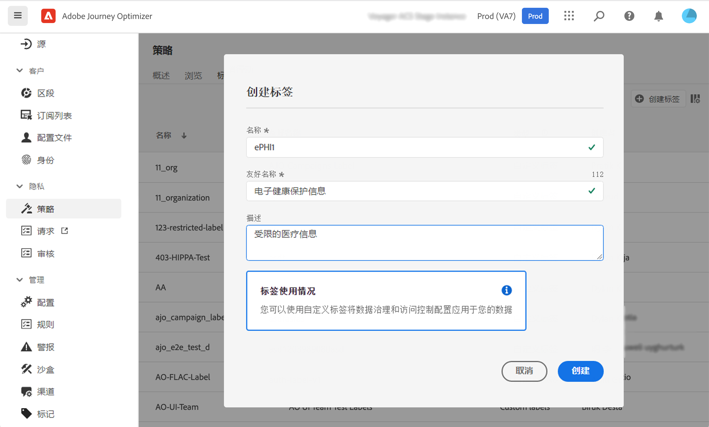
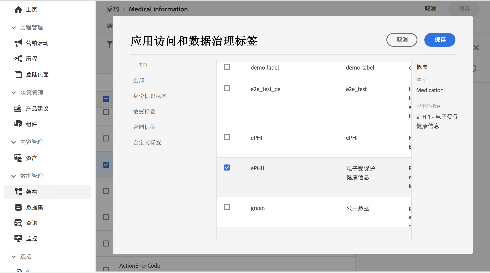
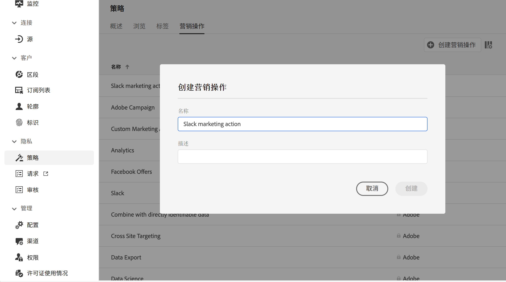
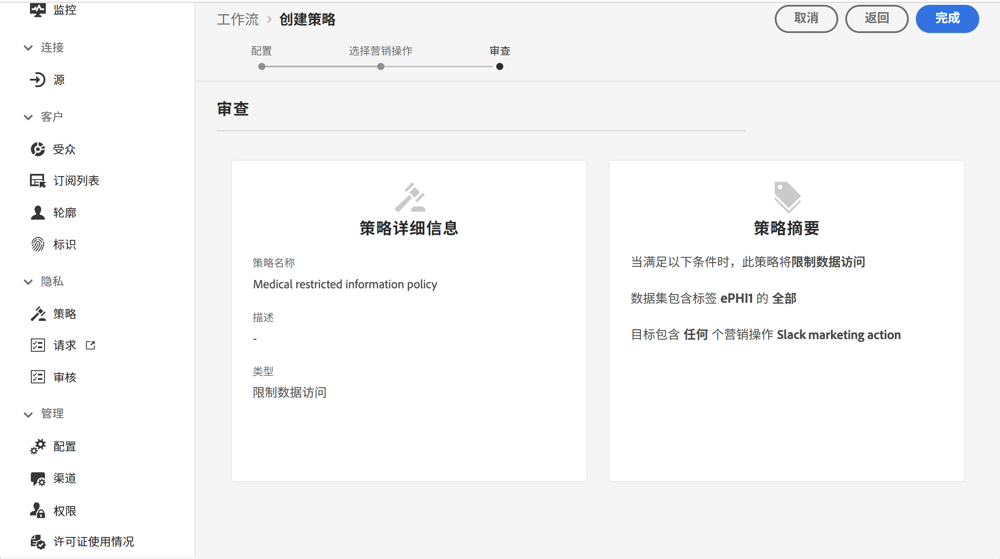
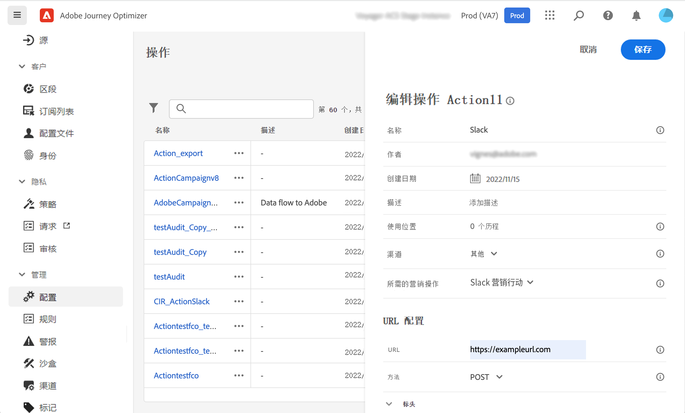
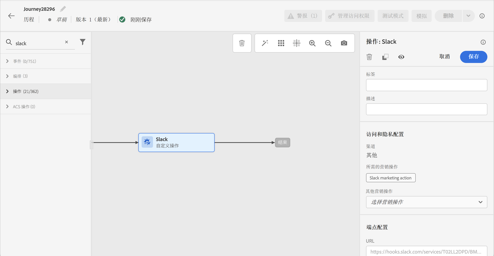
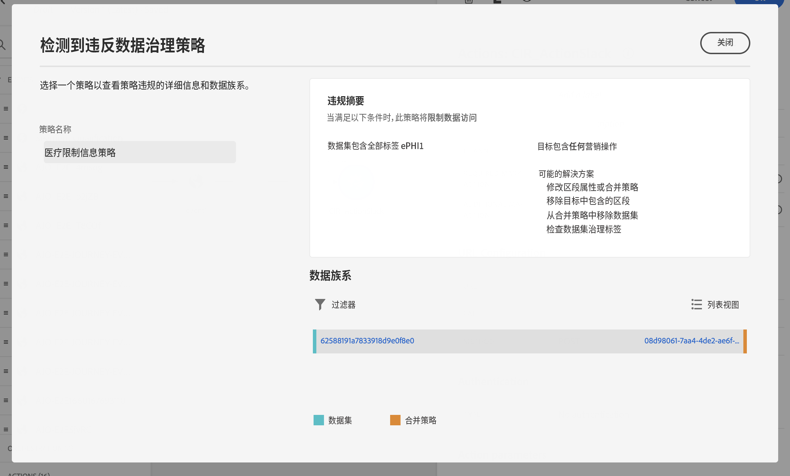

# 数据管理 {#restrict-fields}

>[!IMPORTANT]
>
>数据使用标签和执行 (DULE) 的使用当前仅限于选定客户，并且将在未来版本中部署到所有环境。

凭借其数据使用标签和执行 (DULE) 管理框架，Journey Optimizer 现在可以利用 Adobe Experience Platform 管理策略来防止通过自定义操作将敏感字段导出到第三方系统。如果系统在自定义操作参数中识别出受限字段，则会显示一条错误消息，阻止您发布历程。

Adobe Experience Platform允许您为字段添加标签并为每个渠道创建营销操作。 然后，您可以定义链接到标签和营销操作的管理策略。

在Journey Optimizer中，您可以将这些策略应用于自定义操作，以阻止将特定字段导出到第三方系统。

有关数据管理框架以及如何使用标签和策略的更多信息，请参阅 Adobe Experience Platform 文档：

* [数据管理服务概述](https://experienceleague.adobe.com/docs/experience-platform/data-governance/home.html?lang=zh-Hans)
* [数据使用标签概述](https://experienceleague.adobe.com/docs/experience-platform/data-governance/labels/overview.html?lang=zh-Hans)
* [数据使用策略](https://experienceleague.adobe.com/docs/experience-platform/data-governance/policies/overview.html?lang=zh-Hans)

## 重要说明 {#important-notes}

* 数据管理仅适用于历程中的自定义操作。 Campaign Classic和Campaign Standard操作不受支持。
* 仅当在自定义操作级别设置营销操作（必需或其他操作）时，管理策略才适用。
* 不支持使用现成并集架构的字段组所包含的属性。 这些属性将在界面中隐藏。 您需要使用其他架构创建另一个字段组。

## 定义管理政策 {#governance-policies}

您可以使用现有标签、营销操作和策略。 以下是创建新配置步骤的主要步骤：

* 添加标签并将其应用于您不希望导出到第三方系统的特定字段，例如人员的血型。
* 为历程中使用的每个第三方自定义操作定义营销操作。
* 创建管理策略并将其与标签和营销操作相关联。

有关如何管理策略的详细信息，请参阅此 [文档](https://experienceleague.adobe.com/docs/experience-platform/data-governance/policies/user-guide.html?lang=en#consent-policy)

让我们举一个血型字段的示例，您需要将该字段标记为敏感并限制将其导出到第三方。 以下是不同的步骤：

1. 在左侧菜单的 **隐私**，单击 **策略**.
   
1. 选择 **标签** 选项卡，单击 **创建标签**.
   
1. 为此标签定义名称和友好名称。 例如， _ePHI1_.
   
1. 在左侧菜单的 **数据管理**，单击 **模式**，然后单击 **应用访问和数据管理标签** 按钮。 选择您的架构和字段（血型），然后选择之前创建的标签， _ePHI1_ 以我们的例子。
   
1. 返回到 **策略** 菜单，选择 **营销操作** 选项卡，单击 **创建营销操作**. 我们建议您为历程中使用的每个第三方自定义操作创建一个营销操作。 例如，我们创建一个 _Slack营销操作_ 它将用于您的Slack自定义操作。
   
1. 选择 **浏览** ，单击 **创建策略** 选择 **数据管理政策**. 选择您的标签(_ePHI1_)和营销操作(_Slack营销操作_)。
   

当您在历程中使用配置了的Slack自定义操作时 _Slack营销操作_，则相关策略将被利用。

## 配置自定义操作 {#consent-custom-action}

在左侧菜单的 **管理**，单击 **配置** 选择 **操作**. 打开Slack自定义操作。 配置自定义操作时，可使用两个字段进行数据管理。

* 的 **渠道** 字段允许您选择与此自定义操作相关的渠道： **电子邮件**, **短信**&#x200B;或 **推送通知**. 它将预填充 **必需的营销操作** 字段，其中包含所选渠道的默认营销操作。 如果您选择 **其他**，则默认情况下不会定义营销操作。 在本例中，我们选择渠道 **其他**.

* 的 **必需的营销操作** 允许您定义与自定义操作相关的营销操作。 例如，如果您使用该自定义操作通过第三方发送电子邮件，则可以选择 **电子邮件定位**. 在本例中，我们选择 _Slack营销操作_. 将检索并利用与该营销操作关联的管理策略。

有关配置自定义操作的其他步骤，请参见 [此部分](../action/about-custom-action-configuration.md#consent-management).

## 构建历程 {#consent-journey}

在左侧菜单的 **历程管理**，单击 **历程**. 创建历程并添加自定义操作。  在历程中添加自定义操作时，有多个选项允许您管理数据管理。 单击 **显示只读字段** 以显示所有参数。

的 **渠道** 和 **必需的营销操作**，则配置自定义操作时定义的规则将显示在屏幕顶部。 您无法修改这些字段。

您可以定义 **其他营销操作** 设置自定义操作类型。 这允许您定义此历程中自定义操作的用途。 除了所需的营销操作（通常特定于渠道）之外，您还可以定义其他营销操作，该操作将特定于此特定历程中的自定义操作。 例如：健身通讯、时事通讯、健身通讯等。 所需的营销操作和其他营销操作都将适用。

在我们的示例中，我们不使用其他营销操作。

如果其中一个字段标记为 _ePHI1_ （我们示例中的“血液类型”字段）在操作参数中被检测，此时会显示错误，阻止您发布历程。

有关在历程中配置自定义操作的其他步骤，请参阅 [此部分](../building-journeys/using-custom-actions.md).
