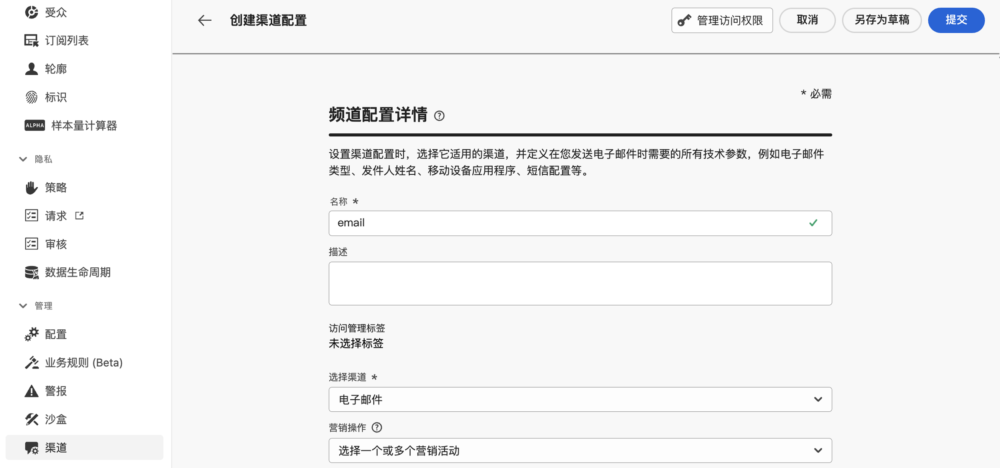
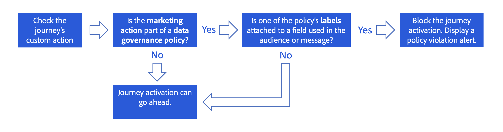

# 数据治理 {#restrict-fields}

>[!CONTEXTUALHELP]
>id="ajo_data_governance_policy_violation"
>title="数据治理策略违规"
>abstract="如果系统在历程/营销活动或自定义操作中识别出受限字段，则会显示一条错误消息，阻止您发布它。使用此对话框中的数据谱系图，了解在激活历程或营销活动之前，需要做出哪些其他配置更改。"

## 数据治理策略入门 {#gs}

通过其[数据使用标签和执行(DULE)管理](https://experienceleague.adobe.com/docs/experience-platform/data-governance/home.html?lang=zh-Hans){target="_blank"}框架，Adobe Experience Platform允许您&#x200B;**为字段设置标签**&#x200B;并为每个渠道创建&#x200B;**营销操作**，从而跨渠道管理和执行数据治理策略。

定义标签和营销操作后，您可以创建将这两个元素联系起来的&#x200B;**数据治理策略**。例如，您可以设置一个策略，将“ePHI”标签与“电子邮件定位”营销操作相关联，从而确保标记为“ePHI”的字段不会用于个性化电子邮件。[了解如何创建数据治理策略](#policy)

创建治理策略后，您可以将营销操作应用于历程/营销活动和历程自定义操作。
[了解如何在 Journey Optimizer 中应用营销操作](#apply-marketing-actions)

构建历程或营销活动时，在选择渠道配置或添加自定义操作后，系统会验证消息渠道配置中的营销操作或自定义操作是否属于数据治理策略的一部分。如果是，系统会检查目标受众或消息个性化中的任何字段是否被策略标记和限制。如果检测到此类标签，则会阻止发布历程或营销活动。[了解如何检测数据治理策略违规](#violation)

## 创建标签和营销操作{#labels-marketing-actions}

实施数据治理策略的第一步是创建标签，并将其附加到要限制使用的字段，以及每个渠道的营销操作。

1. 在左侧菜单中的&#x200B;**隐私**&#x200B;下，单击&#x200B;**策略**。

1. 选择&#x200B;**标签**&#x200B;选项卡，然后单击&#x200B;**创建标签**。

1. 为您的标签定义名称和易记名称。例如，_ePHI1_。

1. 在左侧菜单中的&#x200B;**数据管理**&#x200B;下，单击&#x200B;**架构**，然后单击&#x200B;**应用访问和数据治理标签**&#x200B;按钮。选择您的架构和字段（例如“血型”），然后选择之前创建的标签，在我们的例子中为 _ePHI1_。

   

1. 返回至&#x200B;**策略**&#x200B;菜单，选择&#x200B;**营销操作**&#x200B;选项卡，然后单击&#x200B;**创建营销操作**。建议您为历程中使用的每个渠道和每个第三方自定义操作创建一个营销操作。例如，我们来创建一个 _Slack 营销操作_，用于 Slack 自定义操作。

   

## 创建数据治理策略 {#policy}

现已创建标签和营销操作，您可以将它们一起链接到数据治理策略中。为此，请选择&#x200B;**浏览**&#x200B;选项卡，单击&#x200B;**创建策略**，然后选择&#x200B;**数据治理策略**。选择您的标签 (_ePHI1_) 和营销操作（_Slack 营销操作_）。

如果您在历程中使用配置了 _Slack 营销操作_&#x200B;的 Slack 自定义操作，则将利用关联的策略。

## 在 Journey Optimizer 中应用营销操作{#apply-marketing-actions}

要在 Journey Optimizer 中实施数据治理策略，您需要将营销操作应用于历程、营销活动或自定义操作。

### 将营销操作应用于历程和营销活动{#journeys-campaigns}

创建治理策略后，必须在 Journey Optimizer **渠道配置**&#x200B;中应用相关的营销操作。为此，请执行以下步骤：

1. 访问&#x200B;**[!UICONTROL 渠道]** > **[!UICONTROL 常规设置]** > **[!UICONTROL 渠道配置]**&#x200B;菜单。

1. 打开现有渠道配置或创建新渠道配置。

1. 在&#x200B;**[!UICONTROL 营销操作]**&#x200B;字段中，使用此配置选择要与历程/营销活动关联的营销操作。利用与营销操作关联的所有同意和数据治理策略，尊重客户的偏好和为敏感字段设置的限制。[了解详情](../action/consent.md#surface-marketing-actions)

   

1. 完成渠道配置设置，然后保存。[了解如何设置渠道配置](../configuration/channel-surfaces.md)。

1. 在历程或营销活动中创建消息时，选择相关的渠道配置。完成历程或营销活动的配置并保存。

在激活历程或营销活动之前，系统会验证所选渠道配置中的营销操作是否属于数据治理策略的一部分。如果是，系统会检查目标受众或消息个性化中的任何字段是否被策略标记和限制。

如果系统识别到受限字段，则会显示一条错误消息，阻止您发布历程或营销活动。[了解如何检测治理策略违规](#violation)

{zoomable="yes"}

*历程和营销活动的策略违规分析步骤*

### 将营销操作应用于自定义操作 {#custom-actions}

>[!NOTE]
>
>不支持 Campaign v7/v8 和 Campaign Standard 历程操作。

让我们以“血型”字段为例，您需要限制将其导出到使用自定义操作的第三方。为此，您需要将营销操作应用于自定义操作，然后构建历程并在其中添加自定义操作。

1. 在左侧菜单中的&#x200B;**管理**&#x200B;下，单击&#x200B;**配置**，然后选择&#x200B;**操作**。

1. 打开 Slack 自定义操作。配置自定义操作时，可使用两个字段进行数据治理。

   

   * **渠道**&#x200B;字段允许您选择与此自定义操作相关的渠道。所选渠道的&#x200B;**所需的营销操作**&#x200B;字段会预填充默认营销操作。如选择&#x200B;**其他**，则默认不会定义营销操作。在本例中，我们为渠道选择&#x200B;**其他**。

   * 使用&#x200B;**必需的营销操作**&#x200B;字段，可定义与自定义操作相关的营销操作。例如，如果您使用该自定义操作通过第三方发送电子邮件，则可以选择&#x200B;**电子邮件定位**。在本例中，我们选择 _Slack 营销操作_。检索并利用与该营销操作关联的治理策略。

   有关配置自定义操作的其他步骤，请参见[此部分](../action/about-custom-action-configuration.md#consent-management)。

1. 在左侧菜单的&#x200B;**历程管理**&#x200B;中，单击&#x200B;**历程**。

1. 创建历程并添加自定义操作。在历程中添加自定义操作时，有多个选项可用于对数据治理工作进行管理。单击&#x200B;**显示只读字段**&#x200B;以显示所有参数。

   

   * 配置自定义操作时定义的&#x200B;**渠道**&#x200B;和&#x200B;**必需的营销操作**&#x200B;将显示在屏幕顶部。您无法修改这些字段。

   * 您可以定义&#x200B;**其他营销操作**&#x200B;以设置自定义操作类型。这允许您定义此历程中自定义操作的用途。除了必需的营销操作（通常特定于渠道）之外，您还可以定义附加营销操作，该操作将特定于此历程中的自定义操作。例如：训练通信、新闻稿、健身通信等。所需的营销操作和附加营销操作都将适用。在我们的示例中，我们不使用其他营销操作。

如果在操作参数中检测到有一个字段标记为 _ePHI1_（我们示例中的“血型”字段），则会显示一条错误，并阻止您发布历程。[了解如何检测治理策略违规](#violation)

{zoomable="yes"}

*历程自定义操作的策略违规分析步骤*

## 检测策略违规 {#violation}

如果系统在历程/营销活动或自定义操作中识别出受限字段，则会显示错误并阻止您发布。

**[!UICONTROL 警报]**&#x200B;按钮将显示错误。选择此错误可显示有关发生的数据治理策略违规的详细信息。

此对话框指示当前历程/营销活动配置违反现有的数据治理策略。使用数据谱系图，了解在激活历程或营销活动之前，需要做出哪些其他配置更改。

[数据使用策略违规文档](https://experienceleague.adobe.com/zh-hans/docs/experience-platform/data-governance/enforcement/auto-enforcement#data-usage-violation){_blank}中提供了详细信息。
