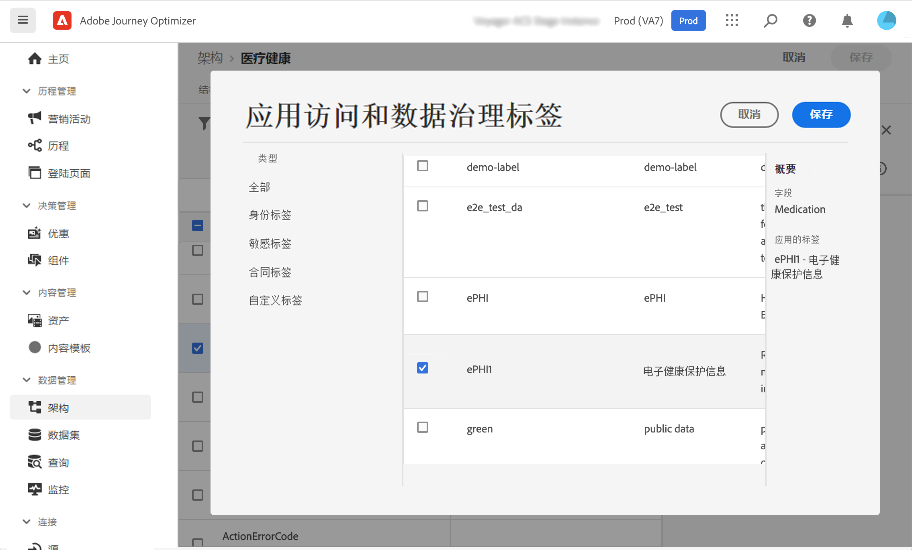
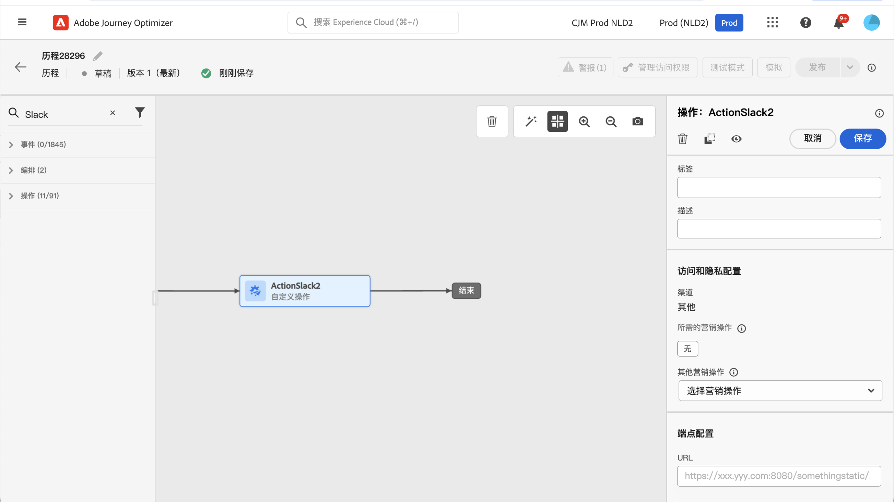

# 数据治理 {#restrict-fields}

>[!IMPORTANT]
>
>数据使用标签和执行 (DULE) 的使用当前仅限于选定客户，并且将在未来版本中部署到所有环境。

凭借其数据使用标签和执行 (DULE) 管理框架，Journey Optimizer 现在可以利用 Adobe Experience Platform 管理策略来防止通过自定义操作将敏感字段导出到第三方系统。如果系统在自定义操作参数中识别出受限字段，则会显示一条错误消息，阻止您发布历程。

使用 Adobe Experience Platform，您可以为字段添加标签，并为每个渠道创建营销操作。然后，可定义链接到标签和营销操作的治理策略。

在 Journey Optimizer 中，可将这些策略应用于自定义操作，以防止将特定字段导出到第三方系统。

有关数据管理框架以及如何使用标签和策略的更多信息，请参阅 Adobe Experience Platform 文档：

* [数据管理服务概述](https://experienceleague.adobe.com/docs/experience-platform/data-governance/home.html?lang=zh-Hans)
* [数据使用标签概述](https://experienceleague.adobe.com/docs/experience-platform/data-governance/labels/overview.html?lang=zh-Hans)
* [数据使用策略](https://experienceleague.adobe.com/docs/experience-platform/data-governance/policies/overview.html?lang=zh-Hans)

## 重要说明 {#important-notes}

* 数据治理仅适用于历程中的自定义操作。不支持 Campaign Classic 和 Campaign Standard 操作。
* 仅在自定义操作级别设置营销操作（必需或附加）时，治理策略才适用。
* 不支持使用现成联合架构的字段组所包含的属性。这些属性在界面中处于隐藏状态。您需要使用其他架构创建另一个字段组。

## 定义治理策略 {#governance-policies}

您可以使用现有标签、营销操作和策略。以下是创建新治理策略的主要配置步骤：

* 添加标签并将其应用于不希望导出到第三方系统的特定字段，例如人员的血型。
* 为历程中使用的每个第三方自定义操作定义营销操作。
* 创建治理策略并将其与标签和营销操作相关联。

有关如何管理策略的更多信息，请参阅此[文档](https://experienceleague.adobe.com/docs/experience-platform/data-governance/policies/user-guide.html?lang=zh-Hans#consent-policy)

让我们以血型字段为例，您需要将该字段标记为敏感字段，并限制将其导出到第三方系统。具体步骤如下：

1. 在左侧菜单中的&#x200B;**隐私**&#x200B;下，单击&#x200B;**策略**。
   
1. 选择&#x200B;**标签**&#x200B;选项卡，然后单击&#x200B;**创建标签**。
   
1. 为此标签定义名称和友好名称。例如，_ePHI1_。
   
1. 在左侧菜单中的&#x200B;**数据管理**&#x200B;下，单击&#x200B;**架构**，然后单击&#x200B;**应用访问和数据治理标签**&#x200B;按钮。选择您的架构和字段（血型），然后选择之前创建的标签，在我们的例子中为 _ePHI1_。
   
1. 返回至&#x200B;**策略**&#x200B;菜单，选择&#x200B;**营销操作**&#x200B;选项卡，然后单击&#x200B;**创建营销操作**。建议您为历程中使用的每个第三方自定义操作创建一个营销操作。例如，我们来创建一个 _Slack 营销操作_，用于 Slack 自定义操作。
   
1. 选择&#x200B;**浏览**&#x200B;选项卡，单击&#x200B;**创建策略**，然后选择&#x200B;**数据治理策略**。选择您的标签 (_ePHI1_) 和营销操作（_Slack 营销操作_）。
   

如果您在历程中使用配置了 _Slack 营销操作_&#x200B;的 Slack 自定义操作，则将利用关联的策略。

## 配置自定义操作 {#consent-custom-action}

在左侧菜单中的&#x200B;**管理**&#x200B;下，单击&#x200B;**配置**，然后选择&#x200B;**操作**。打开 Slack 自定义操作。配置自定义操作时，可使用两个字段进行数据治理。

* 使用&#x200B;**渠道**&#x200B;字段，可选择与此自定义操作相关的渠道：**电子邮件**、**短信**&#x200B;或&#x200B;**推送通知**。所选渠道的&#x200B;**必需的营销操作**&#x200B;字段会预填充默认营销操作。如选择&#x200B;**其他**，则默认不会定义营销操作。在本例中，我们为渠道选择&#x200B;**其他**。

* 使用&#x200B;**必需的营销操作**&#x200B;字段，可定义与自定义操作相关的营销操作。例如，如果您使用该自定义操作通过第三方发送电子邮件，则可以选择&#x200B;**电子邮件定位**。在本例中，我们选择 _Slack 营销操作_。检索并利用与该营销操作关联的治理策略。

有关配置自定义操作的其他步骤，请参见[此部分](../action/about-custom-action-configuration.md#consent-management)。

## 构建历程 {#consent-journey}

在左侧菜单的&#x200B;**历程管理**，单击&#x200B;**历程**。创建历程并添加自定义操作。在历程中添加自定义操作时，有多个选项可用于对数据治理工作进行管理。单击&#x200B;**显示只读字段**&#x200B;以显示所有参数。

配置自定义操作时定义的&#x200B;**渠道**&#x200B;和&#x200B;**必需的营销操作**&#x200B;将显示在屏幕顶部。您无法修改这些字段。

您可以定义&#x200B;**其他营销操作**&#x200B;以设置自定义操作类型。这允许您定义此历程中自定义操作的用途。除了必需的营销操作（通常特定于渠道）之外，您还可以定义附加营销操作，该操作将特定于此历程中的自定义操作。例如：训练通信、新闻稿、健身通信等。必需的营销操作和附加营销操作都将适用。

在我们的示例中，我们不使用其他营销操作。

如果在操作参数中检测到有一个字段标记为 _ePHI1_（我们示例中的“血液类型”字段），则会显示错误，导致您无法发布历程。

有关在历程中配置自定义操作的其他步骤，请参阅[此部分](../building-journeys/using-custom-actions.md)。
