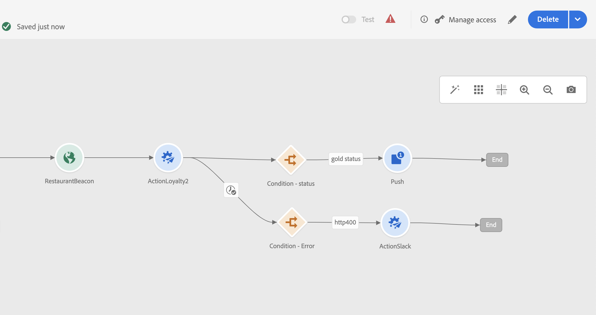

# 在自定义操作中使用 API 调用响应 {#custom-action-enhancements}

您可以在自定义操作中利用API调用响应，并根据这些响应编排历程。

>[!AVAILABILITY]
>
>此功能目前在Beta版中可用。

<!--
You can now leverage API call responses in custom actions and orchestrate your journeys based on these responses.

This capability was previously only available when using data sources. You can now use it with custom actions. 
-->

## 重要说明{#custom-action-enhancements-notes}

<!--
* Custom actions should only be used with private or internal endpoints, and used with an appropriate capping or throttling limit. See [this page](../configuration/external-systems.md). 
-->

* 响应有效负载支持标量数组：

  ```
  "dummyScalarArray": [
  "val1",
  "val2"
  ]
  ```

* 响应有效负载中不支持异构阵列：

  ```
  "dummyRandomArray": [
  20,
  "aafw",
  false
  ]
  ```

<!--
## Best practices{#custom-action-enhancements-best-practices}

A capping limit of 5000 calls/s is defined for all custom actions. This limit has been set based on customers usage, to protect external endpoints targeted by custom actions. You need to take this into account in your audience-based journeys by defining an appropriate reading rate (5000 profiles/s when custom actions are used). If needed, you can override this setting by defining a greater capping or throttling limit through our Capping/Throttling APIs. See [this page](../configuration/external-systems.md).

You should not target public endpoints with custom actions for various reasons:

* Without proper capping or throttling, there is a risk of sending too many calls to a public endpoint that may not support such volume.
* Profile data can be sent through custom actions, so targeting a public endpoint could lead to inadvertently sharing personal information externally.
* You have no control on the data being returned by public endpoints. If an endpoint changes its API or starts sending incorrect information, those will be made available in communications sent, with potential negative impacts.
-->

<!--
## Define the custom action {#define-custom-action}

When defining the custom action, two enhancements have been made available: the addition of the GET method and the new payload response field. The other options and parameters are unchanged. See [this page](../action/about-custom-action-configuration.md).

### Endpoint configuration {#endpoint-configuration}

The **URL configuration** section has been renamed **Endpoint configuration**.

In the **Method** drop-down, you can now select **GET**.

{width="70%" align="left"}

### Payloads {#payloads-new}

The **Action parameters** section has been renamed **Payloads**. Two fields are available:

* The **Request** field: this field is only available for POST and PUT calling methods.
* The **Response** field: this is the new capability. This field as available for all calling methods.

>[!NOTE]
> 
>Both these fields are optional.

{width="70%" align="left"}
-->

## 配置自定义操作 {#config-response}

1. 创建自定义操作。 请参见[此页面](../action/about-custom-action-configuration.md)。

1. 在 **响应** 字段。

   {width="80%" align="left"}

1. 粘贴由调用返回的有效负载示例。 验证字段类型是否正确（字符串、整数等）。 以下是调用期间捕获的响应有效负载示例。 我们的本地端点发送会员积分数和用户档案的状态。

   ```
   {
   "customerID" : "xY12hye",    
   "status":"gold",
   "points": 1290 }
   ```

   {width="80%" align="left"}

   每次调用 API 时，系统将检索有效负载示例中包含的所有字段。

1. 我们还要将customerID添加为查询参数。

   {width="80%" align="left"}

1. 单击&#x200B;**保存**。

## 在历程中利用响应 {#response-in-journey}

只需将自定义操作添加到历程中。 然后，您可以在条件、其他操作和消息个性化中利用响应有效负载字段。

例如，您可以添加条件以检查会员积分数。 当人员进入餐厅时，您的本地端点会发送包含用户档案忠诚度信息的调用。 如果用户档案是黄金客户，则可以发送推送。 如果在调用中检测到错误，请发送自定义操作以通知您的系统管理员。


1. 添加您的事件和之前创建的忠诚度自定义操作。

1. 在“忠诚度”自定义操作中，将客户ID查询参数映射到配置文件ID。 选中选项 **在超时或错误的情况下添加替代路径**.

   

1. 在第一个分支中，添加一个条件并使用高级编辑器利用 **上下文** 节点。

   

1. 然后，添加推送，并使用响应字段个性化消息。 在本例中，我们使用忠诚度积分数和客户状态来个性化内容。 操作响应字段位于 **上下文属性** > **Journey Orchestration** > **操作**.

   

   >[!NOTE]
   >
   >每个输入自定义操作的配置文件都将触发调用。 即使响应始终相同，历程仍会为每个配置文件执行一个调用。

1. 在超时和错误分支中，添加条件并利用内置 **jo_status_code** 字段。 在我们的示例中，我们使用
   **http_400** 错误类型。 请参阅[此章节](#error-status)。

   ```
   @action{ActionLoyalty.jo_status_code} == "http_400"
   ```

   

1. 添加将发送到贵组织的自定义操作。

   

## 测试模式日志 {#test-mode-logs}

您可以通过测试模式访问与自定义操作响应相关的状态日志。 如果您在历程中定义了具有响应的自定义操作，则会看到 **actionsHistory** 部分，用于显示外部端点返回的有效负载（作为来自该自定义操作的响应）。 这在调试方面可能非常有用。


## 错误状态 {#error-status}

此 **jo_status_code** 字段始终可用，即使未定义响应有效负载也是如此。

以下是此字段的可能值：

* http状态代码： http_`<HTTP API call returned code>`，例如http_200或http_400
* 超时错误： **超时**
* 上限错误： **上限**
* 内部错误： **内部错误**

如果返回的http代码大于2xx或发生错误，则认为操作调用有误。 在这种情况下，历程会流向专用超时或错误分支。

>[!WARNING]
>
>只有新创建的自定义操作包括 **jo_status_code** 现成字段。 如果要将其用于现有的自定义操作，则需要更新操作。 例如，您可以更新说明并保存。

## 表达式语法 {#exp-syntax}

以下是语法：

```json
#@action{myAction.myField} 
```

下面是一些示例：

```json
 // action response field
 @action{<action name>.<path to the field>}
 @action{ActionLoyalty.status}
```

```json
 // action response field
 @action{<action name>.<path to the field>, defaultValue: <default value expression>}
 @action{ActionLoyalty.points, defaultValue: 0}
 @action{ActionLoyalty.points, defaultValue: @{myEvent.newPoints}}
```

有关字段引用的更多信息，请参阅 [本节](../building-journeys/expression/field-references.md).
