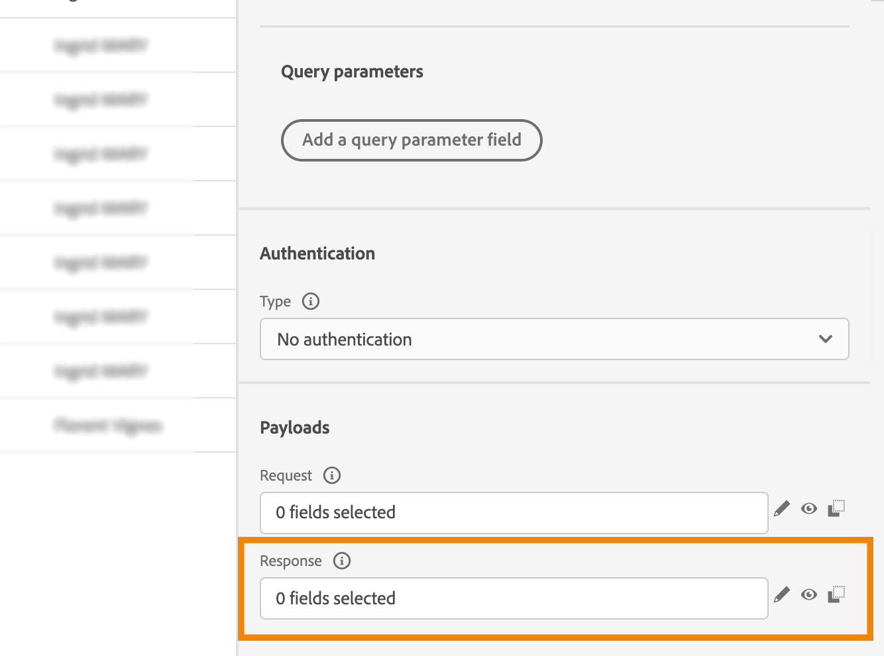

# 自定义操作增强功能

您现在可以在自定义操作中利用API调用响应，并根据这些响应编排历程。

此功能仅在使用数据源时可用。 现在，您可以将其用于自定义操作。

>[!AVAILABILITY]
>
>此功能目前作为私有测试版提供。

## 定义自定义操作

在定义自定义操作时，提供了两项增强功能：添加了GET方法和新的有效负载响应字段。 其他选项和参数保持不变。 请参阅[此页](../action/about-custom-action-configuration.md)。

### 端点配置

此 **URL配置** 已重命名部分 **端点配置**.

在 **方法** 下拉列表，您现在可以选择 **GET**.

{width="70%" align="left"}

### 负载

此 **操作参数** 已重命名部分 **负载**. 有两个字段可用：

* 此 **请求** 字段：此字段仅可用于POST和PUT调用方法。
* 此 **响应** 字段：这是新功能。 此字段可用于所有调用方法。

>[!NOTE]
> 
>这两个字段都是可选的。

{width="70%" align="left"}

1. 在 **响应** 字段。

   {width="80%" align="left"}

1. 粘贴由调用返回的有效负载示例。 验证字段类型是否正确（字符串、整数等）。

   {width="80%" align="left"}

1. 单击&#x200B;**保存**。

每次调用 API 时，系统将检索有效负载示例中包含的所有字段。请注意，您可以单击 **粘贴新的有效负载** （如果要更改当前传递的有效负载）。

以下是调用天气API服务期间捕获的响应有效负载示例：

```
{
    "coord": {
        "lon": 2.3488,
        "lat": 48.8534
    },
    "weather": [
        {
            "id": 800,
            "main": "Clear",
            "description": "clear sky",
            "icon": "01d"
        }
    ],
    "base": "stations",
    "main": {
        "temp": 29.78,
        "feels_like": 29.78,
        "temp_min": 29.92,
        "temp_max": 30.43,
        "pressure": 1016,
        "humidity": 31
    },
    "visibility": 10000,
    "wind": {
        "speed": 5.66,
        "deg": 70
    },
    "clouds": {
        "all": 0
    },
    "dt": 1686066467,
    "sys": {
        "type": 1,
        "id": 6550,
        "country": "FR",
        "sunrise": 1686023350,
        "sunset": 1686080973
    },
    "timezone": 7200,
    "id": 2988507,
    "name": "Paris",
    "cod": 200
}
```

## 在历程中利用响应

只需将自定义操作添加到历程中。 然后，您可以在条件、其他操作和消息个性化中利用响应有效负载字段。

### 条件和操作

例如，可添加条件以检查风速。 当人员进入冲浪店时，如果天气太风，您可以发送推送。


在条件中，您需要使用高级编辑器来利用 **上下文** 节点。


您还可以利用 **jo_states** 用于创建新路径以防出错的代码。


>[!WARNING]
>
>只有新创建的自定义操作才包括此字段。 如果要将其用于现有的自定义操作，则需要更新操作。 例如，您可以更新说明并保存。

以下是此字段的可能值：

* http状态代码：用于实例 **http_200** 或 **http_400**
* 超时错误： **超时**
* 上限错误： **上限**
* 内部错误： **内部错误**

有关历程活动的更多信息，请参阅 [本节](../building-journeys/about-journey-activities.md).

### 消息个性化

您可以使用响应字段个性化消息。 在我们的示例中，在推送通知中，我们使用速度值将内容个性化。


>[!NOTE]
>
>在给定历程中，每个用户档案只能执行一次调用。 同一配置文件的多条消息不会触发新调用。

有关消息个性化的更多信息，请参阅 [本节](../personalization/personalize.md).

## 表达式语法

以下是语法：

```json
#@action{myAction.myField} 
```

下面是一些示例：

```json
// action response field
@action{<action name>.<path to the field>}
@action{OpenWeatherMap.main.temp}
```

```json
// action response field
@action{<action name>.<path to the field>, defaultValue: <default value expression>}
@action{OpenWeatherMap.main.temp, defaultValue: 273.15}
@action{OpenWeatherMap.main.temp, defaultValue: @{myEvent.temperature}} 
```

有关字段引用的更多信息，请参阅 [本节](../building-journeys/expression/field-references.md).
