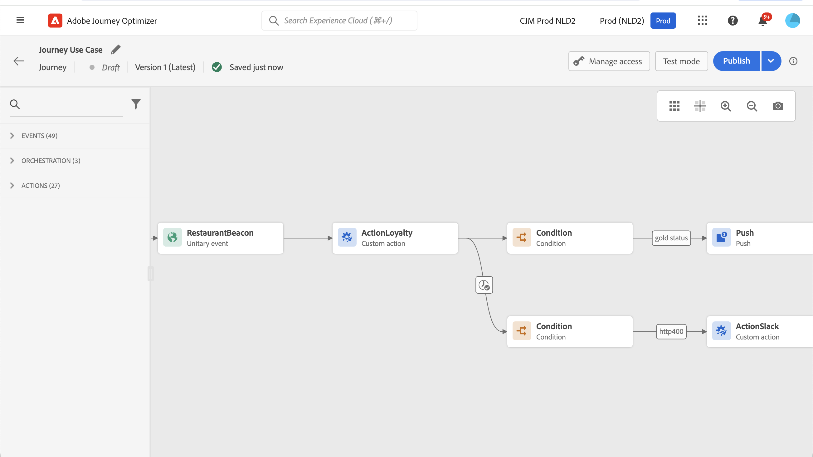

# 自定义操作增强功能

您现在可以在自定义操作中利用API调用响应，并根据这些响应编排历程。

此功能仅在使用数据源时可用。 现在，您可以将其用于自定义操作。

>[!AVAILABILITY]
>
>此功能目前作为私有测试版提供。

>[!WARNING]
>
>自定义操作只能用于私有或内部端点，并且应配合适当的上限或限制使用。 请参阅[此页](../configuration/external-systems.md)。

## 定义自定义操作

在定义自定义操作时，提供了两项增强功能：添加了GET方法和新的有效负载响应字段。 其他选项和参数保持不变。 请参阅[此页](../action/about-custom-action-configuration.md)。

### 端点配置

此 **URL配置** 已重命名部分 **端点配置**.

在 **方法** 下拉列表，您现在可以选择 **GET**.

{width="70%" align="left"}

### 负载

此 **操作参数** 已重命名部分 **负载**. 有两个字段可用：

* 此 **请求** 字段：此字段仅可用于POST和PUT调用方法。
* 此 **响应** 字段：这是新功能。 此字段可用于所有调用方法。

>[!NOTE]
> 
>这两个字段都是可选的。

{width="70%" align="left"}

1. 在 **响应** 字段。

   {width="80%" align="left"}

1. 粘贴由调用返回的有效负载示例。 验证字段类型是否正确（字符串、整数等）。 以下是调用期间捕获的响应有效负载示例。 我们的本地端点发送会员积分数和用户档案的状态。

   ```
   {
   "customerID" : "xY12hye",    
   "status":"gold",
   "points": 1290 }
   ```

   {width="80%" align="left"}

   每次调用 API 时，系统将检索有效负载示例中包含的所有字段。

1. 我们还要将customerID添加为查询参数。

   {width="80%" align="left"}

1. 单击&#x200B;**保存**。

## 在历程中利用响应

只需将自定义操作添加到历程中。 然后，您可以在条件、其他操作和消息个性化中利用响应有效负载字段。

例如，您可以添加条件以检查会员积分数。 当人员进入餐厅时，您的本地端点会发送包含用户档案忠诚度信息的调用。 如果用户档案是黄金客户，则可以发送推送。 如果在调用中检测到错误，请发送自定义操作以通知您的系统管理员。



1. 添加您的事件和之前创建的忠诚度自定义操作。

1. 在“忠诚度”自定义操作中，将客户ID查询参数映射到配置文件ID。 选中选项 **在超时或错误的情况下添加替代路径**.

   

1. 在第一个分支中，添加一个条件并使用高级编辑器利用 **上下文** 节点。

   

1. 然后，添加推送，并使用响应字段个性化消息。 在本例中，我们使用忠诚度积分数和客户状态来个性化内容。 操作响应字段位于 **上下文属性** > **Journey Orchestration** > **操作**.

   

   >[!NOTE]
   >
   >每个输入自定义操作的配置文件都将触发调用。 即使响应始终相同，历程仍会为每个配置文件执行一个调用。

1. 在超时和错误分支中，添加条件并利用内置 **jo_status_code** 字段。 在我们的示例中，我们使用
   **http_400** 错误类型。 请参阅[此章节](#error-status)。

   ```
   @action{ActionLoyalty.jo_status_code} == "http_400"
   ```

   

1. 添加将发送到贵组织的自定义操作。

   

## 错误状态{#error-status}

此 **jo_status_code** 字段始终可用，即使未定义响应有效负载也是如此。

以下是此字段的可能值：

* http状态代码： http_`<HTTP API call returned code>`，例如http_200或http_400
* 超时错误： **超时**
* 上限错误： **上限**
* 内部错误： **内部错误**

如果返回的http代码大于2xx或发生错误，则认为操作调用有误。 在这种情况下，历程会流向专用超时或错误分支。

>[!WARNING]
>
>只有新创建的自定义操作包括 **jo_status_code** 现成字段。 如果要将其用于现有的自定义操作，则需要更新操作。 例如，您可以更新说明并保存。

## 表达式语法

以下是语法：

```json
#@action{myAction.myField} 
```

下面是一些示例：

```json
 // action response field
 @action{<action name>.<path to the field>}
 @action{ActionLoyalty.status}
```

```json
 // action response field
 @action{<action name>.<path to the field>, defaultValue: <default value expression>}
 @action{ActionLoyalty.points, defaultValue: 0}
 @action{ActionLoyalty.points, defaultValue: @{myEvent.newPoints}}
```

有关字段引用的更多信息，请参阅 [本节](../building-journeys/expression/field-references.md).
