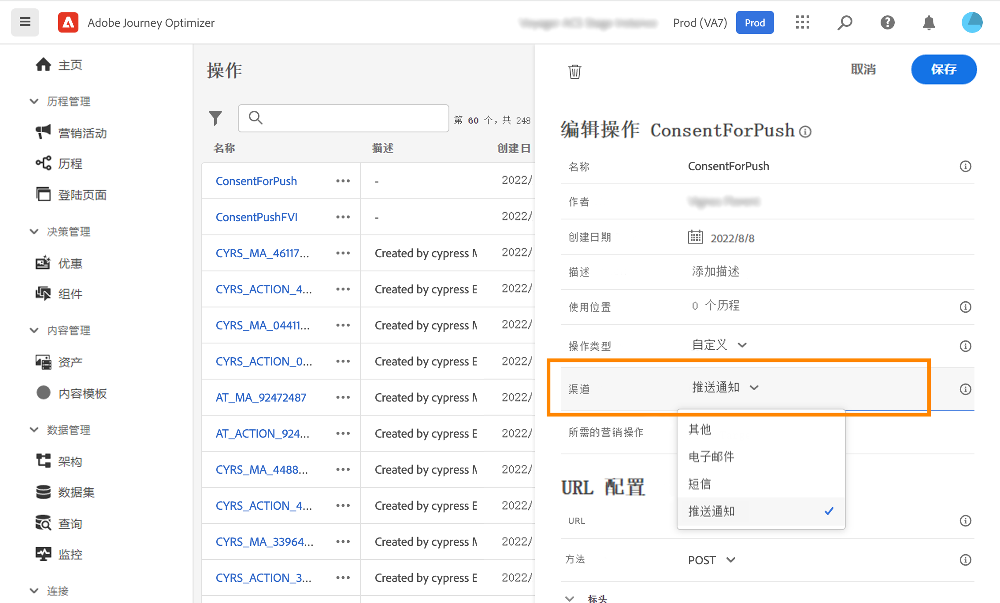

# 使用同意策略 {#consent-management}

贵组织或法律法规可能会对您的数据设置使用限制。因此，确保您在 Journey Optimizer 中的数据操作符合[数据使用政策](https://experienceleague.adobe.com/docs/experience-platform/data-governance/policies/overview.html?lang=zh-Hans){target="_blank"}非常重要。这些策略是 Adobe Experience Platform 规则，定义了您可以对数据执行哪些[营销操作](https://experienceleague.adobe.com/docs/experience-platform/data-governance/policies/overview.html?lang=zh-Hans#marketing-actions){target="_blank"}。

一种可用的数据使用策略是&#x200B;**同意政策**。它们允许您轻松地采用和执行营销策略，尊重客户的同意偏好。[了解有关策略实施的更多信息](https://experienceleague.adobe.com/docs/experience-platform/data-governance/enforcement/auto-enforcement.html?lang=zh-Hans){target="_blank"}

>[!IMPORTANT]
>
>目前，同意策略仅适用于已购买 Adobe **Healthcare Shield** 或 **Privacy and Security Shield** 附加产品的组织。

例如，您可以在 Experience Platform 中[创建同意策略](https://experienceleague.adobe.com/docs/experience-platform/data-governance/policies/user-guide.html?lang=zh-Hans#consent-policy){target="_blank"}，以排除未同意接收电子邮件、推送或短信通信的客户。

* 对于原生出站渠道（电子邮件、推送、短信、直邮），逻辑如下：

   * 默认情况下，如果某个用户档案选择不接收来自您的通信，则会在后续投放中排除相应的用户档案。

   * 如果您有 Adobe **Health Shield** 或 **Privacy and Security Shield**，您可以创建覆盖默认逻辑的自定义同意策略。例如，您可以将策略定义为仅向所有已选择接收通信的人员发送电子邮件。如果没有自定义策略，则应用默认策略。

  要应用自定义策略，您需要在该策略中定义营销操作，并将其与渠道配置关联。[了解详情](#surface-marketing-actions)

在历程级别，您可以将这些同意策略应用于自定义操作。

* 在&#x200B;**配置自定义操作**&#x200B;时，您可以定义渠道和营销操作。[了解详情](#consent-custom-action)
* 在添加&#x200B;**历程中的自定义操作**&#x200B;时，您可以定义其他营销操作。[了解详情](#consent-journey)

## 通过渠道配置利用同意策略 {#surface-marketing-actions}

在 [!DNL Journey Optimizer] 中，同意由 Experience Platform [同意架构](https://experienceleague.adobe.com/docs/experience-platform/xdm/field-groups/profile/consents.html?lang=zh-Hans){target="_blank"}处理。默认情况下，同意字段的值为空，并视为同意接收您的通信。载入时，您可将此默认值修改为[此处](https://experienceleague.adobe.com/docs/experience-platform/xdm/data-types/consents.html?lang=zh-Hans#choice-values){target="_blank"}列出的可能值之一。

要修改同意字段值，您可以创建自定义同意策略，在该策略中定义营销操作以及执行该操作的条件。[了解有关营销操作的更多信息](https://experienceleague.adobe.com/docs/experience-platform/data-governance/policies/overview.html?lang=zh-Hans#marketing-actions){target="_blank"}

例如，如果要创建同意策略以仅定位到同意接收电子邮件通信的用户档案，请执行以下步骤。

1. 确保贵组织已购买 Adobe **Health Shield** 或 **Privacy and Security Shield** 附加产品。[了解详情](https://experienceleague.adobe.com/docs/events/customer-data-management-voices-recordings/governance/healthcare-shield.html?lang=zh-Hans){target="_blank"}

1. 在 Adobe Experience Platform 中，创建自定义策略（从&#x200B;**[!UICONTROL 隐私]** > **[!UICONTROL 策略]**&#x200B;菜单）。[了解如何操作](https://experienceleague.adobe.com/docs/experience-platform/data-governance/policies/user-guide.html?lang=zh-Hans#create-policy){target="_blank"}

   <!---->

1. 选择&#x200B;**[!UICONTROL 同意政策]**，按以下方式键入并配置条件。[了解如何配置同意策略](https://experienceleague.adobe.com/docs/experience-platform/data-governance/policies/user-guide.html?lang=zh-Hans#consent-policy){target="_blank"}

   1. 在 **[!UICONTROL If]** 部分，选择&#x200B;**[!UICONTROL 电子邮件定位]**&#x200B;默认营销操作。

      <!---->

      >[!NOTE]
      >
      >[此表](https://experienceleague.adobe.com/docs/experience-platform/data-governance/policies/overview.html?lang=zh-Hans#core-actions){target="_blank"}中列出了 Adobe 提供的现成核心营销操作。[此部分](https://experienceleague.adobe.com/docs/experience-platform/data-governance/policies/user-guide.html?lang=zh-Hans#create-marketing-action){target="_blank"}中列出了创建自定义营销操作的步骤。

   1. 选择应用营销操作时发生的事件。在此示例中，选择&#x200B;**[!UICONTROL 电子邮件营销同意]**。

   

1. 保存并[启用](https://experienceleague.adobe.com/docs/experience-platform/data-governance/policies/user-guide.html?lang=zh-Hans#enable){target="_blank"}此策略。

1. 在 Journey Optimizer 中，创建电子邮件表面。[了解如何操作](../configuration/channel-surfaces.md#create-channel-surface)

1. 在电子邮件配置详细信息中，选择&#x200B;**[!UICONTROL 电子邮件定位]**&#x200B;营销操作。

   

将自动利用与该营销操作关联的所有同意策略，以尊重客户的偏好。

因此，在此示例中，在营销活动或历程中使用该配置的任何[电子邮件](../email/create-email.md)只会被发送给同意接收来自您的电子邮件的用户档案。未同意接收电子邮件通信的用户档案将被排除在外。

## 通过自定义操作利用同意策略 {#journey-custom-actions}

### 重要说明 {#important-notes}

在 Journey Optimizer 中，可以在自定义操作中利用同意策略。如果要将其与内置消息功能一起使用，您需要使用条件活动来筛选历程中的客户。

使用同意管理功能时，会分析两个历程活动：

* 读取受众：检索到的受众会被考虑在内。
* 自定义操作：同意管理功能会考虑所使用的属性（[操作参数](../action/about-custom-action-configuration.md#define-the-message-parameters)）以及定义的营销操作（必需的营销操作和其他营销操作）。
* 不支持使用现成联合架构的字段组所包含的属性。这些属性在界面中处于隐藏状态。您需要使用其他架构创建另一个字段组。
* 仅在自定义操作级别设置营销操作（必需或其他）时，同意策略才适用。

历程中使用的所有其他活动均不会被考虑在内。如果您以“受众鉴别”开始历程，则不会考虑该受众。

在历程中，如果自定义操作中的同意策略将某个用户档案排除，则不会向该用户发送消息，但是其历程会继续运行。 使用条件时，用户档案不会转到超时和错误路径。

在刷新位于历程中的自定义操作中的策略之前，请确保您的历程没有错误。

<!--
There are two types of latency regarding the use of consent policies:

* **User latency**: the delay from the time a profile changes a consent settings to the moment it is applied in Experience Platform. This can take up to 48h. 
* **Consent policy latency**: the delay from the time a consent policy is created or updated to the moment it is applied. This can take up to 6 hours
-->

### 配置自定义操作 {#consent-custom-action}

>[!CONTEXTUALHELP]
>id="ajo_consent_required_marketing_action"
>title="定义必需的营销操作"
>abstract="使用“必需的营销操作”字段，可定义与自定义操作相关的营销操作。例如，如果您使用该自定义操作发送电子邮件，则可以选择“电子邮件定位”。在历程中使用时，将检索和利用与该营销操作关联的所有同意策略。无法在画布上修改此设置。"

配置自定义操作时，可使用两个字段进行同意管理。

使用&#x200B;**渠道**&#x200B;字段，可选择与此自定义操作相关的渠道：**电子邮件**、**短信**&#x200B;或&#x200B;**推送通知**。所选渠道的&#x200B;**必需的营销操作**&#x200B;字段会预填充默认营销操作。如选择&#x200B;**其他**，则默认不会定义营销操作。

使用&#x200B;**必需的营销操作**&#x200B;字段，可定义与自定义操作相关的营销操作。例如，如果您使用该自定义操作发送电子邮件，则可以选择&#x200B;**电子邮件定位**。在历程中使用时，会检索和利用与该营销操作关联的所有同意策略。系统会选择默认营销操作，但您可以单击向下箭头，从列表中选择任何可用的营销操作。

对于某些类型的重要通信（例如发送的用于重置客户密码的事务性消息），您可能不希望应用同意策略。您可以在&#x200B;**必需的营销操作**&#x200B;字段中选择&#x200B;**无**。

有关配置自定义操作的其他步骤，请参见[此部分](../action/about-custom-action-configuration.md#consent-management)。

### 构建历程 {#consent-journey}

>[!CONTEXTUALHELP]
>id="ajo_consent_required_marketing_action_canvas"
>title="必需的营销操作"
>abstract="在创建自定义操作时，定义必需的营销操作。无法从操作中删除或修改此必需的营销操作。"

>[!CONTEXTUALHELP]
>id="ajo_consent_additional_marketing_action_canvas"
>title="其他营销操作"
>abstract="除了必需的操作之外，还可以添加其他营销操作。将强制执行与两个营销操作相关的同意策略。"

>[!CONTEXTUALHELP]
>id="ajo_consent_refresh_policies_canvas"
>title="对将在运行时应用的同意策略进行可视化"
>abstract="营销操作可引入同意策略，这些策略会将操作参数和单个用户档案同意值结合起来，以筛选用户。单击按钮进行刷新，获取这些策略的最新定义。"

在历程中添加自定义操作时，有多个选项可用于管理同意。单击&#x200B;**显示只读字段**&#x200B;以显示所有参数。

配置自定义操作时定义的&#x200B;**渠道**&#x200B;和&#x200B;**必需的营销操作**&#x200B;将显示在屏幕顶部。您无法修改这些字段。

您可以定义&#x200B;**其他营销操作**&#x200B;以设置自定义操作类型。这允许您定义此历程中自定义操作的用途。除了必需的营销操作（通常特定于渠道）之外，您还可以定义附加营销操作，该操作特定于此历程中的自定义操作。例如：训练通信、新闻稿、健身通信等。必需的营销操作和附加营销操作都适用。

单击屏幕底部的&#x200B;**刷新策略**&#x200B;按钮，更新和检查此自定义操作考虑的策略列表。在构建历程时，这仅供参考。对于实时历程，每 6 小时自动检索和更新一次同意策略。

<!--
The following data is taken into account for consent:

* marketing actions and additional marketing actions defined in the custom action
* action parameters defined in the custom action, see this [section](../action/about-custom-action-configuration.md#define-the-message-parameters) 
* attributes used as criteria in a segment when the journey starts with a Read segment, see this [section](../building-journeys/read-audience.md) 

>[!NOTE]
>
>Please note that there can be a latency when updating the list of policies applied, refer to this [this section](../action/consent.md#important-notes).
-->

有关在历程中配置自定义操作的其他步骤，请参阅[此部分](../building-journeys/using-custom-actions.md)。