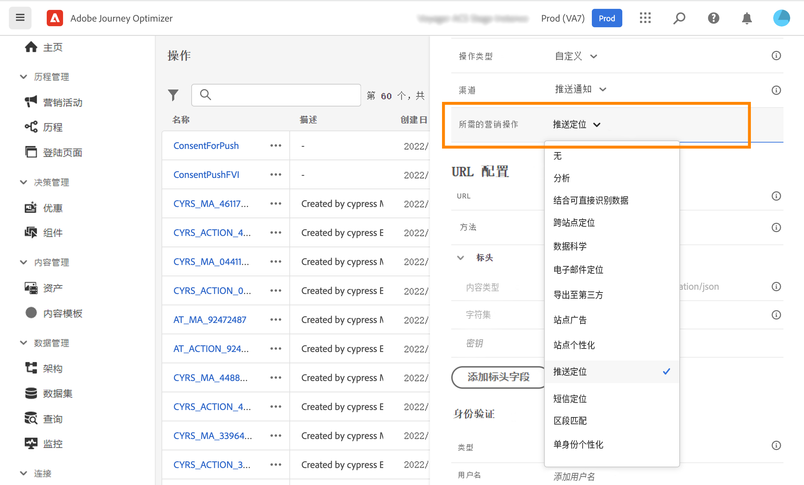
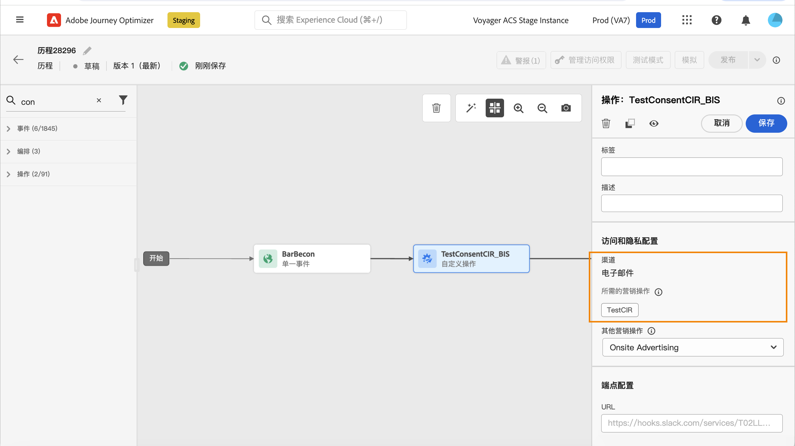
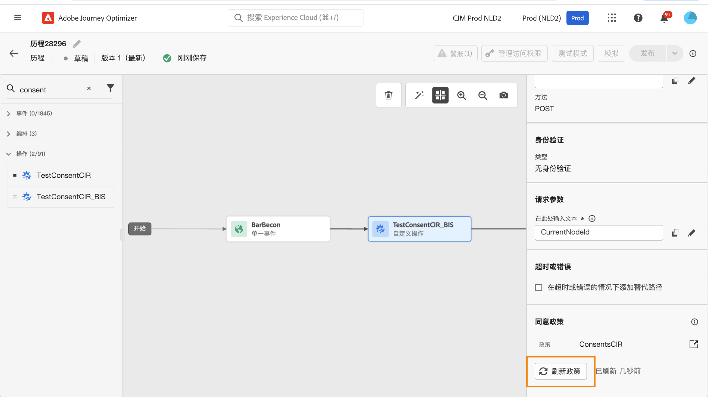

# 使用同意策略 {#consent-management}

Adobe Experience Platform 允许您轻松地采用和执行营销策略，尊重客户的同意偏好。同意策略是在 Adobe Experience Platform 中定义的。请参阅 [本文档](https://experienceleague.adobe.com/docs/experience-platform/data-governance/policies/user-guide.html?lang=en#consent-policy).

在 Journey Optimizer 中，您可以将这些同意策略应用于自定义操作。例如，您可以定义同意策略以排除未同意接收电子邮件、推送或短信通信的客户。

>[!NOTE]
>
>同意策略当前仅适用于已购买Healthcare Shield附加产品的组织。

在Journey Optimizer中，同意在以下几个级别定义：

* when **配置自定义操作**，您可以定义渠道和营销操作。 请参阅 [部分](../action/consent.md#consent-custom-action).
* 添加 **历程中的自定义操作**，您可以定义其他营销操作。 请参阅 [部分](../action/consent.md#consent-journey).

## 重要说明 {#important-notes}

在Journey Optimizer中，可以在自定义操作中利用同意。 如果要将其与内置消息功能一起使用，您需要使用条件活动来筛选历程中的客户。

在同意管理下，将分析两个历程活动：

* 读取区段：检索到的区段会被考虑在内。
* 自定义操作：同意管理考虑了所使用的属性([操作参数](../action/about-custom-action-configuration.md#define-the-message-parameters))以及定义的营销操作（必需的营销操作和其他营销操作）。
* 不支持使用现成并集架构的字段组所包含的属性。 这些属性将在界面中隐藏。 您需要使用其他架构创建另一个字段组。
* 仅当在自定义操作级别设置营销操作（必需或其他操作）时，才应用同意策略。

历程中使用的所有其他活动均不予考虑。 如果您以区段鉴别开始历程，则不会考虑该区段。

在历程中，如果自定义操作中的同意策略将用户档案排除，则不会向其发送消息，但是他会继续历程。 使用条件时，用户档案不会转到超时和错误路径。

在位于历程中的自定义操作中刷新策略之前，请确保您的历程没有错误。

<!--
There are two types of latency regarding the use of consent policies:

* **User latency**: the delay from the time a profile changes a consent settings to the moment it is applied in Experience Platform. This can take up to 48h. 
* **Consent policy latency**: the delay from the time a consent policy is created or updated to the moment it is applied. This can take up to 6 hours
-->

## 配置自定义操作 {#consent-custom-action}

>[!CONTEXTUALHELP]
>id="ajo_consent_required_marketing_action_admin"
>title="定义必需的营销操作"
>abstract="“必需”营销操作允许您定义与自定义操作相关的营销操作。 例如，如果您使用该自定义操作发送电子邮件，则可以选择电子邮件定位。 在历程中使用时，将检索和利用与该营销操作关联的所有同意策略。 无法在画布上修改此设置。"

配置自定义操作时，可使用两个字段进行同意管理。

的 **渠道** 字段允许您选择与此自定义操作相关的渠道： **电子邮件**, **短信**&#x200B;或 **推送通知**. 它将预填充 **必需的营销操作** 字段，其中包含所选渠道的默认营销操作。 如果您选择 **其他**，则默认情况下不会定义营销操作。

的 **必需的营销操作** 允许您定义与自定义操作相关的营销操作。 例如，如果您使用该自定义操作发送电子邮件，则可以选择 **电子邮件定位**. 在历程中使用时，将检索和利用与该营销操作关联的所有同意策略。 已选择默认营销操作，但您可以单击向下箭头，从列表中选择任何可用的营销操作。

对于某些类型的重要通信（例如发送的用于重置客户端密码的事务型消息），您可能不希望应用同意策略。 然后，您将选择 **无** 在 **必需的营销操作** 字段。

有关配置自定义操作的其他步骤，请参见 [此部分](../action/about-custom-action-configuration.md#consent-management).

### 构建历程 {#consent-journey}

>[!CONTEXTUALHELP]
>id="ajo_consent_required_marketing_action_canvas"
>title="必需的营销操作"
>abstract="在创建自定义操作时，定义了必需的营销操作。 无法从操作中删除或修改此必需的营销操作。"

>[!CONTEXTUALHELP]
>id="ajo_consent_additional_marketing_action_canvas"
>title="其他营销操作"
>abstract="除了所需的操作之外，还添加其他营销操作。 将强制执行与两个营销操作相关的同意策略。"

>[!CONTEXTUALHELP]
>id="ajo_consent_refresh_policies_canvas"
>title="可视化将在运行时应用的同意策略"
>abstract="营销操作引入了同意策略，这些策略将操作参数和单个配置文件同意值结合起来，以过滤掉用户。 单击要刷新的按钮，以获取这些策略的最新定义。"

在历程中添加自定义操作时，多个选项允许您管理同意。 单击 **显示只读字段** 以显示所有参数。

的 **渠道** 和 **必需的营销操作**，则配置自定义操作时定义的规则将显示在屏幕顶部。 您无法修改这些字段。

您可以定义 **其他营销操作** 设置自定义操作类型。 这允许您定义此历程中自定义操作的用途。 除了所需的营销操作（通常特定于渠道）之外，您还可以定义其他营销操作，该操作将特定于此特定历程中的自定义操作。 例如：健身通讯、时事通讯、健身通讯等。 所需的营销操作和其他营销操作都将适用。

单击 **刷新策略** 按钮来更新和检查此自定义操作考虑的策略列表。 这仅用于信息目的，在构建历程时。 对于实时历程，每6小时自动检索和更新一次同意策略。

<!--
The following data is taken into account for consent:

* marketing actions and additional marketing actions defined in the custom action
* action parameters defined in the custom action, see this [section](../action/about-custom-action-configuration.md#define-the-message-parameters) 
* attributes used as criteria in a segment when the journey starts with a Read segment, see this [section](../building-journeys/read-segment.md) 

>[!NOTE]
>
>Please note that there can be a latency when updating the list of policies applied, refer to this [this section](../action/consent.md#important-notes).
-->

有关在历程中配置自定义操作的其他步骤，请参阅 [此部分](../building-journeys/using-custom-actions.md).
