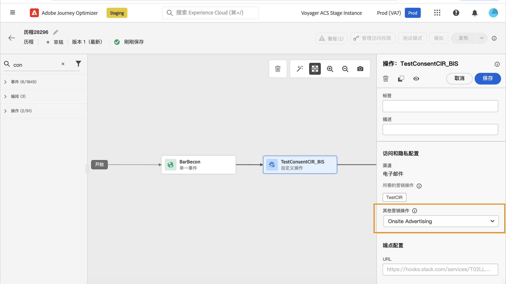

# 使用同意策略 {#consent-management}

贵组织或法律法规可能会对您的数据设置使用限制。因此，请务必确保您在 Journey Optimizer 中的数据操作符合[数据使用策略](https://experienceleague.adobe.com/docs/experience-platform/data-governance/policies/overview.html?lang=zh-Hans){target="_blank"}. These policies are Adobe Experience Platform rules defining which [marketing actions](https://experienceleague.adobe.com/docs/experience-platform/data-governance/policies/overview.html?lang=zh-Hans#marketing-actions){target="_blank"}中允许执行的数据操作。

一种可用的数据使用策略是&#x200B;**同意政策**。它们允许您轻松地采用和执行营销策略，尊重客户的同意偏好。[了解有关策略实施的更多信息](https://experienceleague.adobe.com/docs/experience-platform/data-governance/enforcement/auto-enforcement.html?lang=zh-Hans){target="_blank"}

>[!IMPORTANT]
>
>目前，同意策略仅适用于已购买 Adobe **Healthcare Shield** 或 **Privacy and Security Shield** 附加产品的组织。

例如，您可以在 Experience Platform 中[创建同意策略](https://experienceleague.adobe.com/docs/experience-platform/data-governance/policies/user-guide.html?lang=zh-Hans#consent-policy){target="_blank"}，以排除未同意接收电子邮件、推送或短信通信的客户。

<!--* For the native outbound channels (Email, Push, SMS, Direct mail), the logic is as follows:

    * By default, if a profile has opted out from receiving communications from you, the corresponding profile is excluded from subsequent deliveries.

    * If you have the Adobe **Healthcare Shield** or **Privacy and Security Shield**, you can create a custom consent policy that overrides the default logic. For example, you can define a policy to only send email messages to all individuals who have opted in. In the absence of a custom policy, the default policy applies.
    
    To apply a custom policy, you need to define a marketing action in that policy and associate it to a channel surface. [Learn more](#marketing-actions)-->

在历程级别，您可以将这些同意策略应用于自定义操作。

* 在&#x200B;**配置自定义操作**&#x200B;时，您可以定义渠道和营销操作。[了解详情](#consent-custom-action)
* 在添加&#x200B;**历程中的自定义操作**&#x200B;时，您可以定义其他营销操作。[了解详情](#consent-journey)

<!--

## Leverage consent policies through channel surfaces {#marketing-actions}

In [!DNL Journey Optimizer], consent is handled by the Experience Platform [Consent schema](https://experienceleague.adobe.com/docs/experience-platform/xdm/field-groups/profile/consents.html){target="_blank"}. By default, the value for the consent field is empty and treated as consent to receive your communications. You can modify this default value while onboarding to one of the possible values listed [here](https://experienceleague.adobe.com/docs/experience-platform/xdm/data-types/consents.html#choice-values){target="_blank"}.

To modify the consent field value, you can create a custom consent policy in which you define a marketing action and the conditions under which that action is performed. [Learn more on marketing actions](https://experienceleague.adobe.com/docs/experience-platform/data-governance/policies/overview.html#marketing-actions){target="_blank"}

For example, if you want to create a consent policy to target only profiles who have consented to receive email communications, follow the steps below.

1. Make sure your organization has purchased the Adobe **Healthcare Shield** or **Privacy and Security Shield** add-on offerings. [Learn more](https://experienceleague.adobe.com/docs/events/customer-data-management-voices-recordings/governance/healthcare-shield.html){target="_blank"}

1. In Adobe Experience Platform, create a custom policy (from the **[!UICONTROL Privacy]** > **[!UICONTROL Policies]** menu). [Learn how](https://experienceleague.adobe.com/docs/experience-platform/data-governance/policies/user-guide.html#create-policy){target="_blank"}

    

1. Choose the **[!UICONTROL Consent policy]** type and configure a condition as follows. [Learn how to configure consent policies](https://experienceleague-review.corp.adobe.com/docs/experience-platform/data-governance/policies/user-guide.html#consent-policy){target="_blank"}

    1. Under the **[!UICONTROL If]** section, select the **[!UICONTROL Email Targeting]** default marketing action.

        

        >[!NOTE]
        >
        >The core marketing actions provided out-of-the-box by Adobe are listed in [this table](https://experienceleague.adobe.com/docs/experience-platform/data-governance/policies/overview.html?lang=en#core-actions){target="_blank"}. The steps to create a custom marketing action are listed in [this section](https://experienceleague.adobe.com/docs/experience-platform/data-governance/policies/user-guide.html#create-marketing-action){target="_blank"}.

    1. Select what happens when the marketing action applies. In this example, select **[!UICONTROL Email Marketing Consent]**.

    

1. Save and [enable](https://experienceleague.adobe.com/docs/experience-platform/data-governance/policies/user-guide.html#enable){target="_blank"} this policy.

1. In Journey Optimizer, create an email surface. [Learn how](../configuration/channel-surfaces.md#create-channel-surface)

1. In the email surface details, select the **[!UICONTROL Email Targeting]** marketing action.

    

All consent policies associated with that marketing action are automatically leveraged in order to respect the preferences of your customers.

Therefore, in this example, any [email](../email/create-email.md) using that surface in a campaign or a journey is only sent to the profiles who have consented to receive emails from you. Profiles who have not consented to receive email communications are excluded.-->

## 通过自定义操作利用同意策略 {#journey-custom-actions}

### 重要说明 {#important-notes}

在 Journey Optimizer 中，可以<!--also -->在自定义操作中利用同意策略。如果要将其与内置消息功能一起使用，您需要使用条件活动来筛选历程中的客户。

使用同意管理功能时，会分析两个历程活动：

* 读取受众：检索到的受众会被考虑在内。
* 自定义操作：同意管理功能会考虑所使用的属性（[操作参数](../action/about-custom-action-configuration.md#define-the-message-parameters)）以及定义的营销操作（必需的营销操作和其他营销操作）。
* 不支持使用现成联合架构的字段组所包含的属性。这些属性在界面中处于隐藏状态。您需要使用其他架构创建另一个字段组。
* 仅在自定义操作级别设置营销操作（必需或其他）时，同意策略才适用。

历程中使用的所有其他活动均不会被考虑在内。如果您以“受众鉴别”开始历程，则不会考虑该受众。

在历程中，如果自定义操作中的同意策略将某个用户档案排除，则不会向该用户发送消息，但是其历程会继续运行。 使用条件时，用户档案不会转到超时和错误路径。

在刷新位于历程中的自定义操作中的策略之前，请确保您的历程没有错误。

<!--
There are two types of latency regarding the use of consent policies:

* **User latency**: the delay from the time a profile changes a consent settings to the moment it is applied in Experience Platform. This can take up to 48h. 
* **Consent policy latency**: the delay from the time a consent policy is created or updated to the moment it is applied. This can take up to 6 hours
-->

### 配置自定义操作 {#consent-custom-action}

>[!CONTEXTUALHELP]
>id="ajo_consent_required_marketing_action"
>title="定义必需的营销操作"
>abstract="使用“必需的营销操作”字段，可定义与自定义操作相关的营销操作。例如，如果您使用该自定义操作发送电子邮件，则可以选择“电子邮件定位”。在历程中使用时，将检索和利用与该营销操作关联的所有同意策略。无法在画布上修改此设置。"

配置自定义操作时，可使用两个字段进行同意管理。

使用&#x200B;**渠道**&#x200B;字段，可选择与此自定义操作相关的渠道：**电子邮件**、**短信**&#x200B;或&#x200B;**推送通知**。所选渠道的&#x200B;**必需的营销操作**&#x200B;字段会预填充默认营销操作。如选择&#x200B;**其他**，则默认不会定义营销操作。

使用&#x200B;**必需的营销操作**&#x200B;字段，可定义与自定义操作相关的营销操作。例如，如果您使用该自定义操作发送电子邮件，则可以选择&#x200B;**电子邮件定位**。在历程中使用时，会检索和利用与该营销操作关联的所有同意策略。系统会选择默认营销操作，但您可以单击向下箭头，从列表中选择任何可用的营销操作。

对于某些类型的重要通信（例如发送的用于重置客户密码的事务性消息），您可能不希望应用同意策略。您可以在&#x200B;**必需的营销操作**&#x200B;字段中选择&#x200B;**无**。

有关配置自定义操作的其他步骤，请参见[此部分](../action/about-custom-action-configuration.md#consent-management)。

### 构建历程 {#consent-journey}

>[!CONTEXTUALHELP]
>id="ajo_consent_required_marketing_action_canvas"
>title="必需的营销操作"
>abstract="在创建自定义操作时，定义必需的营销操作。无法从操作中删除或修改此必需的营销操作。"

>[!CONTEXTUALHELP]
>id="ajo_consent_additional_marketing_action_canvas"
>title="其他营销操作"
>abstract="除了必需的操作之外，还可以添加其他营销操作。将强制执行与两个营销操作相关的同意策略。"

>[!CONTEXTUALHELP]
>id="ajo_consent_refresh_policies_canvas"
>title="对将在运行时应用的同意策略进行可视化"
>abstract="营销操作可引入同意策略，这些策略会将操作参数和单个用户档案同意值结合起来，以筛选用户。单击按钮进行刷新，获取这些策略的最新定义。"

在历程中添加自定义操作时，有多个选项可用于管理同意。单击&#x200B;**显示只读字段**&#x200B;以显示所有参数。

配置自定义操作时定义的&#x200B;**渠道**&#x200B;和&#x200B;**必需的营销操作**&#x200B;将显示在屏幕顶部。您无法修改这些字段。

您可以定义&#x200B;**其他营销操作**&#x200B;以设置自定义操作类型。这允许您定义此历程中自定义操作的用途。除了必需的营销操作（通常特定于渠道）之外，您还可以定义附加营销操作，该操作特定于此历程中的自定义操作。例如：训练通信、新闻稿、健身通信等。必需的营销操作和附加营销操作都适用。

单击屏幕底部的&#x200B;**刷新策略**&#x200B;按钮，更新和检查此自定义操作考虑的策略列表。在构建历程时，这仅供参考。对于实时历程，每 6 小时自动检索和更新一次同意策略。

<!--
The following data is taken into account for consent:

* marketing actions and additional marketing actions defined in the custom action
* action parameters defined in the custom action, see this [section](../action/about-custom-action-configuration.md#define-the-message-parameters) 
* attributes used as criteria in a segment when the journey starts with a Read segment, see this [section](../building-journeys/read-audience.md) 

>[!NOTE]
>
>Please note that there can be a latency when updating the list of policies applied, refer to this [this section](../action/consent.md#important-notes).
-->

有关在历程中配置自定义操作的其他步骤，请参阅[此部分](../building-journeys/using-custom-actions.md)。
