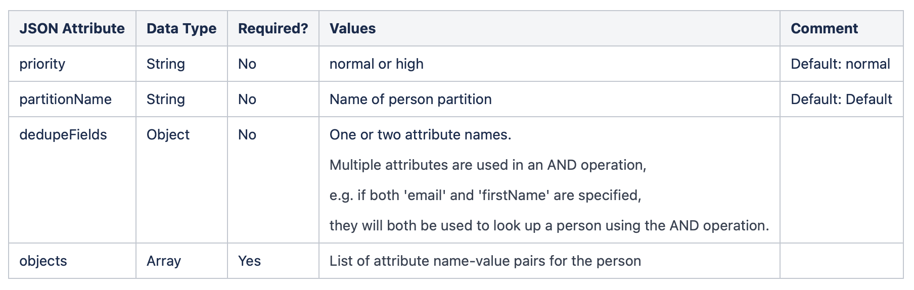

# 与Marketo Engage集成 {#integrating-with-marketo-engage}

开始与Marketo Engage无缝数据集成的历程。 Journey Optimizer中的此特定自定义操作支持摄取两种关键数据类型：

* 人员（用户档案）：Marketo会将用户档案转换为切实可行的见解。
* 自定义对象：使用自定义对象（如产品）定制数据，以实现个性化营销方法。

## 先决条件 {#prerequisites}

* Marketo Engage的客户实例必须已启用IMS。
* Marketo Engage实例和AEP/AJO实例必须位于同一IMS组织中。+link
* 必须向客户设置MktoSync：摄取服务访问权限（在此处添加注释+链接）

## 配置操作 {#configure-marketo-action}

* 导航到管理>配置>操作，然后单击管理
* 在“操作”列表中，单击“创建操作”。 在此处阅读有关自定义操作创建的更多信息（+链接）
* 输入名称和描述，然后选择Adobe Marketo Engage作为操作类型


* 单击&#x200B;**请求**&#x200B;和&#x200B;**响应**&#x200B;有效负载的“编辑有效负载”。
* 对于这两种情况，请撰写有效负载并将其粘贴到专用弹出窗口中。


* Inspect并配置有效负载值
注意：若要动态传递值，请为每个字段将**常量**&#x200B;更改为&#x200B;**变量**。


* 在字段配置窗口中单击&#x200B;**保存**，然后单击自定义操作的&#x200B;**保存**。

您现在可以在专用画布上使用自定义操作。


## 有效负载语法 {#payload-syntax}

### 人员



### 自定义对象


针对人员&#x200B;**的**&#x200B;有效负载示例

```json
{
   "munchkinID": "388-KKG-245",  
   "person": {
    "priority": "normal",
    "partitionName": "XYZ",
    "dedupeFields": {
      "field1": "email",
      "field2": "firstName"
    },
    "objects": [
      {
        "email": "Email address",
        "firstName": "First name",
        "lastName": "Last name"
      }
    ]
  }
}
```

自定义对象的&#x200B;**有效负载示例**

```json
{
  "munchkinID": "388-KKG-245", 
  "customObject": {
    "priority": "normal",
    "objectName": "products",
    "objects": [
      {
        "email": "Email Address",
        "productName": "Product Name",
        "productQty": "Product Quantity",
        "priceTotal": "Price Total"
      }
    ]
  }
}
```


## 使用操作 {#engage-using}

* 将自定义操作拖动到历程画布上。 （请参阅如何使用自定义操作/链接）
* 在Request参数中，使用您在有效负载中配置的动态值单击每个参数的编辑。


