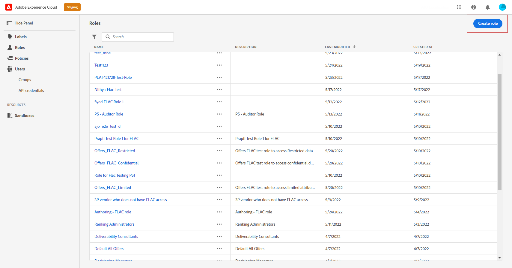
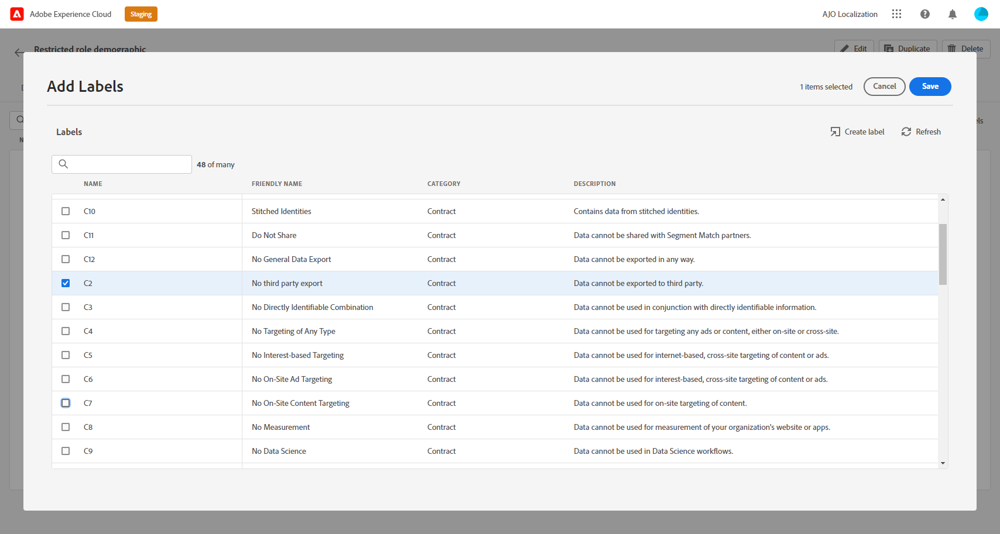
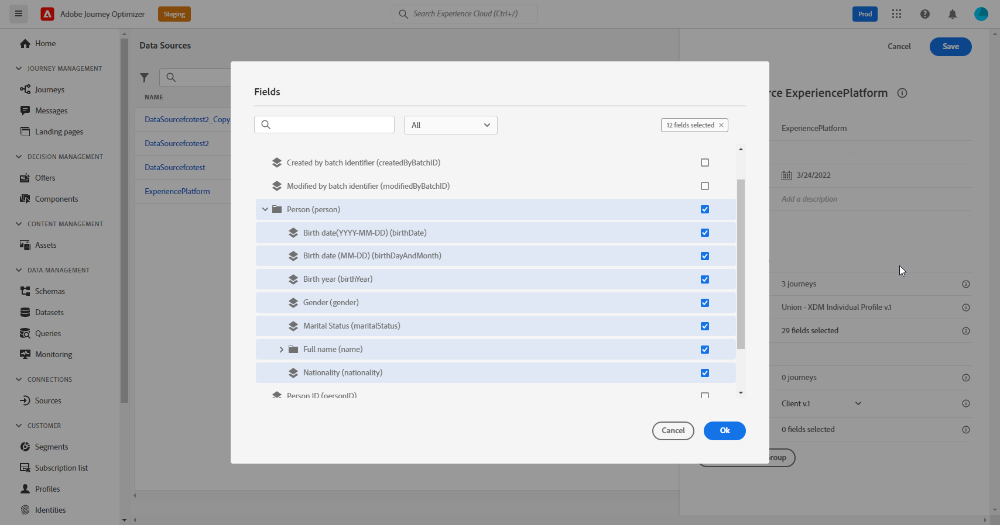

# 基于属性的访问控制 {#attribute-based-access}

>[!BEGINSHADEBOX]

**在此页面上：**&#x200B;在Adobe Journey Optimizer中使用基于属性的访问控制，将敏感架构字段、配置文件属性和受众限制为授权角色，以便您可以保护个人数据并防止未经授权的用户对其进行操作。

>[!ENDSHADEBOX]

基于属性的访问控制功能允许您定义用于管理特定团队或用户组的数据访问的授权。 其目的是保护敏感的数字资产免受未经授权用户的侵害，进一步保护个人数据。

在Adobe Journey Optimizer中使用基于属性的访问控制来保护数据，并授予对特定字段元素(包括体验数据模型(XDM)架构、配置文件属性和受众)的特定访问权限。

有关用于基于属性的访问控制的术语的更详细列表，请参阅[Adobe Experience Platform文档](https://experienceleague.adobe.com/docs/experience-platform/access-control/abac/overview.html?lang=zh-Hans){target="_blank"}。

在此示例中，向&#x200B;**国籍**&#x200B;架构字段添加标签以限制未经授权的用户使用它。 要使此功能正常工作，请执行以下步骤：

1. 创建新的&#x200B;**[!UICONTROL 角色]**，并为该角色分配相应的&#x200B;**[!UICONTROL 标签]**，以便用户能够访问和使用架构字段。

1. 将&#x200B;**[!UICONTROL 标签]**&#x200B;分配给Adobe Experience Platform中的&#x200B;**国籍**&#x200B;架构字段。

1. 在Adobe Journey Optimizer中使用&#x200B;**[!UICONTROL 架构字段]**。

请注意，还可以使用基于属性的访问控制API访问&#x200B;**[!UICONTROL 角色]**、**[!UICONTROL 策略]**&#x200B;和&#x200B;**[!UICONTROL 产品]**。 有关详细信息，请参阅此[文档](https://experienceleague.adobe.com/docs/experience-platform/access-control/abac/abac-api/overview.html?lang=zh-Hans){target="_blank"}。

## 创建角色并分配标签 {#assign-role}

>[!IMPORTANT]
>
>&#x200B;>在管理角色的权限之前，请先创建策略。 有关更多信息，请参阅 [Adobe Experience Platform 文档](https://experienceleague.adobe.com/docs/experience-platform/access-control/abac/permissions-ui/policies.html?lang=zh-Hans){target="_blank"}。

**[!UICONTROL 角色]**&#x200B;是组织内共享相同权限、标签和沙盒的一组用户。 属于&#x200B;**[!UICONTROL Role]**&#x200B;的每个用户都有资格使用产品中包含的Adobe应用程序和服务。 您还可以创建自己的&#x200B;**[!UICONTROL 角色]**，以微调用户对界面中特定功能或对象的访问权限。

要授予所选用户访问标记为C2的&#x200B;**国籍**&#x200B;字段的权限，请创建一个包含一组特定用户的新&#x200B;**[!UICONTROL 角色]**，并授予他们标签C2，以让他们在&#x200B;**[!UICONTROL 历程]**&#x200B;中使用&#x200B;**国籍**&#x200B;详细信息。

1. 从[!DNL Permissions]产品中，从左窗格菜单中选择&#x200B;**[!UICONTROL 角色]**，然后单击&#x200B;**[!UICONTROL 创建角色]**。 请注意，您还可以将&#x200B;**[!UICONTROL 标签]**&#x200B;添加到内置角色。

   

1. 将&#x200B;**[!UICONTROL Name]**&#x200B;和&#x200B;**[!UICONTROL Description]**&#x200B;添加到您的新&#x200B;**[!UICONTROL 角色]**，此处：受限角色人口统计。

1. 从下拉列表中，选择您的&#x200B;**[!UICONTROL 沙盒]**。

   

1. 从&#x200B;**[!UICONTROL 资源]**&#x200B;菜单中，单击&#x200B;**[!UICONTROL Adobe Experience Platform]**&#x200B;以打开其他功能。 在此，我们选择&#x200B;**[!UICONTROL 历程]**。

   

1. 从下拉列表中，选择链接到选定功能的&#x200B;**[!UICONTROL 权限]**，例如&#x200B;**[!UICONTROL 查看历程]**&#x200B;或&#x200B;**[!UICONTROL 发布历程]**。

   

1. 保存新创建的&#x200B;**[!UICONTROL 角色]**&#x200B;后，单击&#x200B;**[!UICONTROL 属性]**&#x200B;以进一步配置对角色的访问权限。

   

1. 在&#x200B;**[!UICONTROL 用户]**&#x200B;选项卡中，单击&#x200B;**[!UICONTROL 添加用户]**。

   

1. 从&#x200B;**[!UICONTROL 标签]**&#x200B;选项卡中，选择&#x200B;**[!UICONTROL 添加标签]**。

   

1. 选择要添加到角色中的&#x200B;**[!UICONTROL 标签]**，然后单击&#x200B;**[!UICONTROL 保存]**。 在本例中，将标签C2授予用户，以访问以前受限的模式的字段。

   

**受限角色人口统计**&#x200B;角色中的用户现在可以访问标记为C2的对象。

## 将标签分配给Adobe Experience Platform中的对象 {#assign-label}

>[!WARNING]
>
>不正确的标签使用可能会中断人员的访问并触发策略违规。

**[!UICONTROL 标签]**&#x200B;可用于使用基于属性的访问控制来分配特定功能区域。 在此示例中，对&#x200B;**国籍**&#x200B;字段的访问受到限制。 此字段仅可供具有分配给其&#x200B;**[!UICONTROL 角色]**&#x200B;的相应&#x200B;**[!UICONTROL 标签]**&#x200B;的用户访问。

请注意，您还可以将&#x200B;**[!UICONTROL 标签]**&#x200B;添加到&#x200B;**[!UICONTROL 架构]**、**[!UICONTROL 数据集]**&#x200B;和&#x200B;**[!UICONTROL 受众]**。

1. 创建您的&#x200B;**[!UICONTROL 架构]**。 有关详细信息，请参阅[本文档](https://experienceleague.adobe.com/docs/experience-platform/xdm/schema/composition.html?lang=zh-Hans){target="_blank"}。

   

1. 在新创建的&#x200B;**[!UICONTROL 架构]**&#x200B;中，我们首先添加包含&#x200B;**国籍**&#x200B;字段的&#x200B;**[!UICONTROL 人口统计详细信息]**&#x200B;字段组。

   

1. 从&#x200B;**[!UICONTROL 标签]**&#x200B;选项卡，检查受限字段名称，此处&#x200B;**国籍**。 然后从右窗格菜单中选择&#x200B;**[!UICONTROL 编辑治理标签]**。

   

1. 选择相应的&#x200B;**[!UICONTROL 标签]**，在这种情况下，C2 — 数据无法导出到第三方。 有关可用标签的详细列表，请参阅[此页面](https://experienceleague.adobe.com/docs/experience-platform/data-governance/labels/reference.html?lang=zh-Hans#contract-labels){target="_blank"}。

   

1. 如果需要，可进一步个性化您的架构，然后启用它。 有关如何启用架构的详细步骤，请参阅此[页面](https://experienceleague.adobe.com/docs/experience-platform/xdm/ui/resources/schemas.html?lang=zh-Hans#profile){target="_blank"}。

现在，您架构的字段将仅对具有C2标签的角色集所包含的用户可见和使用。 通过将&#x200B;**[!UICONTROL 标签]**&#x200B;应用于您的&#x200B;**[!UICONTROL 字段名称]**，**[!UICONTROL 标签]**&#x200B;将自动应用于每个创建的架构中的&#x200B;**国籍**&#x200B;字段。

## 访问Adobe Journey Optimizer中带有标签的对象 {#attribute-access-ajo}

在新架构和角色中标记&#x200B;**国籍**&#x200B;字段名称后，可在Adobe Journey Optimizer中观察到此限制的影响。 对于此示例：

* 用户X可以访问标记为C2的对象，并创建一个历程，该历程的条件以受限的&#x200B;**[!UICONTROL 字段名称]**&#x200B;为目标。
* 用户Y如果无法访问标记为C2的对象，则会尝试发布历程。

1. 在Adobe Journey Optimizer中，使用新架构配置&#x200B;**[!UICONTROL 数据源]**。

   

1. 将新创建的&#x200B;**[!UICONTROL 架构]**&#x200B;的新&#x200B;**[!UICONTROL 字段组]**&#x200B;添加到内置&#x200B;**[!UICONTROL 数据源]**。 您还可以创建新的外部&#x200B;**[!UICONTROL 数据源]**&#x200B;和关联的&#x200B;**[!UICONTROL 字段组]**。

   

1. 选择之前创建的&#x200B;**[!UICONTROL 架构]**&#x200B;后，从&#x200B;**[!UICONTROL 字段]**&#x200B;类别中单击&#x200B;**[!UICONTROL 编辑]**。

   

1. 选择要定位的&#x200B;**[!UICONTROL 字段名称]**。 在此处，我们选择受限制的&#x200B;**国籍**&#x200B;字段。

   

1. 创建向具有特定国籍的用户发送电子邮件的历程。 添加&#x200B;**[!UICONTROL 事件]**&#x200B;和&#x200B;**[!UICONTROL 条件]**。

   

1. 选择受限制的&#x200B;**国籍**&#x200B;字段以开始构建表达式。

   

1. 编辑您的&#x200B;**[!UICONTROL 条件]**&#x200B;以使用受限的&#x200B;**国籍**&#x200B;字段针对特定群体。

   

1. 根据需要个性化您的历程，此处我们添加了一个&#x200B;**[!UICONTROL 电子邮件]**&#x200B;操作。

   

如果用户Y无权访问标签C2对象，则需要使用受限字段访问此历程：

* 用户Y将无法使用受限字段名称，因为它将不可见。
* 在高级模式下，用户Y将无法编辑具有受限字段名称的表达式。 将出现以下错误： `The expression is invalid. Field is no longer available or you do not have enough permission to see it`。
* 用户Y可以删除表达式。
* 用户Y将无法测试历程。
* 用户Y将无法发布历程。

+++ AI知识参考

本节包含结构化知识，用于支持与本主题相关的解释、检索和问答。

要全面了解相关信息，应将此信息与本页上的文档相结合。 这两个源都不是独立的；页面描述了功能，而本节提供了其他上下文来帮助消除术语、意图、适用性和约束条件的歧义。

* **TL；DR：**&#x200B;通过将治理标签应用于架构字段并将匹配标签分配给角色来保护Journey Optimizer中的敏感数据字段，这样未经授权的用户就无法查看、编辑、测试或发布使用这些受限字段的历程。

**意图：**

* 创建角色并分配治理标签以限制对特定架构字段的访问
* 将标签应用于Adobe Experience Platform中的架构字段以强制实施访问限制
* 在Journey Optimizer历程中使用标记的架构字段
* 了解没有所需标签的用户如何在历程中体验访问限制
* 通过基于属性的访问控制API管理角色、策略和产品

**术语表：**

* **ABAC（基于属性的访问控制）**：根据标签&#x200B;*（特定于产品）*&#x200B;等属性定义用于管理特定团队或用户组的数据访问的授权的功能
* **角色**：组织&#x200B;*（产品特定）*&#x200B;中共享相同权限、标签和沙盒的一组用户
* **标签**：应用于架构字段、数据集或受众的治理标记（例如C2），用于控制哪些角色可以访问它们&#x200B;*（产品特定）*
* **策略**：在管理角色的权限之前必须创建的配置 — ABAC *（产品特定）的先决条件*
* **XDM架构**：用于在Adobe Experience Platform *（产品特定）中定义数据结构的Experience Data Model架构*

**护栏：**

* 必须先创建策略，然后才能管理角色的权限（前提条件，如页面上的重要说明中所述）
* 使用不正确的标签可能会中断人员的访问并触发策略违规（如页面上的警告中所述）
* 没有与受限字段匹配的标签的用户无法：查看受限字段名称、在高级模式下编辑引用该字段的表达式、测试历程或发布历程

**术语：**

* 规范名称：基于属性的访问控制 — 缩写：ABAC — 变体：基于属性的访问管理
* 规范名称：体验数据模型 — 缩写：XDM — 变体：XDM架构、XDM架构
* 同义词： &quot;Label&quot; = &quot;governance label&quot; = &quot;data governance label&quot;
* 请勿混淆：“角色”（一组具有共享权限和标签的用户）≠“策略”（管理基于标签的数据访问实施的规则）
* 请勿混淆：ABAC（通过平台级别的标签策略控制对架构字段、数据集和受众的访问）≠OLAC(控制对特定Journey Optimizer对象（如历程和营销活动）的访问

**常见问题解答：**

* **问：标签能否添加到内置角色？**  — 可以，标签可同时添加到自定义和内置角色中。
* **问：缺少历程中限制字段标签的用户会发生什么情况？**  — 他们看不到该字段；他们无法编辑引用该字段的表达式、测试历程或发布历程。
* **问：标签是否可以应用于架构字段以外的对象？**  — 是；标签也可以应用于架构、数据集和受众。
* **问：是否有用ABAC管理角色、策略和产品的API？**  — 是；可以通过基于属性的访问控制API访问角色、策略和产品。

+++
<!-- ai-accordion-version: 1 | source-hash: aa94c226 -->