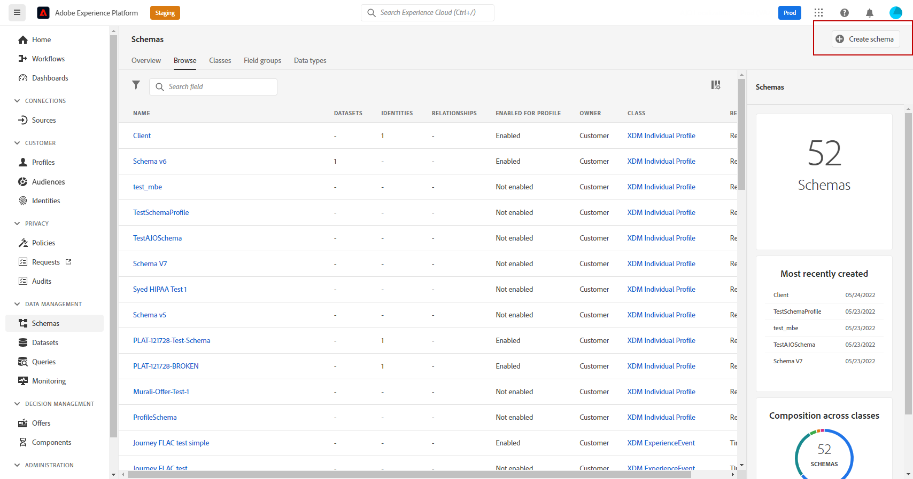

# 基于属性的访问控制 {#attribute-based-access}

>[!IMPORTANT]
>
>目前，基于属性的访问控制的使用仅限于选定用户，但将在未来版本中部署到所有环境。

基于属性的访问控制(ABAC)允许您定义权限，以管理特定团队或用户组的数据访问。 其目的是保护敏感数字资产免受未经授权用户的侵害，从而进一步保护个人数据。

在Adobe Journey Optimizer中，ABAC允许您保护数据并授予对特定字段元素的特定访问权限，这些元素包括体验数据模型(XDM)架构、用户档案属性和区段。

有关ABAC使用的术语的更详细列表，请参阅 [Adobe Experience Platform文档](https://experienceleague.adobe.com/docs/experience-platform/access-control/abac/overview.html).

在本例中，我们要向 **国籍** 架构字段，以限制未授权用户使用该架构。 要使此功能正常工作，您需要执行以下步骤：

1. 新建  **[!UICONTROL 角色]** 并为其分配相应的  **[!UICONTROL 标签]** 使用户能够访问和使用架构字段。

1. 分配  **[!UICONTROL 标签]** 到 **国籍** 架构字段。Adobe Experience Platform

1. 使用  **[!UICONTROL 架构字段]** 在Adobe Journey Optimizer。

请注意 **[!UICONTROL 角色]**, **[!UICONTROL 策略]** 和 **[!UICONTROL 产品]** 也可以使用基于属性的访问控制API进行访问。 有关更多信息，请参阅此 [文档](https://experienceleague.adobe.com/docs/experience-platform/access-control/abac/abac-api/overview.html).

## 创建角色并分配标签 {#assign-role}

>[!IMPORTANT]
>
>在管理角色的权限之前，您首先需要创建策略。 有关更多信息，请参阅 [Adobe Experience Platform文档](https://experienceleague.adobe.com/docs/experience-platform/access-control/abac/permissions-ui/policies.html).

**[!UICONTROL 角色]** 是您组织内共享相同权限、标签和沙箱的一组用户。 每个用户属于 **[!UICONTROL 角色]** 有权使用产品中包含的Adobe应用程序和服务。
您还可以创建自己的 **[!UICONTROL 角色]** 如果您想要优化用户对界面中特定功能或对象的访问权限。

我们现在要向选定用户授予 **国籍** 字段，标记为C2。 为此，我们需要创建一个 **[!UICONTROL 角色]** 并为他们授予标签C2，以便他们使用 **国籍** 详细信息 **[!UICONTROL 历程]**.

1. 从 [!DNL Permissions] 产品，选择 **[!UICONTROL 角色]** 从左窗格菜单中，单击 **[!UICONTROL 创建角色]**. 请注意，您还可以 **[!UICONTROL 标签]** 内置角色。

   

1. 添加 **[!UICONTROL 名称]** 和 **[!UICONTROL 描述]** 新 **[!UICONTROL 角色]**，此处：角色人口限制。

1. 从下拉菜单中，选择 **[!UICONTROL 沙盒]**.

   

1. 从 **[!UICONTROL 资源]** 菜单，单击 **[!UICONTROL Adobe Experience Platform]** 以打开不同的功能。 在此，我们选择 **[!UICONTROL 历程]**.

   

1. 从下拉菜单中，选择 **[!UICONTROL 权限]** 链接到所选功能，例如 **[!UICONTROL 查看历程]** 或 **[!UICONTROL 发布历程]**.

   

1. 保存新创建的 **[!UICONTROL 角色]**，单击 **[!UICONTROL 属性]** 以进一步配置对您角色的访问权限。

   

1. 从 **[!UICONTROL 用户]** ，单击 **[!UICONTROL 添加用户]**.

   

1. 从 **[!UICONTROL 标签]** 选项卡，选择 **[!UICONTROL 添加标签]**.

   

1. 选择 **[!UICONTROL 标签]** 要添加到您的角色并单击 **[!UICONTROL 保存]**. 在本例中，我们为用户授予标签C2，以便有权访问以前受限架构的字段。

   

中的用户 **受限角色人口统计** 角色现在可以访问C2标记的对象。

## 为Adobe Experience Platform中的对象分配标签 {#assign-label}

>[!WARNING]
>
>错误的标签使用可能会中断对人员的访问并触发策略违规。

**[!UICONTROL 标签]** 可以使用基于属性的访问控制来分配特定的功能区域。
在本例中，我们要限制对 **国籍** 字段。 只有具有相应 **[!UICONTROL 标签]** 到  **[!UICONTROL 角色]**.

请注意，您还可以  **[!UICONTROL 标签]** to  **[!UICONTROL 架构]**,  **[!UICONTROL 数据集]** 和  **[!UICONTROL 区段]**.

1. 创建 **[!UICONTROL 架构]**. 有关更多信息，请参阅 [本文档](https://experienceleague.adobe.com/docs/experience-platform/xdm/schema/composition.html?lang=zh-Hans).

   

1. 在新创建的 **[!UICONTROL 架构]**，我们会首先在 **[!UICONTROL 人口统计详细信息]** 包含的字段组 **国籍** 字段。

   

1. 从 **[!UICONTROL 标签]** ，请在此处查看受限字段名称 **国籍**. 然后，从右窗格菜单中，选择 **[!UICONTROL 编辑管理标签]**.

   

1. 选择相应的 **[!UICONTROL 标签]**，在这种情况下， C2 — 数据无法导出到第三方。 有关可用标签的详细列表，请参阅 [本页](https://experienceleague.adobe.com/docs/experience-platform/data-governance/labels/reference.html#contract-labels).

   

1. 根据需要进一步个性化您的架构，然后启用它。 有关如何启用架构的详细步骤，请参阅此 [页面](https://experienceleague.adobe.com/docs/experience-platform/xdm/ui/resources/schemas.html#profile).

您架构的字段现在将只可见，并且现在只能由使用C2标签的角色集的一部分的用户使用。
通过应用 **[!UICONTROL 标签]** 至 **[!UICONTROL 字段名称]**，请注意 **[!UICONTROL 标签]** 将自动应用于 **国籍** 字段。

## 访问Adobe Journey Optimizer中的标记对象 {#attribute-access-ajo}

在标记 **国籍** 字段名称（在新架构和新角色中），我们现在可以在Adobe Journey Optimizer中查看此限制的影响。
例如，对标有C2的对象具有访问权限的第一个用户X将创建一个历程，该用户的条件是定位受限制的 **[!UICONTROL 字段名称]**. 如果第二个用户Y无权访问标有C2的对象，则需要发布该历程。

1. 在Adobe Journey Optimizer中，您首先需要配置 **[!UICONTROL 数据源]** 使用新模式。

   

1. 添加新 **[!UICONTROL 字段组]** 新建 **[!UICONTROL 架构]** 内置 **[!UICONTROL 数据源]**. 您还可以创建新的外部 **[!UICONTROLD数据源]** 关联 **[!UICONTROL 字段组]**.

   

1. 选择您之前创建的 **[!UICONTROL 架构]**，单击 **[!UICONTROL 编辑]** 从 **[!UICONTROL 字段]** 类别。

   

1. 选择 **[!UICONTROL 字段名称]** 要定位。 在此，我们选择受限 **国籍** 字段。

   

1. 然后，创建历程，以向具有特定国籍的用户发送电子邮件。 添加 **[!UICONTROL 事件]** 那么 **[!UICONTROL 条件]**.

   

1. 选择受限制的 **国籍** 字段来开始构建表达式。

   

1. 编辑 **[!UICONTROL 条件]** 以限制 **国籍** 字段。

   

1. 根据需要将您的历程个性化，在此我们添加 **[!UICONTROL 电子邮件]** 操作。

   

如果无权访问标签C2对象的用户Y需要使用此受限字段访问此历程：

* 用户Y将无法使用受限的字段名称，因为它不可见。

* 在高级模式下，用户Y将无法编辑具有受限字段名称的表达式。 将显示以下错误 `The expression is invalid. Field is no longer available or you don't have enough permission to see it`.

* 用户Y可以删除表达式。

* 用户Y将无法测试历程。

* 用户Y将无法发布历程。
