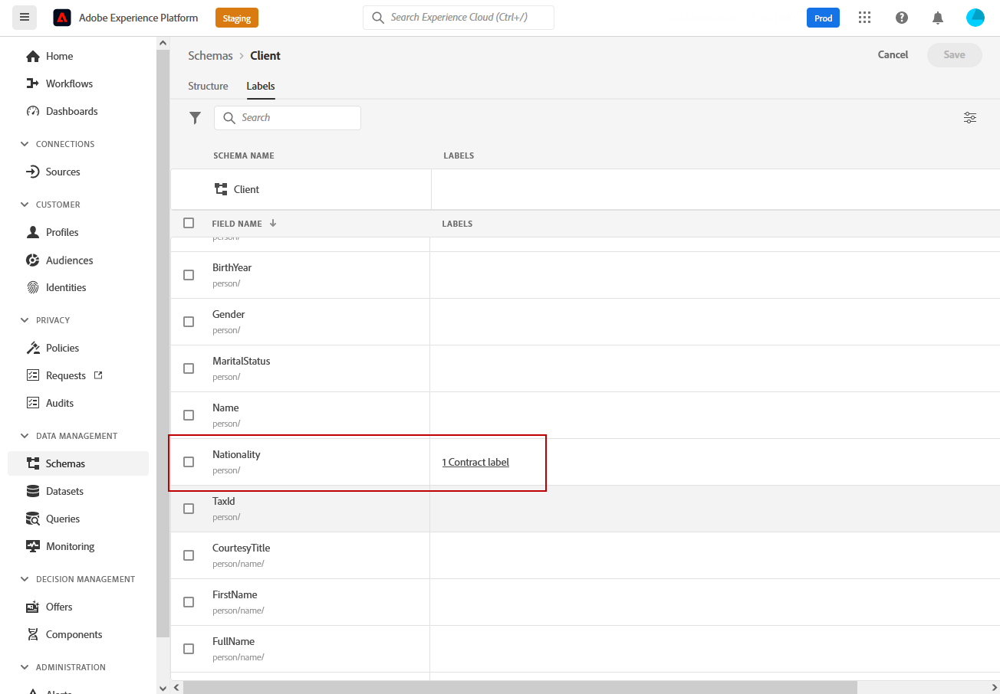
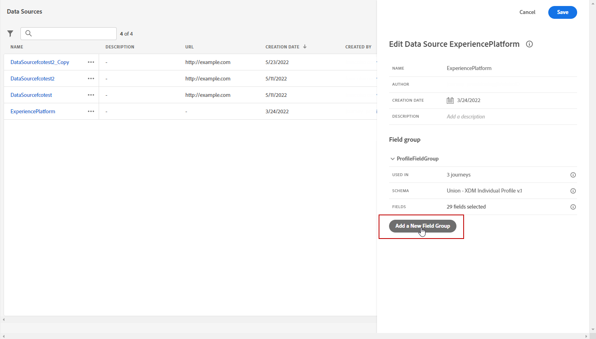

# 基于属性的访问控制 {#attribute-based-access}

通过基于属性的访问控制功能，可定义用于管理特定团队或用户组的数据访问的授权。 其目的是保护敏感的数字资产，使其免遭未经授权的用户的侵害，从而进一步保护个人数据。

在Adobe Journey Optimizer中使用基于属性的访问控制来保护数据，并授予对特定字段元素(包括体验数据模型(XDM)架构、配置文件属性和受众)的特定访问权限。

有关与基于属性的访问控制一起使用的术语的更详细列表，请参阅[Adobe Experience Platform文档](https://experienceleague.adobe.com/docs/experience-platform/access-control/abac/overview.html?lang=zh-Hans){target="_blank"}。

在此示例中，我们要向&#x200B;**国籍**&#x200B;架构字段添加标签以限制未经授权的用户使用它。 要使此功能正常工作，您需要执行以下步骤：

1. 创建新的&#x200B;**[!UICONTROL 角色]**，并为该角色分配相应的&#x200B;**[!UICONTROL 标签]**，以便用户能够访问和使用架构字段。

1. 将&#x200B;**[!UICONTROL 标签]**&#x200B;分配给Adobe Experience Platform中的&#x200B;**国籍**&#x200B;架构字段。

1. 在Adobe Journey Optimizer中使用&#x200B;**[!UICONTROL 架构字段]**。

请注意，还可以使用基于属性的访问控制API访问&#x200B;**[!UICONTROL 角色]**、**[!UICONTROL 策略]**&#x200B;和&#x200B;**[!UICONTROL 产品]**。 有关详细信息，请参阅此[文档](https://experienceleague.adobe.com/docs/experience-platform/access-control/abac/abac-api/overview.html){target="_blank"}。

## 创建角色并分配标签 {#assign-role}

>[!IMPORTANT]
>
>在管理角色的权限之前，您将首先需要创建策略。 有关详细信息，请参阅[Adobe Experience Platform文档](https://experienceleague.adobe.com/docs/experience-platform/access-control/abac/permissions-ui/policies.html){target="_blank"}。

**[!UICONTROL 角色]**&#x200B;是组织内共享相同权限、标签和沙盒的一组用户。 属于&#x200B;**[!UICONTROL Role]**&#x200B;的每个用户都有资格使用产品中包含的Adobe应用程序和服务。
如果您希望调整用户对界面中特定功能或对象的访问权限，您还可以创建自己的&#x200B;**[!UICONTROL 角色]**。

现在，我们要向选定的用户授予对&#x200B;**国籍**&#x200B;字段（标记为C2）的访问权限。 为此，我们需要创建一个具有一组特定用户的新&#x200B;**[!UICONTROL 角色]**，并授予他们标签C2，以便他们在&#x200B;**[!UICONTROL 历程]**&#x200B;中使用&#x200B;**国籍**&#x200B;详细信息。

1. 从[!DNL Permissions]产品中，从左窗格菜单中选择&#x200B;**[!UICONTROL 角色]**，然后单击&#x200B;**[!UICONTROL 创建角色]**。 请注意，您还可以将&#x200B;**[!UICONTROL 标签]**&#x200B;添加到内置角色。

   

1. 将&#x200B;**[!UICONTROL Name]**&#x200B;和&#x200B;**[!UICONTROL Description]**&#x200B;添加到您的新&#x200B;**[!UICONTROL 角色]**，此处：受限角色人口统计。

1. 从下拉列表中，选择您的&#x200B;**[!UICONTROL 沙盒]**。

   

1. 从&#x200B;**[!UICONTROL 资源]**&#x200B;菜单中，单击&#x200B;**[!UICONTROL Adobe Experience Platform]**&#x200B;以打开其他功能。 在此，我们选择&#x200B;**[!UICONTROL 历程]**。

   

1. 从下拉列表中，选择链接到选定功能的&#x200B;**[!UICONTROL 权限]**，例如&#x200B;**[!UICONTROL 查看历程]**&#x200B;或&#x200B;**[!UICONTROL 发布历程]**。

   

1. 保存新创建的&#x200B;**[!UICONTROL 角色]**&#x200B;后，单击&#x200B;**[!UICONTROL 属性]**&#x200B;以进一步配置对角色的访问权限。

   

1. 在&#x200B;**[!UICONTROL 用户]**&#x200B;选项卡中，单击&#x200B;**[!UICONTROL 添加用户]**。

   

1. 从&#x200B;**[!UICONTROL 标签]**&#x200B;选项卡中，选择&#x200B;**[!UICONTROL 添加标签]**。

   

1. 选择要添加到角色中的&#x200B;**[!UICONTROL 标签]**，然后单击&#x200B;**[!UICONTROL 保存]**。 在本例中，我们为用户授予标签C2以访问以前受限的架构的字段。

   

**受限角色人口统计**&#x200B;角色中的用户现在可以访问标记为C2的对象。

## 将标签分配给Adobe Experience Platform中的对象 {#assign-label}

>[!WARNING]
>
>不正确的标签使用可能会中断对人员的访问并触发策略违规。

**[!UICONTROL 标签]**&#x200B;可用于使用基于属性的访问控制分配特定功能区域。
在此示例中，我们要限制对&#x200B;**国籍**&#x200B;字段的访问。 此字段仅对具有其&#x200B;**[!UICONTROL 角色]**&#x200B;对应的&#x200B;**[!UICONTROL 标签]**&#x200B;的用户可访问。

请注意，您还可以将&#x200B;**[!UICONTROL 标签]**&#x200B;添加到&#x200B;**[!UICONTROL 架构]**、**[!UICONTROL 数据集]**&#x200B;和&#x200B;**[!UICONTROL 受众]**。

1. 创建您的&#x200B;**[!UICONTROL 架构]**。 有关详细信息，请参阅[此文档](https://experienceleague.adobe.com/docs/experience-platform/xdm/schema/composition.html){target="_blank"}。

   

1. 在新创建的&#x200B;**[!UICONTROL 架构]**&#x200B;中，我们首先添加包含&#x200B;**国籍**&#x200B;字段的&#x200B;**[!UICONTROL 人口统计详细信息]**&#x200B;字段组。

   

1. 从&#x200B;**[!UICONTROL 标签]**&#x200B;选项卡，检查受限字段名称，此处&#x200B;**国籍**。 然后从右窗格菜单中选择&#x200B;**[!UICONTROL 编辑治理标签]**。

   

1. 选择相应的&#x200B;**[!UICONTROL 标签]**，在这种情况下，C2 — 数据无法导出到第三方。 有关可用标签的详细列表，请参阅[此页面](https://experienceleague.adobe.com/docs/experience-platform/data-governance/labels/reference.html#contract-labels){target="_blank"}。

   

1. 如果需要，进一步个性化您的架构，然后启用它。 有关如何启用架构的详细步骤，请参阅此[页面](https://experienceleague.adobe.com/docs/experience-platform/xdm/ui/resources/schemas.html#profile){target="_blank"}。

架构的字段现在将仅可见，并且现在只能由属于具有C2标签的角色集的用户使用。
通过将&#x200B;**[!UICONTROL 标签]**&#x200B;应用于您的&#x200B;**[!UICONTROL 字段名称]**，请注意&#x200B;**[!UICONTROL 标签]**&#x200B;将自动应用于每个创建的架构中的&#x200B;**国籍**&#x200B;字段。

## 访问Adobe Journey Optimizer中带有标签的对象 {#attribute-access-ajo}

在新架构中标记我们的&#x200B;**国籍**&#x200B;字段名和新角色后，我们现在可以在Adobe Journey Optimizer中看到此限制的影响。
例如，第一个有权访问标记为C2的对象的用户X将创建一个历程，其条件针对受限的&#x200B;**[!UICONTROL 字段名]**。 第二个用户Y无权访问标记为C2的对象，则需要发布该历程。

1. 从Adobe Journey Optimizer中，您首先需要使用新架构配置&#x200B;**[!UICONTROL 数据源]**。

   

1. 将新创建的&#x200B;**[!UICONTROL 架构]**&#x200B;的新&#x200B;**[!UICONTROL 字段组]**&#x200B;添加到内置&#x200B;**[!UICONTROL 数据源]**。 您还可以创建新的外部&#x200B;**[!UICONTROL 数据源]**&#x200B;和关联的&#x200B;**[!UICONTROL 字段组]**。

   

1. 选择之前创建的&#x200B;**[!UICONTROL 架构]**&#x200B;后，从&#x200B;**[!UICONTROL 字段]**&#x200B;类别中单击&#x200B;**[!UICONTROL 编辑]**。

   

1. 选择要定位的&#x200B;**[!UICONTROL 字段名称]**。 在此处，我们选择受限制的&#x200B;**国籍**&#x200B;字段。

   

1. 然后，创建一个历程，向具有特定国籍的用户发送电子邮件。 添加&#x200B;**[!UICONTROL 事件]**&#x200B;和&#x200B;**[!UICONTROL 条件]**。

   

1. 选择受限制的&#x200B;**国籍**&#x200B;字段以开始构建表达式。

   

1. 编辑您的&#x200B;**[!UICONTROL 条件]**&#x200B;以使用受限的&#x200B;**国籍**&#x200B;字段针对特定群体。

   

1. 根据需要个性化您的历程，此处我们添加了一个&#x200B;**[!UICONTROL 电子邮件]**&#x200B;操作。

   

如果无权访问标签C2对象的用户Y需要使用此受限字段访问此历程：

* 用户Y将无法使用受限字段名称，因为它将不可见。

* 在高级模式下，用户Y将无法编辑具有受限字段名称的表达式。 将出现以下错误`The expression is invalid. Field is no longer available or you don't have enough permission to see it`。

* 用户Y可以删除表达式。

* 用户Y将无法测试历程。

* 用户Y将无法发布历程。
