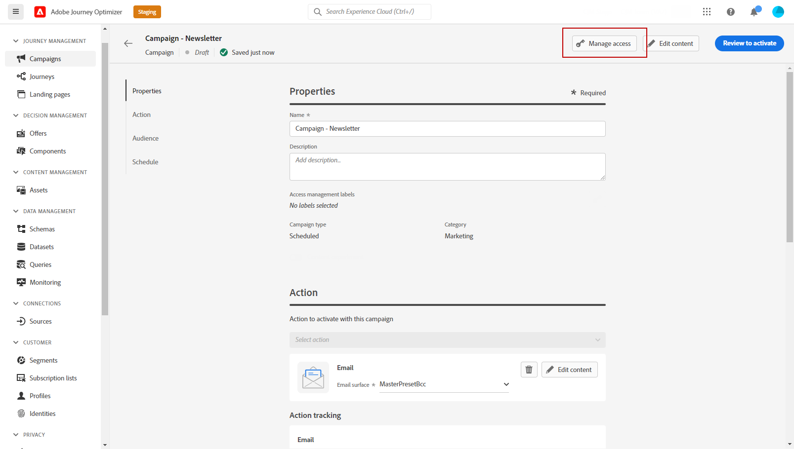

# 对象级访问控制 {#object-level-access}

>[!BEGINSHADEBOX]

**在此页面上：**&#x200B;使用对象级别的访问控制来限制具有访问标签的单个对象，例如历程、营销活动和优惠，以便您可以将敏感内容和个人数据限制为仅供授权用户使用。

>[!ENDSHADEBOX]

>[!CONTEXTUALHELP]
>id="ajo_olac_manage_access"
>title="访问管理标签"
>abstract="您可以根据访问标签限制对对象的访问。 这种方法可以保护敏感数字资产免受未经授权用户的访问，确保进一步保护个人数据。 **确保仅选择您有权限的标签。**"

您可以根据访问标签限制对对象的访问。 这种方法可以保护敏感数字资产免受未经授权用户的访问，确保进一步保护个人数据。

对象级访问控制(OLAC)功能允许您定义用于管理所选对象的数据访问的授权：

* 历程
* 促销活动
* 模板
* 片段
* 登陆页面
* 产品建议
* 静态优惠收藏集
* 优惠决策
* 渠道配置
* IP预热计划

## 先决条件 {#prereq-labels}

要[创建标签](#create-labels)，您必须属于具有&#x200B;**[!UICONTROL 管理使用标签]**&#x200B;权限的角色。

要能够[分配标签](#assign-labels)，您必须属于具有&#x200B;**管理**&#x200B;权限的角色，即[!DNL Manage journeys]、[!DNL Manage Campaigns]或[!DNL Manage decisions]。 如果没有此权限，**[!UICONTROL 管理访问权限]**&#x200B;按钮将灰显。

可在[此部分](../administration/permissions.md)中详细了解权限。

## 创建标签 {#create-labels}

**[!UICONTROL 标签]**&#x200B;允许您根据应用于该数据的使用策略对数据集和字段进行分类。 **[!UICONTROL 标签]**&#x200B;可以随时应用，从而灵活地管理数据。

使用标签为用户提供访问权限，并强制实施数据治理和同意策略。 这些治理标签可能会影响下游消费。

您可以在[!DNL Permissions]产品中创建标签。 有关详细信息，请参阅[Adobe Experience Platform文档](https://experienceleague.adobe.com/docs/experience-platform/access-control/abac/permissions-ui/labels.html?lang=zh-Hans){target="_blank"}。

您也可以直接在Journey Optimizer中创建&#x200B;**[!UICONTROL 标签]**。 要创建标签，请执行以下步骤：

1. 从Adobe Journey Optimizer对象（例如新创建的&#x200B;**[!UICONTROL 营销活动]**）中，单击&#x200B;**[!UICONTROL 管理访问权限]**&#x200B;按钮。

   Adobe Journey Optimizer中的

1. 在&#x200B;**[!UICONTROL 管理访问权限]**&#x200B;窗口中，单击&#x200B;**[!UICONTROL 创建标签]**。

   

1. 配置您的标签。 您必须指定：

   * **[!UICONTROL 名称]**
   * **[!UICONTROL 友好名称]**
   * **[!UICONTROL 描述]**

   

1. 单击&#x200B;**[!UICONTROL 创建]**&#x200B;以保存您的&#x200B;**[!UICONTROL 标签]**。

您新创建的&#x200B;**[!UICONTROL 标签]**&#x200B;现在在列表中可用。 如果需要，您可以在[!DNL Permissions]产品中修改它。

## 分配标签 {#assign-labels}

要将自定义或核心数据使用标签分配给您的Journey Optimizer对象，请执行以下操作：

1. 从Adobe Journey Optimizer对象（例如新创建的&#x200B;**[!UICONTROL 营销活动]**）中，单击&#x200B;**[!UICONTROL 管理访问权限]**&#x200B;按钮。

   Adobe Journey Optimizer中的

1. 从&#x200B;**[!UICONTROL 管理访问权限]**&#x200B;窗口中，选择自定义或核心数据使用标签以管理对此对象的访问权限。

   有关核心数据使用标签的详细信息，请参阅[此页面](https://experienceleague.adobe.com/docs/experience-platform/data-governance/labels/reference.html?lang=zh-Hans){target="_blank"}。

   

1. 单击&#x200B;**[!UICONTROL 保存]**&#x200B;以应用此标签限制。

要访问此对象，用户必须在其&#x200B;**[!UICONTROL 角色]**&#x200B;中包含特定的&#x200B;**[!UICONTROL 标签]**。 例如，具有C1标签的用户将只能访问带有C1标签或未标签的对象。

有关如何将&#x200B;**[!UICONTROL 标签]**&#x200B;分配给&#x200B;**[!UICONTROL 角色]**&#x200B;的详细信息，请参阅[此页面](https://experienceleague.adobe.com/docs/experience-platform/access-control/abac/permissions-ui/permissions.html#manage-labels-for-a-role){target="_blank"}。

+++ AI知识参考

本节包含结构化知识，用于支持与本主题相关的解释、检索和问答。

要全面了解相关信息，应将此信息与本页上的文档相结合。 这两个源都不是独立的；页面描述了功能，而本节提供了其他上下文来帮助消除术语、意图、适用性和约束条件的歧义。

* **TL；DR：**&#x200B;对象级别访问控制(OLAC)允许您将访问标签应用于特定Journey Optimizer对象，如历程、营销活动和选件，因此只有角色包含匹配标签的用户才能查看这些对象或与其交互。

**意图：**

* 直接在Journey Optimizer中或通过权限产品创建自定义访问标签
* 将访问标签分配给Journey Optimizer对象（历程、营销策划、选件等）
* 将敏感内容限制为仅供授权用户使用
* 了解创建和分配标签所需的权限

**术语表：**

* **OLAC（对象级访问控制）**：用于定义授权以管理特定Journey Optimizer对象&#x200B;*（产品特定）*&#x200B;选择的数据访问权限的功能
* **标签**：应用于对象的标记，以按使用策略对对象进行分类，并根据角色成员资格限制访问&#x200B;*（产品特定）*
* **管理访问权限**：受支持的Journey Optimizer对象上可用于创建和分配访问标签&#x200B;*（产品特定）的按钮或界面*
* **核心数据使用标签**：由Adobe Experience Platform提供的预定义标签，而不是由组织&#x200B;*（特定于产品）创建的自定义标签*

**护栏：**

* 创建标签需要&#x200B;**管理使用标签**&#x200B;权限（先决条件）
* 分配标签需要对象类型的&#x200B;**管理**&#x200B;权限（例如，管理历程、管理营销活动或管理决策）；如果没有该权限，**管理访问权限**&#x200B;按钮将灰显（先决条件）
* OLAC标签支持的对象：历程、促销活动、模板、片段、登陆页面、优惠、静态优惠收藏集、优惠决策、渠道配置、IP预热计划

**术语：**

* 规范名称：对象级访问控制 — 缩写：OLAC — 变体：基于对象的访问控制、基于对象的访问管理
* 请勿混淆：OLAC(使用标签限制对特定AJO对象（如历程和营销活动）的访问)≠ABAC（基于属性，将标签策略应用于平台级别的架构字段、数据集和受众）
* 请勿混淆：“核心数据使用标签”（来自Adobe Experience Platform的预建标签）≠“自定义标签”（由组织创建的标签）

**常见问题解答：**

* **问：我能否直接在Journey Optimizer中创建标签，而无需转到“权限”产品？**  — 是；对任何支持的对象使用“管理访问权限”窗口，然后单击“创建标签”。
* **问：哪些对象类型支持OLAC标签？** —历程、促销活动、模板、片段、登陆页面、优惠、静态优惠收集、优惠决策、渠道配置和IP预热计划。
* **问：为历程分配标签需要什么权限？**  — 管理历程权限；如果没有管理权限，管理访问权限按钮将灰显。
* **问：如果用户角色中只有C1标签，那么他们可以访问哪些对象？**  — 仅限带有C1标签或未标签的对象。

+++
<!-- ai-accordion-version: 1 | source-hash: 4e9b2577 -->
