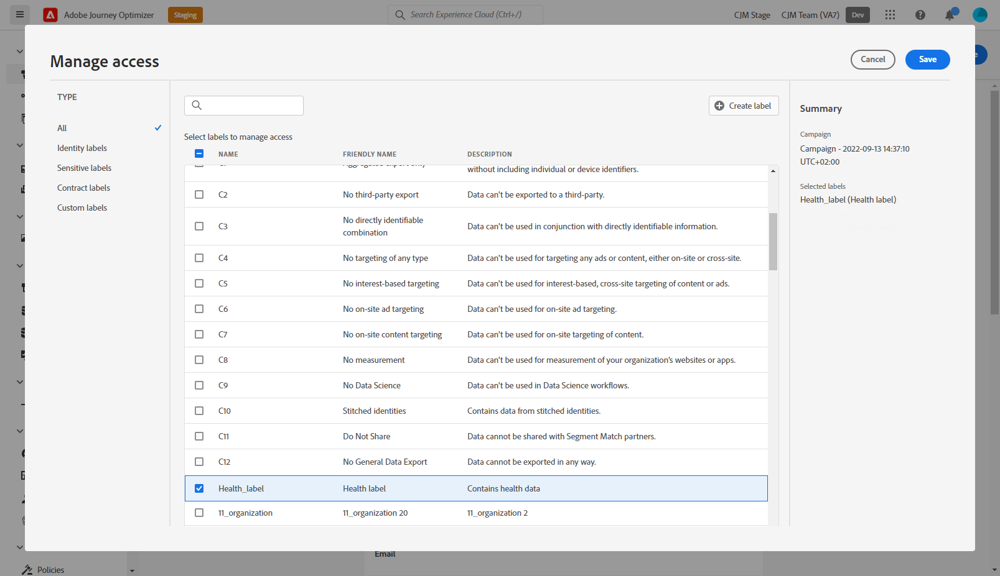

# 对象级访问控制 {#object-level-access}

>[!CONTEXTUALHELP]
>id="ajo_olac_manage_access"
>title="对象级访问控制"
>abstract="如果您应用了您无权访问的任何标签，则您对此对象的访问权限将被撤消。"

>[!IMPORTANT]
>
>对象级别访问控制的使用当前仅限于选定的客户，并且将在未来版本中部署到所有环境。

对象级别访问控制(OLAC)允许您定义用于管理对所选对象的数据访问权限的授权：

* 历程
* Campaign
* 登陆页面
* 选件
* 选件集合
* Offer decisioning

其目的是保护敏感数字资产免受未经授权用户的侵害，从而进一步保护个人数据。

在Adobe Journey Optimizer中，OLAC允许您保护数据并授予对特定对象的特定访问权限。

## 创建标签 {#create-assign-labels}

>[!IMPORTANT]
>
>要创建标签，您必须是 **[!UICONTROL 管理使用情况标签]** 权限。

**[!UICONTROL 标签]** 允许您根据应用于该数据的使用策略对数据集和字段进行分类。 **[!UICONTROL 标签]** 可以随时应用，从而在选择如何管理数据方面提供了灵活性。

您可以在 [!DNL Permissions] 产品。 有关详细信息，请参见[此页面](https://experienceleague.adobe.com/docs/experience-platform/access-control/abac/permissions-ui/labels.html)。

**[!UICONTROL 标签]** 也可以直接在Journey Optimizer中创建：

1. 从Adobe Journey Optimizer对象中，此处是新创建的 **[!UICONTROL Campaign]**，请单击 **[!UICONTROL 管理访问权限]** 按钮。

   

1. 从 **[!UICONTROL 管理访问权限]** 窗口，单击 **[!UICONTROL 创建标签]**.

   

1. 配置标签时，必须指定：
   * **[!UICONTROL 名称]**
   * **[!UICONTROL 友好名称]**
   * **[!UICONTROL 描述]**

   

1. 单击 **[!UICONTROL 创建]** 保存 **[!UICONTROL 标签]**.

您新创建的 **[!UICONTROL 标签]** 现在可在列表中使用。 如果需要，您可以在 [!DNL Permissions] 产品。

## 分配标签 {#assign-labels}

>[!IMPORTANT]
>
>要能够分配标签，您必须是具有“管理”权限的角色的一部分，例如， [!DNL Manage journeys], [!DNL Manage Campaigns] 或 [!DNL Manage decisions]. 如果没有这项许可， **[!UICONTROL 管理访问权限]** 按钮将灰显。

要为Journey Optimizer对象分配自定义或核心数据使用标签，请执行以下操作：

1. 从Adobe Journey Optimizer对象中，此处是新创建的 **[!UICONTROL Campaign]**，请单击 **[!UICONTROL 管理访问权限]** 按钮。

   

1. 从 **[!UICONTROL 管理访问权限]** 窗口中，选择自定义或核心数据使用标签以管理对此对象的访问。

   有关核心数据使用标签的更多信息，请参阅 [本页](https://experienceleague.adobe.com/docs/experience-platform/data-governance/labels/reference.html).

   

1. 单击 **[!UICONTROL 保存]** 以应用此标签限制。

要访问此对象，用户需要具有 **[!UICONTROL 标签]** 包含在 **[!UICONTROL 角色]**.
例如，具有C1标签的用户将只能访问C1标记或未标记的对象。

有关如何分配的详细信息 **[!UICONTROL 标签]** 至 **[!UICONTROL 角色]**，请参阅 [本页](https://experienceleague.adobe.com/docs/experience-platform/access-control/abac/permissions-ui/permissions.html?lang=en#manage-labels-for-a-role).

