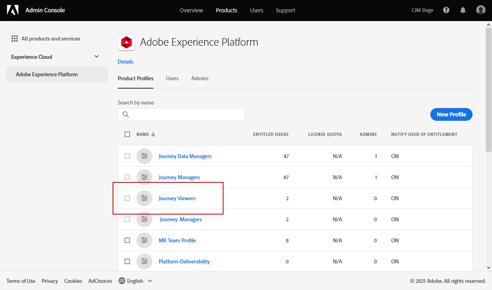

# 管理用户和产品配置文件 {#manage-permissions}

>[!IMPORTANT]
>
> 下文详述的每个程序只能由 **[!UICONTROL Product]** 或 **[!UICONTROL System]** 管理员。 有关此内容的更多信息，请参阅 [管理控制台文档](https://helpx.adobe.com/enterprise/admin-guide.html/enterprise/using/admin-roles.ug.html).

**[!UICONTROL Product profiles]** 是您组织内共享相同权限和沙箱的一组用户。

的 [!DNL Journey Optimizer] 产品允许您在不同的现成功能之间进行选择 **[!UICONTROL Product profiles]** 具有不同级别的权限来分配给用户。 有关 **[!UICONTROL Product profiles]**，请参见 [页面](ootb-product-profiles.md).

每个用户属于 **[!UICONTROL Product profiles]** 有权使用产品中包含的Adobe应用程序和服务。

您还可以创建自己的 **[!UICONTROL Product profiles]** 如果您想要优化用户对界面中特定功能或对象的访问权限。

## 分配产品用户档案 {#assigning-product-profile}

您可以选择分配现成的或自定义的 **[!UICONTROL Product profile]** 发送给您的用户。

在 [内置产品配置文件](ootb-product-profiles.md) 中。

分配 **[!UICONTROL Product profile]**:

1. 在 [!DNL Admin Console]，从 **[!UICONTROL Products]** 选项卡，选择 **[!UICONTROL Experience Cloud - Platform powered applications]** 产品。

1. 选择 **[!UICONTROL Product profile]**。

   

1. 在选项卡 **[!UICONTROL Users]** 中，单击 **[!UICONTROL Add user]**。

   

1. 键入您的用户名或电子邮件地址，然后选择用户。

   如果用户之前未在 [!DNL Admin Console]，请参阅 [添加用户文档](https://helpx.adobe.com/enterprise/admin-guide.html/enterprise/using/manage-users-individually.ug.html#add-users).

   

1. 执行与上述步骤相同的步骤，将其他用户添加到 **[!UICONTROL Product profile]**. 然后，单击 **[!UICONTROL Save]**.

随后，您的用户将收到一封重定向到您的实例的电子邮件。

有关用户管理的更多信息，请参阅 [Admin Console文档](https://helpx.adobe.com/enterprise/admin-guide.html/enterprise/using/manage-users-individually.ug.html).

访问实例时，您的用户将看到一个特定视图，具体取决于 **[!UICONTROL Product profile]**. 如果用户无权访问某项功能，则将显示以下屏幕。

## 编辑现有产品配置文件 {#edit-product-profile}

用于现成或自定义 **[!UICONTROL Product profiles]**，您可以随时决定添加或删除权限。

在本例中，我们要添加 **[!UICONTROL Permissions]** 与 **[!UICONTROL Message]** 为分配给历程查看器的用户提供的功能 **[!UICONTROL Product profile]**. 随后，用户将能够发布消息。

请注意，如果您修改了现成的或自定义 **[!UICONTROL Product profile]**，它会影响分配给此的每个用户 **[!UICONTROL Product profile]**.

1. 在 [!DNL Admin Console]，从 **[!UICONTROL Products]** 选项卡，选择 **[!UICONTROL Experience Cloud - Platform powered applications]** 产品。

1. 选择历程查看器 **[!UICONTROL Product profile]**.

1. 选择 **[!UICONTROL Permissions]** 选项卡。

   的 **[!UICONTROL Permissions]** 选项卡显示应用于 **[!UICONTROL Experience Cloud - Platform powered applications]** 产品。

   

1. 选择 **[!UICONTROL Messages]** 功能。

   

1. 从 **[!UICONTROL Available Permission Items]** 列表中，选择要分配给 **[!UICONTROL Product profile]** 单击加号(+)图标。

   在此，我们将 **[!UICONTROL Publish messages]** 权限。

   

1. 如果需要，请在 **[!UICONTROL Included Permission Items]** 下，单击删除您的产品用户档案权限旁边的 X 图标。

1. 完成后，单击 **[!UICONTROL Save]**。

   

如果需要，您还可以创建具有特定权限的新产品用户档案。 有关更多信息，请参阅 [创建产品用户档案](#create-product-profile).

## 创建产品用户档案 {#create-product-profile}

[!DNL Journey Optimizer] 允许您创建自己的 **[!UICONTROL Product profiles]** 并为用户分配一组权限和沙箱。 使用 **[!UICONTROL Product profiles]**，则可以授权或拒绝对界面中特定功能或对象的访问。

有关如何创建和管理沙箱的详细信息，请参阅 [Adobe Experience Platform文档](https://experienceleague.adobe.com/docs/experience-platform/sandbox/ui/user-guide.html?lang=zh-Hans){target=&quot;_blank&quot;}。

在本例中，我们将创建一个名为 **历程只读** 我们将为历程功能授予只读权限。 用户将只能访问和查看历程，并且将无法访问其他功能，例如 **[!DNL  Decision management]** 或 **[!DNL Messages]** in [!DNL Journey Optimizer].

创建 **历程只读** **[!UICONTROL product profiles]**:

1. 访问 [!DNL Admin Console].

1. 从 **[!UICONTROL Products]** 选项卡，选择 **[!UICONTROL Experience Cloud - Platform powered applications]** 产品。

1. 单击 **[!UICONTROL New Profile]**。

   

1. 添加 **[!UICONTROL Product Profile Name]**, **[!UICONTROL Display Name]** 和 **[!UICONTROL Description]** 新 **[!UICONTROL product profiles]**.

   

1. 在类别 **[!UICONTROL Notifications]** 中，选择在添加用户或从此产品用户档案中删除用户时，是否会通过电子邮件通知用户。

1. 完成后，单击 **[!UICONTROL Save]** 选择您新创建的 **[!UICONTROL product profiles]**.

1. 要为用户添加访问不同功能的权限，请选择 **[!UICONTROL Permissions]** 选项卡。

1. 在不同的功能(例如 **[!DNL Messages]**, **[!DNL Segments]** 或 **[!DNL Decision management]** 可用 [!DNL Journey Optimizer] 在左侧菜单中列出。

   在此，我们选择 **[!UICONTROL Journeys]** 功能。

   

1. 从 **[!UICONTROL Available Permission Items]** 列表中，选择要分配给 **[!UICONTROL Product profile]** 单击加号(+)图标。

   在此，我们选择 **[!DNL View journeys]** 和 **[!DNL View journeys event, data sources, actions]**.

   

1. 选择 **[!UICONTROL Sandbox access]** 能够选择要分配给您的沙盒 **[!UICONTROL Product profile]**.

   

1. 在 **[!UICONTROL Available Permissions Items]** 下，单击加号 (+) 图标，将沙箱分配给用户档案。[进一步了解沙箱](sandboxes.md)。

1. 完成后，单击 **[!UICONTROL Save]**。

您的 **[!UICONTROL Product profile]** 现已创建并配置。 您现在需要将其分配给用户。

有关产品配置文件创建和管理的更多信息，请参阅 [Admin Console文档](https://helpx.adobe.com/enterprise/admin-guide.html/enterprise/using/manage-product-profiles.ug.html).
