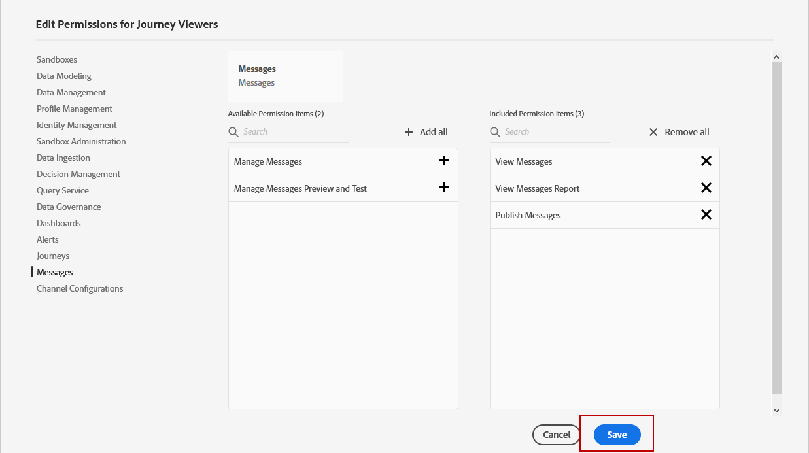

# 管理用户和产品配置文件{#manage-permissions}

>[!IMPORTANT]
>
> 下面所详述的每个过程只能由&#x200B;**[!UICONTROL Product]**&#x200B;或&#x200B;**[!UICONTROL System]**&#x200B;管理员执行。 有关此内容的更多信息，请参阅[管理控制台文档](https://helpx.adobe.com/enterprise/admin-guide.html/enterprise/using/admin-roles.ug.html)。

**[!UICONTROL Product profiles]** 是您组织内共享相同权限和沙箱的一组用户。

[!DNL Journey Optimizer]产品允许您在不同的现成&#x200B;**[!UICONTROL Product profiles]**&#x200B;之间进行选择，这些现成的具有分配给用户的不同权限级别。 有关可用&#x200B;**[!UICONTROL Product profiles]**&#x200B;的详细信息，请参阅此[页面](ootb-product-profiles.md)。

属于&#x200B;**[!UICONTROL Product profiles]**&#x200B;的每个用户都有权使用产品中包含的Adobe应用程序和服务。

如果要优化用户对界面中特定功能或对象的访问权限，也可以创建自己的&#x200B;**[!UICONTROL Product profiles]**。

## 分配产品用户档案 {#assigning-product-profile}

您可以选择为用户分配现成的或自定义的&#x200B;**[!UICONTROL Product profile]**。

每个已分配权限的现成产品配置文件的列表，可在[内置产品配置文件](ootb-product-profiles.md)部分找到。

分配&#x200B;**[!UICONTROL Product profile]**:

1. 在[!DNL Admin Console]的&#x200B;**[!UICONTROL Products]**&#x200B;选项卡中，选择&#x200B;**[!UICONTROL Experience Cloud - Platform powered applications]**&#x200B;产品。

1. 选择 **[!UICONTROL Product profile]**。

   

1. 在选项卡 **[!UICONTROL Users]** 中，单击 **[!UICONTROL Add user]**。

   

1. 键入您的用户名或电子邮件地址，然后选择用户。

   如果用户之前未在[!DNL Admin Console]中创建，请参阅[添加用户文档](https://helpx.adobe.com/enterprise/admin-guide.html/enterprise/using/manage-users-individually.ug.html#add-users)。

   

1. 执行与上述步骤相同的步骤，将其他用户添加到您的&#x200B;**[!UICONTROL Product profile]**&#x200B;中。 然后，单击&#x200B;**[!UICONTROL Save]**。

随后，您的用户将收到一封重定向到您的实例的电子邮件。

有关用户管理的更多信息，请参阅[Admin Console文档](https://helpx.adobe.com/enterprise/admin-guide.html/enterprise/using/manage-users-individually.ug.html)。

访问实例时，您的用户将看到一个特定视图，具体视图取决于&#x200B;**[!UICONTROL Product profile]**&#x200B;中分配的权限。 如果用户无权访问某项功能，则将显示以下屏幕。

## 编辑现有产品配置文件{#edit-product-profile}

对于现成或自定义的&#x200B;**[!UICONTROL Product profiles]**，您可以随时决定添加或删除权限。

在此示例中，我们要为分配给历程查看器&#x200B;**[!UICONTROL Product profile]**&#x200B;的用户添加与&#x200B;**[!UICONTROL Message]**&#x200B;功能相关的&#x200B;**[!UICONTROL Permissions]**。 随后，用户将能够发布消息。

请注意，如果您修改现成的或自定义&#x200B;**[!UICONTROL Product profile]**，将影响分配给此&#x200B;**[!UICONTROL Product profile]**&#x200B;的每个用户。

1. 在[!DNL Admin Console]的&#x200B;**[!UICONTROL Products]**&#x200B;选项卡中，选择&#x200B;**[!UICONTROL Experience Cloud - Platform powered applications]**&#x200B;产品。

1. 选择历程查看器&#x200B;**[!UICONTROL Product profile]**。

1. 选择 **[!UICONTROL Permissions]** 选项卡。

   **[!UICONTROL Permissions]**&#x200B;选项卡显示适用于***[!UICONTROL Experience Cloud - Platform powered applications]**&#x200B;产品的功能列表。

   

1. 选择&#x200B;**[!UICONTROL Messages]**&#x200B;功能。

   

1. 从&#x200B;**[!UICONTROL Available Permission Items]**&#x200B;列表中，单击加号(+)图标，选择要分配给&#x200B;**[!UICONTROL Product profile]**&#x200B;的权限。

   在此，我们添加&#x200B;**[!UICONTROL Publish messages]**&#x200B;权限。

   

1. 如果需要，请在 **[!UICONTROL Included Permission Items]** 下，单击删除您的产品用户档案权限旁边的 X 图标。

1. 完成后，单击 **[!UICONTROL Save]**。

   

如果需要，您还可以创建具有特定权限的新产品用户档案。 有关更多信息，请参阅[创建产品配置文件](#create-product-profile)。

## 创建产品用户档案 {#create-product-profile}

[!DNL Journey Optimizer] 允许您创建自己的 **[!UICONTROL Product profiles]** 权限，并为用户分配一组权限和沙箱。通过&#x200B;**[!UICONTROL Product profiles]**，您可以授权或拒绝对界面中特定功能或对象的访问。

有关如何创建和管理沙箱的更多信息，请参阅 [Adobe Experience Platform 文档](https://experienceleague.adobe.com/docs/experience-platform/sandbox/ui/user-guide.html?lang=zh-Hans)。

在此示例中，我们将创建名为&#x200B;**历程只读**&#x200B;的产品配置文件，在该配置文件中，我们将授予历程功能的只读权限。 用户将只能访问和查看历程，而无法访问其他功能，如[!DNL Journey Optimizer]中的&#x200B;**[!UICONTROL Decision management]**&#x200B;或&#x200B;**[!UICONTROL Messages]**。

要创建&#x200B;**历程只读** **[!UICONTROL product profiles]**:

1. 访问[!DNL Admin Console]。

1. 从&#x200B;**[!UICONTROL Products]**&#x200B;选项卡中，选择&#x200B;**[!UICONTROL Experience Cloud - Platform powered applications]**&#x200B;产品。

1. 单击 **[!UICONTROL New Profile]**。

   

1. 为新的&#x200B;**[!UICONTROL product profiles]**&#x200B;添加&#x200B;**[!UICONTROL Product Profile Name]**、**[!UICONTROL Display Name]**&#x200B;和&#x200B;**[!UICONTROL Description]**。

   

1. 在类别 **[!UICONTROL Notifications]** 中，选择在添加用户或从此产品用户档案中删除用户时，是否会通过电子邮件通知用户。

1. 完成后，单击&#x200B;**[!UICONTROL Save]**&#x200B;并选择新创建的&#x200B;**[!UICONTROL product profiles]**。

1. 要为用户添加访问不同功能的权限，请选择&#x200B;**[!UICONTROL Permissions]**&#x200B;选项卡。

1. 在左侧菜单中列出的[!DNL Journey Optimizer]中可用的不同功能（如&#x200B;**[!UICONTROL Messages]**、**[!UICONTROL Segments]**&#x200B;或&#x200B;**[!UICONTROL Decision management]**）之间进行选择。

   在此，我们选择&#x200B;**[!UICONTROL Journeys]**&#x200B;功能。

   

1. 从&#x200B;**[!UICONTROL Available Permission Items]**&#x200B;列表中，单击加号(+)图标，选择要分配给&#x200B;**[!UICONTROL Product profile]**&#x200B;的权限。

   在此，我们选择&#x200B;**[!UICONTROL View journeys]**&#x200B;和&#x200B;**[!UICONTROL View journeys event, data sources, actions]**。

   

1. 选择&#x200B;**[!UICONTROL Sandbox access]**&#x200B;功能，以选择要分配给&#x200B;**[!UICONTROL Product profile]**&#x200B;的沙盒。

   

1. 在 **[!UICONTROL Available Permissions Items]** 下，单击加号 (+) 图标，将沙箱分配给用户档案。[进一步了解沙箱](https://experienceleague.adobe.com/docs/experience-platform/sandbox/home.html?lang=zh-Hans)。

1. 完成后，单击 **[!UICONTROL Save]**。

现已创建并配置&#x200B;**[!UICONTROL Product profile]**。 您现在需要将其分配给用户。

有关产品配置文件创建和管理的更多信息，请参阅[Admin Console文档](https://helpx.adobe.com/enterprise/admin-guide.html/enterprise/using/manage-product-profiles.ug.html)。
