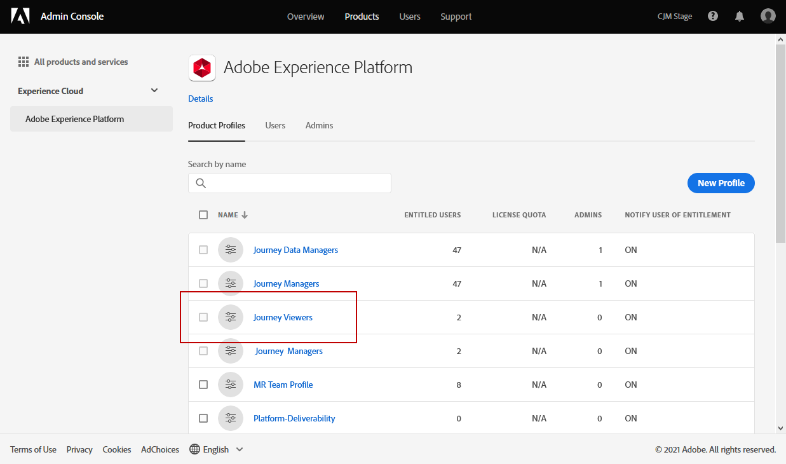
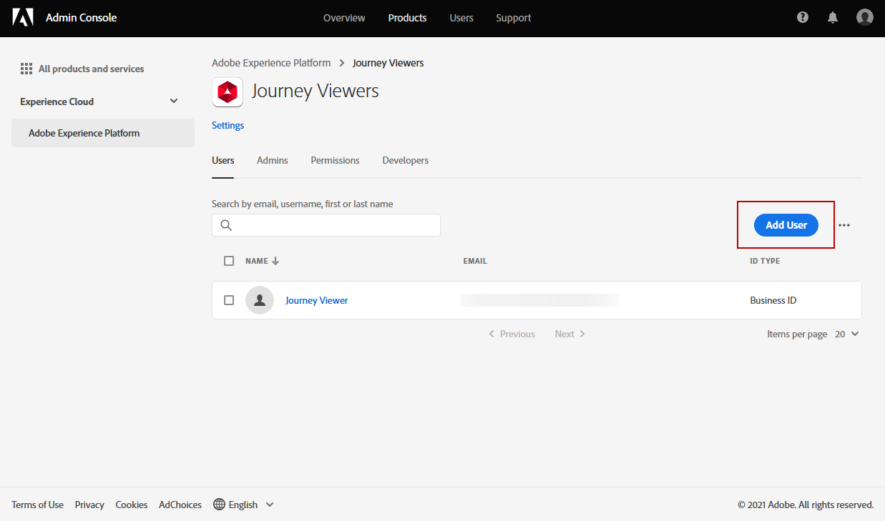
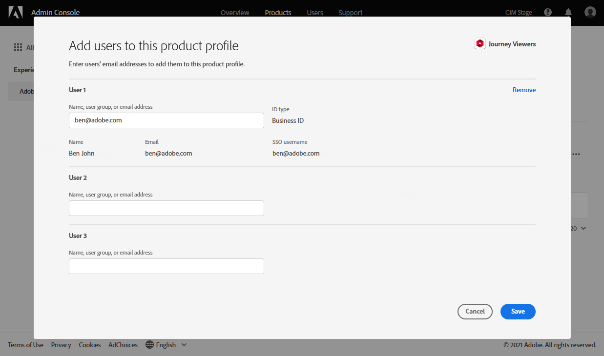
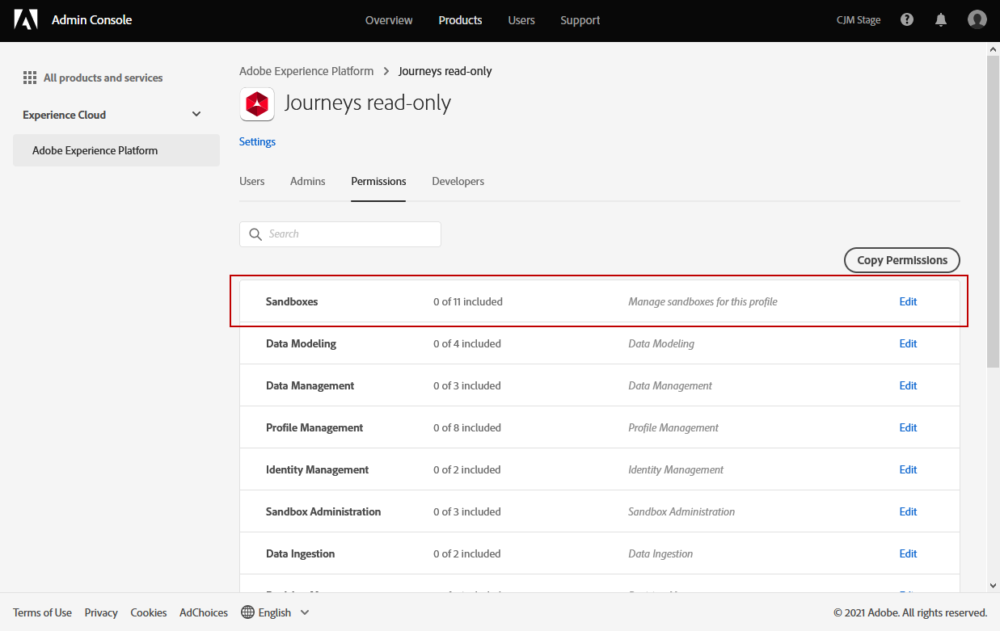

# 管理用户和角色 {#manage-permissions}

>[!BEGINSHADEBOX]

**在此页面上：**&#x200B;在“权限”产品中分配、编辑和创建角色，以便您可以为每个用户提供在Journey Optimizer中完成工作所需的确切访问权限。

>[!ENDSHADEBOX]

**[!UICONTROL 角色]**&#x200B;是指共享相同权限和沙盒的用户集合。 利用这些角色，可轻松管理组织中不同用户组的访问和权限。

使用[!DNL Journey Optimizer]产品，您可以从预先存在的&#x200B;**[!UICONTROL 角色]**&#x200B;范围中进行选择，每个角色都具有各种级别的权限，以便分配给您的用户。 有关可用的&#x200B;**[!UICONTROL 角色]**&#x200B;的详细信息，请参阅此[页面](ootb-product-profiles.md)。

当用户属于&#x200B;**[!UICONTROL Role]**&#x200B;时，他们将获得对产品中包含的Adobe应用程序和服务的访问权限。

如果预先存在的角色不符合您组织的特定需求，您还可以创建自定义&#x200B;**[!UICONTROL 角色]**，以微调对界面中特定功能或对象的访问权限。 这样，您就可以确保每个用户只能访问他们有效执行任务所需的资源和工具。

>[!IMPORTANT]
>
>以下详述的步骤和过程只能由&#x200B;**[!UICONTROL Product]**&#x200B;或&#x200B;**[!UICONTROL System]**&#x200B;管理员执行。

## 分配角色 {#assigning-role}

您可以为用户分配现成或自定义&#x200B;**[!UICONTROL 角色]**。

[内置角色](ootb-product-profiles.md)部分中提供了具有已分配权限的所有现成角色的列表。

要分配&#x200B;**[!UICONTROL 角色]**：

1. 要向[!DNL Permissions]产品中的用户分配角色，请导航到&#x200B;**[!UICONTROL 角色]**&#x200B;选项卡，然后选择所需的角色。

   

1. 在&#x200B;**[!UICONTROL 用户]**&#x200B;选项卡中，单击&#x200B;**[!UICONTROL 添加用户]**。

   

1. 键入您的用户名或电子邮件地址，或从列表中选择用户，然后单击&#x200B;**[!UICONTROL 保存]**。

   如果之前未在[!DNL Admin Console]中创建该用户，请参阅[添加用户文档](https://experienceleague.adobe.com/docs/experience-platform/access-control/ui/users.html){target="_blank"}。

   

您的用户会收到一封电子邮件，会将他们重定向到您的实例。

有关用户管理的详细信息，请参阅[访问控制文档](https://experienceleague.adobe.com/docs/experience-platform/access-control/home.html?lang=zh-Hans){target="_blank"}。

访问实例时，您的用户会看到一个特定视图，具体取决于&#x200B;**[!UICONTROL Role]**&#x200B;中分配的权限。 如果用户无权访问某个功能，则会显示以下消息：

`You do not have permission to access this feature. Permission needed: XX.`

## 编辑现有角色 {#edit-product-profile}

对于内置或自定义&#x200B;**[!UICONTROL 角色]**，您可以随时决定添加或删除权限。

在以下示例中，我们要为分配给历程查看器&#x200B;**[!UICONTROL 历程]**&#x200B;的用户添加与&#x200B;**[!UICONTROL 角色]**&#x200B;资源相关的&#x200B;**[!UICONTROL 权限]**。 随后，用户将能够发布历程。

>[!IMPORTANT]
>
>对内置或自定义角色所做的更改将影响分配给该角色的所有用户。

1. 要编辑[!DNL Permissions]产品中的角色，请导航到&#x200B;**[!UICONTROL 角色]**&#x200B;选项卡并选择所需的角色，此处为历程查看器&#x200B;**[!UICONTROL 角色]**。
   

1. 在您的&#x200B;**[!UICONTROL 角色]**&#x200B;仪表板中，单击&#x200B;**[!UICONTROL 编辑]**。

   

1. **[!UICONTROL 资源]**&#x200B;菜单显示应用于&#x200B;**[!UICONTROL Experience Cloud - Platform支持的应用程序]**&#x200B;产品的资源列表。 拖放资源以分配权限。

   从&#x200B;**[!UICONTROL 历程]**&#x200B;资源下拉列表中，我们在此处选择发布历程&#x200B;**[!UICONTROL 权限]**。

   

1. 如果需要，在&#x200B;**[!UICONTROL 包含的权限项]**&#x200B;下，单击X图标以从您的角色中删除权限或资源。

1. 完成后，单击&#x200B;**[!UICONTROL 保存]**。

如果需要，您还可以创建具有特定权限的新角色。

## 创建新角色 {#create-product-profile}

[!DNL Journey Optimizer]允许您创建自己的&#x200B;**[!UICONTROL 角色]**，并为用户分配一组权限和沙箱。 使用&#x200B;**[!UICONTROL 角色]**，您可以授权或拒绝对界面中特定功能或对象的访问。

有关如何创建和管理沙盒的更多信息，请参阅 [Adobe Experience Platform 文档](https://experienceleague.adobe.com/docs/experience-platform/sandbox/ui/user-guide.html?lang=zh-Hans){target="_blank"}。

在此示例中，我们创建了一个名为&#x200B;**历程只读**&#x200B;的角色，我们在该角色中授予历程功能的只读权限。 用户将只能访问和查看历程，而无法访问[!DNL Journey Optimizer]中的其他功能，如&#x200B;**[!DNL Decision management]**。

要创建我们的&#x200B;**历程只读** **[!UICONTROL 角色]**：

1. 要向[!DNL Permissions]产品中的用户分配角色，请导航到&#x200B;**[!UICONTROL 角色]**&#x200B;选项卡，然后单击&#x200B;**[!UICONTROL 创建角色]**。

   

1. 为您的新&#x200B;**[!UICONTROL 角色]**&#x200B;添加&#x200B;**[!UICONTROL 名称]**&#x200B;和&#x200B;**[!UICONTROL 描述]**。 然后单击&#x200B;**[!UICONTROL 确认]**。

   

1. 从&#x200B;**[!UICONTROL 沙盒]**&#x200B;资源下拉列表中，选择要分配给您的&#x200B;**[!UICONTROL 角色]**&#x200B;的沙盒。 [进一步了解沙盒](sandboxes.md)。

   

1. 从左侧菜单中列出的[!DNL Journey Optimizer]中可用的其他资源（如&#x200B;**[!DNL Journeys]**、**[!DNL Segments]**&#x200B;或&#x200B;**[!DNL Decision management]**）中进行选择。

   在此处，我们选择&#x200B;**[!UICONTROL 历程]**&#x200B;资源。

   

1. 从&#x200B;**[!UICONTROL 历程]**&#x200B;下拉列表中，选择要分配给您的&#x200B;**[!UICONTROL 角色]**&#x200B;的权限。

   在此，我们选择&#x200B;**[!DNL View journeys]**、**[!DNL View journeys report]**&#x200B;和&#x200B;**[!DNL View journeys event, data sources, actions]**。

   

1. 完成后，单击&#x200B;**[!UICONTROL 保存]**。

您的&#x200B;**[!UICONTROL 角色]**&#x200B;现已创建并配置。 您现在需要将其分配给用户。

有关创建和管理角色的更多信息，请参阅[Adobe Admin Console文档](https://experienceleague.adobe.com/docs/experience-platform/access-control/abac/permissions-ui/roles.html){target="_blank"}。

+++ AI知识参考

本节包含结构化知识，用于支持与本主题相关的解释、检索和问答。

要全面了解相关信息，应将此信息与本页上的文档相结合。 这两个源都不是独立的；页面描述了功能，而本节提供了其他上下文来帮助消除术语、意图、适用性和约束条件的歧义。

- **TL；DR：**&#x200B;本页向产品和系统管理员介绍权限产品中的三项角色管理任务：为用户分配现有角色、编辑角色的权限以及创建具有特定权限和沙盒的新自定义角色。

**意图：**

- 在Journey Optimizer中为用户分配内置或自定义角色
- 编辑现有角色的权限（添加或删除权限）
- 创建具有特定权限和沙盒分配的新自定义角色
- 了解谁有权执行角色和权限管理

**术语表：**

- **角色**：共享相同权限和沙盒的用户集合，用于管理组织&#x200B;*（产品特定）*&#x200B;中的访问权限
- **权限产品**： Adobe CX Enterprise界面（通过[!DNL Permissions]访问），其中角色、权限和沙盒配置了&#x200B;*（产品特定）*
- **内置角色**：具有已定义权限集的预先存在的角色，可用于立即分配，而无需自定义配置&#x200B;*（产品特定）*

**护栏：**

- 只有产品或系统管理员可以分配、编辑或创建角色（硬先决条件，如页面上的重要说明中所述）
- 对内置或自定义角色所做的更改会影响分配给该角色的所有用户（如页面上的重要说明中所述）

**术语：**

- 规范名称：权限产品 — 变体：Adobe权限、权限UI、Adobe CX企业权限
- 请勿混淆：“分配角色”（将用户添加到现有角色）≠“创建角色”（从头开始定义具有自己权限和沙盒的新角色）
- 请勿混淆：“编辑现有角色”（修改现有角色的权限或沙盒；影响所有分配的用户）≠“创建新角色”（构建新角色而不影响任何现有角色或其用户）

**常见问题解答：**

- **问：谁可以在Journey Optimizer中为用户分配角色？**  — 仅限产品或系统管理员。
- **问：如果我编辑内置角色的权限，会发生什么情况？**  — 更改会影响当前分配给该角色的所有用户。
- **问：在产品中，我该从哪里管理角色？**  — 在“权限”产品中，导航到“角色”选项卡。
- **问：分配角色后，用户是否会收到通知？**  — 是，用户会自动收到一封电子邮件，会将用户重定向到实例。

+++
<!-- ai-accordion-version: 1 | source-hash: 09d3612e -->
