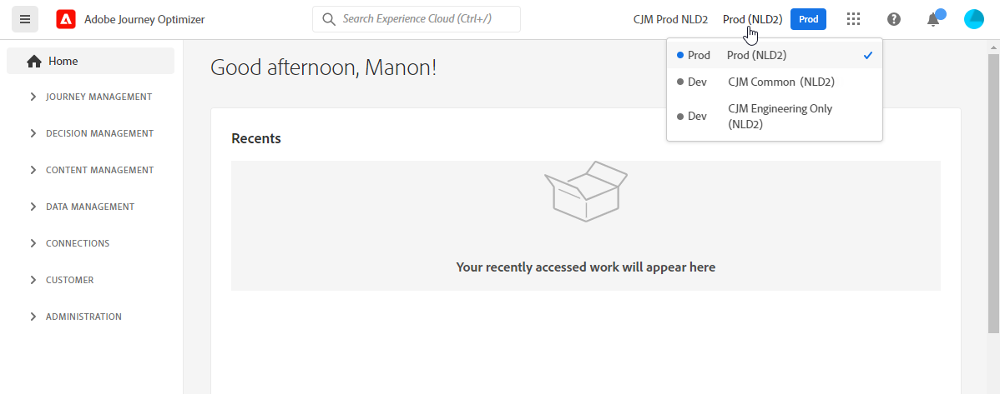
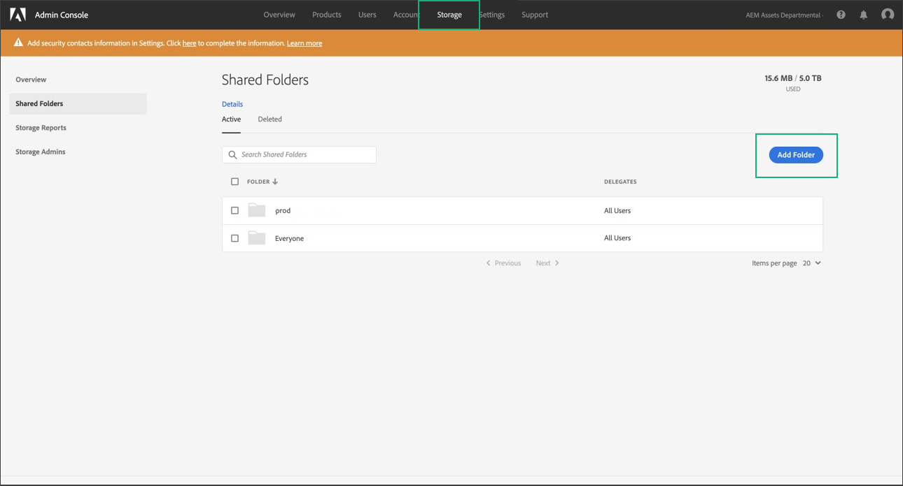

# 沙盒管理 {#sandboxes}

## 使用沙箱 {#using-sandbox}

[!DNL Journey Optimizer] 允许您将实例分区为称为沙箱的分隔虚拟环境。
沙箱通过 Admin Console 中的产品用户档案进行分配。[了解如何分配沙箱](permissions.md#create-product-profile)。

[!DNL Journey Optimizer] 反映为给定组织创建的 Adobe Experience Platform 沙箱。
可以从 Adobe Experience Platform 实例创建或重置 Adobe Experience Platform 沙箱。[在沙盒用户指南中了解详情](https://experienceleague.adobe.com/docs/experience-platform/sandbox/ui/user-guide.html?lang=zh-Hans){target=&quot;_blank&quot;}。

您可以在屏幕右上方找到您的组织名称旁边的沙盒切换器控件。 要从一个沙箱切换到另一个沙箱，请单击切换器中当前活动的沙箱，然后从下拉列表中选择另一个沙箱。

➡️ [在视频中发现此功能](#video)

## 分配沙箱 {#assign-sandboxes}

>[!IMPORTANT]
>
> 沙箱管理只能通过 **[!UICONTROL Product]** 或 **[!UICONTROL System]** 管理员。 有关此内容的更多信息，请参阅 [管理控制台文档](https://helpx.adobe.com/enterprise/admin-guide.html/enterprise/using/admin-roles.ug.html){target=&quot;_blank&quot;}。

您可以选择为现成或自定义沙箱分配不同的沙箱 **[!UICONTROL Product profiles]**.

要分配沙箱，请执行以下操作：

1. 在 [!DNL Admin Console]，从 **[!UICONTROL Products]** 选项卡，选择 **[!UICONTROL Adobe Experience Platform Apps]** 产品。

1. 选择 **[!UICONTROL Product profile]**。

   

1. 选择 **[!UICONTROL Permissions]** 选项卡。

1. 选择 **[!UICONTROL Sandboxes]** 功能。

   

1. 在 **[!UICONTROL Available Permissions Items]** 下，单击加号 (+) 图标，将沙箱分配给用户档案。[了解有关沙箱的更多信息](https://experienceleague.adobe.com/docs/experience-platform/sandbox/home.html?lang=zh-Hans){target=&quot;_blank&quot;}。

   

1. 如果需要，在下 **[!UICONTROL Included Permission Items]**，请单击删除沙箱访问您的 **[!UICONTROL Product profile]**.

   

1. 单击 **[!UICONTROL Save]**。

## 访问内容 {#content-access}

要配置内容辅助功能，您需要为每个沙箱分配一个内容共享文件夹。您可以在 [!DNL Admin Console] 中显示的 **[!UICONTROL Storage]** 选项卡中为管理员创建和配置共享文件夹。如果您对 [!DNL Admin Console] 拥有系统管理员访问权限，则可以创建共享文件夹并向它们添加具有不同访问级别的代表。

请注意，要使内容与正确的沙箱同步，您必须遵循与沙箱相同的语法，例如，如果沙箱命名为“development”，则共享文件夹应具有相同的名称。

[了解如何管理共享文件夹](https://helpx.adobe.com/enterprise/admin-guide.html/enterprise/using/manage-adobe-storage.ug.html){target=&quot;_blank&quot;}。

## 操作方法视频{#video}

了解沙箱是什么以及如何区分开发沙箱和生产沙箱。了解如何创建、重置和删除沙箱。

>[!VIDEO](https://video.tv.adobe.com/v/334355?quality=12)
