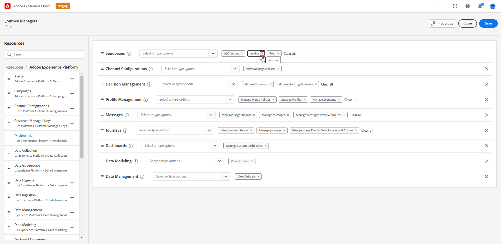

# 沙盒管理 {#sandboxes}

## 使用沙盒 {#using-sandbox}

[!DNL Journey Optimizer] 允许您将实例分区为称为沙盒的分隔虚拟环境。
沙盒通过权限中的角色进行分配。 [了解如何分配沙盒](permissions.md#create-product-profile)。

[!DNL Journey Optimizer] 反映为给定组织创建的 Adobe Experience Platform 沙盒。
可以从 Adobe Experience Platform 实例创建或重置 Adobe Experience Platform 沙盒。[在沙盒用户指南中了解详情](https://experienceleague.adobe.com/docs/experience-platform/sandbox/ui/user-guide.html?lang=zh-Hans){target="_blank"}。

您可以在屏幕右上角组织名称旁边找到沙盒切换器控件。 要从一个沙盒切换到另一个沙盒，请单击切换器中当前活动的沙盒，然后从下拉列表中选择另一个沙盒。

➡️[在此视频中了解有关沙盒的更多信息](#video)

## 分配沙盒 {#assign-sandboxes}

>[!IMPORTANT]
>
> 沙盒管理只能由&#x200B;**[!UICONTROL Product]**&#x200B;或&#x200B;**[!UICONTROL System]**&#x200B;管理员执行。

您可以选择将不同的沙盒分配给现成或自定义&#x200B;**[!UICONTROL 角色]**。

要分配沙箱，请执行以下操作：

1. 在[!DNL Permissions]中，从&#x200B;**[!UICONTROL 角色]**&#x200B;选项卡中选择&#x200B;**[!UICONTROL 角色]**。

   

1. 单击&#x200B;**[!UICONTROL 编辑]**。

1. 从&#x200B;**[!UICONTROL 沙盒]**&#x200B;资源下拉列表中，选择要分配给您的角色的沙盒。

   

1. 如果需要，请单击旁边的X图标以删除沙盒对您的&#x200B;**[!UICONTROL 角色]**&#x200B;的访问权限。

   

1. 单击&#x200B;**[!UICONTROL 保存]**。

## 访问内容 {#content-access}

要配置内容辅助功能，您需要为每个沙盒分配一个内容共享文件夹。您可以在[!DNL Admin Console]中显示的&#x200B;**[!UICONTROL 存储]**&#x200B;选项卡中为管理员创建和配置共享文件夹。 如果您对 [!DNL Admin Console] 拥有系统管理员访问权限，则可以创建共享文件夹并向它们添加具有不同访问级别的代表。

请注意，要使内容与正确的沙盒同步，您必须遵循与沙盒相同的语法，例如，如果沙盒命名为“development”，则共享文件夹应具有相同的名称。

[了解如何管理共享文件夹](https://helpx.adobe.com/cn/enterprise/admin-guide.html/enterprise/using/manage-adobe-storage.ug.html){target="_blank"}。

## 操作方法视频{#video}

了解沙盒是什么以及如何区分开发沙盒和生产沙盒。了解如何创建、重置和删除沙盒。

>[!VIDEO](https://video.tv.adobe.com/v/334355?quality=12)