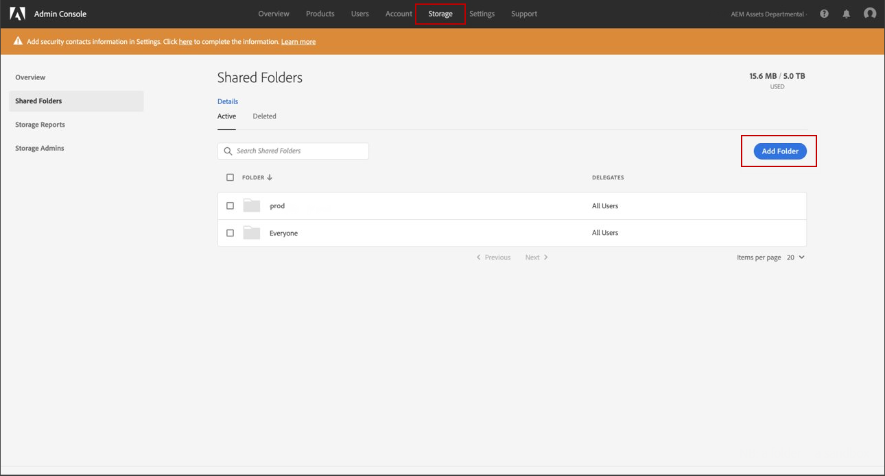

# 使用和分配沙盒 {#sandboxes}

>[!BEGINSHADEBOX]

**在此页面上：**&#x200B;使用并分配沙盒将Adobe Journey Optimizer实例分区为单独的环境，以便您可以开发、测试和在生产环境中运行而不会影响其他工作。

>[!ENDSHADEBOX]

**沙盒**&#x200B;是将您的Adobe Journey Optimizer实例分区为单独的独立工作区的虚拟环境，用于开发、测试或生产。 您可以在&#x200B;**管理** > **渠道** > **连接您的系统和环境**（或通过界面右上角的沙盒切换器）下找到沙盒管理。 沙盒可帮助您安全地进行试验、为每个角色分配不同的访问权限，并保持内容井然有序。 本页介绍如何使用和分配沙盒、配置内容访问权限，以及在[将对象导出到另一个沙盒](../configuration/copy-objects-to-sandbox.md)文章中，介绍如何在沙盒之间复制历程和模板。

## 使用沙盒 {#using-sandbox}

[!DNL Journey Optimizer]允许您将实例分区到称为沙箱的单独虚拟环境中。 沙盒通过权限中的角色进行分配。 [了解如何分配沙盒](permissions.md#create-product-profile)。

[!DNL Journey Optimizer]反映为给定组织创建的Adobe Experience Platform沙箱。 可以从 Adobe Experience Platform 实例创建或重置 Adobe Experience Platform 沙盒。 [在沙盒用户指南中了解详情](https://experienceleague.adobe.com/docs/experience-platform/sandbox/ui/user-guide.html?lang=zh-Hans){target="_blank"}。

您可以在屏幕的右上角、组织名称的旁边找到沙盒切换器控件。 要从一个沙盒切换到另一个沙盒，请单击切换器中当前活动的沙盒，然后从下拉列表中选择另一个沙盒。

➡️ [在此视频中了解有关沙盒的更多信息](#video)

## 分配沙盒 {#assign-sandboxes}

>[!IMPORTANT]
>
> 沙盒管理只能由&#x200B;**[!UICONTROL Product]**&#x200B;或&#x200B;**[!UICONTROL System]**&#x200B;管理员执行。

您可以选择将不同的沙盒分配给现成或自定义&#x200B;**[!UICONTROL 角色]**。

要分配沙箱，请执行以下操作：

1. 在[!DNL Permissions]中，从&#x200B;**[!UICONTROL 角色]**&#x200B;选项卡中选择&#x200B;**[!UICONTROL 角色]**。

   

1. 单击&#x200B;**[!UICONTROL 编辑]**。

1. 从&#x200B;**[!UICONTROL 沙盒]**&#x200B;资源下拉列表中，选择要分配给您的角色的沙盒。

   

1. 如果需要，请单击它旁边的X图标以从&#x200B;**[!UICONTROL 角色]**&#x200B;中删除沙盒访问权限。

   

1. 单击&#x200B;**[!UICONTROL 保存]**。

## 访问内容 {#content-access}

要配置内容辅助功能，请为每个沙盒分配一个内容共享文件夹。 您可以在[!DNL Admin Console]中显示的&#x200B;**[!UICONTROL 存储]**&#x200B;选项卡中为管理员创建和配置共享文件夹。 如果您以系统管理员身份有权访问[!DNL Admin Console]，则可以创建共享文件夹并向共享文件夹添加具有不同访问级别的代表。

请注意，要使内容与正确的沙盒同步，您必须遵循与沙盒相同的语法。 例如，如果沙盒命名为“development”，则共享文件夹应具有相同的名称。

[了解如何管理共享文件夹](https://helpx.adobe.com/cn/enterprise/admin-guide.html/enterprise/using/manage-adobe-storage.ug.html){target="_blank"}。

## 操作方法视频{#video}

了解沙盒是什么以及如何区分开发沙盒和生产沙盒。 了解如何创建、重置和删除沙盒。

>[!VIDEO](https://video.tv.adobe.com/v/334355?quality=12)

+++ AI知识参考

本节包含结构化知识，用于支持与本主题相关的解释、检索和问答。

要全面了解相关信息，应将此信息与本页上的文档相结合。 这两个源都不是独立的；页面描述了功能，而本节提供了其他上下文来帮助消除术语、意图、适用性和约束条件的歧义。

- **TL；DR：**&#x200B;沙盒将您的Journey Optimizer实例分区为单独的虚拟工作区，以供开发、测试和生产使用；沙盒通过权限产品中的角色分配给用户，内容访问通过Admin Console中的共享文件夹进行配置。

**意图：**

- 使用沙盒切换器在Journey Optimizer界面中的沙盒之间切换
- 将一个或多个沙盒分配给权限产品中的角色
- 从角色中删除沙盒访问权限
- 为沙盒配置内容访问（共享文件夹）
- 了解沙盒与角色和权限的关系

**术语表：**

- **沙盒**：一个虚拟环境，将Journey Optimizer实例分区为单独的独立工作区，以供开发、测试或生产使用&#x200B;*（特定于产品）*
- **沙盒切换器**： Journey Optimizer界面右上角组织名称旁边的控件用于在沙盒&#x200B;*（产品特定）*&#x200B;之间切换
- **共享文件夹**：在Admin Console中为允许内容访问的沙盒配置的存储文件夹；其名称必须与内容的沙盒名称匹配才能正确同步&#x200B;*（产品特定）*

**护栏：**

- 沙盒管理只能由产品或系统管理员执行（硬先决条件，如页面上的重要说明中所述）
- 对于要同步到正确沙盒的内容，共享文件夹名称必须遵循与沙盒名称相同的语法（如页面上所述）

**术语：**

- 请勿混淆：“使用沙盒”（在UI中使用沙盒切换器切换到该沙盒）≠“分配沙盒”（将沙盒添加到权限产品中的角色）≠“创建沙盒”（在Adobe Experience Platform中完成，而不是在Journey Optimizer中完成）
- 同义词： &quot;sandbox&quot; =此页面上下文中的&quot;virtual environment&quot;
- 请勿混淆：“分配沙箱”（向权限中的角色添加沙箱）≠“管理沙箱”（创建、重置或删除沙箱 — 在Adobe Experience Platform中完成）

**常见问题解答：**

- **问：如何在Journey Optimizer中的沙盒之间切换？**  — 使用屏幕右上角、您组织名称旁边的沙盒切换器；单击活动的沙盒，然后从下拉列表中选择另一个沙盒。
- **问：谁可以将沙盒分配给角色？**  — 仅限产品或系统管理员。
- **问：沙盒如何对用户可用？**  — 沙盒通过权限产品中的角色进行分配。
- **问：共享文件夹必须遵循什么命名规范？**  — 共享文件夹必须具有与关联沙盒相同的名称（例如，如果沙盒称为“开发”，则共享文件夹还必须称为“开发”）。

+++
<!-- ai-accordion-version: 1 | source-hash: 0a5ada9b -->