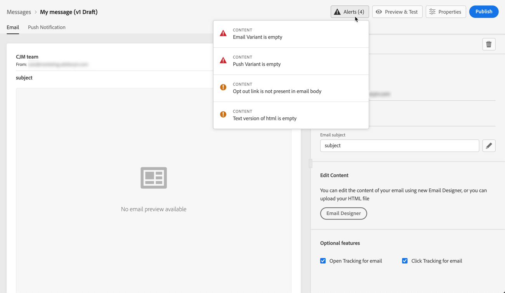

# 消息{#publish-manage-messages}上的警报

## 发布{#message-alerting}前检查

在创建消息时，当您需要在发布消息之前执行重要操作时，会发出警告。

警报显示在屏幕右上方，如下所示：

>[!NOTE]
>
>如果未看到此按钮，则未检测到任何警报。

可以发生两种类型的警报：

* **警** 告请参阅建议和最佳实践。例如，如果缺少退出链接，则将显示一条消息。

* **错** 误只要消息未解决，就会阻止您发布消息。例如，将显示一条消息，警告您主题行缺失。

所有可能的警告和错误都详见。

>[!CAUTION]
>
> 在发布之前，您需要解决所有&#x200B;**error**&#x200B;警报。

## 警告和错误列表{#alerts-and-warnings}

系统检查的设置和元素如下。 您还将找到有关如何调整配置以解决相应问题的信息。

**警告**:

* **[!UICONTROL Opt out link not present in the email body]**:在电子邮件正文中添加退订链接是最佳做法。了解如何在[此部分](consent.md)中配置它。

* **[!UICONTROL Text version of html is empty]**:不要忘记定义电子邮件正文的文本版本，因为当无法显示HTML内容时，将使用它。了解如何在[本节](create-email-content.md#generate-text-version)中创建文本版本。

* **[!UICONTROL Empty link is present in email body]**:检查您电子邮件中的所有链接是否正确。了解如何管理[本节](create-email-content.md)中的内容和链接。

* **[!UICONTROL Email size has exceeded the limit of 100KB]**:为获得最佳投放，请确保您的电子邮件大小不超过100KB。了解如何在[此部分](create-email-content.md)中编辑电子邮件内容。

**错误**:

* **[!UICONTROL Subject Line Not Present]**:电子邮件主题行为必填。了解如何在[本节](configure-email.md)中定义和个性化它。

   <!--HTML is empty when Amp HTML is present-->

* **[!UICONTROL Push Variant is empty]**:当缺少推送通知正文或标题时，会显示此错误。了解如何在[本节](configure-push.md)中定义推送通知内容。

* **[!UICONTROL Email Variant is empty]**:未配置电子邮件内容时，会显示此错误。了解如何在[本节](design-emails.md)中设计电子邮件内容。

* **[!UICONTROL Preset doesn’t exist]**:如果在消息创建后删除了您选择的预设，则无法发布消息。如果发生此错误，请在消息&#x200B;**[!UICONTROL Properties]**&#x200B;中选择其他预设。 了解有关[本部分](administration.md#cjm-branding)中品牌的更多信息。

* **[!UICONTROL Push iOS/Android payload has exceeded limit of 4KB]**:推送通知大小不能超过4KB。要遵守此限制，请尝试减少使用图像或表情符号。 了解如何在[本节](configure-push.md)中管理您的推送通知内容。

>[!CAUTION]
>
> 要能够发布消息，您需要解决所有&#x200B;**error**&#x200B;警报。

<!--Other issues can stop publication such as:
* The push notification title is empty-->
