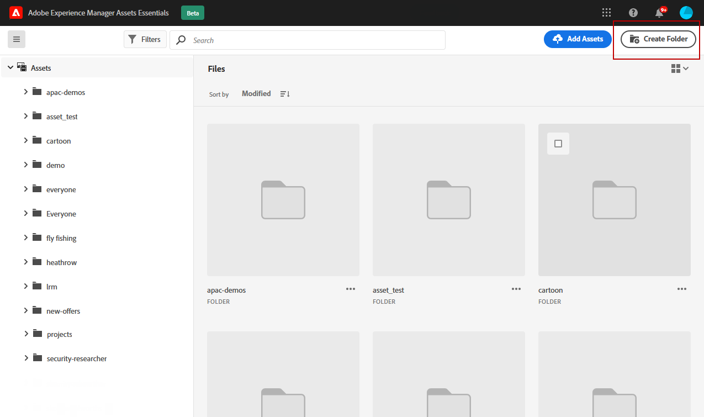
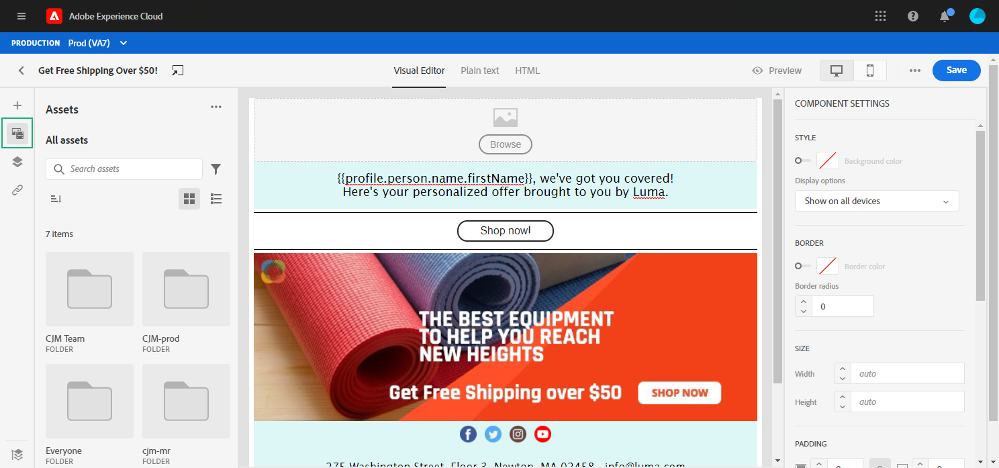

# 使用 [!DNL Adobe Experience Manager Assets Essentials] {#experience-manager-assets}

## 开始使用 [!DNL Assets Essentials] {#get-started-assets-essentials}

>[!NOTE]
>
> 要使用[!DNL Adobe Experience Manager Assets Essentials]，您需要为贵组织部署[!DNL Assets Essentials]，并确保您是&#x200B;**Assets Essentials客户用户**&#x200B;或/和&#x200B;**Assets Essentials用户**&#x200B;产品配置文件的一部分。   有关此内容的更多信息，请参阅 [此页面](https://experienceleague.adobe.com/docs/experience-manager-assets-essentials/help/deploy-administer.html)。

[!DNL Adobe Experience Manager Assets Essentials] 提供了一个可用于填充消息的集中资产存储库。它可以直接从[!DNL Adobe Journey Optimizer]访问到&#x200B;**[!UICONTROL Assets]**&#x200B;部分。 在设计电子邮件内容时，您还可以访问资产和文件夹。 [进一步了解电子邮件设计](design-emails.md)。

有关[!DNL Assets Essentials]的更多详细过程，请参阅[Adobe Experience Manager Assets Essentials文档](https://experienceleague.adobe.com/docs/experience-manager-assets-essentials/help/introduction.html)。

## 上传和插入资产{#add-asset}

要上传[!DNL Assets Essentials]中的文件，您首先需要浏览或创建将存储到其中的文件夹。 然后，您便能够将它们插入到电子邮件内容中。

有关如何上传资产的更多信息，请参阅[Adobe Experience Manager Assets Essentials文档](https://experienceleague.adobe.com/docs/experience-manager-assets-essentials/help/add-delete.html)。

1. 从[!DNL Adobe Journey Optimizer]主页中，选择&#x200B;**[!UICONTROL Content management]**&#x200B;菜单下的&#x200B;**[!UICONTROL Assets]**&#x200B;选项卡以访问[!DNL Assets Essentials]。

   

1. 从中央部分或树视图中双击文件夹以将其打开。

   您还可以单击&#x200B;**[!UICONTROL Create folder]**&#x200B;创建新文件夹。

   

1. 进入选定或创建的文件夹后，单击&#x200B;**[!UICONTROL Add Assets]** ，将新资产上传到您的文件夹。

   

1. 在&#x200B;**[!UICONTROL Upload files]**&#x200B;中，单击&#x200B;**[!UICONTROL Browse]**&#x200B;并选择想要&#x200B;**[!UICONTROL Browse files]**&#x200B;还是&#x200B;**[!UICONTROL Browse folders]**。

   

1. 选择要上传的文件。 完成后，单击 **[!UICONTROL Upload]**。

   要了解有关如何管理资产的更多信息，请参阅此[页面](https://experienceleague.adobe.com/docs/experience-manager-assets-essentials/help/manage-organize.html?lang=en)。

1. 上传资产后，您现在可以通过Email designer将资产插入其中一条消息。

   您还可以使用&#x200B;**编辑**&#x200B;模式([!DNL Assets Essentials])对资产进行进一步编辑。 [了解详情](https://experienceleague.adobe.com/docs/experience-manager-assets-essentials/help/edit-images.html)。

   

1. 从[!DNL Adobe Journey Optimizer]中，从电子邮件设计器的左窗格中选择&#x200B;**[!UICONTROL Asset picker]**。

   

1. 选择您的Assets文件夹。 您还可以在搜索栏中搜索资产或文件夹。

1. 将资产拖放到电子邮件内容中。

   

1. 您可以进一步自定义资产，例如添加外部链接或使用&#x200B;**[!UICONTROL Components settings]**&#x200B;的文本。 [了解有关组件设置的更多信息](content-components.md)

   
