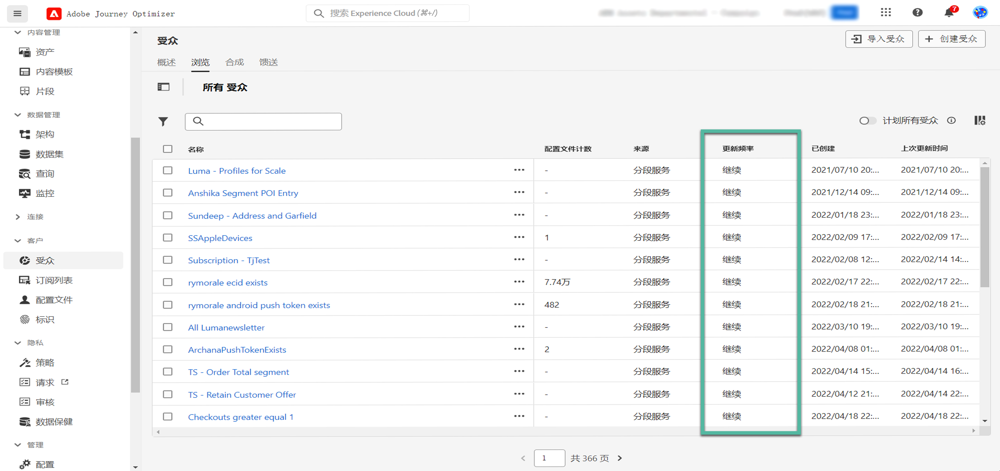

# Adobe Experience Platform 受众入门指南 {#about-segments}

>[!CONTEXTUALHELP]
>id="ajo_campaigns_content_experiment_segment"
>title="受众"
>abstract="通过利用 Real-Time Customer Profile 数据，Adobe Experience Platform 让您能够轻松地构建区段定义，从而创建目标受众，用于捕捉客户的独特行为和偏好。"

>[!CONTEXTUALHELP]
>id="ajo_campaigns_audience"
>title="选择活动受众"
>abstract="此列表显示所有可用的Adobe Experience Platform受众。 选择营销活动要定位的受众。 在营销活动中配置的消息将发送给属于所选受众的所有个人。 [了解有关受众的更多信息](../audience/about-audiences.md)"

受众是指一组具有相似行为和/或特征的人员。 要了解有关受众的更多信息，请参阅 [Adobe Experience Platform Segmentation Service文档](https://experienceleague.adobe.com/docs/experience-platform/segmentation/home.html?lang=zh-Hans){target="_blank"}.

[!DNL Journey Optimizer] 允许您直接从构建Adobe Experience Platform受众 **[!UICONTROL 受众]** 菜单，并将它们用于您的历程或营销活动。

可以使用不同方法生成受众：

* **区段定义**：使用Adobe Experience Platform分段服务创建新的受众定义。 [了解如何构建区段定义](creating-a-segment-definition.md)
* **自定义上传**：使用CSV文件导入受众。 了解如何在Adobe Experience Platform中导入受众 [Segmentation Service文档](https://experienceleague.adobe.com/docs/experience-platform/segmentation/ui/overview.html#import-audience){target="_blank"}.
* **受众构成**：创建组合工作流以将现有Adobe Experience Platform受众合并到可视画布中，并利用各种活动（拆分、排除……）来创建新受众。 [受众组合入门](get-started-audience-orchestration.md)

## 在以下位置定位受众： [!DNL Journey Optimizer] {#segments-in-journey-optimizer}

您可以在营销活动和历程中选择使用区段定义、自定义上传或组合工作流生成的任何受众。

>[!AVAILABILITY]
>
>受众构成和自定义上传（CSV文件）受众中的受众和属性的使用当前不适用于Healthcare Shield或Privacy and Security Shield。 [了解如何在Journey Optimizer中使用受众扩充属性](../audience/about-audiences.md#enrichment)

您可通过不同方式在 **[!DNL Journey Optimizer]** 中利用受众：

* 为&#x200B;**营销活动**&#x200B;选择受众，消息将发送给属于所选受众的所有个人。[了解如何定义营销活动的受众](../campaigns/create-campaign.md#define-the-audience-audience)。

* 使用 **读取受众** 历程中的编排活动，旨在使受众中的所有个人进入历程并接收历程中包含的消息。 假设您拥有“白银客户”受众。通过此活动，您可以使所有白银客户进入历程，并向其发送一系列个性化消息。[了解如何配置读取受众活动](../building-journeys/read-audience.md#configuring-segment-trigger-activity)。

* 使用历程中的&#x200B;**条件**&#x200B;活动，根据受众成员资格构建条件。[了解如何在条件中使用受众](../building-journeys/condition-activity.md#using-a-segment)。

* 使用 **受众资格** 历程中的事件活动，旨在根据Adobe Experience Platform受众进入和退出，让个人进入历程或在该历程中前进。 例如，您可以让所有新的白银客户进入历程并向其发送消息。有关如何使用此活动的更多信息，请参阅[了解如何配置受众鉴别活动](../building-journeys/audience-qualification-events.md)。

  >[!NOTE]
  >
  >由于使用组合工作流和自定义上传创建的受众具有批次性质，因此无法在“受众资格”活动中定位这些受众。 此活动中只能利用使用区段定义创建的受众。

## 使用受众扩充属性 {#enrichment}

在对使用合成工作流生成的受众进行定位时，您可以利用这些受众的扩充属性来构建历程并个性化消息。

要在历程中使用扩充属性，请确保将它们添加到“ExperiencePlatform”数据源中的字段组。

+++ 了解如何将扩充属性添加到字段组

1. 导航到“管理”>“配置”>“数据源”。
1. 选择“Experience Platform”并创建或编辑字段组。
1. 打开字段选择器，查找要添加的扩充属性，然后选中这些属性旁边的复选框。
1. 保存更改。

有关数据源的详细信息，请参阅以下部分：

* [使用Adobe Experience Platform数据源](../datasource/adobe-experience-platform-data-source.md)
* [配置数据源](../datasource/configure-data-sources.md)

+++

将扩充属性添加到字段组后，您可以在Journey Optimizer中的不同位置利用它们：

* **在历程中创建多个路径** 基于利用目标受众的扩充属性的规则。 要实现此目的，请使用定位受众 [读取受众](../building-journeys/read-audience.md) 活动，然后在中创建规则 [条件](../building-journeys/condition-activity.md) 基于受众扩充属性的活动。

  {width="70%" zoomable="yes"}

* **个性化您的消息** 在历程或营销活动中，通过在个性化编辑器中添加来自目标受众的扩充属性。 [了解如何使用个性化编辑器](../personalization/personalization-build-expressions.md)

  {width="70%" zoomable="yes"}

>[!AVAILABILITY]
>
>自定义上传扩充属性尚不可在Journey Optimizer中使用。

## 受众评估方法 {#evaluation-method-in-journey-optimizer}

在Adobe Journey Optimizer中，使用下面三种评估方法之一从区段定义生成受众。

+++ 流式客户细分

当新数据流入系统时，受众的用户档案列表会实时保持最新。

流式分段是一个持续的数据选择过程，会更新区段以响应用户活动。构建区段定义并保存生成的受众后，该区段定义将应用于传入 Journey Optimizer 的数据。这意味着当个人资料数据发生变化时，将会在受众中添加或删除个人，从而确保您的目标受众始终相关。 [了解详情](https://experienceleague.adobe.com/docs/experience-platform/segmentation/ui/streaming-segmentation.html){target="_blank"}

>[!NOTE]
>
>确保使用正确的事件作为流式分段标准。 [了解详情](#streaming-segmentation-events-guardrails)

+++

+++ 批量分段

每24小时评估一次受众的用户档案列表。

批量分段是流式分段的替代方法，是通过区段定义一次性处理所有用户档案数据的过程。这会创建受众的快照，可保存和导出以供使用。但是，与流式分段不同，批量分段不会持续实时更新受众列表，并且在下一次批量处理之前，批量处理流程之后输入的新数据不会反映在受众中。 [了解详情](https://experienceleague.adobe.com/docs/experience-platform/segmentation/home.html#batch){target="_blank"}

+++

+++ 边缘分段

边缘分段是一种在Adobe Experience Platform中即时评估区段的能力 [在边缘](https://experienceleague.adobe.com/docs/experience-platform/edge/home.html){target="_blank"}，启用同一页面和下一页面个性化用例。 当前只有选定的查询类型可使用边缘分段进行评估。 [了解详情](https://experienceleague.adobe.com/docs/experience-platform/segmentation/ui/edge-segmentation.html#query-types){target="_blank"}

+++

如果您知道要使用哪种评估方法，请使用下拉列表选择它。 您还可以单击带有放大镜的浏览图标文件夹图标，查看可用区段定义评估方法的列表。 [了解详情](https://experienceleague.adobe.com/docs/experience-platform/segmentation/ui/segment-builder.html#segment-properties){target="_blank"}

<!--The determination between batch segmentation and streaming segmentation is made by the system for each audience, based on the complexity and the cost of evaluating the segment definition rule. You can view the evaluation method for each audience in the **[!UICONTROL Evaluation method]** column of the audience list.
    

>[!NOTE]
>
>If the **[!UICONTROL Evaluation method]** column does not display, you  need to add it using configuration button on the top right of the list.-->

首次定义受众后，在符合条件时，用户档案会被添加到受众。

从先前数据回填受众最多可能需要 24 小时。回填受众后，受众会持续保持最新状态，并始终准备好用于定位。

### 使用流式客户细分的事件使用情况 {#streaming-segmentation-events-guardrails}

流式分段对于高价值用例的实时个性化很有用。 但是，选择正确的策略很重要 [事件](https://experienceleague.adobe.com/docs/experience-platform/segmentation/ui/segment-builder.html#events){target="_blank"} 用作分段标准。

因此，要获得流式分段的最佳性能，请避免使用以下事件：

* **消息已打开** 交互类型事件

  在构建受众时，使用 **消息已打开** 交互事件变得不可靠，因为它们不是用户活动的实际指示器，可能会对分段性能产生负面影响。 请参阅以了解原因 [Adobe博客帖子](https://blog.adobe.com/en/publish/2021/06/24/what-apples-mail-privacy-protection-means-for-email-marketers){target="_blank"}. 因此，Adobe建议不要使用 **消息已打开** 使用流式分段处理交互事件。 相反，应使用真正的用户活动信号，如点击次数、购买次数或信标数据。

* **消息已发送** 反馈状态事件

  此 **消息已发送** 反馈事件通常用于在发送电子邮件之前检查频率或禁止显示。 Adobe建议避免使用它，因为它会给性能带来压力，并可能导致系统性能下降。 因此，对于频率或抑制逻辑，请使用业务规则而不是 **消息已发送** 反馈活动。 请注意，个人用户档案的每日频率上限将很快可用，以补充业务规则现有的每月频率。

>[!NOTE]
>
>您可以使用 **消息已打开** 和 **消息已发送** 批量分段中的事件没有任何性能问题。

## 受众构成和自定义上传常见问题解答 {#faq}

以下部分列出了有关在Journey Optimizer中使用通过组合工作流和自定义上传（CSV文件）创建的受众的常见问题解答。

+++ 在Journey Optimizer中，可在何处使用受众构成和自定义上传的受众？

可以从营销活动和历程中定位受众构成和自定义上传的受众。 [了解如何在中定位受众 [!DNL Journey Optimizer]](#segments-in-journey-optimizer)

* 在 **营销活动**，则单击“选择受众”按钮后，受众选取器中会显示这些受众。

* 在 **历程**，您可以在受众选择期间在“读取受众”活动中使用这些受众，并在用于受众成员资格检查的“条件”活动中使用这些受众。 但是，由于其批次性质，这些受众不会出现在“受众资格”活动中。

  >[!NOTE]
  >
  >对于自定义上传受众，如果在定期历程中启用了“增量读取”，则仅在第一次定期时检索用户档案，因为这些受众已修复。

此外，这些受众可在个性化编辑器中使用，以在历程和营销活动中个性化您的消息。 [了解如何使用个性化编辑器](../personalization/personalization-build-expressions.md)

+++

+++ 什么是扩充属性？

扩充属性是额外的上下文属性，特定于受众。 它们与用户档案无关，通常用于个性化目的。

扩充属性通过 [扩充](composition-canvas.md#enrich) 受众构成中或通过自定义上传过程进行的活动。

+++

+++ 在Journey Optimizer中，可在何处使用扩充属性？

可在以下方面利用受众组合中的扩充属性。 [了解如何使用受众扩充属性](#enrichment)

* 条件活动(历程)
* 自定义操作属性(历程)
* 消息个性化(历程和营销活动)

>[!AVAILABILITY]
>
>自定义上传扩充属性尚不可在Journey Optimizer中使用。

+++

+++ 如何在历程中启用扩充属性？

要在历程中使用扩充属性，请确保将它们添加到“ExperiencePlatform”数据源中的字段组。 有关如何将扩充属性添加到字段组的信息，请参阅 [本节](#enrichment)

+++

+++ 从受众构成或自定义上传发布受众多久之后才能在Journey Optimizer中使用它？

* 受众来自 **受众构成** 每天执行，因此您可能需要等待最多24小时才能在Journey Optimizer中使用它们。
* 受众来自 **自定义上传** 在发布后约2小时可在Journey Optimizer中使用。

+++

+++ 扩充属性值是否在历程开始后更新？

当前不支持。 即使在等待或事件节点之后，扩充属性值仍与历程开始时相同。

+++

+++ 自定义上传受众如何与用户档案联接？

在自定义上传过程中，指定要用作身份的CSV属性及其映射到的配置文件身份。 这会在受众数据和用户档案之间建立链接。 如果CSV文件包含未在配置文件中找到的标识值，则会使用该标识值创建新配置文件。

Adobe Experience Platform中提供了有关自定义上传过程的详细信息 [Segmentation Service文档](https://experienceleague.adobe.com/docs/experience-platform/segmentation/ui/overview.html#import-audience){target="_blank"}.

+++

+++ 我的数据在Journey Optimizer中处于何种刷新状态？

受众构成和自定义上传中的受众数据由受众导出服务(AES)填充。 AES读取配置文件属性和受众成员资格，并按以下时间线将这些受众提供给这些受众：

* **受众构成**：每日导出（约24小时）
* **自定义上传**：专用导出作业（约2小时）

任何在“读取受众”活动中使用受众构成或自定义上传的受众的历程都将具有与上次批次评估一样全新的配置文件属性。 这包括历程中的同意/抑制。

此外，受众构成受众中的丰富属性与上次构成运行一样新，过去最长可达24小时。

+++

