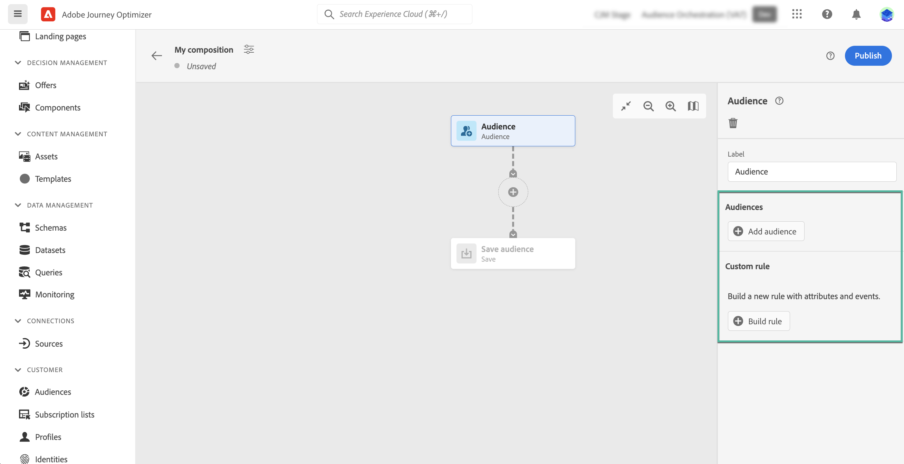
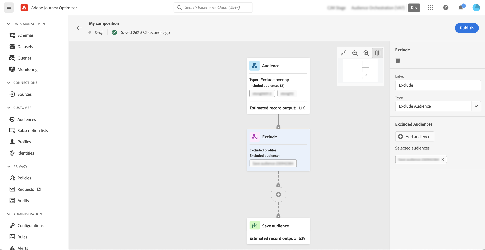

# 使用组合画布 {#composition-canvas}

>[!BEGINSHADEBOX]

此文档提供了有关如何在 Adobe Journey Optimizer 中使用受众组合的详细信息。如果您没有使用 Adobe Journey Optimizer，请[单击此处](https://experienceleague.adobe.com/docs/experience-platform/segmentation/ui/audience-composition.html?lang=zh-Hans){target="_blank"}。

>[!ENDSHADEBOX]

受众构成提供了一个可视画布，通过它可创建受众并使用各种活动（拆分、扩充等）。

在画布中构建受众的步骤如下：

1. [定义起始受众](#starting-audience)
1. [添加一个或多个活动](#action-activities)
1. [将结果保存到新受众中](#save)

## 选择起始受众 {#starting-audience}

创建构成的第一步是选择一个或多个现有受众作为构成的基础。

1. 选择 **[!UICONTROL 受众]** 活动，然后为活动提供标签。

1. 选择要定位的受众：

   * 单击 **[!UICONTROL 添加受众]** 按钮以选择一个或多个现有受众，
   * 单击 **[!UICONTROL 生成规则]** 按钮，以使用创建新的受众定义 [分段服务](https://experienceleague.adobe.com/docs/experience-platform/segmentation/ui/overview.html?lang=zh-Hans).

   

1. 如果选择多个受众，请指定应如何合并这些受众的用户档案：

* **[!UICONTROL 并集]**：包括选定受众的所有用户档案，
* **[!UICONTROL 交叉]**：包含所有选定受众通用的用户档案，
* **[!UICONTROL 排除重叠]**：仅包含属于某个受众的用户档案。 属于多个受众的用户档案将不会包含在内。

在本例中，我们要定位属于金牌和银牌受众的所有用户档案。

选择受众后，活动底部会显示预计的用户档案数。

## 添加活动 {#action-activities}

选择起始受众后添加活动以优化您的选择。

为此，请单击构成路径上的+按钮，然后选择所需的活动。 右侧窗格将打开，允许您配置新添加的活动。

可用的活动包括：

* [受众](#audience)：包括属于一个或多个现有受众的其他配置文件，
* [排除](#exclude)：排除属于现有受众的用户档案，或根据特定属性排除用户档案，
* [扩充](#enrich)：使用来自Adobe Experience Platform数据集的其他属性丰富受众，
* [排名](#rank)：根据特定属性对配置文件进行排名，指定要保留并包含在构成中的配置文件数，
* [Split](#split)：根据随机百分比或属性将合成划分为多个路径。

您可以添加任意数量的 **[!UICONTROL 受众]** 和 **[!UICONTROL 排除]** 构成中所需的活动。 但是，之后无法添加其他活动 **[!UICONTROL 排名]** 和 **[!UICONTROL Split]** 活动。

您可以随时通过单击右窗格中的删除按钮从画布中删除活动。  如果要删除的活动是构成中其他活动的父项，则会显示一条消息，允许您指定是只删除选定活动，还是删除其所有子活动。

### 受众活动 {#audience}

>[!CONTEXTUALHELP]
>id="ajo_ao_audience"
>title="受众活动"
>abstract="“受众活动”让您可以在组合中包括属于现有受众的配置文件。"

>[!CONTEXTUALHELP]
>id="ajo_ao_merge_types"
>title="合并类型"
>abstract="指定应如何合并所选受众的配置文件。"

此 **[!UICONTROL 受众]** 利用活动，可在构成中包含属于现有受众的其他用户档案。

此活动的配置与 [受众活动](#starting-audience).

### 排除活动 {#exclude}

>[!CONTEXTUALHELP]
>id="ajo_ao_exclude_type"
>title="排除类型"
>abstract="使用“排除受众类型”排除属于现有受众的配置文件。“使用属性类型排除”让您可以根据特定属性来排除配置文件。"

>[!CONTEXTUALHELP]
>id="ajo_ao_exclude"
>title="排除活动"
>abstract="“排除活动”让您可以通过选择现有受众或使用规则，从组合中排除配置文件。"

此 **[!UICONTROL 排除]** 利用活动，可从构成中排除用户档案。 提供了两种类型的排除项：

* **[!UICONTROL 排除受众]**：排除属于现有受众的用户档案。

  单击 **[!UICONTROL 添加受众]** 按钮，然后选择要排除的受众。

  

* **[!UICONTROL 使用属性排除]**：根据特定属性排除用户档案。

  选择要查找的属性，然后指定要排除的值。 在本例中，我们从家庭地址在日本的用户档案中排除。

  >[!NOTE]
  >
  >只能指定一个排除值。

  

### 扩充活动 {#enrich}

>[!CONTEXTUALHELP]
>id="ajo_ao_enrich"
>title="扩充活动"
>abstract="使用“扩充活动”通过来自 Adobe Experience Platform 数据集的其他属性来扩充您的受众。例如，您可以添加与所购买产品相关的信息（例如名称、价格或制造商 ID），并利用这些信息对发送给受众的投放内容进行个性化设置。"

>[!CONTEXTUALHELP]
>id="ajo_ao_enrich_dataset"
>title="扩充数据集"
>abstract="选择包含要与受众关联的数据的扩充数据集。"

>[!CONTEXTUALHELP]
>id="ajo_ao_enrich_criteria"
>title="扩充标准"
>abstract="选择要用作源数据集（即受众）与扩充数据集之间的合并关键项的字段。"

>[!CONTEXTUALHELP]
>id="ajo_ao_enrich_attributes"
>title="扩充属性"
>abstract="从扩充数据集中选择一个或多个属性以关联到受众。组合在发布之后，这些属性就会与受众相关联，并且可以在 Journey Optimizer 营销活动中用来提供个性化的投放。"

此 **[!UICONTROL 扩充]** 利用活动，可使用来自Adobe Experience Platform数据集的其他属性扩充受众。 例如，您可以添加与所购买产品相关的信息（例如名称、价格或制造商 ID），并利用这些信息对发送给受众的投放内容进行个性化设置。

使用时，请注意以下限制 **[!UICONTROL 扩充]** 活动：

* **数据集** 要扩充，则必须是记录类型（与事件类型相反），并且它们不能是系统数据集，也不能标记为用户档案。 它们必须小于1GB。
* **扩充支持1:1联接**. 这意味着，如果联接键在扩充数据集上具有多个匹配项，则系统会选取一个匹配项，并将其用于1:1联接。
* **可以在RTCDP目标中激活受众**，但其扩充属性（如果有）不能。

要配置活动，请执行以下步骤：

1. 选择 **[!UICONTROL 扩充数据集]** 包含要与受众关联的数据。

1. 在 **[!UICONTROL 扩充条件]** 部分，选择要用作源数据集（即受众）和扩充数据集之间的协调键的字段。 在本例中，我们使用购买产品的ID作为协调密钥。

1. 单击 **[!UICONTROL 添加属性]** 按钮，然后从扩充数据集中选择一个或多个要关联到受众的属性。

   

发布构成后，选定的属性即与受众关联，并可在营销活动中用于个性化投放。

### 排名活动 {#rank}

>[!CONTEXTUALHELP]
>id="ajo_ao_ranking"
>title="排名活动"
>abstract="“排名活动”允许您根据特定属性对配置文件进行排名并将它们包含在组合中。例如，包含忠诚度积分最高的 50 个配置文件。"

>[!CONTEXTUALHELP]
>id="ajo_ao_rank_profilelimit_text"
>title="添加配置文件限制"
>abstract="打开此选项以指定要包含在组合中的配置文件最大数量。"

此 **[!UICONTROL 排名]** 利用活动，可根据特定属性对用户档案进行排名，并将其包含在合成中。 例如，您可以包含50个用户档案，其中具有最高的会员积分。

1. 选择要查找的属性并指定排名顺序（升序或降序）。

   >[!NOTE]
   >
   >您可以选择具有以下数据类型的属性：整数、数字、短整数 <!--(other?)-->

1. 切换 **[!UICONTROL 添加配置文件限制]** 选项，并指定构成中要包含的最大配置文件数。

   

### 拆分活动 {#split}

<!-- [!CONTEXTUALHELP]
>id="ajo_ao_control_group_text"
>title="Control Group"
>abstract="Use control groups to isolate a portion of the profiles. This allows you to measure the impact of a marketing activity and make a comparison with the behavior of the rest of the population."-->

>[!CONTEXTUALHELP]
>id="ajo_ao_split"
>title="拆分活动"
>abstract="“拆分活动”让您可以将组合拆分成多个路径。在发布组合时，一个受众将在 Adobe Experience Platform 针对每个路径进行保存。"

>[!CONTEXTUALHELP]
>id="ajo_ao_split_type"
>title="拆分类型"
>abstract="使用“百分比拆分类型”可将配置文件随机拆分到多个路径中。“属性拆分类型”让您可以根据特定属性来拆分配置文件。"

>[!CONTEXTUALHELP]
>id="ajo_ao_split_otherprofiles_text"
>title="其他配置文件"
>abstract="打开此选项可以创建一个附加路径，其中包含与其他路径中指定的任意条件都不匹配的剩余配置文件。"

此 **[!UICONTROL Split]** 利用活动，可将合成划分为多个路径。

此操作会自动添加 **[!UICONTROL 保存]** 活动。 在发布组合时，一个受众将在 Adobe Experience Platform 针对每个路径进行保存。

有两种类型的拆分操作可用：

* **[!UICONTROL 百分比拆分]**：将用户档案随机拆分为两个或更多路径。 例如，可将用户档案拆分为2个各自为50%的不同路径。 <!--and add an additional path for control group.-->

  

* **[!UICONTROL 属性拆分]**：根据特定属性拆分用户档案。 在本例中，我们将根据用户档案的类型首选项来分割用户档案。

  

  要设置基于属性的拆分活动，请执行以下步骤：

   1. 单击位于旁边的按钮 **[!UICONTROL 属性]** 字段以选择要用作拆分条件的属性。
   1. 根据需要添加任意数量的路径。 对于每个路径，提供一个标签并指定将用于确定哪些配置文件应包含在该特定路径中的值。

      >[!NOTE]
      >
      >只能为每个路径指定一个值。

   1. 打开 **[!UICONTROL 其他配置文件]** 选项，用于创建具有不符合其他路径中指定的任何条件的剩余配置文件的附加路径。

## 保存您的受众 {#save}

配置将保存到Adobe Experience Platform中的生成的受众。

要执行此操作，请选择 **[!UICONTROL 保存受众]** 每个路径末尾的活动中，指定要创建的新受众的名称。

合成准备就绪后，即可发布。 [了解如何创建合成](create-compositions.md)
