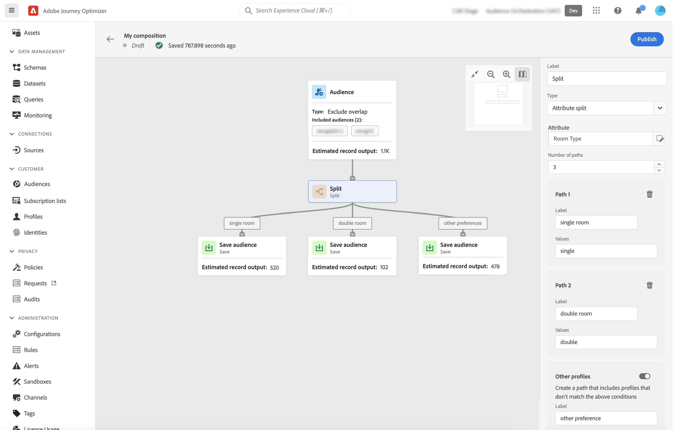

# 使用组合画布 {#composition-canvas}

>[!BEGINSHADEBOX]

此文档提供了有关如何在 Adobe Journey Optimizer 中使用受众组合的详细信息。如果您没有使用Adobe Journey Optimizer，[单击此处](https://experienceleague.adobe.com/docs/experience-platform/segmentation/ui/audience-composition.html?lang=zh-Hans){target="_blank"}。

>[!ENDSHADEBOX]

受众构成提供了一个可视画布，允许您创建受众并使用各种活动（拆分、扩充等）。

在画布中构建受众的步骤如下：

1. [定义起始受众](#starting-audience)
1. [添加一个或多个活动](#action-activities)
1. [将结果保存到新受众](#save)

## 选择起始受众 {#starting-audience}

创建构成的第一步是选择一个或多个现有受众作为构成的基础。

1. 选择&#x200B;**[!UICONTROL 受众]**&#x200B;活动，然后提供该活动的标签。

1. 选择要定位的受众：

   * 单击&#x200B;**[!UICONTROL 添加受众]**&#x200B;按钮以选择一个或多个现有受众，
   * 单击&#x200B;**[!UICONTROL 生成规则]**&#x200B;按钮以使用[分段服务](https://experienceleague.adobe.com/docs/experience-platform/segmentation/ui/overview.html?lang=zh-Hans)创建新的受众定义。

   

1. 如果选择多个受众，请指定应如何合并这些受众的用户档案：

* **[!UICONTROL 联合]**：包含选定受众的所有用户档案，
* **[!UICONTROL 交集]**：包含所有选定受众通用的配置文件，
* **[!UICONTROL 排除重叠]**：仅包含属于其中一个受众的用户档案。 属于多个受众的用户档案将不会包含在内。

在本例中，我们要定位属于金牌和银牌受众的所有用户档案。

选择受众后，活动底部会显示预计的用户档案数。

## 添加活动 {#action-activities}

选择起始受众后添加活动以优化您的选择。

为此，请单击构成路径上的+按钮，然后选择所需的活动。 右侧窗格将打开，允许您配置新添加的活动。

可用的活动包括：

* [受众](#audience)：包含属于一个或多个现有受众的其他配置文件，
* [排除](#exclude)：排除属于现有受众的用户档案，或根据特定属性排除用户档案，
* [扩充](#enrich)：使用来自Adobe Experience Platform数据集的其他属性扩充您的受众，
* [排名](#rank)：根据特定属性对配置文件进行排名，指定要保留的配置文件数并将其包含在合成中，
* [拆分](#split)：根据随机百分比或属性将合成划分为多个路径。

您可以在组合中添加所需数量的&#x200B;**[!UICONTROL 受众]**&#x200B;和&#x200B;**[!UICONTROL 排除]**&#x200B;活动。 但是，在&#x200B;**[!UICONTROL 排名]**&#x200B;和&#x200B;**[!UICONTROL 拆分]**&#x200B;活动之后无法添加其他活动。

您可以随时通过单击右窗格中的删除按钮从画布中删除活动。  如果要删除的活动是构成中其他活动的父项，则会显示一条消息，允许您指定是只删除选定活动，还是删除其所有子活动。

### 受众活动 {#audience}

>[!CONTEXTUALHELP]
>id="ajo_ao_audience"
>title="受众活动"
>abstract="“受众活动”让您可以在组合中包括属于现有受众的轮廓。"

>[!CONTEXTUALHELP]
>id="ajo_ao_merge_types"
>title="合并类型"
>abstract="指定应如何合并所选受众的轮廓。"

**[!UICONTROL 受众]**&#x200B;活动允许您在构成中包含属于现有受众的其他配置文件。

此活动的配置与起始[受众活动](#starting-audience)相同。

### 排除活动 {#exclude}

>[!CONTEXTUALHELP]
>id="ajo_ao_exclude_type"
>title="排除类型"
>abstract="使用“排除受众类型”排除属于现有受众的轮廓。“使用属性类型排除”让您可以根据特定属性来排除轮廓。"

>[!CONTEXTUALHELP]
>id="ajo_ao_exclude"
>title="排除活动"
>abstract="“排除活动”让您可以通过选择现有受众或使用规则，从组合中排除轮廓。"

**[!UICONTROL 排除]**&#x200B;活动允许您从组合中排除用户档案。 提供了两种类型的排除项：

* **[!UICONTROL 排除受众]**：排除属于现有受众的用户档案。

  单击&#x200B;**[!UICONTROL 添加受众]**&#x200B;按钮，然后选择要排除的受众。

  

* **[!UICONTROL 使用属性排除]**：根据特定属性排除配置文件。

  选择要查找的属性，然后指定要排除的值。 在本例中，我们从家庭地址在日本的用户档案中排除。

  >[!NOTE]
  >
  >只能指定一个排除值。

  

### 扩充活动 {#enrich}

>[!CONTEXTUALHELP]
>id="ajo_ao_enrich"
>title="扩充活动"
>abstract="使用“扩充活动”通过来自 Adobe Experience Platform 数据集的其他属性来扩充您的受众。例如，您可以添加与所购买产品相关的信息（例如名称、价格或制造商 ID），并利用这些信息对发送给受众的投放内容进行个性化设置。"

>[!CONTEXTUALHELP]
>id="ajo_ao_enrich_dataset"
>title="扩充数据集"
>abstract="选择包含要与受众关联的数据的扩充数据集。"

>[!CONTEXTUALHELP]
>id="ajo_ao_enrich_criteria"
>title="扩充标准"
>abstract="选择要用作源数据集（即受众）与扩充数据集之间的合并关键项的字段。"

>[!CONTEXTUALHELP]
>id="ajo_ao_enrich_attributes"
>title="扩充属性"
>abstract="从扩充数据集中选择一个或多个属性以关联到受众。组合在发布之后，这些属性就会与受众相关联，并且可以在 Journey Optimizer 营销活动中用来提供个性化的投放。"

利用&#x200B;**[!UICONTROL Extends]**&#x200B;活动，可使用来自Adobe Experience Platform数据集的其他属性扩充受众。 例如，您可以添加与所购买产品相关的信息（例如名称、价格或制造商 ID），并利用这些信息对发送给受众的投放内容进行个性化设置。

在使用&#x200B;**[!UICONTROL Extends]**&#x200B;活动时，请注意以下限制：

* 用于扩充的&#x200B;**数据集**&#x200B;必须是记录类型（相对于事件类型），并且不能是系统数据集，也不能标记为配置文件。 它们必须小于1GB。
* **扩充支持1:1联接**。 这意味着，如果联接键在扩充数据集上具有多个匹配项，则系统会选取一个匹配项，并将其用于1:1联接。
* **可以在RTCDP目标**&#x200B;中激活受众，但无法激活其扩充属性（如果有）。
* 扩充属性尚未与策略实施服务集成。 因此，您应用于扩充属性的任何数据使用标签都不会在Journey Optimizer营销活动或历程中强制执行。

要配置活动，请执行以下步骤：

1. 选择包含要与受众关联的数据的&#x200B;**[!UICONTROL 扩充数据集]**。

1. 在&#x200B;**[!UICONTROL 扩充标准]**&#x200B;部分中，选择要用作源数据集（即受众）与扩充数据集之间协调键的字段。 在本例中，我们使用购买产品的ID作为协调密钥。

1. 单击&#x200B;**[!UICONTROL 添加属性]**&#x200B;按钮，然后从扩充数据集中选择一个或多个要关联到受众的属性。

   

发布构成后，选定的属性即与受众关联，并可在营销活动中用于个性化投放。

### 排名活动 {#rank}

>[!CONTEXTUALHELP]
>id="ajo_ao_ranking"
>title="排名活动"
>abstract="“排名活动”允许您根据特定属性对轮廓进行排名并将它们包含在组合中。例如，包含忠诚度积分最高的 50 个轮廓。"

>[!CONTEXTUALHELP]
>id="ajo_ao_rank_profilelimit_text"
>title="添加轮廓限制"
>abstract="打开此选项以指定要包含在组合中的轮廓最大数量。"

**[!UICONTROL 排名]**&#x200B;活动允许您根据特定属性对配置文件进行排名，并将其包含在合成中。 例如，您可以包含50个用户档案，其中具有最高的会员积分。

1. 选择要查找的属性并指定排名顺序（升序或降序）。

   >[!NOTE]
   >
   >您可以选择具有以下数据类型的属性：整数、数字、短整数<!--(other?)-->

1. 打开&#x200B;**[!UICONTROL 添加配置文件限制]**&#x200B;选项，并指定要包含在构成中的配置文件的最大数量。

   

### “拆分”活动 {#split}

<!-- [!CONTEXTUALHELP]
>id="ajo_ao_control_group_text"
>title="Control Group"
>abstract="Use control groups to isolate a portion of the profiles. This allows you to measure the impact of a marketing activity and make a comparison with the behavior of the rest of the population."-->

>[!CONTEXTUALHELP]
>id="ajo_ao_split"
>title="拆分活动"
>abstract="“拆分活动”让您可以将组合拆分成多个路径。在发布组合时，一个受众将在 Adobe Experience Platform 针对每个路径进行保存。"

>[!CONTEXTUALHELP]
>id="ajo_ao_split_type"
>title="拆分类型"
>abstract="使用“百分比拆分类型”可将轮廓随机拆分到多个路径中。“属性拆分类型”让您可以根据特定属性来拆分轮廓。"

>[!CONTEXTUALHELP]
>id="ajo_ao_split_otherprofiles_text"
>title="其他轮廓"
>abstract="打开此选项可以创建一个附加路径，其中包含与其他路径中指定的任意条件都不匹配的剩余轮廓。"

**[!UICONTROL 拆分]**&#x200B;活动允许您将合成划分为多个路径。

此操作会在每个路径的末尾自动添加&#x200B;**[!UICONTROL Save]**&#x200B;活动。 在发布组合时，一个受众将在 Adobe Experience Platform 针对每个路径进行保存。

有两种类型的拆分操作可用：

* **[!UICONTROL 百分比拆分]**：将用户档案随机拆分为两个或更多路径。 例如，可将用户档案拆分为2个各自为50%的不同路径。<!--and add an additional path for control group.-->

  

* **[!UICONTROL 属性拆分]**：根据特定属性拆分配置文件。 在本例中，我们将根据用户档案的类型首选项来分割用户档案。

  

  要设置基于属性的拆分活动，请执行以下步骤：

   1. 单击&#x200B;**[!UICONTROL 属性]**&#x200B;字段旁边的按钮以选择要用作拆分条件的属性。
   1. 根据需要添加任意数量的路径。 对于每个路径，提供一个标签并指定将用于确定哪些配置文件应包含在该特定路径中的值。

      >[!NOTE]
      >
      >只能为每个路径指定一个值。

   1. 打开&#x200B;**[!UICONTROL 其他配置文件]**&#x200B;选项，使用不符合其他路径中指定的任何条件的剩余配置文件创建其他路径。

## 保存您的受众 {#save}

配置将保存到Adobe Experience Platform中的生成的受众。

为此，请选择每个路径末尾的&#x200B;**[!UICONTROL 保存受众]**&#x200B;活动，然后指定要创建的新受众的名称。

合成准备就绪后，即可发布。 [了解如何创建合成](create-compositions.md)
