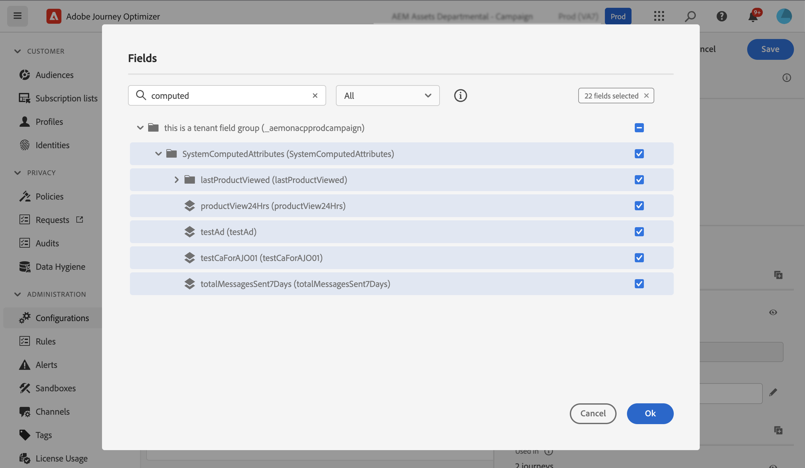

# 使用计算属性 {#computed-attributes}

计算属性将各个行为事件汇总到Adobe Experience Platform上可用的计算配置文件属性中。 这些属性基于摄取到Adobe Experience Platform中的启用配置文件的体验事件数据集，并充当存储在客户配置文件中的聚合数据点。

每个计算属性是一个配置文件属性，您可以在历程和营销活动中利用它进行分段、个性化和激活。 这种简化增强了向客户提供及时且有意义的个性化体验的能力。

>[!NOTE]
>
>要访问计算属性，请确保您具有适当的权限（**查看计算属性**&#x200B;和&#x200B;**管理计算属性**）。

## 创建计算属性 {#manage}

要创建计算属性，请浏览到左侧的&#x200B;**[!UICONTROL 配置文件]**&#x200B;菜单中的&#x200B;**[!UICONTROL 计算属性]**&#x200B;选项卡。

在此屏幕中，您可以通过构建规则来构建计算属性，这些规则将事件属性、聚合函数与指定的回顾期间结合使用。 例如，您可以计算过去三个月中进行的购买总数，确定上周未购买的用户档案查看的最新项目，或统计每个用户档案累计的总奖励积分。

规则准备就绪后，发布计算属性以将其用于其他下游服务，包括Journey Optimizer。

有关创建和管理计算属性的详细信息，请参阅[计算属性文档](https://experienceleague.adobe.com/docs/experience-platform/profile/computed-attributes/overview.html?lang=zh-Hans)

## 将计算属性添加到Adobe Experience Platform数据源 {#source}

要利用Journey Optimizer中的计算属性，请将其添加到Journey Optimizer **Experience Platform**&#x200B;数据源。

Adobe Experience Platform数据源定义与Adobe实时客户个人资料的连接。 此数据源从实时客户资料服务中检索资料数据和体验事件数据。

要将计算属性添加到数据源，请执行以下步骤：

1. 浏览至左侧的&#x200B;**[!UICONTROL 配置]**&#x200B;菜单，然后单击&#x200B;**[!UICONTROL 数据源]**&#x200B;卡。

1. 选择&#x200B;**[!UICONTROL Experience Platform]**&#x200B;数据源。

   

1. 添加包含所有已创建的计算属性的&#x200B;**[!UICONTROL SystemComputedAttributes]**&#x200B;字段组。

   

计算属性现在可以在Journey Optimizer中使用。 [了解如何在Journey Optimizer中使用计算属性](#use)

有关将字段组添加到Adobe Experience Platform数据源的详细信息，请参阅[此部分](../datasource/adobe-experience-platform-data-source.md)。

## 在Journey Optimizer中使用计算属性 {#use}

>[!NOTE]
>
>开始之前，请确保已将计算属性添加到Adobe Experience Platform数据源。 [在本节](#source)中了解详情。

计算属性在Journey Optimizer中提供多种功能。 将它们用于各种目的，例如个性化消息内容、创建新受众或根据特定计算属性拆分历程。 例如，通过在Condition活动中添加单个计算属性，根据用户档案在最近三周内的总购买量拆分历程路径。 您还可以通过显示每个用户档案最近查看的项目来个性化电子邮件。

由于计算属性是在您的配置文件合并架构上创建的配置文件属性字段，请从&#x200B;**SystemComputedAttributes**&#x200B;字段组中的个性化编辑器访问它们。 从此处，将计算属性添加到表达式中，将其视为任何其他配置文件属性来执行所需的操作。

