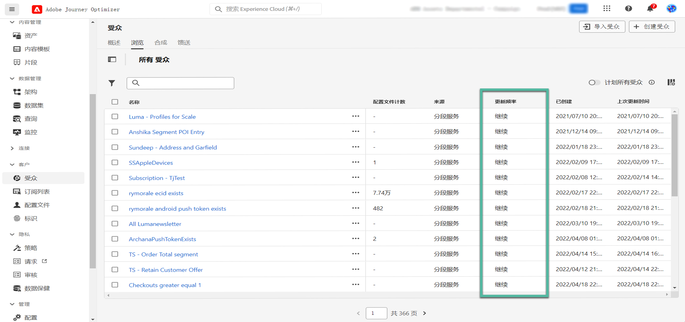

# 生成区段定义 {#build-segments}

>[!CONTEXTUALHELP]
>id="ajo_ao_create_rule"
>title="创建规则"
>abstract="通过生成规则创建方法，可使用 Adobe Experience Platform Audience Segmentation Service 创建新的受众定义。"

## 创建区段定义 {#create}

在本例中，我们将构建受众，以定位生活在亚特兰大、旧金山或西雅图且出生于1980年之后的所有客户。 所有这些客户应在过去7天内购买了。

➡️[在此视频中了解如何创建受众](#video-segment)

1. 从&#x200B;**[!UICONTROL 受众]**&#x200B;菜单中，单击&#x200B;**[!UICONTROL 创建受众]**&#x200B;按钮，然后选择&#x200B;**[!UICONTROL 生成规则]**。

   

   利用区段定义屏幕，可配置定义受众所需的所有字段。 了解如何在[Segmentation Service文档](https://experienceleague.adobe.com/docs/experience-platform/segmentation/ui/overview.html?lang=zh-Hans){target="_blank"}中配置受众。

   

1. 在&#x200B;**[!UICONTROL 受众属性]**&#x200B;窗格中，提供受众的名称和描述（可选）。

   

1. 将所需字段从左窗格拖放到中心工作区，然后根据需要进行配置。

   区段定义的基本构建块为&#x200B;**属性**&#x200B;和&#x200B;**事件**。 此外，现有受众中包含的属性和事件还可以用作新定义的组件。 [在分段服务文档中了解详情](https://experienceleague.adobe.com/en/docs/experience-platform/segmentation/ui/segment-builder#building-blocks){target="_blank"}

   >[!NOTE]
   >
   >请注意，左窗格中可用的字段因为您的组织配置&#x200B;**XDM Individual Profile**&#x200B;和&#x200B;**XDM ExperienceEvent**&#x200B;架构的方式而异。  在[Experience Data Model (XDM)文档](https://experienceleague.adobe.com/docs/experience-platform/xdm/home.html){target="_blank"}中了解详情。

   

   在此示例中，我们需要依赖&#x200B;**Attributes**&#x200B;和&#x200B;**Events**&#x200B;字段来构建受众：

   * **属性**：出生于1980年之后的亚特兰大、旧金山或西雅图的用户档案。

     

   * **事件**：过去7天内购买的用户档案。

     

1. 当您在工作区中添加和配置新字段时，**[!UICONTROL 受众属性]**&#x200B;窗格会自动更新，其中包含有关属于受众的估计配置文件的信息。

   

1. 受众准备就绪后，单击&#x200B;**[!UICONTROL 保存]**。 它显示在Adobe Experience Platform受众的列表中。 请注意，搜索栏可帮助您搜索列表中的特定受众。

受众现在可以在您的历程中使用。 有关详细信息，请参阅[此部分](../audience/about-audiences.md)。

## 受众评估方法 {#evaluation-method-in-journey-optimizer}

在Adobe Journey Optimizer中，使用下面三种评估方法之一从区段定义生成受众。

+++ 流式客户细分

当新数据流入系统时，受众的用户档案列表会实时保持最新。

流式分段是一个持续的数据选择过程，会更新区段以响应用户活动。构建区段定义并保存生成的受众后，该区段定义将应用于传入 Journey Optimizer 的数据。这意味着当个人资料数据发生变化时，将会在受众中添加或删除个人，从而确保您的目标受众始终相关。 [在Adobe Expe中了解详情](https://experienceleague.adobe.com/docs/experience-platform/segmentation/ui/streaming-segmentation.html){target="_blank"}

>[!IMPORTANT]
>
>自2024年11月1日起，流式分段不再支持使用Journey Optimizer跟踪和反馈数据集中的&#x200B;**发送**&#x200B;和&#x200B;**打开**&#x200B;事件。
>
>* 此更改适用于所有客户沙盒和组织。
>* 仅发送和打开事件受到影响：点击次数和其他跟踪事件仍可用于流式分段。
>* 此更改仅适用于流式客户细分。 发送和打开事件仍可以在批处理区段中使用，但如果包含在流区段中，则将批处理评估它们。 此外，发送事件导致的排除事件和退回/延迟事件也会受此更改的影响。
>* 不影响跟踪数据收集。 将继续像往常一样收集“发送”和“打开”事件。
>* 历程中的反应事件不受此更改的影响。

+++

+++ 批次分段

每24小时评估一次受众的用户档案列表。

批量分段是流式分段的替代方法，是通过区段定义一次性处理所有轮廓数据的过程。这会创建受众的快照，可保存和导出以供使用。但是，与流式分段不同，批量分段不会持续实时更新受众列表，并且在下一次批量处理之前，批量处理流程之后输入的新数据不会反映在受众中。 尝试强制立即更新不会覆盖每日周期。 要立即进行增量更新，请考虑使用流式或按需分段选项。

有关更多详细信息，请参阅[Adobe Experience Platform分段服务文档](https://experienceleague.adobe.com/docs/experience-platform/segmentation/home.html#batch){target="_blank"}

+++

+++ 边缘分段

Edge分段功能能够在Adobe Experience Platform的边缘[&#128279;](https://experienceleague.adobe.com/docs/experience-platform/edge/home.html){target="_blank"}上即时评估中的区段，从而启用同页和下一页个性化用例。 当前只有选定的查询类型可使用边缘分段进行评估。 有关更多详细信息，请参阅[Adobe Experience Platform分段服务文档](https://experienceleague.adobe.com/docs/experience-platform/segmentation/ui/edge-segmentation.html#query-types){target="_blank"}

+++

如果您知道要使用哪种评估方法，请使用下拉列表选择它。 您还可以单击带有放大镜的浏览图标文件夹图标，查看可用区段定义评估方法的列表。 有关更多详细信息，请参阅[Adobe Experience Platform分段服务文档](https://experienceleague.adobe.com/docs/experience-platform/segmentation/ui/segment-builder.html#segment-properties){target="_blank"}

<!--The determination between batch segmentation and streaming segmentation is made by the system for each audience, based on the complexity and the cost of evaluating the segment definition rule. You can view the evaluation method for each audience in the **[!UICONTROL Evaluation method]** column of the audience list.
    

>[!NOTE]
>
>If the **[!UICONTROL Evaluation method]** column does not display, you  need to add it using configuration button on the top right of the list.-->

首次定义受众后，用户档案将在符合条件时添加到受众。 从先前数据回填受众最多可能需要 24 小时。回填受众后，受众会持续保持最新状态，并始终准备好用于定位。

## 灵活的受众评估 {#flexible}

Adobe Experience Platform Audience Portal允许您根据需要对所选受众运行分段作业，确保在将受众定位到Journey Optimizer历程和营销活动之前始终具有最新的受众数据。

通过灵活的受众评估，您可以：

1. 根据最新数据创建新的区段。
1. 实时评估受众以确保准确性。 要实现此目的，请选择要评估的受众，然后选择“评估受众”，前提是受众符合特定标准（例如，基于人员的分段服务来源）。
1. 在Adobe Journey Optimizer营销活动或历程中使用评估后的受众进行精确定位。

您一次最多可以评估20个受众，不符合条件的受众将被自动排除。 有关更多详细信息，请参阅[Adobe Experience Platform Segmentation Service文档](https://experienceleague.adobe.com/en/docs/experience-platform/segmentation/ui/audience-portal#flexible-audience-evaluation)。

## 操作方法视频{#video-segment}

了解 Journey Optimizer 如何使用规则生成受众，并了解如何使用属性、事件和现有受众创建受众。

>[!VIDEO](https://video.tv.adobe.com/v/3425020?quality=12)
