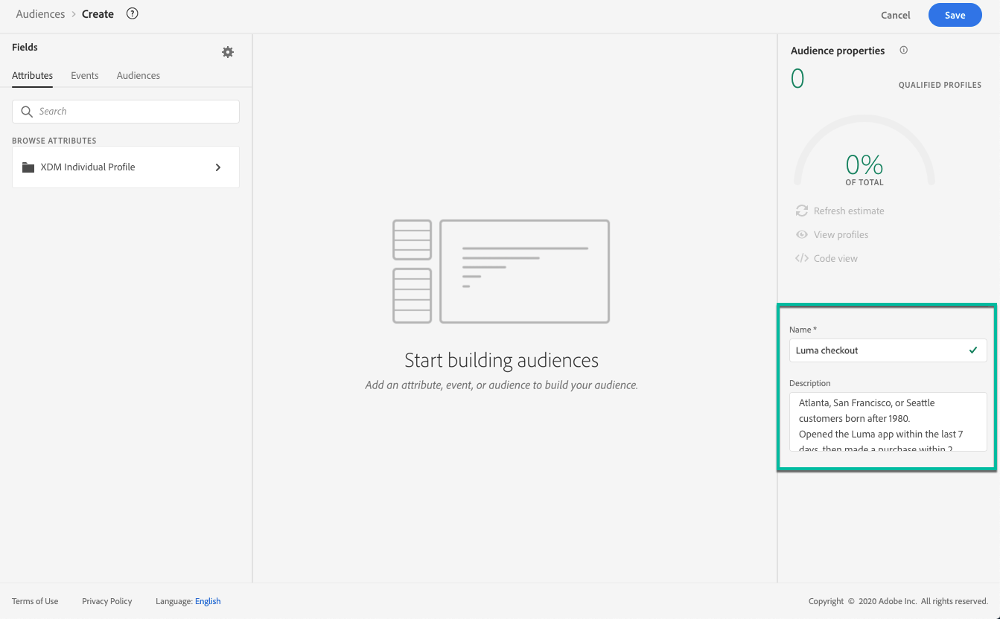

# 生成区段定义 {#build-segments}

>[!CONTEXTUALHELP]
>id="ajo_ao_create_rule"
>title="创建规则"
>abstract="通过构建规则创建方法，可使用 Adobe Experience Platform Audience Segmentation Service 创建新的受众定义。"

在本例中，我们将构建受众，以定位生活在亚特兰大、旧金山或西雅图且出生于1980年之后的所有客户。 所有这些客户应在过去7天内打开Luma应用程序，然后在打开应用程序后2小时内购买该应用程序。

➡️[在此视频中了解如何创建受众](#video-segment)

1. 从&#x200B;**[!UICONTROL 受众]**&#x200B;菜单中，单击&#x200B;**[!UICONTROL 创建受众]**&#x200B;按钮，然后选择&#x200B;**[!UICONTROL 生成规则]**。

   

   利用区段定义屏幕，可配置定义受众所需的所有字段。 了解如何在[Segmentation Service文档](https://experienceleague.adobe.com/docs/experience-platform/segmentation/ui/overview.html?lang=zh-Hans){target="_blank"}中配置受众。

   

1. 在&#x200B;**[!UICONTROL 受众属性]**&#x200B;窗格中，提供受众的名称和描述（可选）。

   

1. 将所需字段从左窗格拖放到中心工作区，然后根据需要进行配置。

   >[!NOTE]
   >
   >请注意，左窗格中可用的字段因为您的组织配置&#x200B;**XDM Individual Profile**&#x200B;和&#x200B;**XDM ExperienceEvent**&#x200B;架构的方式而异。  在[Experience Data Model (XDM)文档](https://experienceleague.adobe.com/docs/experience-platform/xdm/home.html){target="_blank"}中了解详情。

   

   在此示例中，我们需要依赖&#x200B;**Attributes**&#x200B;和&#x200B;**Events**&#x200B;字段来构建受众：

   * **属性**：在1980年之后出生的亚特兰大、旧金山或西雅图的用户档案

     

   * **事件**：在过去7天内打开了Luma应用程序，然后在打开应用程序后2小时内购买的用户档案。

     

     >[!NOTE]
     >
     >Adobe建议不要将“打开”和“发送”事件与流式分段一起使用。 相反，应使用真正的用户活动信号，如点击次数、购买次数或信标数据。 对于频率或抑制逻辑，请使用业务规则而不是发送事件。 [了解详情](about-audiences.md#open-and-send-event-guardrails)

1. 当您在工作区中添加和配置新字段时，**[!UICONTROL 受众属性]**&#x200B;窗格会自动更新，其中包含有关属于受众的估计配置文件的信息。

   

1. 受众准备就绪后，单击&#x200B;**[!UICONTROL 保存]**。 它显示在Adobe Experience Platform受众的列表中。 请注意，搜索栏可帮助您搜索列表中的特定受众。

受众现在可以在您的历程中使用。 有关详细信息，请参阅[此部分](../audience/about-audiences.md)。

## 操作方法视频{#video-segment}

了解 Journey Optimizer 如何使用规则生成受众，并了解如何使用属性、事件和现有受众创建受众。

>[!VIDEO](https://video.tv.adobe.com/v/3425020?quality=12)
