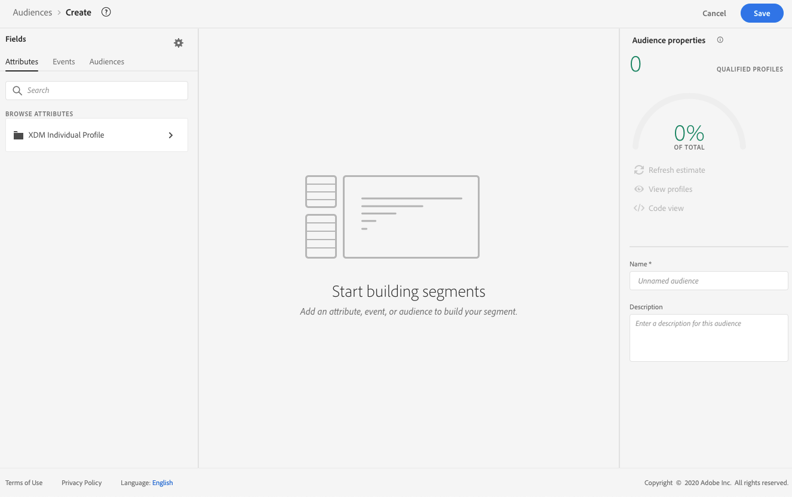

# 生成区段定义 {#build-segments}

>[!CONTEXTUALHELP]
>id="ajo_ao_create_rule"
>title="创建规则"
>abstract="通过构建规则创建方法，您可以使用 Adobe Experience Platform Audience Segmentation Service 创建新的受众定义。"

在本例中，我们将构建受众，以定位生活在亚特兰大、旧金山或西雅图且出生于1980年之后的所有客户。 所有这些客户应在过去7天内打开Luma应用程序，然后在打开应用程序后2小时内购买该应用程序。

➡️ [在此视频中了解如何创建受众](#video-segment)

1. 从 **[!UICONTROL 受众]** 菜单，单击 **[!UICONTROL 创建受众]** 按钮并选择 **[!UICONTROL 生成规则]**.

   

   利用区段定义屏幕，可配置定义受众所需的所有字段。 了解如何在中配置受众 [Segmentation Service文档](https://experienceleague.adobe.com/docs/experience-platform/segmentation/ui/overview.html?lang=zh-Hans){target="_blank"}.

   

1. 在 **[!UICONTROL 受众属性]** 窗格，为受众提供名称和描述（可选）。

   

1. 将所需字段从左窗格拖放到中心工作区，然后根据需要进行配置。

   >[!NOTE]
   >
   >请注意，左窗格中可用的字段会因 **XDM个人资料** 和 **XDM ExperienceEvent** 已为您的组织配置架构。  在中了解详情 [Experience Data Model (XDM)文档](https://experienceleague.adobe.com/docs/experience-platform/xdm/home.html){target="_blank"}.

   

   在本例中，我们需要依靠 **属性** 和 **活动** 用于构建受众的字段：

   * **属性**：生活在亚特兰大、旧金山或西雅图且出生于1980年后的用户档案

     

   * **活动**：过去7天内打开了Luma应用程序，然后在打开应用程序后2小时内购买的用户档案。

     

     >[!NOTE]
     >
     >Adobe建议不要将“打开”和“发送”事件与流式分段一起使用。 相反，应使用真正的用户活动信号，如点击次数、购买次数或信标数据。 对于频率或抑制逻辑，请使用业务规则而不是发送事件。 [了解详情](about-audiences.md#open-and-send-event-guardrails)

1. 当您在工作区中添加和配置新字段时， **[!UICONTROL 受众属性]** 窗格会自动更新有关属于受众的预计用户档案的信息。

   

1. 受众准备就绪后，单击 **[!UICONTROL 保存]**. 它显示在Adobe Experience Platform受众的列表中。 请注意，搜索栏可帮助您搜索列表中的特定受众。

受众现在可以在您的历程中使用。 有关详细信息，请参阅[此部分](../audience/about-audiences.md)。

## 操作方法视频{#video-segment}

了解 Journey Optimizer 如何使用规则生成受众，并了解如何使用属性、事件和现有受众创建受众。

>[!VIDEO](https://video.tv.adobe.com/v/3425020?quality=12)
