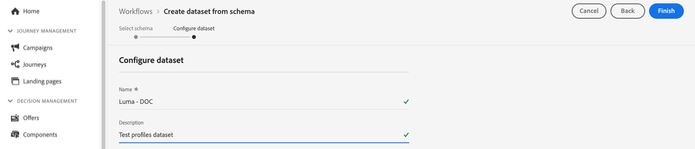
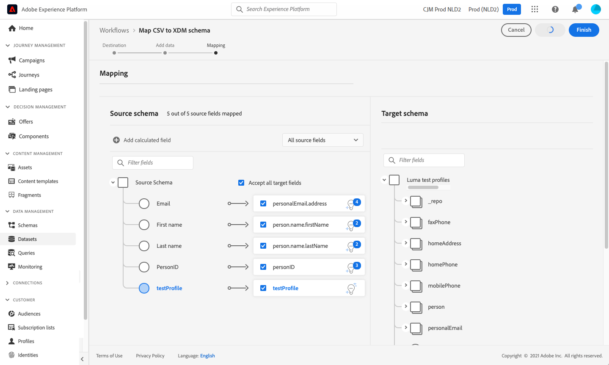

# 创建测试轮廓 {#create-test-profiles}

在历程中使用[测试模式](../building-journeys/testing-the-journey.md)时需要测试配置文件，并且需要[预览和测试您的内容](../content-management/preview-test.md)。

>[!NOTE]
>
>[!DNL Journey Optimizer]允许测试内容的不同变体，方法是预览内容并使用从CSV或JSON文件上传或手动添加的示例输入数据发送校样。 [了解如何使用示例输入数据测试内容](../test-approve/simulate-sample-input.md)

您可以通过[上传CSV文件](#create-test-profiles-csv)或使用[API调用](#create-test-profiles-api)来创建测试配置文件。 [!DNL Adobe Journey Optimizer]还提供了特定的[产品内用例](#use-case-1)以便于创建测试配置文件。

您可以将JSON文件上传到现有数据集。 有关详细信息，请参阅[数据摄取文档](https://experienceleague.adobe.com/docs/experience-platform/ingestion/tutorials/ingest-batch-data.html#add-data-to-dataset){target="_blank"}。

请注意，创建测试用户档案与在[!DNL Adobe Experience Platform]中创建常规用户档案类似。 有关详细信息，请参阅[实时客户资料文档](https://experienceleague.adobe.com/docs/experience-platform/profile/home.html?lang=zh-Hans){target="_blank"}。

➡️ [在此视频中了解如何创建测试配置文件](#video)

## 先决条件 {#test-profile-prerequisites}

要创建配置文件，您首先需要在Adobe [!DNL Journey Optimizer]中创建架构和数据集。

### 创建架构

要&#x200B;**创建架构**，请执行以下步骤：

1. 在“数据管理”菜单部分中，单击&#x200B;**[!UICONTROL 架构]**&#x200B;并选择&#x200B;**[!UICONTROL 创建架构]**&#x200B;按钮。

   

1. 选择&#x200B;**[!UICONTROL Standard]**&#x200B;作为架构创建选项。
1. 选择架构类型，例如&#x200B;**个人资料**，然后单击&#x200B;**下一步**。
   
1. 输入架构的名称，然后单击&#x200B;**完成**。
   
1. 在&#x200B;**字段组**&#x200B;部分的左侧，单击&#x200B;**添加**&#x200B;并选择适当的字段组。 确保添加&#x200B;**配置文件测试详细信息**字段组。
   
完成后，单击**[!UICONTROL 添加字段组]**：字段组的列表将显示在架构概述屏幕上。
   

   >[!NOTE]
   >
   >单击架构的名称可更新其属性。

1. 在字段列表中，单击要定义为主标识的字段。
   
1. 在&#x200B;**[!UICONTROL 字段属性]**&#x200B;右侧窗格中，检查&#x200B;**[!UICONTROL 标识]**&#x200B;和&#x200B;**[!UICONTROL 主标识]**&#x200B;选项并选择命名空间。 如果希望主标识是电子邮件地址，请选择&#x200B;**[!UICONTROL 电子邮件]**&#x200B;命名空间。 单击&#x200B;**[!UICONTROL 应用]**。
   
1. 选择架构并在&#x200B;**[!UICONTROL 架构属性]**&#x200B;窗格中启用&#x200B;**[!UICONTROL 配置文件]**选项。
   
1. 单击&#x200B;**保存**。

>[!NOTE]
>
>有关创建架构的更多信息，请参阅[XDM文档](https://experienceleague.adobe.com/docs/experience-platform/xdm/ui/resources/schemas.html#prerequisites){target="_blank"}。

### 创建数据集

然后，您需要&#x200B;**创建要在其中导入用户档案的数据集**。 执行以下步骤：

1. 浏览到&#x200B;**[!UICONTROL 数据集]**，然后单击&#x200B;**[!UICONTROL 创建数据集]**。
   
1. 选择&#x200B;**[!UICONTROL 从架构]**创建数据集。
   
1. 选择之前创建的架构，然后单击&#x200B;**[!UICONTROL 下一步]**。
   用于创建数据集的
1. 选择一个名称，然后单击&#x200B;**[!UICONTROL 完成]**。
   
1. 启用&#x200B;**[!UICONTROL 配置文件]**选项。
   

>[!NOTE]
>
> 有关创建数据集的详细信息，请参阅[目录服务文档](https://experienceleague.adobe.com/docs/experience-platform/catalog/datasets/user-guide.html#getting-started){target="_blank"}。

## 产品内用例{#use-case-1}

从[!DNL Adobe Journey Optimizer]主页中，您可以利用产品用例中的测试配置文件。 此用例有助于创建测试用户档案，用于在发布之前测试历程。


单击&#x200B;**[!UICONTROL 开始]**&#x200B;按钮开始实施用例。

需要以下信息：

1. **身份命名空间**： [身份命名空间](../audience/get-started-identity.md)用于唯一标识测试配置文件。 例如，如果电子邮件用于识别测试用户档案，则应选择身份命名空间&#x200B;**Email**。 如果唯一标识符是电话号码，则应选择身份命名空间&#x200B;**电话**。

2. **CSV文件**：包含要创建的测试配置文件列表的逗号分隔文件。 用例需要CSV文件的预定义格式，该文件包含要创建的测试用户档案列表。 文件中的每一行应按正确的顺序包含以下字段，如下所示：

   1. **人员ID**：测试配置文件的唯一标识符。 此字段的值应当反映所选的身份命名空间。 (例如，如果为身份命名空间选择了&#x200B;**电话**，则此字段的值应为电话号码。 同样，如果选择&#x200B;**电子邮件**，则此字段的值应为电子邮件)
   1. **电子邮件地址**：测试配置文件电子邮件地址。 （如果选择&#x200B;**电子邮件**&#x200B;作为身份命名空间，**人员ID**&#x200B;字段和&#x200B;**电子邮件地址**&#x200B;字段可能包含相同的值）
   1. **名字**：测试配置文件名字。
   1. **姓氏**：测试配置文件的姓氏。
   1. **城市**：测试配置文件居住城市
   1. **国家/地区**：测试用户档案居住国家/地区
   1. **性别**：测试个人资料性别。 可用值为&#x200B;**男**、**女**&#x200B;和&#x200B;**非指定**

选择身份命名空间并根据上述格式提供CSV文件后，选择右上角的&#x200B;**[!UICONTROL 运行]**&#x200B;按钮。 用例可能需要几分钟才能完成。 一旦用例完成处理和创建测试用户档案，将发送通知以通知用户。
>[!NOTE]
>
>测试配置文件可能会覆盖现有配置文件。 在执行用例之前，请确保CSV仅包含测试用户档案，并且它针对正确的沙盒执行。

<!-- Removed as asked in DOCAC-13605 AJO Test Profiles Using a Journey should be removed
## Turn a profile into a test profile{#turning-profile-into-test}

You can turn an existing profile into a test profile: you can update profiles attributes in the same way as when you create a profile. 

A simple way to do this is by using an **[!UICONTROL Update Profile]** action activity in a journey and change the **testProfile** boolean field from false to true.

Your journey will be composed of a **[!UICONTROL Read Audience]** and an **[!UICONTROL Update Profile]** activity. You first need to create an audience targeting the profiles you want to turn into test profiles. 

>[!NOTE]
>
> Since you will be updating the **testProfile** field, the chosen profiles must include this field. The related schema must have the **Profile test details** field group. See [this section](../audience/creating-test-profiles.md#create-test-profiles).

1. Browse to **Audiences**, then **Create audience**, in the top right.
     
1. Define a name for your audience and build the audience: choose the field(s) and value(s) to target the profiles you want.
     
1. Click **Save** and check that the profiles are correctly targeted by the audience.
     

    >[!NOTE]
    >
    > Audience calculation can take some time. Learn more about audiences in [this section](../audience/about-audiences.md).

1. Now create a new journey and start with a **[!UICONTROL Read Audience]** orchestration activity.
1. Choose the previously created audience and the namespace that your profiles use.
    
1. Add an **[!UICONTROL Update Profile]** action activity. 
1. Select the schema, the **testProfiles** field, the dataset and set the value to **True**. To perform this, in the **[!UICONTROL VALUE]** field, click the **Pen** icon on the right, select **[!UICONTROL Advanced mode]** and enter **true**.
    
1. Click **[!UICONTROL Publish]**.
1. In the **[!UICONTROL Audiences]** section, check that the profiles have been correctly updated.
    

    >[!NOTE]
    >
    > For more information on the **[!UICONTROL Update Profile]** activity, refer to [this section](../building-journeys/update-profiles.md).
-->

## 使用csv文件创建测试配置文件{#create-test-profiles-csv}

在[!DNL Adobe Experience Platform]中，您可以通过将包含不同配置文件字段的csv文件上传到数据集来创建配置文件。 这是最简单的方法。

1. 使用电子表格软件创建一个简单的csv文件。
1. 为每个必填字段添加一列。 确保添加主标识字段（上面示例中为“personID”），并将“testProfile”字段设置为“true”。
   
1. 为每个用户档案添加一行并填写每个字段的值。
   包含示例测试配置文件数据的
1. 将电子表格另存为csv文件。 确保使用逗号作为分隔符。
1. 浏览到[!DNL Adobe Experience Platform] **工作流**。
   Adobe Experience Platform中的
1. 选择&#x200B;**将CSV映射到XDM架构**，然后单击&#x200B;**启动**。
   
1. 选择要将用户档案导入到的数据集。 单击&#x200B;**下一步**。
   用于CSV导入的
1. 单击&#x200B;**选择文件**&#x200B;并选择您的csv文件。 上传文件后，单击&#x200B;**下一步**。
   使用“选择文件”按钮
1. 将源csv字段映射到架构字段，然后单击&#x200B;**完成**。
   
1. 数据导入开始。 状态将从&#x200B;**正在处理**&#x200B;移至&#x200B;**成功**。 单击右上方的&#x200B;**预览数据集**。
   
1. 检查测试配置文件是否已正确添加。
   

您的测试用户档案已添加，现在可以在测试历程时使用。 请参阅[此小节](../building-journeys/testing-the-journey.md)。

>[!NOTE]
>
>有关csv导入的详细信息，请参阅[数据摄取文档](https://experienceleague.adobe.com/docs/experience-platform/ingestion/tutorials/map-a-csv-file.html#tutorials){target="_blank"}。

## 使用API调用创建测试用户档案{#create-test-profiles-api}

您还可以通过API调用创建测试用户档案。 请参阅[[!DNL Adobe Experience Platform] 文档](https://experienceleague.adobe.com/docs/experience-platform/profile/home.html?lang=zh-Hans){target="_blank"}以了解详情。

您必须使用包含“配置文件测试详细信息”字段组的配置文件架构。 testProfile标志是此字段组的一部分。
创建配置文件时，请确保传递值： testProfile = true。

请注意，您还可以更新现有配置文件，将其testProfile标志更改为“true”。

以下是创建测试用户档案的API调用示例：

```bash
curl -X POST \
'https://dcs.adobedc.net/collection/xxxxxxxxxxxxxx' \
-H 'Cache-Control: no-cache' \
-H 'Content-Type: application/json' \
-H 'Postman-Token: xxxxx' \
-H 'cache-control: no-cache' \
-H 'x-api-key: xxxxx' \
-H 'x-gw-ims-org-id: xxxxx' \
-d '{
"header": {
"msgType": "xdmEntityCreate",
"msgId": "xxxxx",
"msgVersion": "xxxxx",
"xactionid":"xxxxx",
"datasetId": "xxxxx",
"imsOrgId": "xxxxx",
"source": {
"name": "Postman"
},
"schemaRef": {
"id": "https://example.adobe.com/mobile/schemas/xxxxx",
"contentType": "application/vnd.adobe.xed-full+json;version=1"
}
},
"body": {
"xdmMeta": {
"schemaRef": {
"contentType": "application/vnd.adobe.xed-full+json;version=1"
}
},
"xdmEntity": {
"_id": "xxxxx",
"_mobile":{
"ECID": "xxxxx"
},
"testProfile":true
}
}
}'
```

## 操作说明视频 {#video}

了解如何创建测试用户档案。

>[!VIDEO](https://video.tv.adobe.com/v/334236?quality=12)
