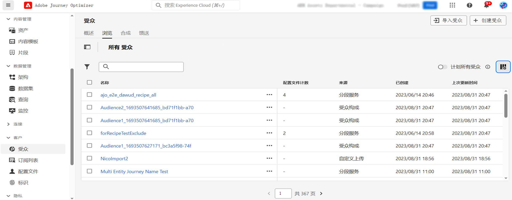
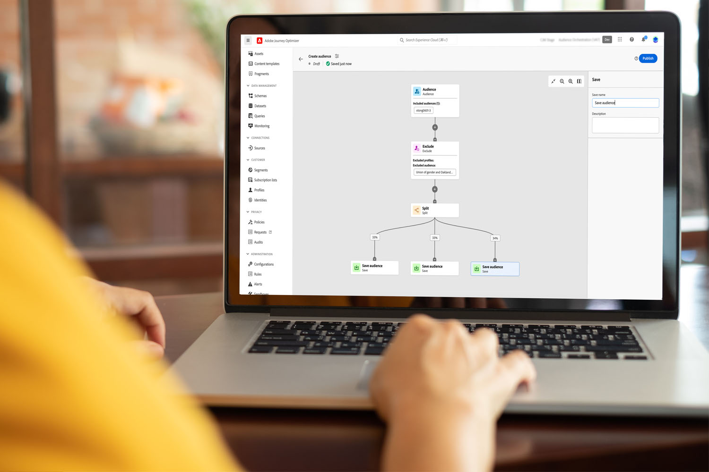

# 受众组合入门 {#get-start-audience-composition}

>[!CONTEXTUALHELP]
>id="ajo_ao_create_composition"
>title="创建组合"
>abstract="创建一个组合工作流程，将现有的 Adobe Experience Platform 受众组合到一个可视画布中，并利用各种活动（拆分、排除...）来创建新的受众。"

>[!BEGINSHADEBOX]

此文档提供了有关如何在 Adobe Journey Optimizer 中使用受众组合的详细信息。如果您仅是 Real-time Customer Profile 客户并且没有使用 Adobe Journey Optimizer，请[单击此处](https://experienceleague.adobe.com/docs/experience-platform/segmentation/ui/audience-composition.html?lang=zh-Hans){target="_blank"}。

>[!ENDSHADEBOX]

通过受众组合，您可以创建&#x200B;**组合工作流程**，将现有 Adobe Experience Platform 受众合并到可视画布中，并利用各种活动（拆分、排除等）来创建新受众。

完成后，**生成的受众**&#x200B;与现有受众会一起保存到 Adobe Experience Platform 中，并且可以&#x200B;**在营销活动中加以利用**&#x200B;以定位客户。[了解如何使用营销活动](../campaigns/get-started-with-campaigns.md)

>[!IMPORTANT]
>
>目前，将组合工作流生成的受众用于历程的功能以 Private Beta 版的形式提供。有关更多信息，请与您的 Adobe 代表联系。
>
>Adobe Journey Optimizer 中的营销活动尚未与策略执行服务集成。因此，不会在 Journey Optimizer 营销活动中强制执行您应用于受众属性的任何数据使用标签。

可通过 Adobe Journey Optimizer **[!UICONTROL 受众]**&#x200B;菜单访问受众组合：

* **[!UICONTROL 概述]**&#x200B;选项卡提供了专用仪表板，其中包含与贵组织受众数据相关的关键量度。要了解更多信息，请参阅 [Adobe Experience Platform 仪表板指南](https://experienceleague.adobe.com/docs/experience-platform/dashboards/guides/segments.html?lang=zh-Hans)。

* **[!UICONTROL 浏览]**&#x200B;选项卡列出了存储到 Adobe Experience Platform 中的所有现有受众。

* 通过&#x200B;**[!UICONTROL 组合]**&#x200B;选项卡，您可以创建组合工作流程，并在其中合并和排列受众以创建新受众。

单击每张卡片以了解如何使用受众组合：

<table style="table-layout:fixed"><tr style="border: 0;">
<td>

<a href="create-compositions.md"><strong>创建您的第一个组合工作流程</strong></a>
</td>
<td>

<a href="composition-canvas.md"><strong>使用组合画布</strong></a>
</td>
<td>

<a href="access-audiences.md"><strong>访问和管理受众</strong></a>
</td>
</tr></table>
