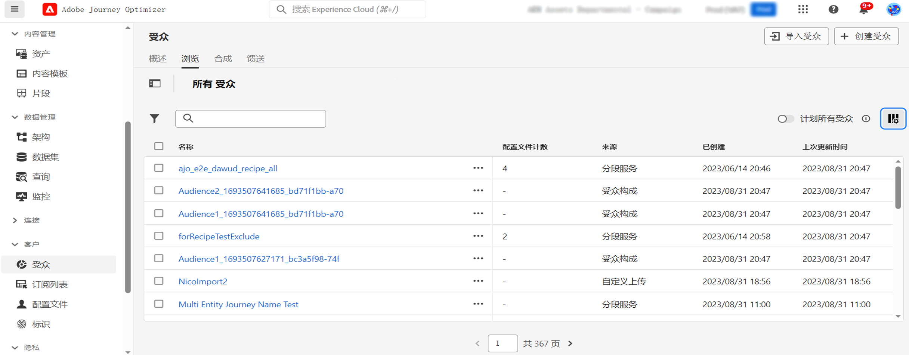
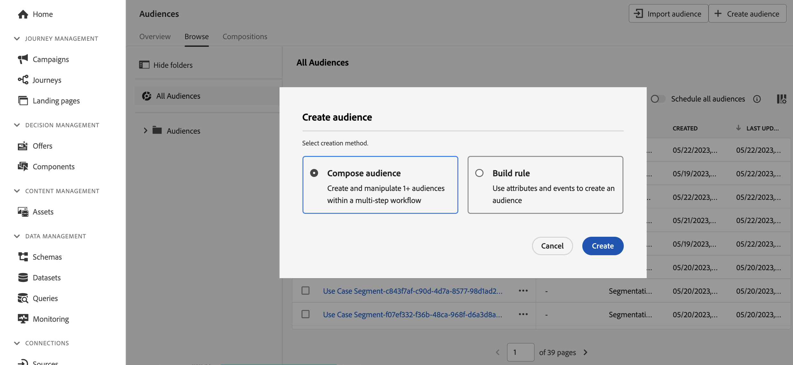
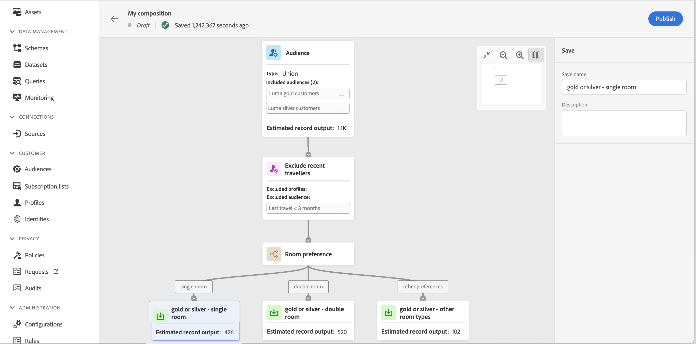

# 受众组合入门 {#get-start-audience-composition}

>[!CONTEXTUALHELP]
>id="ajo_ao_create_composition"
>title="创建合成"
>abstract="创建合成工作流程以将现有Adobe Experience Platform受众合并到可视画布中，并利用各种活动（拆分、排除……） 以创建新受众。"

>[!CONTEXTUALHELP]
>id="ajo_ao_publish"
>title="发布受众"
>abstract="发布合成以将生成的受众保存到Adobe Experience Platform中。"

>[!CONTEXTUALHELP]
>id="ajo_ao_audience"
>title="受众活动"
>abstract="利用受众活动，可在构成中包含属于现有受众的其他配置文件。"

>[!CONTEXTUALHELP]
>id="ajo_ao_merge_types"
>title="合并类型"
>abstract="指定所选受众的配置文件应如何合并。"

>[!CONTEXTUALHELP]
>id="ajo_ao_exclude_type"
>title="排除类型"
>abstract="使用“排除受众”类型可排除属于现有受众的用户档案。 使用属性类型排除允许您根据特定属性排除配置文件。"

>[!CONTEXTUALHELP]
>id="ajo_ao_exclude"
>title="排除活动"
>abstract="利用“排除”活动，可通过选择现有受众或使用规则从构成中排除用户档案。"

>[!CONTEXTUALHELP]
>id="ajo_ao_enrich"
>title="丰富活动"
>abstract="使用扩充活动通过来自Adobe Experience Platform数据集的其他属性扩充您的受众。 例如，您可以添加与所购买产品相关的信息（如名称、价格或制造商ID），并利用这些信息来个性化发送给受众的投放。"

>[!CONTEXTUALHELP]
>id="ajo_ao_enrich_dataset"
>title="扩充数据集"
>abstract="选择包含要与受众关联的数据的扩充数据集。"

>[!CONTEXTUALHELP]
>id="ajo_ao_enrich_criteria"
>title="扩充条件"
>abstract="选择要用作源数据集（即受众）和扩充数据集之间的协调键的字段。"

>[!CONTEXTUALHELP]
>id="ajo_ao_enrich_attributes"
>title="扩充属性"
>abstract="从扩充数据集中选择一个或多个属性以关联到受众。 发布构成后，这些属性将与受众相关联，并可以在Journey Optimizer营销活动中利用它们来个性化投放。"

>[!CONTEXTUALHELP]
>id="ajo_ao_ranking"
>title="排名活动"
>abstract="排名活动允许您根据特定属性对配置文件进行排名，并将它们包含在构成中。 例如，包含50个会员积分最高的用户档案。"

>[!CONTEXTUALHELP]
>id="ajo_ao_rank_profilelimit_text"
>title="添加配置文件限制"
>abstract="启用此选项可指定构成中要包含的最大配置文件数。"

<!--
 [!CONTEXTUALHELP]
>id="ajo_ao_control_group_text"
>title="Control Group"
>abstract="Use control groups to isolate a portion of the profiles. This allows you to measure the impact of a marketing activity and make a comparison with the behavior of the rest of the population."
-->

>[!CONTEXTUALHELP]
>id="ajo_ao_split"
>title="拆分活动"
>abstract="利用拆分活动，可将合成划分为多个路径。 发布构成时，将为每个路径将一个受众保存到Adobe Experience Platform中。"

>[!CONTEXTUALHELP]
>id="ajo_ao_split_type"
>title="拆分类型"
>abstract="使用百分比拆分类型将用户档案随机拆分为多个路径。 属性拆分类型允许您根据特定属性拆分配置文件。"

>[!CONTEXTUALHELP]
>id="ajo_ao_split_otherprofiles_text"
>title="其他配置文件"
>abstract="启用此选项后，可使用不符合其他路径中指定的任何条件的剩余配置文件创建一个附加路径。"

>[!BEGINSHADEBOX]

本文档提供了有关如何在Adobe Journey Optimizer中使用受众组合的详细信息。 如果您是仅使用Real-time Customer Profile的客户并且没有使用Adobe Journey Optimizer，请[单击此处](https://experienceleague.adobe.com/docs/experience-platform/segmentation/ui/audience-composition.html){target="_blank"}。

>[!ENDSHADEBOX]

受众组合允许您创建&#x200B;**组合工作流**，您可以在其中将现有Adobe Experience Platform受众组合到可视画布中并利用各种活动（拆分、排除……） 以创建新受众。

完成后，**生成的受众**&#x200B;与现有受众一起保存回Adobe Experience Platform中，可以在Journey Optimizer营销活动和历程中利用它来定位客户。 了解如何在Journey Optimizer中定位受众

>[!IMPORTANT]
>
>* 受众构成中的受众和属性当前不能用于Healthcare Shield或Privacy and Security Shield。
>
>* 扩充属性尚未与策略实施服务集成。 因此，您应用于扩充属性的任何数据使用标签都不会在Journey Optimizer营销活动或历程中强制执行。

可从Adobe Journey Optimizer **[!UICONTROL 受众]**&#x200B;菜单访问受众合成：

* **[!UICONTROL 概述]**&#x200B;选项卡提供了一个专用仪表板，其中包含与贵组织的受众数据相关的关键量度。 要了解更多信息，请参阅[Adobe Experience Platform功能板指南](https://experienceleague.adobe.com/docs/experience-platform/dashboards/guides/segments.html)。

* **[!UICONTROL 浏览]**&#x200B;选项卡列出了存储在Adobe Experience Platform中的所有现有受众。

* **[!UICONTROL 合成]**&#x200B;选项卡允许您创建合成工作流，您可以在其中组合和排列受众以创建新受众。

## 创建合成工作流 {#create}

要创建合成工作流，请执行以下步骤：

1. 访问&#x200B;**[!UICONTROL 受众]**&#x200B;菜单并选择&#x200B;**[!UICONTROL 创建受众]**。

1. 选择&#x200B;**[!UICONTROL 撰写受众]**。

   

1. 组合画布显示有两个默认活动：

   * **[!UICONTROL 受众]**：合成的起点。 此活动允许您选择一个或多个受众作为工作流的基础，

   * **[!UICONTROL 保存]**：合成的最后一步。 此活动用于将工作流结果保存到新受众中。

1. 打开合成属性以指定标题和描述。

   如果未在属性中定义标题，则排版标签将设置为“排版”，其后跟其创建日期和时间。

   

1. 在&#x200B;**[!UICONTROL 受众]**&#x200B;和&#x200B;**[!UICONTROL 保存]**&#x200B;活动之间添加所需数量的活动，以配置合成。 有关如何创建合成的详细信息，请参阅[受众合成文档](https://experienceleague.adobe.com/en/docs/experience-platform/segmentation/ui/audience-composition)。

   

1. 合成就绪后，单击&#x200B;**[!UICONTROL 发布]**&#x200B;按钮以发布合成并将生成的受众保存到Adobe Experience Platform中。

   >[!IMPORTANT]
   >
   >您最多可以在给定沙盒中发布10个合成。 如果您已达到此阈值，则需要删除合成以释放空间并发布新合成。

   如果在发布期间发生任何错误，将显示警报，其中包含有关如何解决该问题的信息。

   

1. 组合已发布。 生成的受众将保存到Adobe Experience Platform中，并准备好在Journey Optimizer中定位。 [了解如何在Journey Optimizer中定位受众](../audience/about-audiences.md#about-segments)

>[!NOTE]
>
>**受众合成**&#x200B;中的受众每天都会执行，因此您可能需要等待最多24小时才能在Journey Optimizer中使用它们。 受众构成受众中的丰富属性与上次构成运行一样新，过去最长可达24小时。

## 访问合成 {#access}

所有创建的合成都可以从&#x200B;**[!UICONTROL 合成]**&#x200B;选项卡访问。 您可以使用列表中的省略号按钮随时复制或删除现有合成。

合成可以具有多种状态：

* **[!UICONTROL 草稿]**：构成正在进行中，尚未发布。
* **[!UICONTROL 已发布]**：构成已发布，生成的受众已保存并可使用。

>[!NOTE]
>
>受众合成当前未与沙盒重置功能集成。 在启动沙盒重置之前，您需要手动删除合成，以确保正确清理关联的受众数据。 有关详细信息，请参阅Adobe Experience Platform [沙盒文档](https://experienceleague.adobe.com/docs/experience-platform/sandbox/ui/user-guide.html#delete-audience-compositions)
