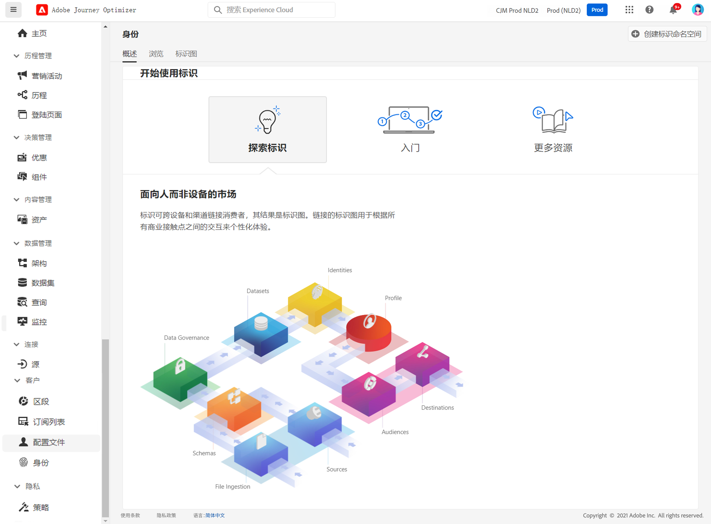

# 身份入门 {#identities-gs}

身份是实体特有的数据，通常是现实世界中的对象，例如个人、硬件设备或Web浏览器。 完全限定的标识包含两个元素：

* 此 **身份命名空间** 用作与身份相关的上下文的指示器。
* 此 **标识值** 是一个表示实体的字符串。

我们来看看电话号码555-555-1234。 在此示例中，字符串“555-555-1234”是 **标识值**，可分类为 **电话** 身份命名空间。

此 **身份** 中的菜单 [!DNL Adobe Journey Optimizer] 使您能够有效地浏览构成数据库中客户的各种标识符。

它提供 **身份图**，特定客户的不同身份之间的关系映射，为您提供客户如何跨不同渠道与您的品牌互动的可视化表示形式。 所有客户身份图由Adobe Experience Platform Identity Service集体管理和更新，以响应客户活动。

有关如何使用标识的详细信息，请参见 [Identity Service文档](https://experienceleague.adobe.com/docs/experience-platform/identity/home.html?lang=zh-Hans){target="_blank"}.
