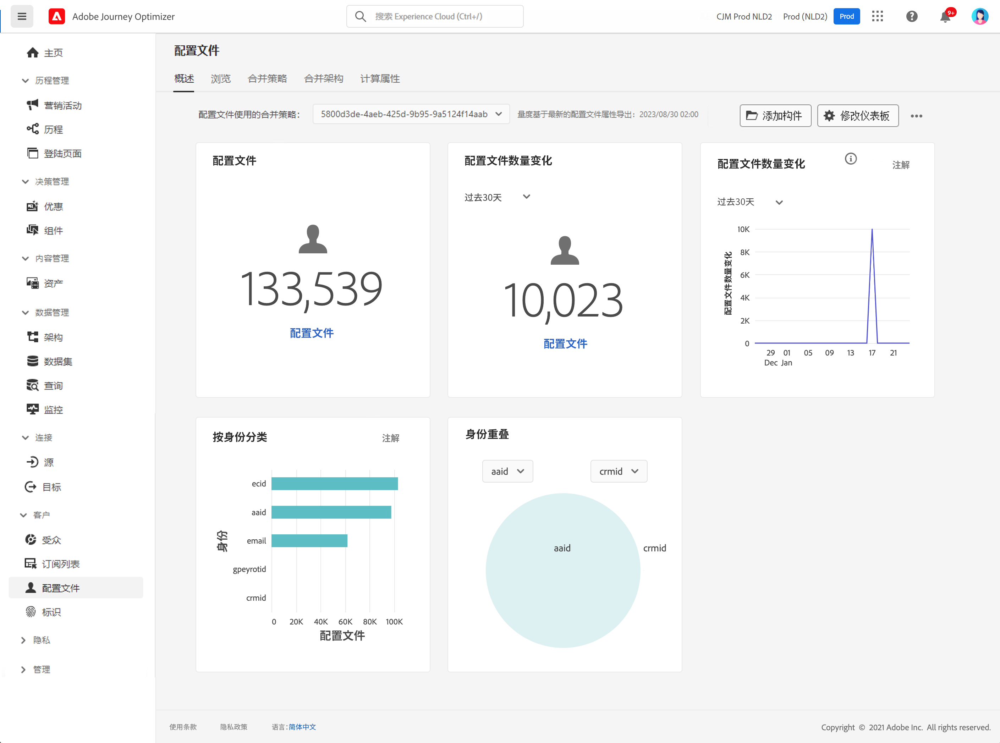

# 个人资料入门 {#profiles-gs}

利用 [!DNL Adobe Journey Optimizer] 中的 Real-time Customer Profile，您可以通过组合来自多个渠道的数据（包括在线、离线、CRM 和第三方）来查看每个客户的整体视图。借助&#x200B;**个人资料**，您可以将客户数据整合到一个统一视图中，该视图提供有关每项客户互动的带时间戳的、可操作的细节数据。

>[!NOTE]
>
>如果贵组织是 [!DNL Adobe Journey Optimizer] 的新用户且尚未创建活动的个人资料数据集或合并策略，则&#x200B;**个人资料**&#x200B;仪表板不可见。相反，**概述**&#x200B;选项卡显示指向 Adobe Experience Platform 文档的链接，以帮助您开始使用 Real-time Customer Profile。

要了解如何访问和使用&#x200B;**个人资料仪表板**&#x200B;以及其中显示的指标的详细信息，请参阅[此部分](https://experienceleague.adobe.com/docs/experience-platform/profile/ui/user-guide.html?lang=zh-Hans){target="_blank"}。

您可以将多个源的数据片段合并在一起，以便查看各个客户的完整视图。将此数据整合在一起时，合并策略是用于确定数据优先级的规则，以及哪些数据将被合并以创建统一视图。

如需详细了解&#x200B;**合并策略**，请参阅此[文档](https://experienceleague.adobe.com/docs/experience-platform/profile/merge-policies/ui-guide.html?lang=zh-Hans){target="_blank"}。

>[!MORELIKETHIS]
>
>* [Real-time Customer Profile 文档](https://experienceleague.adobe.com/docs/experience-platform/query/home.html?lang=zh-Hans){target="_blank"}
>* [Real-time Customer Profile 概述视频](https://experienceleague.adobe.com/docs/experience-platform/profile/home.html?lang=zh-Hans){target="_blank"}
