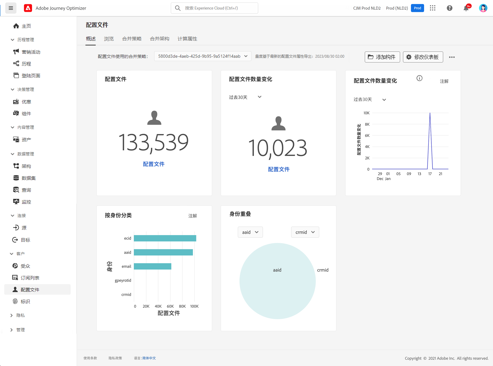

# 轮廓入门 {#profiles-gs}

## 关于轮廓

利用 [!DNL Adobe Journey Optimizer] 中的 Real-time Customer Profile，您可以通过组合来自多个渠道的数据（包括在线、离线、CRM 和第三方）来查看每个客户的整体视图。 借助&#x200B;**轮廓**，您可以将客户数据整合到一个统一视图中，该视图提供有关每项客户互动的带时间戳的、可操作的细节数据。

➡️ [通过观看视频了解此功能](#video)

**实时客户个人资料{&#x200B;1} — 将来自在线、离线和假名的客户属性和事件集成到单个统一个人资料中。**&#x200B;使&#x200B;用配置文件通过跨多个接触点的个性化实时体验吸引客户。  

**数据摄取** — 连接到各种数据源以摄取行为、交易、财务和运营数据。 实时摄取数据或通过批量上传摄取数据，以持续更新用户档案。 用户档案不是直接在[!DNL Journey Optimizer]界面中创建 — 摄取数据时，它们会在Adobe Experience Platform中自动创建或更新。

>[!NOTE]
>
>摄取数据时，电子邮件区分大小写。 这意味着在 [!DNL Journey Optimizer] 历程和营销活动中选择相应的目标收件人时可能创建和使用重复的轮廓（例如，一个轮廓对应 John.Greene@luma.com，另一个轮廓对应 john.greene@luma.com）。

**标识图形** — 使用客户标识（如忠诚度ID或CRM系统ID）合并来自不同来源的数据。 通过&#x200B;映射品牌数据集中不同标识之间的关系，创建客户的全面视图。  

**客户参与** — 使用实时客户配置文件提供情境式的个性化体验，例如有针对性的优惠和消息。 跨各种渠道&#x200B;吸引客户，包括营销活动、客户支持和事务性更新。  

**数据共享** — 与Amazon Web Services、Microsoft Azure和Google Cloud等顶级云存储提供商共享客户配置文件。 使用共享的用户档案通过业务智能工具进行报告、数据归档或更深入的分析。

>[!MORELIKETHIS]
>
>* [开始使用Journey Optimizer中的数据管理](../data/gs-data.md)
>* [实时客户轮廓文档](https://experienceleague.adobe.com/docs/experience-platform/query/home.html?lang=zh-Hans){target="_blank"}
>* [实时客户个人资料数据和细分的默认护栏](https://experienceleague.adobe.com/zh-hans/docs/experience-platform/profile/guardrails){target="_blank"}
>* [&#x200B;数据引入文档](https://experienceleague.adobe.com/en/docs/experience-platform/ingestion/home){target="_blank"}

## 配置文件仪表板

要访问配置文件，请导航到左侧导航窗格中的&#x200B;**[!UICONTROL 客户]** / **[!UICONTROL 配置文件]**&#x200B;菜单。

>[!NOTE]
>
>如果贵组织是 [!DNL Adobe Journey Optimizer] 的新用户且尚未创建活动的轮廓数据集或合并策略，则&#x200B;**轮廓**&#x200B;仪表板不可见。 相反，**概述**&#x200B;选项卡显示指向Adobe Experience Platform文档的链接，以帮助您开始使用实时客户个人资料。 要了解如何使用&#x200B;**个人资料仪表板**&#x200B;以及有关仪表板中显示的量度的详细信息，请参阅[此部分](https://experienceleague.adobe.com/docs/experience-platform/profile/ui/user-guide.html){target="_blank"}。

您可以将多个来源的数据片段放在一起，然后将它们组合在一起，以便查看每个客户的完整视图。 在汇总此数据时，合并策略是用于确定数据优先顺序的方式以及合并哪些数据以创建统一视图的规则。 在此[文档](https://experienceleague.adobe.com/docs/experience-platform/profile/merge-policies/ui-guide.html?lang=zh-Hans){target="_blank"}中了解有关&#x200B;**合并策略**&#x200B;的更多信息。

## 操作方法视频 {#video}

了解Adobe Experience Platform如何组合和更新实时客户配置文件，以及如何访问和使用这些配置文件。

>[!VIDEO](https://video.tv.adobe.com/v/27251?quality=12)
