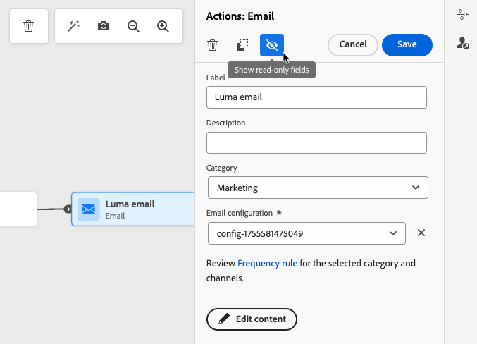

# 历程活动入门 {#about-journey-activities}

结合事件、编排和操作活动以构建多步骤、跨渠道方案。

## 事件活动 {#event-activities}

个性化历程以在线购买等活动开始。 用户档案进入历程后，将自行完成其过程。 每个用户档案可以采用不同的路径和节奏。 当您开始事件时，旅程会在事件到达时触发。 然后，每个配置文件都遵循历程中定义的步骤。

技术用户（请参阅[此页面](../event/about-events.md)）配置的事件，将显示在面板的第一个类别中。 此类别位于屏幕左侧。 可以使用以下事件活动：

* [一般事件](../building-journeys/general-events.md)
* [反应](../building-journeys/reaction-events.md)
* [受众资格筛选](../building-journeys/audience-qualification-events.md)

历程设计器中的

要开始您的历程，请拖放事件活动。 您还可以双击该图标。

## 编排活动 {#orchestration-activities}

编排活动是有助于确定历程中下一步的条件。 这些条件可以包括此人是否拥有未结支持案例或完成购买。 还可以包括当地天气预报，或者该人是否达到1万忠诚点。

在屏幕左侧的面板中，提供了以下编排活动：

* [优化](optimize.md)
* [读取受众](read-audience.md)
* [等待](wait-activity.md)
* [内容决策](content-decision.md)
* [数据集查找](dataset-lookup.md)

历程设计器中的

## 操作活动 {#action-activities}

操作是指您希望因某种触发而发生的操作，例如发送消息。 它是客户体验的历程部分。

从屏幕左侧的调色板中，在&#x200B;**[!UICONTROL 事件]**&#x200B;和&#x200B;**[!UICONTROL 编排]**&#x200B;下方，可以找到&#x200B;**[!UICONTROL 操作]**&#x200B;类别。 可以使用以下操作活动：

* [内置渠道操作](../building-journeys/journey-action.md)可从&#x200B;**操作**&#x200B;活动中使用
* [自定义操作](../building-journeys/using-custom-actions.md)
* [跳转](../building-journeys/jump.md)

历程设计器中的

这些活动代表各种的可用通信渠道。您可以将它们组合在一起，创建跨渠道方案。

您还可以设置用于发送消息的特定操作：

* 如果您使用第三方系统来发送消息，则可以创建特定的自定义操作。 [了解详情](../action/action.md)

* 如果您在使用[!DNL Adobe Campaign]和[!DNL Adobe Journey Optimizer]，请参阅以下部分：

   * [[!DNL Adobe Journey Optimizer]和 [!DNL Adobe Campaign] v7/v8](../action/acc-action.md)
   * [[!DNL Adobe Journey Optimizer]和 [!DNL Adobe Campaign] 标准](../action/acs-action.md)
   * [[!DNL Adobe Journey Optimizer]和 [!DNL Adobe Marketo Engage]](../action/marketo-engage.md)

## 最佳实践 {#best-practices}

使用这些建议可保持历程可读、一致且易于故障排除。

### 添加标签

大多数活动允许您定义&#x200B;**[!UICONTROL 标签]**。 这会将后缀添加到画布中活动下显示的名称中。 如果您在历程中多次使用同一活动，并且希望更轻松地识别它们，则此功能非常有用。 它还使得在发生错误时能够更轻松地进行调试，并使报告更易于阅读。 您还可以添加可选的&#x200B;**[!UICONTROL 描述]**。

历程活动属性中的

>[!NOTE]
>
>对于某些活动，其ID也会显示在窗格中。 在报表中，此ID可用作比标签更稳定的键，标签会发生变化。

### 管理高级参数 {#advanced-parameters}

大多数活动会显示许多您无法修改的高级和/或技术参数。

历程活动属性中的

为了提高可读性，请使用右窗格顶部的&#x200B;**[!UICONTROL 隐藏只读字段]**&#x200B;按钮来隐藏这些参数。

在某些特定上下文中，您可以覆盖这些参数的值以供特定使用。 要强制使用某个值，请单击字段右侧的&#x200B;**[!UICONTROL 启用参数覆盖]**&#x200B;图标。[了解详情](../configuration/primary-email-addresses.md#override-execution-address-journey)

>[!NOTE]
>
>如果高级参数已隐藏，请单击&#x200B;**[!UICONTROL 显示只读字段]**&#x200B;按钮
>
>{width=60%}

### 添加替代路径

当操作或条件中发生错误时，个人历程将停止。使其继续的唯一方法是选中框&#x200B;**[!UICONTROL 在超时或错误的情况下添加替代路径]**。 请参阅[此部分](../building-journeys/using-the-journey-designer.md#paths)

## 疑难解答 {#troubleshooting}

测试和发布历程之前，请验证所有活动均已正确配置。如果系统仍检测到错误，则无法执行测试或发布。

在此页面[上了解如何对活动和历程](troubleshooting.md)中的错误进行故障排除。

另请参阅[监视和故障排除](../../rp_landing_pages/troubleshoot-journey-landing-page.md)
