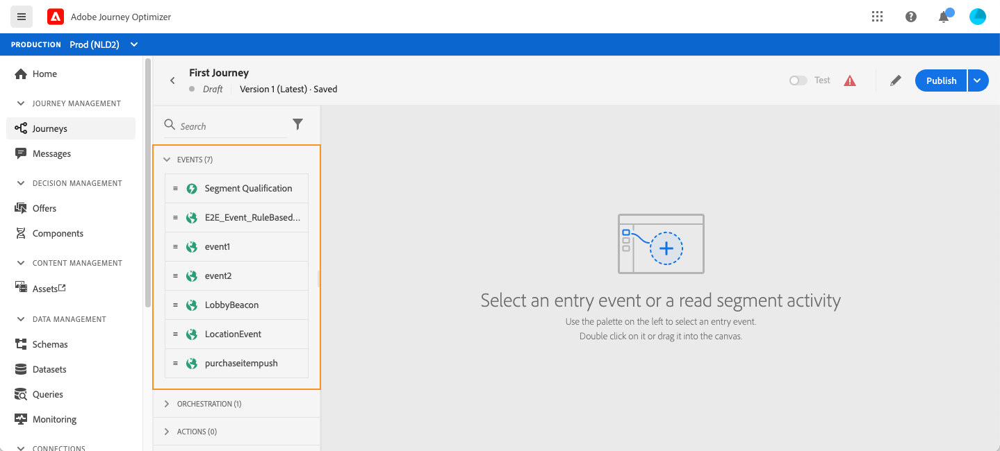

# 关于旅程活动{#about-journey-activities}

结合不同的事件、编排和操作活动，构建多步跨渠道方案。

## 事件活动 {#event-activities}

由技术用户配置的事件（请参阅[此页](../event/about-events.md)）均显示在屏幕左侧的调色板的第一类别中。 提供以下事件活动:

* [一般事件](../building-journeys/general-events.md)
* [反应](../building-journeys/reaction-events.md)
* [细分资格](../building-journeys/segment-qualification-events.md)

通过拖放事件活动开始您的旅程。 您也可以多次单击它。

## 编排活动 {#orchestration-activities}

从屏幕左侧的调色板中，可使用以下业务流程活动:

* [条件](../building-journeys/condition-activity.md)
* [结束](../building-journeys/end-activity.md)
* [等待](../building-journeys/wait-activity.md)
* [阅读区段](../building-journeys/read-segment.md)

## 操作活动 {#action-activities}

从面板的左侧，在屏幕的&#x200B;**[!UICONTROL Events]**&#x200B;和&#x200B;**[!UICONTROL Orchestration]**&#x200B;下方，您将找到&#x200B;**[!UICONTROL Actions]**&#x200B;类别。 可使用以下操作活动:

* [消息](../building-journeys/journeys-message.md)
* [自定义操作](../building-journeys/using-custom-actions.md)
* [跳转](../building-journeys/jump.md)

这些活动代表各种的可用通信渠道。您可以将它们组合在一起，以创建跨渠道方案。

如果您已配置自定义操作，则这些操作将显示在此处（请参阅[此页](../building-journeys/using-custom-actions.md)）。

## 最佳实践 {#best-practices}

大多数活动允许您定义&#x200B;**[!UICONTROL Label]**。 这会为将在画布中的活动下显示的名称添加后缀。 如果您在旅程中多次使用相同的活动，并希望更轻松地识别它们，则此功能非常有用。 它还使得在出现错误时调试更简单，并使报告更易于阅读。 您还可以添加可选的&#x200B;**[!UICONTROL Description]**。

当操作或条件中发生错误时，个人历程将停止。使其继续的唯一方法是选中 **[!UICONTROL Add an alternative path in case of a timeout or an error]** 框。请参阅[此章节](../building-journeys/using-the-journey-designer.md#paths)。

