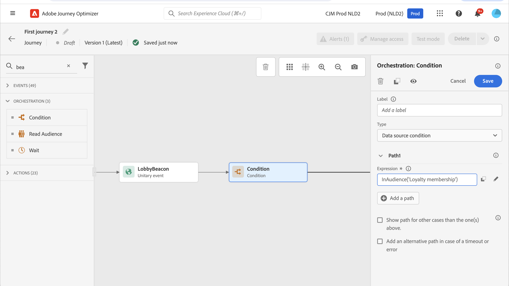

# 历程活动入门 {#about-journey-activities}

结合不同的事件、编排和操作活动，构建多步跨渠道方案。

## 事件活动 {#event-activities}

事件是触发个性化历程的因素，例如在线购买。 当某人进入某个历程时，他们作为个人穿行，没有两个人以相同的速度或同一路径移动。 当您通过事件开始历程时，当收到事件时触发历程。 然后，历程中的每个人员分别遵循历程中定义的后续步骤。

由技术用户配置的事件(请参阅 [本页](../event/about-events.md))都显示在屏幕左侧面板的第一个类别中。 可以使用以下事件活动：

* [一般事件](../building-journeys/general-events.md)
* [反应](../building-journeys/reaction-events.md)
* [区段鉴别](../building-journeys/segment-qualification-events.md)

通过拖放事件活动以开始您的历程。 您还可以双击该页面。

## 编排活动 {#orchestration-activities}

编排活动是帮助确定旅程中下一步的不同条件。 如果人员是否有未结的支持案例，则可能会预测其当前位置的天气情况（他们是否完成了购买）或达到10 000个会员积分。

从屏幕左侧的面板中，可以使用以下编排活动：

* [条件](../building-journeys/condition-activity.md)
* [等待](../building-journeys/wait-activity.md)
* [读取区段](../building-journeys/read-segment.md)

## 操作活动 {#action-activities}

操作是您希望通过某种触发器执行的操作，如发送消息。 这是客户体验的历程。

从屏幕左侧的面板，下方 **[!UICONTROL 事件]** 和 **[!UICONTROL 编排]**，您可以找到 **[!UICONTROL 操作]** 类别。 可使用以下操作活动：

* [电子邮件、短信、推送](../building-journeys/journeys-message.md)
* [自定义操作](../building-journeys/using-custom-actions.md)
* [跳转](../building-journeys/jump.md)

这些活动代表各种的可用通信渠道。您可以将它们组合在一起，以创建跨渠道方案。

如果您配置了自定义操作，则它们也会显示在此处。 [了解详情](../building-journeys/using-custom-actions.md)).

## 最佳实践 {#best-practices}

大多数活动都允许您定义 **[!UICONTROL 标签]**. 这会为将在画布中活动下方显示的名称添加后缀。 如果您在历程中多次使用同一活动并希望更轻松地识别它们，则此功能非常有用。 它还可以在出错时更轻松地进行调试，并且还可以更轻松地阅读报表。 您还可以添加一个可选 **[!UICONTROL 描述]**.

当操作或条件中发生错误时，个人历程将停止。使其继续的唯一方法是选中方框 **[!UICONTROL 在出现超时或错误时添加替代路径]**. 请参阅[此小节](../building-journeys/using-the-journey-designer.md#paths)。

