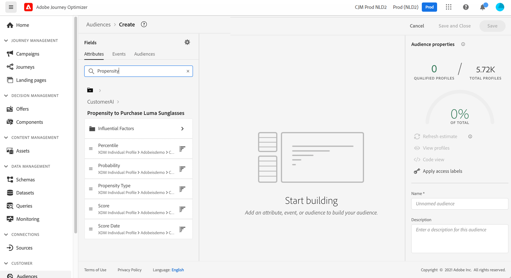

# 与智能服务集成 {#ai-overview}

与集成 **[!DNL Adobe Intelligent Services]** 可让您在客户体验用例中利用人工智能和机器学习的强大功能。 借助此功能，营销分析人员可使用商业级别配置来设置特定于公司需求的预测，而无需具备数据科学专业知识。

[!DNL Intelligent Services]，构建于Adobe Experience Platform之上，允许负责客户体验的营销人员访问AI-as-a-service，从而让任何人能够轻松预测客户行为、衡量营销活动影响或确保提高每项投资的回报。 有关的详细信息 [!DNL Adobe Intelligent Services]，请参阅 [Adobe Experience Platform文档](https://experienceleague.adobe.com/docs/experience-platform/intelligent-services/home.html){target="_blank"}.

集成介于 [!DNL Journey Optimizer] 和 [!DNL Intelligent Services] 允许您利用客户预测。

客户人工智能是的一部分 [!DNL Adobe Intelligent Services]. 它有助于预测客户可能会做什么。 请参阅 [Adobe Experience Platform文档](https://experienceleague.adobe.com/docs/experience-platform/intelligent-services/customer-ai/overview.html){target="_blank"}.

借助客户人工智能，品牌商可利用流失率或转化率机器学习功能来建立分数，这些分数将作为Adobe Experience Platform用户档案（实时客户用户档案）中的用户档案属性提供。

因此，它们可以用作Journey Optimizer条件（用于做出最佳决策）、操作或区段构建中的任何其他配置文件属性。

