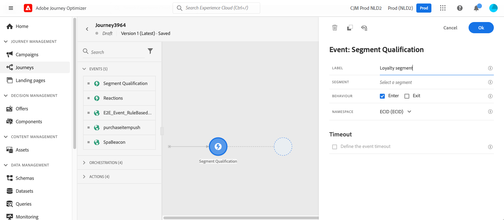
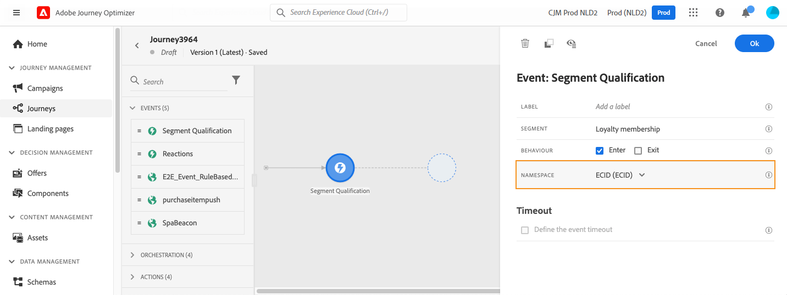
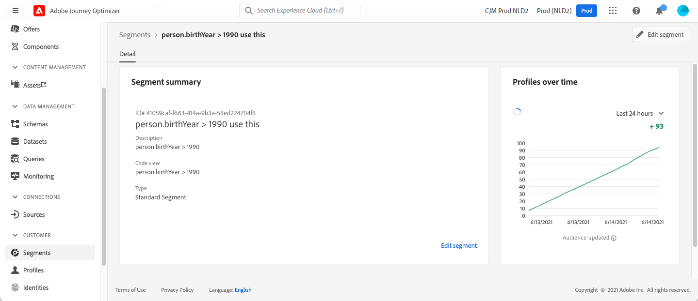

# 受众鉴定事件 {#segment-qualification}

>[!BEGINSHADEBOX]

**在此页面上：**&#x200B;了解如何在配置文件符合或退出Adobe Experience Platform受众资格时，使用和配置受众资格事件以触发历程进入或进展。

>[!ENDSHADEBOX]

>[!CONTEXTUALHELP]
>id="ajo_journey_event_segment_qualification"
>title="受众资格筛选"
>abstract="当轮廓符合或退出某个 [!DNL Adobe Experience Platform] 受众条件时，触发历程进入或继续执行。 建议用于流式受众；对于批量场景，请使用“读取受众”活动。"

## 关于受众资格筛选事件{#about-segment-qualification}

此活动侦听[!DNL Adobe Experience Platform]受众中用户档案的进出口。 它可以使个人进入旅程或前进。 有关创建受众的详细信息，请参阅此[部分](../audience/about-audiences.md)。

假设您拥有“白银客户”受众。 通过此活动，您可以使所有新的白银客户进入历程，并向其发送一系列个性化消息。

此类事件可定位为历程的第一步或后续步骤。

➡️ [通过观看视频了解此功能](#video)

>[!CAUTION]
>
>在开始配置受众资格之前，[请阅读护栏和限制](#audience-qualification-guardrails)。

## 配置活动 {#configure-segment-qualification}

要配置&#x200B;**[!UICONTROL 受众资格]**&#x200B;活动，请执行以下步骤：

>[!CONTEXTUALHELP]
>id="ajo_journey_event_segment_qualification_label"
>title="标签"
>abstract="可选标签，用于在报告和测试模式日志中标识此活动。"

>[!CONTEXTUALHELP]
>id="ajo_journey_event_segment_qualification_audience"
>title="受众"
>abstract="历程监控的 [!DNL Adobe Experience Platform] 受众。 当轮廓符合或退出此受众条件时，会进入历程或继续向前推进。 建议使用流式受众，以便实时评估受众资格。"

>[!CONTEXTUALHELP]
>id="ajo_journey_event_segment_qualification_behavior"
>title="行为"
>abstract="定义历程响应哪些受众成员资格变化：轮廓加入（进入）受众时、离开（退出）受众时，或两者都响应。 同时监听两者可覆盖完整的成员生命周期，而单一选项则将历程限制为单向触发。"

>[!CONTEXTUALHELP]
>id="ajo_journey_event_segment_qualification_identity"
>title="身份标识类型"
>abstract="用于识别符合受众条件个人的身份标识命名空间。 仅支持基于个人的身份标识命名空间，缺少此身份的轮廓无法进入历程。"

>[!CONTEXTUALHELP]
>id="ajo_journey_event_segment_qualification_merge_policy"
>title="合并策略"
>abstract="合并策略将自动从您选择的受众中检索并应用于整个历程。"
>additional-url="https://experienceleague.adobe.com/zh-hans/docs/journey-optimizer/using/orchestrate-journeys/create-journey/journey-properties#merge-policies" text="了解有关合并策略的更多信息"

1. 展开&#x200B;**[!UICONTROL 事件]**&#x200B;类别并将&#x200B;**[!UICONTROL 受众资格]**&#x200B;活动放入画布中。

   历程调色板中的

1. 向活动添加&#x200B;**[!UICONTROL 标签]**。 此步骤是可选的。

1. 单击&#x200B;**[!UICONTROL 受众]**&#x200B;字段并选择要利用的受众。

   >[!NOTE]
   >
   >您可以自定义列表中显示的列并对其进行排序。

   

   添加受众后，**[!UICONTROL 复制]**&#x200B;按钮允许您复制其名称和ID：

   `{"name":"Loyalty membership","id":"8597c5dc-70e3-4b05-8fb9-7e938f5c07a3"}`

   

1. 在&#x200B;**[!UICONTROL Behavior]**&#x200B;字段中，选择要侦听受众入口、出口还是两者。

   >[!NOTE]
   >
   >**[!UICONTROL Enter]**&#x200B;和&#x200B;**[!UICONTROL Exit]**&#x200B;对应于[!DNL Adobe Experience Platform]中的&#x200B;**Realized**&#x200B;和&#x200B;**Exited**&#x200B;受众参与状态。
   >请参阅[分段服务文档](https://experienceleague.adobe.com/docs/experience-platform/segmentation/tutorials/evaluate-a-segment.html#interpret-segment-results){target="_blank"}。

1. 选择命名空间。 仅当将事件定位为历程的第一步时，才需要此操作。 默认情况下，这个字段会预填充为上次使用的命名空间。

   >[!NOTE]
   >
   >您只能选择基于人员的身份命名空间。
   >查找表命名空间（例如，产品查找的ProductID）在&#x200B;**命名空间**&#x200B;下拉列表中不可用。

   

有效负荷包含以下可以在条件和操作中使用的上下文信息：

* 行为（入口、出口）
* 资格筛选时间戳
* 受众id

在遵循&#x200B;**[!UICONTROL 受众资格]**&#x200B;活动的条件或操作中使用表达式编辑器时，您有权访问&#x200B;**[!UICONTROL AudienceQualification]**&#x200B;节点。 您可以选择&#x200B;**[!UICONTROL 上次资格取得时间]**&#x200B;和&#x200B;**[!UICONTROL 状态]**（进入或退出）。

查看[条件](../building-journeys/conditions.md#about_condition)。

包含&#x200B;**受众资格**&#x200B;事件的新历程在发布十分钟后即可开始运行。 此间隔与专用服务的缓存刷新间隔匹配。 等待十分钟，然后再使用此历程。

## 最佳实践 {#best-practices-segments}

**[!UICONTROL 受众资格]**&#x200B;活动允许符合[!DNL Adobe Experience Platform]受众资格或取消资格的个人立即进入历程。

该信息的接收速度很快。 测量显示每秒接收10,000个事件。 规划进入峰值，尽可能避免它们，并准备历程以处理它们。 要进一步了解历程处理速率和吞吐量限制，请参阅[此部分](entry-management.md#journey-processing-rate)。

### 批量受众 {#batch-speed-segment-qualification}

在对批量受众使用“受众资格”时，请注意，在每日计算时会出现入口峰值。 峰值的大小取决于每天进入或退出受众的个人数量。

此外，如果在历程中新创建并立即使用批量受众，则第一批计算可能会产生许多条目。 为这个尖峰做计划。

### 区段成员资格更新的时间 {#timing-segment-membership}

在历程中使用批处理快照时，任何新区段成员资格只能反映在后续快照中。 如果必须立即添加或当天添加区段，请考虑流式分段或验证下一个快照是否捕获区段更新。

### 流式处理受众 {#streamed-speed-segment-qualification}

在对流式传输的受众使用“受众资格”时，由于评估是连续的，因此入口、出口达到高峰的风险较小。 如果受众定义同时使许多客户符合条件，则仍可能会出现峰值。

避免使用具有流式分段的“打开”和“发送”事件。 相反，应使用真正的用户活动信号，如点击次数、购买次数或信标数据。 对于频率或抑制逻辑，请使用业务规则而不是发送事件。 [了解详情](../audience/about-audiences.md)

请参阅[[!DNL Adobe Experience Platform] 流式分段文档](https://experienceleague.adobe.com/en/docs/experience-platform/segmentation/methods/streaming-segmentation){target="_blank"}。

>[!NOTE]
>
>流区段成员资格的传播时间取决于成员资格的评估方式及其在历程中的使用位置：
>
>* **受众资格节点+流区段：**&#x200B;当某个配置文件符合Edge上的流区段的资格时，该成员资格将在旅程对其采取行动之前从Edge投射到中心。 此Edge到中心的传播通常需要&#x200B;**15到30分钟**。 如果配置文件未按预期进入受众资格历程，请在进一步调查之前允许此传播窗口（添加等待活动，如果适用）。 对于需要真正实时输入的用例，请考虑改为单一事件触发器。

#### 为何不是所有符合条件的用户档案都可以进入历程 {#streaming-entry-caveats}

在将流式受众与&#x200B;**受众资格**&#x200B;活动结合使用时，并非所有符合受众条件的配置文件都一定会进入历程。 发生此行为的原因如下：

* **受众中已有的配置文件**：只有在发布历程后新符合受众条件的配置文件才会触发进入。 发布前已存在于受众中的用户档案将不会进入。 同样，当流区段使用基于&#x200B;**时间的条件**（例如，“接下来8小时内的事件”）时，创建区段之前已经满足该条件的配置文件将&#x200B;**不会进行追溯评估** — 仅评估在区段激活后数据更改的用户档案。

* **历程激活时间**：当您发布历程时，**受众资格**&#x200B;活动最长需要&#x200B;**10分钟**&#x200B;才能变为活动并开始侦听配置文件条目和退出。 [了解有关历程激活的更多信息](#configure-segment-qualification)。

* **从受众快速退出**：如果某个配置文件符合受众的条件，但在触发历程进入之前退出，则该配置文件可能无法进入历程。

* **资格与历程处理之间的时间间隔**：由于[!DNL Adobe Experience Platform]的分布式性质，可能存在时间间隔。 用户档案可在历程处理资格事件之前获得资格。

**推荐：**

* 发布历程后，请至少等待10分钟，然后再发送将触发用户档案鉴别的事件或数据。 这将确保历程完全激活并准备好处理条目。

* 对于需要确保所有符合条件的配置文件都进入的关键用例，请考虑改用[读取受众](read-audience.md)活动。 它会在特定时间处理受众中的所有配置文件。

* 监视历程的[进入率和吞吐量](entry-management.md#profile-entrance-rate)以了解配置文件流模式。

* 如果配置文件未按预期输入，请参阅[疑难解答指南](troubleshooting-execution.md#checking-if-people-enter-the-journey)以了解其他诊断步骤。

### 如何避免过载 {#overloads-speed-segment-qualification}

以下是避免使历程中利用的系统（数据源、自定义操作、渠道操作活动）过载的一些最佳实践：

* 在&#x200B;**[!UICONTROL 受众资格]**&#x200B;活动中创建批次受众后，请勿立即使用批次受众。 这样可以避免第一个计算峰值。 如果您要使用从未计算的受众，则历程画布中会显示黄色警告。

  ![在[!DNL Adobe Experience Platform]](assets/segment-error.png)中未找到受众时的错误消息

* 为历程中使用的数据源和操作设置上限规则，以避免其过载。 请参阅[Journey Orchestration文档](https://experienceleague.adobe.com/docs/journeys/using/working-with-apis/capping.html){target="_blank"}以了解详情。 请注意，上限规则不带重试。 如果需要重试，请通过选中框&#x200B;**[!UICONTROL 在条件或操作中出现超时或错误]**&#x200B;时添加替代路径来在历程中使用替代路径。

* 在生产历程中使用受众之前，请每天评估符合此受众条件的个人数量。 为此，请检查&#x200B;**[!UICONTROL 受众]**&#x200B;菜单，打开受众，然后查看&#x200B;**[!UICONTROL 随时间变化的配置文件]**&#x200B;图形。

  

在[本节](entry-management.md#profile-entrance-rate)中了解有关进入速率限制和吞吐量的更多信息。

## 护栏和限制 {#audience-qualification-guardrails}

遵循以下护栏和建议以构建Audience Qualification历程。 另请参阅[受众资格最佳实践](#best-practices-segments)。

* 受众资格历程主要设计用于流受众。 这种结合保证了更好的实时体验。 强烈建议在受众资格活动中使用&#x200B;**流式受众**。

  但是，如果要在流式受众或批量受众中使用基于批量摄取的属性进行受众资格历程，请考虑用于受众评估/激活的时间范围。 使用批量摄取属性的批量受众或流式受众在分段作业完成后约&#x200B;**2小时**&#x200B;即可在&#x200B;**受众资格**&#x200B;活动中使用。 此作业每天在Adobe组织管理员定义的时间运行一次。

* [!DNL Adobe Experience Platform]受众每天计算一次（**批次**&#x200B;受众），或使用[!DNL Adobe Experience Platform]的“高频受众”选项实时计算（针对&#x200B;**流式传输**&#x200B;受众）。

   * 如果对所选受众进行流式处理，则属于此受众的个人可能会实时进入历程。
   * 如果受众是批处理，则新近符合此受众条件的人员可能会在[!DNL Adobe Experience Platform]上执行受众计算时进入历程。

  作为最佳实践，请在&#x200B;**受众资格**&#x200B;活动中使用流式受众。 对于批量用例，请使用&#x200B;**[读取受众](read-audience.md)**&#x200B;活动。

  >[!NOTE]
  >
  >由于使用组合工作流和自定义上传创建的受众具有批次性质，因此无法在“受众资格”活动中定位这些受众。 此活动中只能利用使用区段定义创建的受众。

* 体验事件字段组不能在以&#x200B;**读取受众**、**受众资格**&#x200B;或&#x200B;**业务事件**&#x200B;活动开始的历程中使用。

* 在历程中使用&#x200B;**受众资格**&#x200B;活动时，该活动可能最多需要10分钟才能激活，并侦听进入或退出受众的用户档案。

>[!CAUTION]
>
>实时客户配置文件数据和分段的[护栏](https://experienceleague.adobe.com/docs/experience-platform/profile/guardrails.html?lang=zh-Hans){target="_blank"}也适用于[!DNL Adobe Journey Optimizer]。

## 操作方法视频 {#video}

通过此视频了解受众资格历程的适用用例。 了解如何使用Audience Qualification构建历程以及可以应用的最佳实践。

>[!VIDEO](https://video.tv.adobe.com/v/3425028?quality=12)
