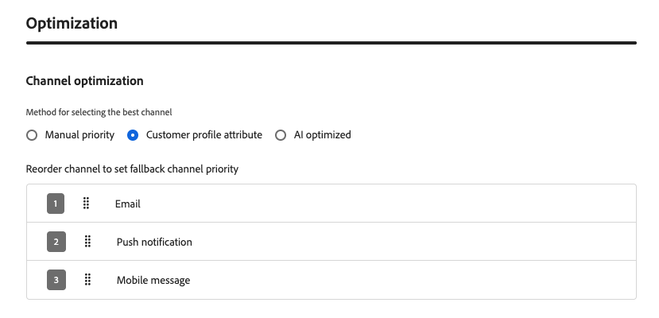

# 渠道优化 {#channel-optimization}

>[!BEGINSHADEBOX]

**在此页面上：**&#x200B;了解如何使用手动排名、用户档案偏好设置或AI支持的倾向分数，配置历程或营销活动操作，通过最佳出站渠道为每个客户传递消息。

>[!ENDSHADEBOX]

>[!AVAILABILITY]
>
>渠道优化当前仅对有限的一组组织可用（限量发布）。 要获得访问权限，请与 Adobe 代表联系。

渠道优化可让您将多个出站渠道（电子邮件、推送、移动设备消息）添加到单个历程或营销活动操作，并让Journey Optimizer在发送时为每个客户自动选择最佳渠道。

该系统不预先选择一个渠道或一次跨所有渠道向客户发送消息，而是挑选每个客户选择的最高等级的渠道，并在该渠道不可用时优雅地退回。

➡️ [在此视频中了解有关渠道优化的更多信息](#video)

## 护栏和限制 {#limitations}

* **支持的渠道**：仅支持本机电子邮件、推送和移动消息渠道。 不支持其他出站渠道，例如WhatsApp。 渠道优化需要使用Journey Optimizer的本机电子邮件、推送和移动消息传送功能；不支持通过自定义操作执行。

* **AI优化量度**： AI模型仅针对参与度（点击量）进行优化。 它不会针对订单、收入或其他业务量度进行优化。 如果需要对订单或收入进行优化，则您的数据科学团队可以离线培训自定义模型，并通过客户配置文件属性功能将其应用。

* **AI排名所需的点击跟踪**：使用基于AI模型的排名时，必须为所有配置的渠道启用点击跟踪。 该模型依赖点击数据来计算倾向分数；如果禁用跟踪，则AI排名模式无法正常运行。 [了解如何在电子邮件中启用点击跟踪](../email/message-tracking.md)

* **无讯息小时数**：在一个操作中合并多个渠道时，无讯息小时数将根据渠道优先级应用：移动消息优先于推送，然后是电子邮件。 要为每个渠道使用不同的安静时间设置，请创建单独的历程操作，而不是在单个操作中组合渠道。

  >[!NOTE]
  >
  >计划在General Availability版本中支持每渠道免打扰时间设置。

* **发送时间优化不兼容**：当前[发送时间优化](send-time-optimization.md)和通道优化不能同时使用 — 请选择其中之一。 UI可防止在同一操作中同时启用这两项功能。

* **反应事件**：历程画布上的反应事件当前仅引用多渠道操作中的第一个渠道。

  >[!NOTE]
  >
  >在General Availability版本中计划支持选择存在多个渠道时的任何有效反应事件。

## 在历程或营销活动中使用渠道优化 {#configure}

要将具有渠道优化的多个出站渠道添加到历程或营销活动，请执行以下步骤。

>[!BEGINTABS]

>[!TAB 在历程中]

1. 通过[事件](general-events.md)或[读取受众](read-audience.md)活动开始您的历程。

1. 从调色板的&#x200B;**[!UICONTROL 操作]**&#x200B;部分，将&#x200B;**[!UICONTROL 操作]**&#x200B;活动拖放到画布中。

1. 选择出站频道（电子邮件、推送或移动消息）并单击&#x200B;**[!UICONTROL 添加]**。

   {width="60%"}

1. 输入操作的标签，然后单击&#x200B;**[!UICONTROL 配置操作]**。

>[!TAB 在营销活动中] 

1. [创建操作营销活动](../campaigns/create-campaign.md)并导航到&#x200B;**[!UICONTROL 操作]**&#x200B;选项卡。

1. 单击&#x200B;**[!UICONTROL 添加操作]**&#x200B;按钮并选择出站渠道（电子邮件、推送或移动消息）。

>[!ENDTABS]

在&#x200B;**[!UICONTROL 操作]**&#x200B;选项卡中选择出站操作后，请继续执行以下步骤。

1. 选择通道配置并单击&#x200B;**[!UICONTROL 添加操作]**&#x200B;以选择其他出站通道。

   {width="1000%"}

   >[!NOTE]
   >
   >在单个多渠道操作中，每个渠道类型仅支持一个操作。 例如，您无法添加具有不同配置的两个单独的电子邮件操作。

   您最多可以将三个出站渠道（**[!UICONTROL 电子邮件]**、**[!UICONTROL 推送]**、**[!UICONTROL 手机消息]**）添加到单个历程操作或营销活动中。

1. 在&#x200B;**[!UICONTROL 渠道优化]**&#x200B;部分中，设置方法以确定系统如何为每个客户选择最佳渠道。 [了解详情](#optimization-modes)

   {width="100%"}

1. 通过将渠道拖放到所需顺序中，设置您的备用渠道顺序（对于手动排名和客户偏好设置方法）。 [了解详情](#fallback)

   {width="90%"}

1. [保存并发布](publish-journey.md)您的历程，或[审核并激活](../campaigns/review-activate-campaign.md)您的营销活动。

## 设置通道优化方法 {#optimization-modes}

>[!CONTEXTUALHELP]
>id="ajo_channel_optimization_method"
>title="定义渠道选择的工作方式"
>abstract="选择Journey Optimizer如何为每个客户选择最佳渠道：**手动优先级** — 按您定义的顺序尝试渠道；可用性通过应用与所选渠道配置关联的订阅首选项和营销同意规则以及与活动或历程关联的所有业务规则（例如渠道频率封顶）来确定。 **客户配置文件属性** — 首先选择与客户在其配置文件中声明的首选项匹配的渠道。 如果未找到首选项，则应用手动优先级。 **AI已优化** — 机器学习模型根据客户的历史参与度对每个渠道进行评分，并选择得分最高的可用渠道。"

<!--
Previous content for contextual help: "The customer's first available channel, based on the selected prioritization method, is used for this action. Availability is determined by the customer's subscription preferences and marketing consent rules for the selected channel configurations, as well as any business rules — such as frequency capping — configured for the campaign or journey." TBC which to keep.

Additional content for contextual help: For **Manual priority** and **Customer profile attribute** modes, Journey Optimizer falls back through your configured channel order when the top-ranked channel cannot be used. For **AI optimized**, it falls back to a random available channel."
-->

信道优化支持三种模式，每种模式使用不同的方法在发送时为每个客户选择最佳信道。

### 手动排名 {#manual-ranking}

**[!UICONTROL 手动优先级]**&#x200B;是默认模式。 您可以直接在操作中定义首选渠道顺序。 Journey Optimizer通过客户选择加入的列表中的第一个渠道进行传递，且没有频率限制，然后[根据需要回退](#fallback)到下一个渠道。

{width="90%"}

当您具有清晰、一致的渠道偏好设置并且不需要按用户档案进行个性化时，请使用此模式。

### 客户偏好 {#customer-preference}

选择&#x200B;**[!UICONTROL 客户配置文件属性]**&#x200B;后，Journey Optimizer使用[同意和偏好设置XDM字段组](https://experienceleague.adobe.com/zh-hans/docs/experience-platform/xdm/field-groups/profile/consents)中的`preferred`属性，从其配置文件中读取客户声明的首选渠道。 支持的值为`email`、`push`和`sms`。

{width="90%"}

如果首选频道不可用（未配置、未选择加入或频率限制），Journey Optimizer将回退到您配置的[回退](#fallback)列表中的下一个频道。

当客户明确声明其首选通信渠道时，请使用此模式。

### 基于AI模型的排名 {#ai-ranking}

如果您选择&#x200B;**[!UICONTROL AI优化]**，Journey Optimizer将使用机器学习模型，该模型会根据每个客户的历史参与度（打开次数、点击次数）计算每个客户的每渠道倾向分数。 分数存储在客户的用户档案中，并且在发送时选择具有最高预测倾向的频道。

{width="70%"}

当客户的参与历史记录不足时，系统回退到随机可用的渠道。

使用此模式可让AI为每个客户推断出最有效的渠道，而无需任何手动配置。

## 回退行为 {#fallback}

无论优化模式如何，当无法使用排名最前的渠道时，Journey Optimizer都会回退到下一个可用渠道。 如果满足以下任何条件，则渠道被视为不可用：

* 客户未选择加入渠道。
* 未在操作中配置渠道。
* 信道已达到其频率上限。
* 未填充该渠道的客户配置文件首选项或AI模型分数。

在&#x200B;**[!UICONTROL 手动优先级]**&#x200B;和&#x200B;**[!UICONTROL 客户配置文件属性]**&#x200B;模式下，回退遵循营销人员配置的渠道优先级列表。 在&#x200B;**[!UICONTROL AI优化]**&#x200B;下，回退选择随机可用渠道。

## 操作方法视频 {#video}

了解Adobe Journey Optimizer的渠道优化功能如何使用手动优先级、配置文件属性或Adobe的AI模型，帮助您通过最有效的渠道吸引客户。

>[!VIDEO](https://video.tv.adobe.com/v/3492140?captions=chi_hans&quality=12)

<!--
**Related topics**

* [Use the Action activity](journey-action.md)
* [Send-Time optimization](send-time-optimization.md)
* [Content optimization](../content-management/gs-message-optimization.md)
-->

