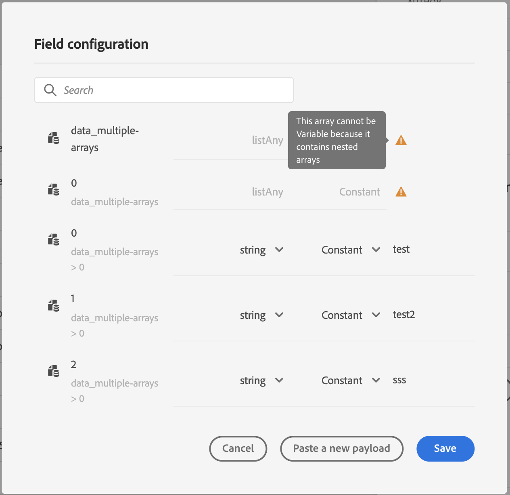

# 将集合传递到自定义操作参数 {#passing-collection}

>[!BEGINSHADEBOX]

**在此页面上：**&#x200B;了解如何将简单集合和对象集合传递到自定义操作参数，以便在运行时动态填充它们。

>[!ENDSHADEBOX]

您可以在自定义操作参数中传递集合，这些参数在运行时动态填充。

支持两种类型的收藏集：

* **简单收藏集**

  将简单集合用于基本值列表，例如字符串、数字或布尔值。 当您只需传递项目列表而无需附加属性时，这些功能非常有用。

  例如，设备类型列表：

  ```json
  {
   "deviceTypes": [
       "android",
       "ios"
   ]
  }
  ```

* **对象集合**

  当每个项包含多个字段或属性时，使用对象集合。 它们通常用于传递结构化数据，例如产品详细信息、事件记录或项目属性。

  例如：

  ```json
  {
  "products":[
     {
        "id":"productA",
        "name":"A",
        "price":20.1
     },
     {
        "id":"productB",
        "name":"B",
        "price":10.0
     },
     {
        "id":"productC",
        "name":"C",
        "price":5.99
     }
   ]
  }
  ```

>[!NOTE]
>
>在自定义操作请求负载中，仅部分支持集合中的嵌套数组。 有关详细信息，请参阅[限制](#limitations)。

## 一般程序 {#general-procedure}

在此部分中，我们使用以下JSON有效负载示例。 这是一个对象数组，其中的字段是一个简单的集合。

```json
{
  "ctxt": {
    "products": [
      {
        "id": "productA",
        "name": "A",
        "price": 20.1,
        "color":"blue",
        "locations": [
          "Paris",
          "London"
        ]
      },
      {
        "id": "productB",
        "name": "B",
        "price": 10.99
      }
    ]
  }
}
```

您可以看到`products`是两个对象的数组。 您需要至少具有一个对象。

1. 创建自定义操作。 请参阅[此页面](../action/about-custom-action-configuration.md)以了解详情。

1. 在&#x200B;**[!UICONTROL 操作参数]**&#x200B;部分中，粘贴JSON示例。 显示的结构是静态的：粘贴有效负载时，所有字段都定义为常量。

   显示集合函数和操作的

1. 如果需要，请调整字段类型。 集合支持以下字段类型：listString、listInteger、listDecimal、listBoolean、listDateTime、listDateTimeOnly、listDateOnly、listObject

   >[!NOTE]
   >
   >根据有效负载示例自动推断字段类型。

1. 如果要动态传递对象，则需要将它们设置为变量。 在此示例中，我们将`products`设置为变量。 对象中包含的所有对象字段都会自动设置为变量。

   >[!NOTE]
   >
   >有效负载示例的第一个对象用于定义字段。

1. 对于每个字段，定义将在历程画布中显示的标签。

   {width="70%"}

1. 创建历程并添加您创建的自定义操作。 请参阅[此页面](../building-journeys/using-custom-actions.md)以了解详情。

1. 在&#x200B;**[!UICONTROL 操作参数]**&#x200B;部分中，使用高级表达式编辑器定义数组参数（在本例中为`products`）。

   

1. 对于以下每个对象字段，键入源XDM架构中的相应字段名称。 如果名称相同，则不需要此操作。 在我们的示例中，我们只需要定义`product id`和“颜色”。

   {width="50%"}

对于数组字段，您还可以使用高级表达式编辑器执行数据操作。 在以下示例中，我们使用[filter](functions/list-functions.md#filter)和[intersect](functions/list-functions.md#intersect)函数：


## 限制 {#limitations}

虽然自定义操作中的集合为传递动态数据提供了灵活性，但需要注意一些结构性约束：

* **在自定义操作中支持嵌套数组**

  [!DNL Adobe Journey Optimizer]在自定义操作&#x200B;**响应负载**&#x200B;中支持对象的嵌套数组，但此支持在&#x200B;**请求负载**&#x200B;中受限。

  在请求有效负载中，仅当嵌套数组包含固定数量的项目时（如自定义操作配置中所定义），才支持嵌套数组。 例如，如果嵌套数组始终只包含三个项目，则可以将其配置为常量。 当项目的数量需要为动态时，只能将非嵌套数组（位于底层的数组）定义为变量。

  示例：

   1. 以下示例说明了&#x200B;**不支持的用例**。

      在此示例中，products数组包含一个嵌套数组(`locations`)，该数组具有动态数量的项，这在请求负载中不受支持。

      ```json
      {
      "products": [
         {
            "id": "productA",
            "name": "A",
            "price": 20,
            "locations": [
            { "name": "Paris" },
            { "name": "London" }
            ]
         }
      ]
      }
      ```

   2. 支持的示例，其中包含定义为常量的固定项目。

      在这种情况下，嵌套位置将由固定字段(`location1`， `location2`)替换，从而允许有效负载在支持的配置中保持有效。

      ```json
      {
      "products": [
         {
            "id": "productA",
            "name": "A",
            "price": 20,
            "location1": { "name": "Paris" },
            "location2": { "name": "London" }
         }
      ]
      }
      ```


* **测试集合**：要使用测试模式测试集合，必须使用代码视图模式。 请注意，业务事件不支持代码视图模式，因此在这种情况下，您只能发送包含单个元素的集合。


## 特定案例{#examples}

对于异构类型和阵列阵列，使用listAny类型定义阵列。 只能映射单个项，但不能将数组更改为变量。

{width="70%"}

异质类型示例：

```json
{
    "data_mixed-types": [
        "test",
        "test2",
        null,
        0
    ]
}
```

阵列示例：

```json
{
    "data_multiple-arrays": [
        [
            "test",
            "test1",
            "test2"
        ]
    ]
}
```

## 其他资源

浏览以下部分，了解有关配置、使用和排除自定义操作的更多信息：

* [自定义操作入门](../action/action.md) — 了解什么是自定义操作以及它们如何帮助您连接到第三方系统
* [配置自定义操作](../action/about-custom-action-configuration.md) — 了解如何创建和配置自定义操作
* [使用自定义操作](../building-journeys/using-custom-actions.md) — 了解如何在历程中使用自定义操作
* [自定义操作疑难解答](../action/troubleshoot-custom-action.md) — 了解自定义操作疑难解答
* [对上下文数据进行迭代](../personalization/iterate-contextual-data.md#arrays-in-journeys) — 了解如何在历程表达式中使用数组，并在消息个性化中迭代自定义操作响应、事件数据和数据集查找

+++ AI知识参考

本节包含结构化知识，用于支持与本主题相关的解释、检索和问答。

要全面了解相关信息，应将此信息与本页上的文档相结合。 这两个源都不是独立的；页面描述了功能，而本节提供了其他上下文来帮助消除术语、意图、适用性和约束条件的歧义。

* **TL；DR：**&#x200B;本页介绍如何在Journey Optimizer中将简单集合和对象集合动态传递到自定义操作参数中，包括支持的字段类型、配置过程以及有关嵌套数组的已知限制。

**意图：**
* 配置自定义操作以接受收藏集（简单或对象）作为动态参数
* 构建历程时，在高级表达式编辑器中将数组参数定义为变量
* 应用过滤器和交集函数以处理表达式编辑器中的数组数据
* 了解并适应自定义操作请求负载的嵌套数组限制
* 在历程测试模式下使用代码视图模式测试收集参数

**术语表：**
* **简单集合**：作为自定义操作参数&#x200B;*（产品特定）传递的基本标量值（字符串、数字、布尔值）列表*
* **对象集合**：结构化对象列表，每个对象具有多个字段，作为自定义操作参数&#x200B;*（产品特定）*&#x200B;传递
* **listObject**：自定义操作配置中用于表示对象&#x200B;*（产品特定）*&#x200B;数组的字段类型
* **listAny**：用于异类数组或数组的字段类型，其中项具有混合类型&#x200B;*（产品特定）*
* **变量（与常量）**：在操作参数配置中，运行时从历程上下文中动态填充设置为“变量”的字段，而“常量”是在配置时&#x200B;*（产品特定）*&#x200B;设置的固定值

**护栏：**
* 仅当请求有效负载中的嵌套数组包含固定数量的项目（定义为常量）时，才支持这些数组；不支持动态嵌套数组
* 在测试模式下测试集合需要代码视图模式；业务事件不支持代码视图，因此在这种情况下只能发送单元素集合
* 用于定义收集字段的有效负载示例中必须至少存在一个对象
* 有效负载示例的第一个对象定义整个集合的字段

**术语：**
* 规范名称：集合 — 首字母缩略词：无 — 变体：数组、列表、动态集合
* 同义词： &quot;simple collection&quot; = &quot;scalar values&quot;； &quot;object collection&quot; = &quot;array of objects&quot;
* 请勿混淆：“listAny”≠“listObject”（listAny处理异构或嵌套数组；listObject处理结构化对象的统一数组）

**常见问题解答：**
* **问：简单集合和对象集合之间有何区别？**  — 简单集合包含基本标量值（字符串、数字、布尔值），而对象集合则包含每个都具有多个命名字段的结构化对象。
* **问：如何在运行时使集合参数成为动态参数？**  — 在自定义操作的Action parameters部分，将数组字段设置为“variable”；其后数组中的所有对象字段都会自动设置为变量。
* **问：自定义操作请求负载是否支持嵌套数组？**  — 仅部分。 具有固定、已知数目的项目的嵌套数组可以定义为常量。 请求负载不支持具有动态项目数的嵌套数组。
* **问：如何在历程测试模式下测试集合？**  — 在测试界面中使用代码视图模式。 请注意，业务事件不支持代码视图，因此在该上下文中只能测试单个元素集合。
* **问：集合支持哪些字段类型？** — listString、listInteger、listDecimal、listBoolean、listDateTime、listDateTimeOnly、listDateOnly和listObject均受支持。

+++
