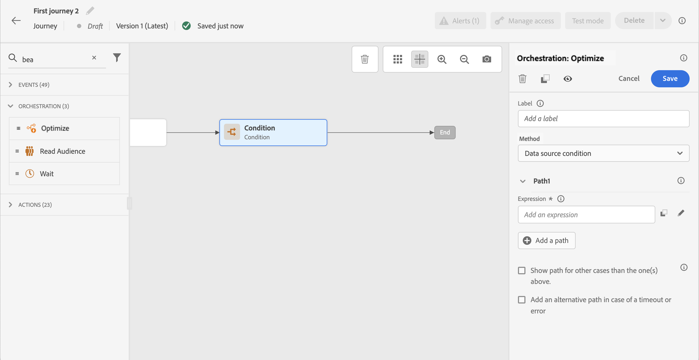

# 条件活动{#condition-activity}

>[!CONTEXTUALHELP]
>id="ajo_journey_condition"
>title="条件活动"
>abstract="此活动允许您定义个人在历程中的流量方式。 将根据各种标准创建多个路径。 您还可以在超时或出错的情况下创建替代路径。"

可以使用以下类型的条件：

* [数据源条件](#data_source_condition)
* [时间条件](#time_condition)
* [百分比拆分](#percentage_split)
* [日期条件](#date_condition)
* [配置文件上限](#profile_cap)

## 关于条件活动 {#about_condition}

>[!CONTEXTUALHELP]
>id="ajo_journey_expression_simple"
>title="关于简单表达式编辑器"
>abstract="利用简单表达式编辑器模式，可基于字段组合执行简单查询。 所有可用字段都显示在屏幕的左侧。 将字段拖放到主区域中。 要组合不同的元素，请将它们互相联锁，以创建不同的组和/或组级别。 然后，您可以选择逻辑运算符来组合同一级别上的元素。"

在历程中使用多个条件时，您可以为其中每个条件定义标签，以便更轻松地识别它们。

单击 **[!UICONTROL 添加路径]** 要定义多个条件时，请执行以下操作： 对于每个条件，都会在活动后的画布中添加新路径。

请注意，历程的设计会对功能产生影响。 在条件后定义多个路径时，将只执行第一个符合条件的路径。 这意味着您可以通过将路径置于彼此之上或之下来改变路径的优先级。

例如，让我们以第一个路径的条件“人员是VIP”和第二个路径的条件“人员是男性”为例。 如果符合这两个条件的人员(男性，VIP)通过此步骤，则将选择第一个路径，即使此人也有资格使用第二个路径，因为第一个路径“高于”。 要更改此优先级，请按其他垂直顺序移动活动。

您可以通过选中 **[!UICONTROL 显示除上述情况以外的其他情况的路径]**. 请注意，此选项在拆分条件中不可用。 请参阅 [百分比拆分](#percentage_split).

利用简单模式，可根据字段组合执行简单查询。 所有可用字段都显示在屏幕的左侧。 将字段拖放到主区域中。 要组合不同的元素，请将它们互相联锁，以创建不同的组和/或组级别。 然后，您可以选择逻辑运算符来组合同一级别上的元素：

* 和：两个条件的交集。 只考虑与所有条件匹配的元素。
* 或：两个标准的并集。 考虑至少符合一个条件的元素。

如果您使用 [Adobe Experience Platform Segmentation Service](https://experienceleague.adobe.com/docs/experience-platform/segmentation/home.html){target=&quot;_blank&quot;}要创建区段，您可以在历程条件中利用这些区段。 请参阅 [在条件中使用区段](../building-journeys/condition-activity.md#using-a-segment).

>[!NOTE]
>
>无法使用简单的编辑器对时间序列（例如购买列表、消息的过去点击）执行查询。 为此，您将需要使用高级编辑器。 请参阅[此页](expression/expressionadvanced.md)。

当操作或条件中发生错误时，个人历程将停止。使其继续的唯一方法是选中方框 **[!UICONTROL 在出现超时或错误时添加替代路径]**. 请参阅[此小节](../building-journeys/using-the-journey-designer.md#paths)。

在简单编辑器中，您还可以在事件和数据源类别下方找到历程属性类别。 此类别包含与给定用户档案的历程相关的技术字段。 这是系统从实时历程中检索到的信息，如历程 ID 或遇到的特定错误。[了解详情](expression/journey-properties.md)

## 数据源条件 {#data_source_condition}

这允许您根据数据源中的字段或先前位于历程中的事件定义条件。 了解如何在中使用表达式编辑器 [此部分](expression/expressionadvanced.md).

使用高级表达式编辑器，您可以设置更高级的条件来处理集合或使用需要传递参数的数据源。 [了解详情](../datasource/external-data-sources.md)。

## 时间条件{#time_condition}

这样，您就可以根据一天中的某个小时和/或一周中的某天执行不同的操作。 例如，您可以决定在白天发送推送通知，在工作日发送夜间电子邮件。

>[!NOTE]
>
>时区不是特定于某个条件，而是在历程属性的历程级别定义。 请参见[此页面](../building-journeys/timezone-management.md)。

提供了三个时间过滤选项：

* 小时：允许您根据一天中的时间设置条件。 然后，定义开始时间和结束时间。 个人将仅在定义的小时范围内输入路径。
* 每周时间：用于根据一周中的某天设置条件。 然后，选择希望个人进入路径的天数。
* 一周中的某天和某小时：此选项是前两个选项的组合。

## 百分比拆分 {#percentage_split}

利用此选项，可随机拆分受众以为每个群组定义不同的操作。 为每个路径定义拆分数和重新分区。 拆分计算是统计的，因为系统无法预测此历程活动中将会有多少人流。 因此，分割具有非常低的误差范围。 此函数基于Java随机机制(请参阅 [页面](https://docs.oracle.com/javase/7/docs/api/java/util/Random.html))。

在测试模式下，达到拆分时，将始终选择顶部分支。 如果希望测试选择其他路径，则可以重新组织拆分分支的位置。 请参见[此页面](../building-journeys/testing-the-journey.md)。

>[!NOTE]
>
>请注意，没有按钮可在百分比拆分条件中添加路径。 路径的数量将取决于拆分的数量。 在拆分条件中，您无法为其他情况添加路径，因为该路径不可能发生。 人们将始终进入一条分割的路径。

## 日期条件 {#date_condition}

这允许您根据日期定义不同的流量。 例如，如果人员在“销售”期间进入该步骤，您将向他们发送特定消息。 你今年剩下的时间，你会再发一条信息。

>[!NOTE]
>
>时区不再特定于条件，现在在历程属性的历程级别定义。 请参阅[此页](../building-journeys/timezone-management.md)。

## 配置文件上限 {#profile_cap}

使用此条件类型为历程路径设置最大用户档案数。 达到此限制后，输入的用户档案会采用替代路径。 这可确保您的历程永远不会超出定义的限制。

>[!NOTE]
>
>我们建议您定义高值配置文件上限。 群体达到确切上限数字的精度和可能性，只会随着上限的增加而增加。 对于小数字（例如，上限为50），数字并不总是匹配，因为在用户档案使用替代路径之前，可能未达到限制。

您可以使用此条件类型来增加投放的数量。 请参阅 [用例](ramp-up-deliveries-uc.md).

默认上限为1000。

计数器仅适用于选定的历程版本。 计数器在一个月后重置为零。 重置后，进入的用户档案将再次采用标称路径，直到达到计数器限制。

即使您将替代路径移动到历程画布上的标称路径上方，标称路径始终比替代路径具有优先级。

对于实时历程，请考虑以下阈值以确保达到限制：

* 对于大于10000的帽，要插入的不同轮廓的数量必须至少是帽的1.3倍。
* 对于低于10000的上限，要插入的不同配置文件数必须为1000加上上上限。

在测试模式下，未考虑配置文件上限。

## 在条件中使用区段 {#using-a-segment}

本节介绍如何在历程条件中使用区段。 有关区段以及如何构建区段的更多信息，请参阅 [此部分](../segment/about-segments.md).

要在历程条件中使用区段，请执行以下步骤：

1. 打开旅程，删除 **[!UICONTROL 条件]** 活动，然后选择 **数据源条件**.
   

1. 单击 **[!UICONTROL 添加路径]** 每个需要的额外路径。 对于每个路径，单击 **[!UICONTROL 表达式]** 字段。

   

1. 在左侧，展开 **[!UICONTROL 区段]** 节点。 拖放要用于条件的区段。 默认情况下，区段上的条件为true。

   

   >[!NOTE]
   >
   >请注意，只有 **已实现** 和 **现有** 区段参与状态将被视为区段的成员。 有关如何评估区段的更多信息，请参阅 [Segmentation Service文档](https://experienceleague.adobe.com/docs/experience-platform/segmentation/tutorials/evaluate-a-segment.html#interpret-segment-results){target=&quot;_blank&quot;}。
