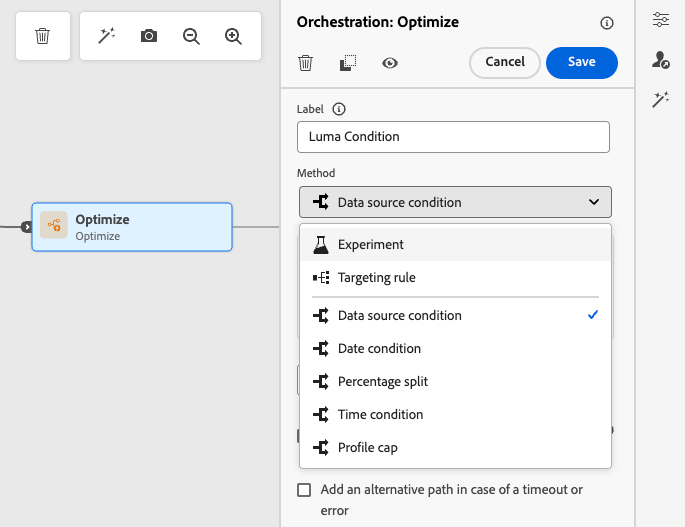

# 条件 {#conditions}

>[!CONTEXTUALHELP]
>id="ajo_journey_conditions"
>title="条件"
>abstract="条件允许您通过基于特定标准创建多个路径来定义个人如何完成您的历程。 您还可以配置备用路径来处理超时或错误，以确保获得无缝的体验。"

通过&#x200B;**条件**，您可以根据特定条件创建多个路径，以定义个人如何在您的历程中前进。 您还可以配置备用路径来处理超时或错误，以确保获得无缝的体验。

>[!AVAILABILITY]
>
>这些条件可通过&#x200B;**优化**&#x200B;活动获得，该活动可在有限可用性中按需访问。 请联系 Adobe 代表以获取访问权限。
>
>如果您无权访问此容量，则仍可使用旧版[条件活动](condition-activity.md)。

## 添加条件 {#add-condition-activity}

要向历程添加条件，请执行以下步骤。

1. 将&#x200B;**[!UICONTROL 优化]**&#x200B;活动拖放到历程画布中。 [了解详情](optimize.md)

1. 添加可选标签以在报告和测试模式日志中标识活动。

1. 从&#x200B;**[!UICONTROL 方法]**&#x200B;下拉列表中选择一个条件。

   {width=80%}

   可以使用以下类型的条件：

   * [数据源条件](#data_source_condition)
   * [时间条件](#time_condition)
   * [百分比拆分](#percentage_split)
   * [日期条件](#date_condition)
   * [配置文件上限](#profile_cap)
   * 您还可以在历程条件中使用受众。 [了解详情](#using-a-segment)

## 管理条件路径 {#condition_paths}

>[!CONTEXTUALHELP]
>id="ajo_journey_expression_simple2"
>title="关于简单表达式编辑器"
>abstract="使用简单表达式编辑器模式，您可以根据字段组合执行简单查询。所有可用的字段都显示在屏幕的左侧。将字段拖放到主区域中。要组合不同元素，请将它们互相联锁，以创建不同的分组和/或分组级别。然后，您可以选择逻辑运算符来组合同一级别上的元素。"

在历程中使用多个条件时，您可以为每个条件定义标签，以便更轻松地对其进行识别。

如果要定义多个条件，请单击&#x200B;**[!UICONTROL 添加路径]**。 对于每个条件，都会在活动后的画布中添加一个新路径。

{width=80%}

请注意，历程的设计会产生功能影响。 当在条件后定义多个路径时，将仅执行第一个符合条件的路径。 这意味着，可以通过将路径置于彼此上方或下方来更改路径的优先级。

让我们以第一个路径的条件“人员是VIP”和第二个路径的条件“人员是男性”为例。 如果同时满足两个条件的人(男性，VIP)通过此步骤，那么即使此人也有资格获得第二条路径，也会选择第一条路径，因为第一条路径是“以上”路径。 要更改此优先级，请以其他垂直顺序移动您的活动。

通过选中&#x200B;**[!UICONTROL 显示上述情况以外的其他情况的路径]**，可以为不符合所定义条件的受众创建其他路径。

>[!NOTE]
>
>此选项在拆分条件中不可用。 [了解详情](#percentage_split)

利用简单模式，可根据字段组合执行简单查询。 所有可用的字段都显示在屏幕的左侧。将字段拖放到主区域中。要组合不同元素，请将它们互相联锁，以创建不同的分组和/或分组级别。然后，您可以选择逻辑运算符来组合同一级别上的元素：

* **AND** — 两个条件的交集。 只考虑符合所有条件的元素。
* **OR** — 两个条件的并集。 考虑至少符合一个条件的元素。

{width=80%}

如果您使用[Adobe Experience Platform分段服务](https://experienceleague.adobe.com/docs/experience-platform/segmentation/home.html?lang=zh-Hans){target="_blank"}创建受众，则可以在历程条件中利用它们。 请参阅[在条件](../building-journeys/condition-activity.md#using-a-segment)中使用受众。

>[!NOTE]
>
>使用简单编辑器无法对时间序列（例如购买列表、过去对消息的点击）执行查询。 为此，您需要使用高级编辑器。 请参阅[此页](expression/expressionadvanced.md)。

当操作或条件中发生错误时，个人历程将停止。使其继续的唯一方法是选中框&#x200B;**[!UICONTROL 在超时或错误的情况下添加替代路径]**。 [了解详情](../building-journeys/using-the-journey-designer.md#paths)

在简单编辑器中，您还可以在事件和数据源类别下找到历程属性类别。 此类别包含与给定用户档案的历程相关的技术字段。 这是系统从实时历程中检索到的信息，如历程 ID 或遇到的特定错误。[了解详情](expression/journey-properties.md)

## 数据源条件 {#data_source_condition}

使用&#x200B;**[!UICONTROL 数据源条件]**&#x200B;根据来自数据源的字段或先前位于历程中的事件定义条件。 此类型的条件是使用表达式编辑器定义的。 [了解如何使用表达式编辑器](expression/expressionadvanced.md)

例如，如果您定位的受众具有使用构成工作流或自定义上传（CSV文件）生成的扩充属性，则可以利用这些扩充属性构建条件。

使用高级表达式编辑器，您可以设置更高级的条件，以处理集合或使用需要传递参数的数据源。 [了解详情](../datasource/external-data-sources.md)

{width=80%}

## 日期条件 {#date_condition}

这允许您根据日期定义不同的流。 例如，如果人员在“销售”期间进入该步骤，您将向他们发送一条特定消息。 一年余下时间里，您将发送另一条消息。

>[!NOTE]
>
>时区不再特定于条件，而是现在在历程属性的历程级别定义。 [了解详情](../building-journeys/timezone-management.md)

## 百分比拆分 {#percentage_split}

此选项允许您随机拆分受众，以为每个组定义不同的操作。 定义每个路径的分割数和重新分区。 拆分计算是统计性的，因为系统无法预测将在历程的这个活动中流动的人数。 因此，分割具有非常低的误差容限。 此函数基于[Java随机机制](https://docs.oracle.com/javase/7/docs/api/java/util/Random.html){target="_blank"}。

在测试模式下，当达到拆分时，始终选择顶部分支。 如果希望测试选择其他路径，可以重新组织拆分分支的位置。 [了解详情](../building-journeys/testing-the-journey.md)

>[!NOTE]
>
>请注意，在百分比拆分条件中没有用于添加路径的按钮。 路径的数量将取决于拆分的次数。 在拆分条件中，您无法为其他情况添加路径，因为它不会发生。 人们总是会走上一条不同的道路。

## 时间条件 {#time_condition}

使用&#x200B;**[!UICONTROL 时间条件]**&#x200B;根据一天中的小时和/或星期执行不同的操作。 例如，您可以决定在白天发送推送通知，在工作日夜间发送电子邮件。

>[!NOTE]
>
>* 时区并非特定于条件，而是在历程属性中的历程级别定义的。 [了解详情](../building-journeys/timezone-management.md)
>
>* 默认情况下，**[!UICONTROL 时间条件]**&#x200B;按小时设置，从00:00到12:00。

提供了三个时间过滤选项：

* **小时** — 允许您根据一天中的时间设置条件。 然后，定义开始时间和结束时间。 个人将仅在定义的小时范围内输入路径。
* **星期** — 允许您根据星期设置条件。 然后，选择您希望个人输入路径的日期。
* **一周中的某天某小时** — 此选项将前两个选项组合在一起。

## 配置文件上限 {#profile_cap}

使用此条件类型可设置历程路径的最大配置文件数。 达到此限制后，输入的轮廓会采用替代路径。 这可确保您的历程不会超过定义的限制。

>[!NOTE]
>
>我们建议您定义高价值用户档案上限。 群体达到确切上限数的精度和可能性只会随着上限的增加而提高。 对于小数字（例如，50为上限），数字将不能始终匹配，因为在用户档案选择替代路径之前，可能无法达到限制。

<!--You can use this condition type to ramp up the volume of your deliveries. See this [use case](ramp-up-deliveries-uc.md).-->

默认上限为1,000。

计数器仅适用于选定的历程版本。 在复制历程或创建新版本时，计数器将重置为零。 重置后，输入的配置文件再次采用名义路径，直到达到计数器限制。

在定期历程上定义用户档案上限时，计数器不会在每次定期后重置。

即使您将替代路径移动到历程画布上的名义路径上方，名义路径始终优先于替代路径。

对于实时历程，需要考虑以下阈值以确保达到限制：

* 对于大于10,000的上限，要注入的不同配置文件的数量必须至少为上限的1.3倍。
* 对于小于10,000的上限，要注入的不同配置文件的数量必须为1000加上上限。

在测试模式下不考虑用户档案上限。

## 在条件中使用受众 {#using-a-segment}

本节介绍如何在历程条件中使用受众。 有关受众以及如何构建受众的详细信息，请参阅[此部分](../audience/about-audiences.md)。

要在历程条件中使用受众，请执行以下步骤：

1. 打开历程，删除&#x200B;**[!UICONTROL 优化]**&#x200B;活动并选择&#x200B;**[!UICONTROL 数据源条件]**。

   

1. 单击&#x200B;**[!UICONTROL 为每个所需的额外路径添加路径]**。 对于每个路径，单击&#x200B;**[!UICONTROL 表达式]**&#x200B;字段。

1. 在左侧，展开&#x200B;**[!UICONTROL 受众]**&#x200B;节点。 拖放要用于条件的受众。 默认情况下，受众的条件为true。

   {width=80%}

   >[!NOTE]
   >
   >请注意，只有具有&#x200B;**已实现**&#x200B;受众参与状态的个人才会被视为受众成员。 有关如何评估受众的更多信息，请参阅[分段服务文档](https://experienceleague.adobe.com/docs/experience-platform/segmentation/tutorials/evaluate-a-segment.html#interpret-segment-results){target="_blank"}。
